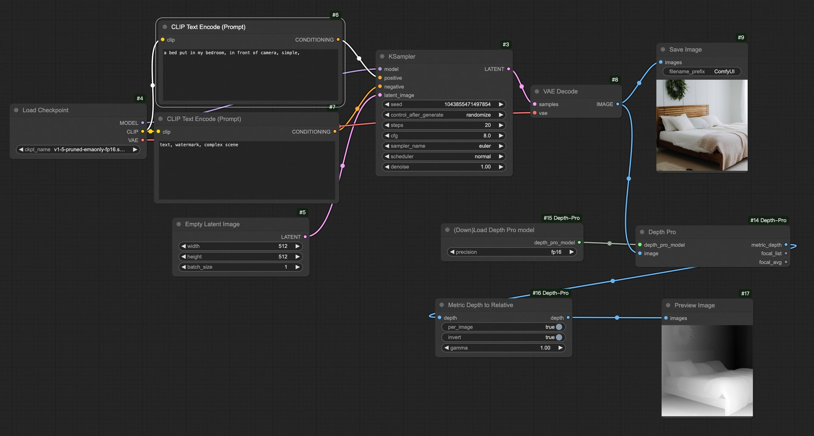

# ComfyUI 搭建"文生图生深度图生3D"工作流

- [步骤](#%E6%AD%A5%E9%AA%A4)
- [效果](#%E6%95%88%E6%9E%9C)
- [workflow （you）](#workflow-you)

---

### 步骤

文生图生深度图:

1. 安装comfyui
2. 安装comfyui manager
3. 通过 manager 安装 depth pro 和 3D 相关node。
4. 下载stable diffusion 模型。
5. 下载depth pro模型。depth pro的模型结点可能不能够自动下载模型，可以手动从hugging face 下载depth pro模型。用cli方便些：`huggingface-cli download spacepxl/ml-depth-pro  depth_pro.fp16.safetensors`
6. 参考aigc工作流，搭建文=>2D图=>深度图=>3D模型工作流

深度图生3D：

1. 没有找到现成的node，需要自己开发 client custom node。可以使用marching cube来重建表面三角形网格。不考虑碰撞问题的话也可以直接用displacement map。

### 效果



### workflow （you）

```json
{
  "last_node_id": 17,
  "last_link_id": 19,
  "nodes": [
    {
      "id": 4,
      "type": "CheckpointLoaderSimple",
      "pos": {
        "0": 95,
        "1": 323
      },
      "size": {
        "0": 315,
        "1": 98
      },
      "flags": {},
      "order": 0,
      "mode": 0,
      "inputs": [],
      "outputs": [
        {
          "name": "MODEL",
          "type": "MODEL",
          "links": [
            1
          ],
          "slot_index": 0
        },
        {
          "name": "CLIP",
          "type": "CLIP",
          "links": [
            3,
            5
          ],
          "slot_index": 1
        },
        {
          "name": "VAE",
          "type": "VAE",
          "links": [
            8
          ],
          "slot_index": 2
        }
      ],
      "properties": {
        "Node name for S&R": "CheckpointLoaderSimple"
      },
      "widgets_values": [
        "v1-5-pruned-emaonly-fp16.safetensors"
      ]
    },
    {
      "id": 7,
      "type": "CLIPTextEncode",
      "pos": {
        "0": 427,
        "1": 343
      },
      "size": {
        "0": 425.27801513671875,
        "1": 180.6060791015625
      },
      "flags": {},
      "order": 4,
      "mode": 0,
      "inputs": [
        {
          "name": "clip",
          "type": "CLIP",
          "link": 5
        }
      ],
      "outputs": [
        {
          "name": "CONDITIONING",
          "type": "CONDITIONING",
          "links": [
            6
          ],
          "slot_index": 0
        }
      ],
      "properties": {
        "Node name for S&R": "CLIPTextEncode"
      },
      "widgets_values": [
        "text, watermark, complex scene"
      ]
    },
    {
      "id": 3,
      "type": "KSampler",
      "pos": {
        "0": 937,
        "1": 199
      },
      "size": {
        "0": 315,
        "1": 262
      },
      "flags": {},
      "order": 5,
      "mode": 0,
      "inputs": [
        {
          "name": "model",
          "type": "MODEL",
          "link": 1
        },
        {
          "name": "positive",
          "type": "CONDITIONING",
          "link": 4
        },
        {
          "name": "negative",
          "type": "CONDITIONING",
          "link": 6
        },
        {
          "name": "latent_image",
          "type": "LATENT",
          "link": 2
        }
      ],
      "outputs": [
        {
          "name": "LATENT",
          "type": "LATENT",
          "links": [
            7
          ],
          "slot_index": 0
        }
      ],
      "properties": {
        "Node name for S&R": "KSampler"
      },
      "widgets_values": [
        89087152028085,
        "randomize",
        20,
        8,
        "euler",
        "normal",
        1
      ]
    },
    {
      "id": 5,
      "type": "EmptyLatentImage",
      "pos": {
        "0": 469,
        "1": 586
      },
      "size": {
        "0": 315,
        "1": 106
      },
      "flags": {},
      "order": 1,
      "mode": 0,
      "inputs": [],
      "outputs": [
        {
          "name": "LATENT",
          "type": "LATENT",
          "links": [
            2
          ],
          "slot_index": 0
        }
      ],
      "properties": {
        "Node name for S&R": "EmptyLatentImage"
      },
      "widgets_values": [
        512,
        512,
        1
      ]
    },
    {
      "id": 8,
      "type": "VAEDecode",
      "pos": {
        "0": 1293,
        "1": 280
      },
      "size": {
        "0": 210,
        "1": 46
      },
      "flags": {},
      "order": 6,
      "mode": 0,
      "inputs": [
        {
          "name": "samples",
          "type": "LATENT",
          "link": 7
        },
        {
          "name": "vae",
          "type": "VAE",
          "link": 8
        }
      ],
      "outputs": [
        {
          "name": "IMAGE",
          "type": "IMAGE",
          "links": [
            11,
            16
          ],
          "slot_index": 0
        }
      ],
      "properties": {
        "Node name for S&R": "VAEDecode"
      },
      "widgets_values": []
    },
    {
      "id": 9,
      "type": "SaveImage",
      "pos": {
        "0": 1583,
        "1": 183
      },
      "size": {
        "0": 210,
        "1": 270
      },
      "flags": {},
      "order": 7,
      "mode": 0,
      "inputs": [
        {
          "name": "images",
          "type": "IMAGE",
          "link": 11
        }
      ],
      "outputs": [],
      "properties": {},
      "widgets_values": [
        "ComfyUI"
      ]
    },
    {
      "id": 15,
      "type": "LoadDepthPro",
      "pos": {
        "0": 1087,
        "1": 599
      },
      "size": {
        "0": 327.5999755859375,
        "1": 58
      },
      "flags": {},
      "order": 2,
      "mode": 0,
      "inputs": [],
      "outputs": [
        {
          "name": "depth_pro_model",
          "type": "DEPTH_PRO_MODEL",
          "links": [
            17
          ],
          "slot_index": 0
        }
      ],
      "properties": {
        "Node name for S&R": "LoadDepthPro"
      },
      "widgets_values": [
        "fp16"
      ]
    },
    {
      "id": 14,
      "type": "DepthPro",
      "pos": {
        "0": 1535,
        "1": 604
      },
      "size": {
        "0": 355.20001220703125,
        "1": 66
      },
      "flags": {},
      "order": 8,
      "mode": 0,
      "inputs": [
        {
          "name": "depth_pro_model",
          "type": "DEPTH_PRO_MODEL",
          "link": 17
        },
        {
          "name": "image",
          "type": "IMAGE",
          "link": 16
        }
      ],
      "outputs": [
        {
          "name": "metric_depth",
          "type": "IMAGE",
          "links": [
            18
          ],
          "slot_index": 0
        },
        {
          "name": "focal_list",
          "type": "LIST",
          "links": null
        },
        {
          "name": "focal_avg",
          "type": "FLOAT",
          "links": null
        }
      ],
      "properties": {
        "Node name for S&R": "DepthPro"
      },
      "widgets_values": []
    },
    {
      "id": 16,
      "type": "MetricDepthToRelative",
      "pos": {
        "0": 1074,
        "1": 772
      },
      "size": {
        "0": 315,
        "1": 106
      },
      "flags": {},
      "order": 9,
      "mode": 0,
      "inputs": [
        {
          "name": "depth",
          "type": "IMAGE",
          "link": 18
        }
      ],
      "outputs": [
        {
          "name": "depth",
          "type": "IMAGE",
          "links": [
            19
          ],
          "slot_index": 0
        }
      ],
      "properties": {
        "Node name for S&R": "MetricDepthToRelative"
      },
      "widgets_values": [
        true,
        true,
        1
      ]
    },
    {
      "id": 17,
      "type": "PreviewImage",
      "pos": {
        "0": 1595,
        "1": 773
      },
      "size": [
        210,
        246
      ],
      "flags": {},
      "order": 10,
      "mode": 0,
      "inputs": [
        {
          "name": "images",
          "type": "IMAGE",
          "link": 19
        }
      ],
      "outputs": [],
      "properties": {
        "Node name for S&R": "PreviewImage"
      },
      "widgets_values": []
    },
    {
      "id": 6,
      "type": "CLIPTextEncode",
      "pos": {
        "0": 437,
        "1": 131
      },
      "size": {
        "0": 422.84503173828125,
        "1": 164.31304931640625
      },
      "flags": {},
      "order": 3,
      "mode": 0,
      "inputs": [
        {
          "name": "clip",
          "type": "CLIP",
          "link": 3
        }
      ],
      "outputs": [
        {
          "name": "CONDITIONING",
          "type": "CONDITIONING",
          "links": [
            4
          ],
          "slot_index": 0
        }
      ],
      "properties": {
        "Node name for S&R": "CLIPTextEncode"
      },
      "widgets_values": [
        "a bed put in my bedroom, in front of camera, simple,"
      ]
    }
  ],
  "links": [
    [
      1,
      4,
      0,
      3,
      0,
      "MODEL"
    ],
    [
      2,
      5,
      0,
      3,
      3,
      "LATENT"
    ],
    [
      3,
      4,
      1,
      6,
      0,
      "CLIP"
    ],
    [
      4,
      6,
      0,
      3,
      1,
      "CONDITIONING"
    ],
    [
      5,
      4,
      1,
      7,
      0,
      "CLIP"
    ],
    [
      6,
      7,
      0,
      3,
      2,
      "CONDITIONING"
    ],
    [
      7,
      3,
      0,
      8,
      0,
      "LATENT"
    ],
    [
      8,
      4,
      2,
      8,
      1,
      "VAE"
    ],
    [
      11,
      8,
      0,
      9,
      0,
      "IMAGE"
    ],
    [
      16,
      8,
      0,
      14,
      1,
      "IMAGE"
    ],
    [
      17,
      15,
      0,
      14,
      0,
      "DEPTH_PRO_MODEL"
    ],
    [
      18,
      14,
      0,
      16,
      0,
      "IMAGE"
    ],
    [
      19,
      16,
      0,
      17,
      0,
      "IMAGE"
    ]
  ],
  "groups": [],
  "config": {},
  "extra": {
    "ds": {
      "scale": 0.6115909044841495,
      "offset": [
        227.49364097335842,
        221.3602578921898
      ]
    }
  },
  "version": 0.4
}
```


> 更新: 2024-10-13 12:28:16  
> 原文: <https://www.yuque.com/viruspc/el3mi0/atoaeug80nu8mc07>