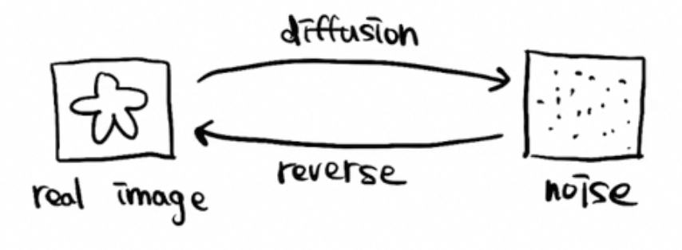
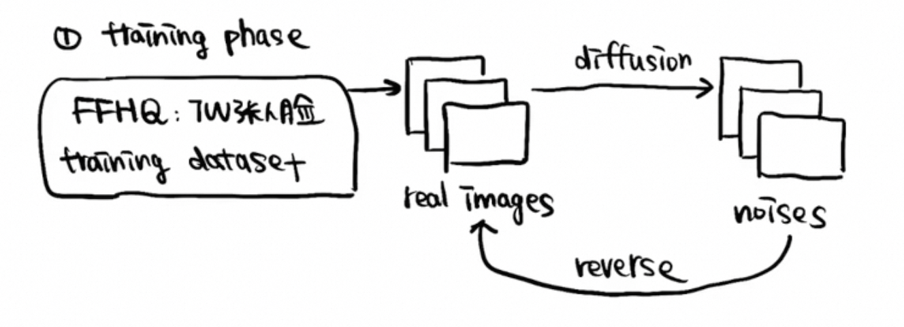
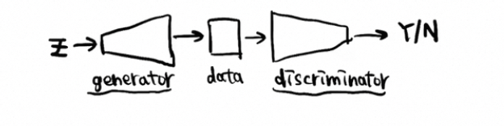

# 概述（DDPM）

- [扩散模型是什么](#%E6%89%A9%E6%95%A3%E6%A8%A1%E5%9E%8B%E6%98%AF%E4%BB%80%E4%B9%88)
- [扩散模型具体流程](#%E6%89%A9%E6%95%A3%E6%A8%A1%E5%9E%8B%E5%85%B7%E4%BD%93%E6%B5%81%E7%A8%8B)
- [对比其他生成模型](#%E5%AF%B9%E6%AF%94%E5%85%B6%E4%BB%96%E7%94%9F%E6%88%90%E6%A8%A1%E5%9E%8B)

---

### 扩散模型是什么
Denoising Diffusion Probabilistic Models NIPS 20

并不是提出扩散模型，是扩散模型中比较有名的一个分支。

扩散模型是什么？**是一种生成模型**，拟合一个**分布**，生成许多符合这个分布的数据。比如，希望生成人脸图像，扩散模型就会拟合一个人脸图像的分布，接着就可以通过这个分布生成一些图像。

### 扩散模型具体流程
宏观来看，扩散模型由两个过程组成：

1. **diffusion（扩散）过程**。由真实图像生成噪声图。
2. **重建过程**。从噪声图重建出真实图。

具体训练和测试过程是怎样的？

1. training phase，训练过程
    1. 从数据集中取真实图像，
    2. 生成噪声图，
    3. 再从噪声图反过来逆向生成真实图像，用损失函数来判断去噪去的怎么样（和原图的相似程度）。损失函数一般用L1/L2 Loss。
    4. 
2. inference phase，推理过程
    1. 从高斯分布采样，得到一些噪声图
    2. 执行训练好的模型的reverse过阶段，生成真实图片。

### 对比其他生成模型
主要的对比模型是GAN，扩散模型相比GAN的优势？

GAN不仅需要训练生成器，还需要生成判别器，用于判断生成图像是否和目标分布的图像是否一致。generator用于生成数据，discriminator用于判断生成的数据是真还是假。

generator和discriminator需要同时训练，是一个权衡的过程不能失衡，一个失衡就会崩掉。背后需要许多调参技巧，比较麻烦。

diffusion model只需要训练reverse过程，训练一个去噪模型，简单稳定目标明确，损失函数有指向性（损失函数大小能直接反应去噪的好坏，反应是训练的早期还是晚期。而GAN是一个对抗的过程，无法判断当前是训练的早期还是晚期）。

**因此，从训练的难度、训练的稳定性，损失函数的简易程度和指向性的角度，扩散模型比生成对抗模型简单很多。**

[https://www.bilibili.com/video/BV1fU4y1i7kK/?spm_id_from=333.788&vd_source=a637826c55b409b420b4b6584a6e8379](https://www.bilibili.com/video/BV1fU4y1i7kK/?spm_id_from=333.788&vd_source=a637826c55b409b420b4b6584a6e8379)

> 更新: 2024-10-13 11:16:16  
> 原文: <https://www.yuque.com/viruspc/el3mi0/uhod7f7myr9ynvs0>