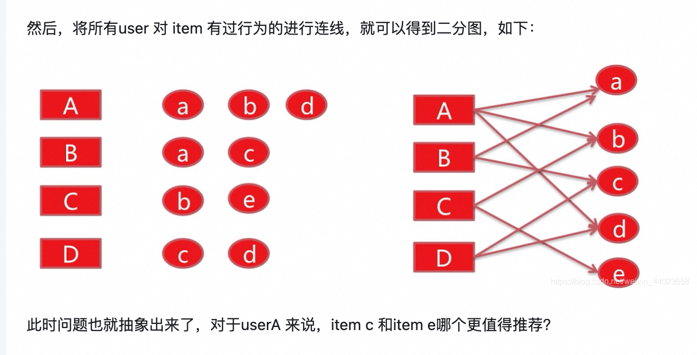

# PersonalRank

  * [基本原理](#%E5%9F%BA%E6%9C%AC%E5%8E%9F%E7%90%86)
  * [计算过程](#%E8%AE%A1%E7%AE%97%E8%BF%87%E7%A8%8B)
  * [特点](#%E7%89%B9%E7%82%B9)
  * [应用场景](#%E5%BA%94%E7%94%A8%E5%9C%BA%E6%99%AF)
  * [共同点](#%E5%85%B1%E5%90%8C%E7%82%B9)
  * [不同点](#%E4%B8%8D%E5%90%8C%E7%82%B9)
  * [应用场景](#%E5%BA%94%E7%94%A8%E5%9C%BA%E6%99%AF-1)
- [其他参考资料](#%E5%85%B6%E4%BB%96%E5%8F%82%E8%80%83%E8%B5%84%E6%96%99)

---

ru

PersonalRank是一种基于图的个性化推荐算法，旨在为特定用户提供个性化的推荐。它是PageRank算法的变体，专门设计用于处理用户与项目之间的关系。以下是PersonalRank的详细介绍：

### 基本原理

它能够结合用户行为构成的二分图，对于固定用户对item集合的重要程度给出排序，也就是说将user A 没有对item c 和item e有过行为，但是personal rank算法可以给出item c 和item e对于user A来说，哪个更值得推荐。

1. **图结构**：
    - 将用户和项目表示为图中的节点，用户与项目之间的交互（如点击、购买）表示为边。
2. **随机游走**：
    - 从特定用户节点开始进行随机游走，通过遍历图中的边来计算其他节点的重要性。
3. **个性化偏好**：
    - 游走过程中，保持返回起始用户节点的概率，以确保结果的个性化。

### 计算过程
[随机游走算法](https://zhida.zhihu.com/search?content_id=135105683&content_type=Article&match_order=1&q=%E9%9A%8F%E6%9C%BA%E6%B8%B8%E8%B5%B0%E7%AE%97%E6%B3%95&zhida_source=entity)PersonalRank实现基于图的推荐对用户A进行个性化推荐，从用户A节点开始在用户-物品二分图random walk，以alpha的概率从A的出边中，等概率选择一条游走过去，到达该顶点后（举例顶点a），由alpha的概率继续从顶点a的出边中，等概率选择一条继续游走到下一个节点，或者（1-alpha）的概率回到顶点A，多次迭代。直到各顶点对于用户A的重要度收敛。

PageRank与person rank算法有极大的相似性。只不过PageRank算法没有固定的起点。

PersonalRank的计算类似于PageRank，但初始概率分布不同。对于用户节点 [u]，其PersonalRank值 [PR(u)] 可以表示为：

$ PR(v) = (1-d) \cdot I(v = u) + d \sum_{w \in N(v)} \frac{PR(w)}{L(w)} $

其中：

+ [d] 是阻尼因子。
+ [I(v = u)] 是指示函数，表示节点 [v] 是否为起始用户节点。
    - 设定起始用户节点的初始值为1，其他节点为0。
+ [N(v)] 是节点 [v] 的邻居节点集合。
+ [L(w)] 是节点 [w] 的出度。

### 特点
+ **个性化**：根据特定用户的兴趣进行推荐。
+ **灵活性**：可以处理多种类型的图结构，包括社交网络、商品推荐等。
+ **迭代更新**：通过迭代计算，逐步更新节点的PersonalRank值。

### 应用场景
+ **社交网络推荐**：推荐朋友或关注者。
+ **商品推荐**：根据用户历史行为推荐商品。
+ **内容推荐**：推荐文章、视频等内容。

PersonalRank通过专注于用户节点的个性化游走，能够有效地提供符合用户个人兴趣的推荐结果。

### 共同点
+ **算法基础**：两者都基于随机游走的思想，利用图结构来评估节点的重要性。
+ **迭代计算**：都通过迭代更新节点的分数，直到收敛。

### 不同点
+ **目标**：PageRank用于全局网页排名，而PersonalRank用于个性化推荐。
+ **初始设置**：在PersonalRank中，随机游走的起点是特定用户节点，以捕捉该用户的个性化偏好。
+ **阻尼因子**：PersonalRank中，阻尼因子控制游走过程中返回起始节点的概率，以保持个性化。

### 应用场景
+ **PageRank**：用于搜索引擎的网页排序。
+ **PersonalRank**：用于社交网络、商品推荐等需要个性化结果的场景。

通过专注于特定用户节点，PersonalRank能够提供更符合用户个人兴趣的推荐结果。

## 其他参考资料
[https://www.zhihu.com/search?type=content&q=personal%20rank](https://www.zhihu.com/search?type=content&q=personal%20rank)

> 更新: 2025-05-02 09:12:16  
> 原文: <https://www.yuque.com/viruspc/el3mi0/yq7n7davps7uybye>