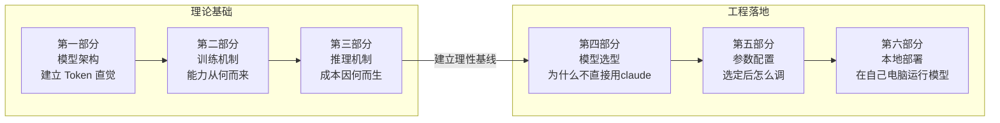

# 第一课：大模型基础

> **目标**：理解大模型"能力从何而来、成本因何而生"，为工程决策提供理性基线，明白"如何进行模型选型和参数配置"。

---

## 核心主线



真正开始把大模型用到工程里之后，你很快会发现：难点从来不是“会不会调用”，而是**什么时候它靠谱，什么时候它昂贵，什么时候它只是看起来聪明**。这也是这节课的编排逻辑：第一部分从 Token、Embedding、Attention 和 Transformer 讲起，建立对模型工作方式的基本直觉；第二部分解释预训练、后训练和对齐，回答“能力为什么会长成现在这样”；第三部分拆开 Prefill、Decode、KV Cache 等推理机制，帮助你理解成本和延迟的来源；有了这三层基础，第四、第五部分再进入模型选型与参数配置；第六部分则用一次本地部署，把前面的判断真正落到实践里。

---

## 第一部分：从语言任务到大模型——能力从何而来

### 1.1 统一范式：预测下一个 Token

在大模型出现之前，不同的语言任务需要不同的模型和工程方案：分词一个模型、情感分析一个模型、翻译一个模型、问答又一个模型。每个任务单独收集数据、单独训练、单独部署。

LLM 的突破在于——**用一个"预测下一个 token"的统一范式，覆盖了几乎所有语言任务**。分类、摘要、翻译、代码生成、对话……全部可以转化为"给定前文，生成后续 token"的问题。

**工程视角**：
1. 这意味着你不需要为每个任务搭专用模型了。一个 API 接口 + 不同的 prompt 就能处理大部分语言任务。这极大降低了 AI 应用的工程门槛，也是为什么"提示词工程"（第二课）变得如此重要。
2. 对于极端追求**低延迟、低成本、高并发**的单一简单任务（例如千万级日活的垃圾评论过滤、或者高频的情感极性打分），企业依然会选择微调部署一个小巧的专用模型（如 BERT 或轻量级分类器），因为调用大模型 API 太慢且太贵。

---

### 1.2 Tokenizer：文本切分与基础单元

**模型不认识文字。** 在任何计算发生之前，文本必须先被切成一个个 **token**——介于字符和单词之间的子词单元：

```
"unhappiness" → ["un", "happi", "ness"] → token ID: [1043, 28937, 2494]

"写代码" → ["写", "代码"] → token ID: [35946, 99257]
```

hugging face 的 tokenizer.json 文件示例:
```json
{
  "version": "1.0",
  "truncation": null,
  "padding": null,
  "added_tokens": [
    { "id": 0, "content": "<s>", "special": true },
    { "id": 1, "content": "</s>", "special": true }
  ],
  "model": {
    "type": "BPE",
    "dropout": null,
    "unk_token": "<unk>",
    "continuing_subword_prefix": null,
    "end_of_word_suffix": null,
    "fuse_unk": false,
    "byte_fallback": true,
    "vocab": {
      "<s>": 0,
      "</s>": 1,
      "Ġ": 3,
      "t": 4,
      "h": 5,
      "e": 6,
      "Ġthe": 7
    },
    "merges": [
      "Ġ t",
      "Ġt h",
      "Ġth e",
      "Ġ t h e"
    ]
  }
}
```

**工程视角**：

1. **钱（成本与模型选型）**：API 严格按 Token 计费。在早期 GPT-4 等采用传统词表的模型中，同样语义的中文通常比英文消耗多 1.5-2 倍 Token，直接推高成本。但在最新的国产原生多语言模型（如 DeepSeek/Qwen）或采用新词表（如 GPT-4o）的模型中，这种差异已缩小至 1.3 倍甚至逼近 1:1。处理大量中文文档时，选对模型的底层词表就是省钱。

2. **容量与本地显存瓶颈**：128K 上下文窗口 ≠ 128K 字符。实际能放多少内容取决于分词效率（早期词表下 128K 可能只够放 8-10 万中文字）。更致命的是，在受限的硬件环境（例如 16GB 统一内存的机器）进行本地推理时，输入越多的 Token，生成的 KV Cache 显存占用就越庞大，这不仅容易引发内存溢出（OOM），还会造成首字响应时间（TTFT）的严重卡顿。

3. **代码与 API 场景的隐形消耗**：连续的空格、代码缩进、长变量名都会疯狂吞噬 Token。此外，前端开发中常见的大型 JSON 数据、OpenAPI 接口规范、或是层级极深的 DOM 结构，往往伴随着极高的 Token 冗余。这就是为什么高效的 AI 终端工作流和编码工具，在将上下文喂给模型前，都必须先执行代码压缩、AST（抽象语法树）裁剪或 API 规范精简等预处理步骤。

> **动手验证**：用 [OpenAI Tokenizer](https://platform.openai.com/tokenizer) 或[HuggingFace - Tokenizer Playground](https://huggingface.co/spaces/Sagicc/tokenizer-playground)把你项目里的一段带缩进的 JSON 响应，和一段纯中文需求文档分别粘贴进去，看看各消耗多少 token，建立直觉。可以明显看到，GPT-5的中文分词比GPT-4的中文分词更加优秀，QWEN 3.5 (和QWEN 3 用的同一款分词器)又比GPT-5的中文分词更加优秀。同时，GPT-5的英文分词比中文分词优秀。


```
多个单词通常对应一个 token，但也有例外：比如 indivisible 可能不会被当作单个token。

像表情符号这类 Unicode 字符，可能会被拆成多个 token（对应其底层字节）：🤚🏾

一些经常连在一起出现的字符序列也可能会被合并成一个 token：1234567890
```

| GPT-4 中文 (104)                       | GPT-5 中文 (82)                        | Qwen-3 中文 (75)                       | GPT-5 英文 (53)                        |
| ------------------------------------ | ------------------------------------ | ------------------------------------ | ------------------------------------ |
| ![[Pasted image 20260225163540.png]] | ![[Pasted image 20260225163512.png]] | ![[Pasted image 20260225163447.png]] | ![[Pasted image 20260225163609.png]] |

---

### 1.3 Embedding：词的向量化与语义表示

Tokenizer 把文本切成了 token 并编上 ID，但 ID 只是编号，不含任何语义信息（ID 35946 和 35947 并不意味着语义相近）。**Embedding 的作用是把每个 token ID 映射成一个数字向量**，让语义相近的词在向量空间中距离也近。

在 1.2 里，`"写代码" → ["写", "代码"] → token ID: [35946, 99257]`。进入 Embedding 层后，模型会先查向量表，而不是直接拿整数 ID 做计算：

- `35946 ("写") → [0.18, -0.27, ..., 0.44]`
- `99257 ("代码") → [0.91, 0.03, ..., -0.12]`

这些高维向量才是后续 Attention 和 FFN 真正处理的输入；也正因为向量里有语义结构，模型才能学到“写代码”和“写文档”既有相近部分，也有差异部分。

文本表示经历了几代演进：


| 阶段  | 方法                                         | 特点                                                                                         | 示例                                                                                                                                                                                                                    | 局限                                          |
| --- | ------------------------------------------ | ------------------------------------------------------------------------------------------ | --------------------------------------------------------------------------------------------------------------------------------------------------------------------------------------------------------------------- | ------------------------------------------- |
| 第一代 | One-hot                                    | 每个词一个 one-hot 维度，向量极度稀疏，词与词之间完全正交、无相似度                                                     | 设词表：{"cat","dog","apple"}，维度=3；<br><br>cat → [1,0,0]，dog → [0,1,0]，apple → [0,0,1]                                                                                                                                    | 维度随词表线性增长；无法表达“cat”和“dog”相似；无法泛化未登录词        |
| 第二代 | Word2Vec / GloVe                           | 低维稠密向量；能捕捉静态语义关系（king - man + woman ≈ queen）                                               | 例如 3 维 toy 向量：<br><br>king=[0.8, 0.6, 0.1]；<br>man=[0.7, 0.2, 0.0]；<br>woman=[0.6,0.1,0.4]；<br>queen≈king−man+woman≈[0.7,0.5,0.5]                                                                                     | 一词一个固定向量，多义词如“bank”（银行/河岸）只能一个向量；不随上下文变化    |
| 第三代 | Transformer 时代的上下文嵌入（Contextual Embedding） | 每个 token 先查 embedding，再通过上下文交互得到**上下文相关**表示；同一 token 在不同句子里向量不同（机制详见 1.4 的 self attention） | 比如词表里有 token "bank"，embedding 层给它初始向量 e_bank；<br><br>句1："I deposited money in the bank." 中最终 hidden state h_bank^① ≈ [0.2, 1.3, -0.7,…]；<br><br>句2："He sat on the river bank." 中 h_bank^② ≈ [-0.9, 0.4, 0.8,…]，二者明显不同 | 需要训练整个 Transformer；训练/推理算力和显存开销大；内部表示难以直接解释 |

**关键跃迁**：在 Transformer 之前，"苹果"永远是同一个向量，无法区分水果和公司。Transformer 让 token 的最终表示从"静态词向量"变成**上下文相关**表示——"苹果很甜"和"苹果发布会"中的"苹果"向量完全不同（机制细节见 1.4）。

**工程视角**：你不需要自己训练 Embedding，但理解"上下文影响表示"这一点非常重要——同一段文字放在不同的上下文（不同的 system prompt、不同的对话历史）中，模型对它的"理解"是不同的。这也是为什么上下文工程（第三课）如此关键。

---

### 1.4 Attention：捕捉上下文间的关联

#### 为什么需要 Attention

模型每一步只做一件事：**预测下一个token**。要预测得准，就得看前文。而Attention的作用是，把“**当前位置相关的上下文**”变成“**面向下一步决策的上下文向量**“。最后，通过简单的线性层 + softmax 就可以把这个向量解释为词表上的概率分布，输出下一个token；

从前文里计算这个向量，本质是在用当前位置的查询表示（Q）去给前文每个位置打分(Q · K)，然后按分数对这些位置的表示 (V) 做加权汇总（加权求和）。
#### Q-K-V 机制
先看一个例子：

上下文：`"小明把苹果递给了小红，她很"`  
此时模型要预测下一个词，候选可能是 `"开心"`、`"生气"`、`"尴尬"`。  
如果只盯着最近的 `"她很"`，模型很难判断该给哪个词更高概率；它需要利用更早的上下文信息（谁把苹果递给了谁）。


Q-K-V 是把"打分选重点"这件事拆成 3 个角色（直接对应上面的“小红”例子）：
- **Query (Q)**：当前计算位置发出的"检索问题"。在这个例子里，预测下一个词时使用的是最后一个已知 token `"很"` 的 Query，记作 `Q_很`。  
- **Key (K)**：前文每个 token 的"匹配键"，只负责和 `Q_很` 计算相关性分数。  
- **Value (V)**：每个 token 真正可被取用的语义内容，只在加权求和时被读取  。

每个 token 通过线性变换得到一对 **(K,V)**：K 用来和查询 Q 计算相似度从而得到注意力权重，V 则用这些权重做加权和，作为最终输出的内容表示。

流程只要记 3 步：

1. **算相关性分数**：`score_i = (Q_很 · K_i) / sqrt(d_k)`（自回归掩码下只对可见前文打分）。
2. **分数转权重**：`alpha_i = softmax(score_i)`。
3. **加权汇总内容**：`context_很 = Σ alpha_i * V_i`，再用于得到下一个词分布。

回到例子（显式写 Q/K/V）：
- 当前 Query：`Q_很`（来自 `"很"` 这个位置）。
- 前文 token 的 Key/Value（示意）：
  - `"递给"`：`K_递给 = [动作, 给予关系]`，`V_递给 = 给予动作语义`
  - `"小红"`：`K_小红 = [人物, 女性, 受事]`，`V_小红 = 小红相关语义`
  - `"她"`：`K_她 = [代词, 女性, 指代]`，`V_她 = 指代相关语义`
  - `"很"`：`K_很 = [程度副词]`，`V_很 = 情绪/状态强化语义`
- 打分（`Q_很 · K_i`）后（示意）：`[2.4, 3.1, 2.9, 1.2]`
- softmax 权重（示意）：`[0.22, 0.40, 0.32, 0.06]`
- 加权聚合输出：`context_很 = 0.22*V_递给 + 0.40*V_小红 + 0.32*V_她 + 0.06*V_很`
- 结论：该位置会更多吸收“递给/小红/她”这些线索，因此 `"开心"` 的概率会被拉高（相对 `"生气"`、`"尴尬"`）。
#### Multi-Head Attention

Multi-head attention 可以把它想成：同一段前文，模型不只用一双眼睛看，而是用多双“不同偏好的眼睛”同时看。

每个 head 都会用不同的投影方式去算一套注意力权重：有的更擅长盯实体/代词指代，有的更关注语法结构，有的擅长抓长距离管理；

最后把这些 head 各自“看到的重点摘要”拼在一起再融合，得到一个更信息丰富、更稳的上下文表示。

**工程视角**：

- 超长上下文的难点：Attention 的计算量与序列长度的平方成正比（每个位置i和前文每个位置j计算相关分数，O(n²)），这就是超长上下文是技术难题的根本原因，也是为什么各家都在做 Attention 优化（GQA、MQA、稀疏注意力等）。

- Lost In Middle：自回归模型的训练是预测下一个 token，最直接、最常出现的有效信号通常来自最近的前文；而开头天然是所有token都看得到的公共前缀，容易被多层、多头反复读到。研究发现模型对开头和结尾的信息关注更多，中间部分容易被"忽略"（Lost in the Middle 现象）。这直接关系到提示词工程和上下文工程——关键信息该放哪里、怎么组织。[# Lost in the Middle: How Language Models Use Long Contexts](https://arxiv.org/abs/2307.03172)

---

### 1.5 Transformer：大模型的网络架构

Attention 解决了"token 间如何交互"的问题，但它只是一个组件。**Transformer 是把 Embedding、 Attention 和其他模块组合成完整架构的方案。**

一个 Transformer Block 的结构：
![[Pasted image 20260225204203.png]]
> **注**：上图展示的是经典 Transformer 的 **Encoder-Decoder 架构**（包含左侧encoder和右侧decoder），也是最初用于机器翻译设计的结构。但**现代大语言模型（LLM）几乎全部转向了纯解码器（ecoder-only）架构**，只有右侧。


几个要点：

- **残差连接**：让信息可以"跳过"某一层直接传递，解决深层网络的训练困难——没有它，96层的网络根本训不动。

- **FFN（前馈网络）**：Attention 负责"在 token 间传递信息"，FFN 负责"在每个位置上做深层加工"。可以理解为 Attention 是"开会讨论"，FFN 是"独立思考"。

- **堆叠 N 层**：每一层都在上一层的基础上做更深层的理解。浅层捕捉语法，中层捕捉语义，深层捕捉复杂推理。

#### Encoder vs Decoder vs Decoder-Only

| 架构               | 特点         | 代表                             |
| ---------------- | ---------- | ------------------------------ |
| Encoder-Only     | 双向看全文，擅长理解 | BERT（分类、NER 等）                 |
| Encoder-Decoder  | 先理解再生成     | T5、早期翻译模型                      |
| **Decoder-Only** | 只看前文，自回归生成 | **GPT、Claude、Gemini、DeepSeek** |

在问答场景下，Encoder-Decoder 和 Decoder-Only 的区别在哪里？

假设你问模型一个问题：`“帮我写一段冒泡排序的代码”`

*   **Encoder-Decoder（像“闭卷考试”）**：
    模型有两个大脑。**大脑 A (Encoder)** 负责审题，它会反复阅读你的问题，理解你要的是“冒泡排序”而不是“快速排序”，然后把这个理解封装成一个“意图包”传给 **大脑 B (Decoder)**。大脑 B 拿到意图包后，开始在另一张白纸上从头写代码。问题和答案在模型里是**物理隔绝**的。
    
*   **Decoder-Only（像“即兴接话”）**：
    模型只有一个大脑。它不觉得你在考它，它觉得你只是说了一句话：`“帮我写一段冒泡排序的代码”`。它的本能是把这句话接下去。于是它顺着你的语气，自然而然地输出：`“好的，以下是 Python 实现的冒泡排序：...”`。在模型看来，**你的问题和它的答案其实是同一段长文本的前后半部分**。

**为什么现代 LLM 统一选择了 Decoder-Only？**
虽然 Encoder-Decoder 在翻译任务上很强，但 Decoder-Only 在处理问答时展现了更强的“联想”和“推理”能力。它把全世界的知识都看作是一个无止境的“续写任务”，这种**问答即续写**的统一范式，让它能更容易地通过海量互联网文本学会逻辑和常识。此外，Decoder-Only 在推理时可以极大利用 KV Cache 缓存（详见 3.2），在大规模并发场景下工程效率更高。

**工程视角**：Decoder-Only 的自回归特性意味着——模型是**逐 token 生成**的，每个 token 都依赖前面所有 token。这直接导致了生成速度受限（无法跳过中间内容直接输出结论），也解释了为什么 output token 比 input token 贵（详见第三部分）。

---

## 第二部分：训练机制——能力从何而来

> **Pre-train 给能力，CPT 补知识，SFT 教行为，Alignment 调偏好。**

### 2.1 预训练（Pre-training）

在海量无标注文本上做 next-token prediction。这个阶段让模型学会语言本身——语法、语义、常识推理、世界知识。训练完的模型本质上是一个强大的文本补全器：给它一段前文，它能续写出统计意义上合理的下文。

但它不理解"指令"，也没有对话意识。如果你问它"法国的首都是什么"，它可能补全为"德国的首都是什么？意大利的首都是什么？"——因为它认为你在列举地理考题，而不是在提问。


### 2.2 后训练（Post-training）

预训练结束后，模型是个通才补全器。后训练分三步，依次解决不同问题：

#### 2.2.1 持续预训练 (CPT)：从"广博"到"精深"

**为什么需要 CPT？**

Base 模型用互联网文本训练，什么都懂一点，但对专业领域只是"扫过"——代码、医学论文、法律文书在通用数据中占比有限，深度不够。

问题在于：**SFT 教的是"怎么回答"，不是"懂什么"**。底层知识储备不够，SFT 无法无中生有。CPT 在 SFT 之前，用大量领域数据对模型做"浸泡式"深化训练，把知识基础打厚，再交给 SFT 雕刻行为。

以代码领域为例，CPT 阶段会喂入海量 GitHub、Stack Overflow 数据，让模型真正理解代码的结构逻辑：`if-else`/`try-catch` 的深层语义、跨几百行的函数依赖关系、不同语言中语义等价的写法（Python 的 `list.append` vs C++ 的 `vector.push_back`）。

**工程视角**：CPT 是模型厂商做的事，不是应用开发者的事。但你能看到它的结果——这就是为什么 Qwen2.5-Coder 和通用 Qwen2.5 在代码任务上有显著差距：前者经过了代码领域的 CPT，底层知识储备更深厚。选模型时，同等规模下优先选经过领域 CPT 的专项模型。

#### 2.2.2 SFT（监督微调）：从"续写"到"响应指令"

在人工构造的（instruction, response）数据对上训练。**SFT 不改变模型知道什么，而是改变模型的行为模式**——让它从"续写文本"切换到"响应指令"，知道用户在提问、自己该回答，并按期望格式输出。

常见包含四个方向：
*   **指令微调 (Instruction Tuning)**：  
	* 通过高质量的（指令, 回答）数据，教模型学会“对话范式”。本质是让模型模仿人类助手的表达方式，学会听从指令。  举个现实例子：
		* 问 Base“帮我写个总结”，它可能续写、偏题、或者继续编故事。
		* 问 Instruct：它会稳定输出“总结结构”。
	* 代表产品：ChatGPT（GPT-3.5/4 Instruct）、Claude 系列、Gemini Chat 版本、Qwen-Instruct。

*   **链式思维监督微调 (CoT SFT)**：  
	* 在 SFT 数据中不仅提供最终答案，还包含详尽的推理步骤（思维链）。这是激活模型复杂推理能力的关键开关，让模型学会“先思考，后回答”。  
	* 代表产品：DeepSeek-R1 / DeepSeek-Reasoner、GPT-4（数学/代码增强版本）、Claude（推理强化版本）。

*   **工具调用监督微调 (Tool SFT / Function Calling SFT)**：  
	* 在训练数据中引入“工具定义 + 结构化调用输出”，让模型学会在合适时机生成函数调用（如 JSON schema），而不是自然语言回答。本质是让模型从“语言生成器”升级为“系统调度器”。  
	* 代表产品：GPT-4 Function Calling、Claude Tool Use、Gemini Function Calling、DeepSeek Chat（API 结构化输出支持）、Mistral Large Function Calling。

*   **代码能力监督微调 (Code SFT / Code Instruct SFT)**：
	* 用（需求/注释/上下文 → 代码）这类监督样本，把模型的输出分布偏向“可编译、可运行、可维护”的代码产物；常见会覆盖：补全、重构、修 bug、解释代码、跨语言迁移等。
	* 代表产品：OpenAI Codex（Codex-tuned 模型，如 `gpt-5.2-codex`）、Qwen2.5-Coder-Instruct（如 Qwen2.5-Coder-7B-Instruct）、Claude（Sonnet/Opus 等强调 coding 的型号）。
#### 2.2.3 Alignment（对齐）：从"能回答"到"回答得好"

SFT 后的模型能响应指令，但回答质量参差不齐——该拒绝的不拒绝、过于冗长或过于简短。Alignment 通过对比"好回答 vs 差回答"的偏好信号，让模型在多个可行回答中选择更符合人类期望的那个。虽然统称为"对齐"，但实现路径和目标有本质区别：

| 维度 | 偏好对齐 (Preference Alignment) | 逻辑对齐 (RLVR - 强化学习) |
| :--- | :--- | :--- |
| **对齐标准** | **主观偏好**：人类觉得哪个回答更好（有用、无害）。 | **客观真理**：系统验证答案是否正确（代码/数学）。 |
| **技术路径** | **RLHF** / **DPO** | **RLVR (Reinforcement Learning)** |
| **实现逻辑** | **RLHF (PPO)**：训练一个奖励模型 (RM) 模拟人类偏好，再通过 PPO 算法优化。上限极高，是 GPT-4 等顶级模型的标配。<br>**DPO**：跳过奖励模型，直接通过数据对比优化。效率极高，是目前开源微调的主流。 | **RLVR**：模型在客观环境（如编译器）中不断尝试，根据结果进行实时策略调整。这是实现“自我进化”的关键。 |
| **典型代表** | GPT-4, Claude 3.5, Llama 3 | **DeepSeek-R1**, OpenAI o1 |

**关键区别 (Deep Insight)**：
*   **RLHF** 是目前大模型对齐的“天花板”，它能通过奖励模型学习到极其细微的人类偏好，但需要极高的算力和算法调优经验。
*   **DPO** 则是让模型以更低成本“对齐”人类价值观的利器。
*   **RLVR** 则是教模型“思考的深度”，强制模型在没有人工干预的情况下，通过成千上万次的自我博弈（Self-play）悟出最严谨的推理路径。

#### 2.2.4 **工程视角——训练阶段如何影响你的开发决策：**

1.  **区分 Base 与 Instruct 版本**：在调用 API 时，除非你要做大规模微调，否则**永远选择 Instruct/Chat 版本**。Base 模型通常无法直接进行对话。
2.  **理解 SFT 的局限性**：如果你发现模型文风不合要求，可以通过 SFT 修改其“肌肉记忆”；但如果模型逻辑本身不行，单纯靠少量 SFT 很难发生质变。
3.  **对齐税 (Alignment Tax)**：过度追求安全性或特定的对话格式（RLHF 过度）会导致模型变得“瞻前顾后”，损失一部分原始的推理和创造力。
4.  **知识截止日期 (Knowledge Cutoff)**：模型的知识锁死在预训练结束那一刻。问最新的新闻它必然会“幻觉”，这是 RAG（检索增强生成）存在的根本意义。
5.  **推理模型的提示词策略**：对于 DeepSeek-R1 或 o1 这种通过 RLVR 训练出的模型，**不要**在 Prompt 中手动加入“Think step by step”。这会干扰模型原生的思维链逻辑，甚至导致性能下降。
6.  **理解“Thinking”的成本**：推理模型生成的长串“思维过程”也是按 Output Token 计费的。开发者应根据任务复杂度判断何时该开启“推理模式”。

**【代码场景专项建议】**：
7.  **通用模型 vs 专用 Coder 模型**：在处理纯编程任务（补全、修 Bug）时，优先选择经过 `Code SFT` 专项强化的模型（如 Qwen2.5-Coder）。这些模型在后训练阶段接触了海量的代码重构和 Debug 样本，对 API 调用和语法规范的“肌肉记忆”远强于同参数量的通用模型。
8.  **小模型补全 vs 大模型重构**：
    *   **实时补全 (Auto-complete)**：选择 1B-7B 的极小模型（配合 FIM 补全技术），追求的是毫秒级的输入跟随。
    *   **逻辑重构 (Refactor)**：必须选择具备 RLVR 推理能力的大模型。只有经过“自我反思”训练的模型，才能真正理解跨文件的代码依赖，避免改了 A 坏了 B。
9.  **为什么代码任务最适合强化学习 (RLVR)**：代码是少数几个“答案对错极度明确”的领域（能运行 vs 报错）。这就是为什么 DeepSeek-R1 等模型在代码任务上表现极其惊艳，因为它们在训练阶段被编译器“毒打”过无数次，练就了极强的纠错本领。


### 2.3 工程视角：哪些投入不会被模型吞掉

**与模型发展方向保持"15度夹角"**（Respect To 秒哒产品经理 2026 年 2 月访谈）：

```
0度（做模型即将内化的事）→ 下一代模型淘汰你的工作
90度（和 AI 完全无关）→ 无法借 AI 杠杆
15度（构建模型增强但不会替代的能力层）→ 模型越强，你越值钱
```

短期不会被内化、值得深入投入的方向：

- 领域私有数据的检索、集成与权限控制
- 多 Agent 协作与复杂编排
- 与外部系统深度集成（CI/CD、数据库、监控、审批流）
- 评估体系与可观测性（trace、debug、回放）
- 发现"哪些问题值得用 AI 解决"的判断力——这个能力需要同时理解业务和模型能力边界

---

## 第三部分：推理机制——成本因何而生

### 3.1 Prefill 与 Decode：两个完全不同的阶段

**一句话本质**：处理输入和生成输出是两个瓶颈完全不同的过程。

```

用户输入 (Prompt) 模型输出 (Completion)

"请解释量子计算的基本原理" → "量 / 子 / 计 / 算 / 是 / ..."

├──── Prefill 阶段 ────┤├─────── Decode 阶段 ──────────────┤

并行处理所有输入 token 逐个生成输出 token

计算密集 (Compute-bound) 内存带宽密集 (Memory-bound)

决定: TTFT (首token延迟) 决定: TPS (每秒生成token数)

```

|      | Prefill                   | Decode                  |
| ---- | ------------------------- | ----------------------- |
| 做什么  | 并行处理整个输入，计算所有 token 的 KV  | 逐个生成新 token，每步读取全部已有 KV |
| 瓶颈   | GPU 算力                    | 显存带宽                    |
| 关键指标 | TTFT（Time To First Token） | TPS（Tokens Per Second）  |

**这解释了你日常体验中的很多现象**：
- **长 prompt 要等更久才出第一个字**：Prefill 处理全部输入 token，输入越长 TTFT 越高。
- **Output token 比 Input token 贵 3-5 倍**：Decode 阶段每生成一个 token 都要过一遍模型，串行执行，GPU 利用率低但没法省。
- **Thinking 模型更贵**：Extended Thinking 在 Decode 阶段生成大量推理 token，全按 Output 价格计费。
- **"流式输出"并不加速生成**：生成速度由 Decode 决定，流式只是让你提前看到已生成的部分，体验上感觉更快。

---

### 3.2 KV Cache 与 Prompt Cache

#### KV Cache：空间换时间

Decode 阶段，每生成一个新 token 理论上要对所有前面的 token 重算 Attention。KV Cache 把已算过的 Key 和 Value 缓存起来，避免重复计算：

```

无 KV Cache: 每步重算全部，计算量 O(n²)

有 KV Cache: 每步只算新 token 的 KV 并追加到缓存，计算量 O(n)

代价: KV Cache 随序列增长不断膨胀，长上下文场景占几十 GB 显存

```

#### Prompt Cache：跨请求复用

当多次请求共享相同前缀（比如同一个 system prompt），可以跨请求复用已计算的 KV Cache：

```

请求 1: [系统指令 | 代码库上下文 | 用户问题A]

├── 共同前缀 (首次计算) ──┤

请求 2: [系统指令 | 代码库上下文 | 用户问题B]

├── 命中缓存! 直接复用 ──┤├ 只算新部分 ┤

```

**真实产品中的应用**：

- **Claude Code**：系统提示词 + 代码库上下文首次请求后缓存，后续对话只为新输入付全价。缓存命中的 token 只有原价 ~10%。这就是为什么 Claude Code 鼓励用详细的 CLAUDE.md 和 system prompt——前期投入更多 input token 换后续每轮的大幅降本。

- **Kimi（月之暗面）**：通过激进的 KV Cache 管理支持超长上下文，首次加载慢（Prefill 大量内容），但后续追问非常快（缓存命中）。

**工程决策启示**：

1. **设计 prompt 时考虑缓存友好性**：稳定内容（system prompt、规则、参考文档）放前面，变化内容（用户输入）放后面，最大化缓存命中。

2. **理解"首次慢、后续快"**：Agent 多轮调用中，第一轮最慢最贵，后续因缓存命中大幅提速降本。这也是为什么一些 Agent 框架会刻意"预热"缓存。

3. **长上下文不免费**：128K 窗口虽然支持，但 KV Cache 的显存开销意味着长上下文请求占用的资源远超短请求，部分服务商会对超长上下文加价。

---

### 3.3 加速与降本技术全景

| 技术                              | 做什么                                | 工程价值                         |
| ------------------------------- | ---------------------------------- | ---------------------------- |
| **量化**                          | 降低参数精度 FP16→INT8→INT4              | 显存降 2-4 倍，私有化部署首选，但有精度损失     |
| **KV Cache 优化 (GQA/MQA)**       | 多个 Query 头共享 KV 头                  | 降低长上下文显存压力                   |
| **Prompt Cache**                | 跨请求复用 KV Cache                     | Agent 场景降本 90%+              |
| **推测解码**                        | 小模型快速草拟 + 大模型验证                    | 生成速度 2-3× 提升，质量不降            |
| **专用芯片 (ASIC)**                 | 为 Transformer 定制硬件                 | Google TPU、Groq LPU——极致推理速度  |
| **连续批处理 (Continuous Batching)** | 词级迭代请求，不等前一个任务完全结束即开始新任务           | 显著提升系统吞吐量（Throughput），降低排队时延 |
| **Paging (vLLM)**               | 像 OS 虚拟内存一样管理 KV Cache 碎片          | 显存利用率近 100%，支撑更多并发用户         |
| **混合专家模型 (MoE)**                | 每次推理仅激活 1/N 的参数（如 DeepSeek, GPT-4） | 以极低推理功耗换取巨量模型性能              |
| **蒸馏 (Distillation)**           | 大模型指导小模型训练，将“智慧”迁移到更小的模型           | 1.5B/7B 模型能达到接近大模型的垂直领域水平    |

**工程视角**：作为 API 调用者，你不需要实现这些技术，但理解它们有助于你：在选推理服务商时评估技术栈（Groq 的 LPU 极快但模型选择有限）；理解同一模型在不同平台上价格和速度差异的原因；在私有化部署时做精度-成本权衡（INT4 量化的 70B 模型可能比 FP16 的 7B 模型效果好且成本相当）。

---

## 第四部分：模型选型

前面三部分建立了理性基线。到工程落地，核心问题变成：**在你的约束下，用哪个模型？**

### 4.1 为什么不直接用最强模型

旗舰模型（Opus 4.6、GPT-4.1 等）代表能力上限，但不是工程默认选项：

| 场景                 | 问题                                                | 更合适的方案                       |
| ------------------ | ------------------------------------------------- | ---------------------------- |
| 高频简单任务（分类、摘要、格式转换） | Opus 单价高，千次调用成本失控                                 | Claude Haiku / GPT-4o mini   |
| 延迟敏感（实时补全、流式交互）    | Opus 响应慢，P95 延迟难达标                                | 小参数量快速模型                     |
| 大量中文处理             | Claude tokenizer 中文效率低于 Qwen，同样内容多消耗 1.3–2× token | Qwen 系列                      |
| 私有数据 / 合规要求        | Claude 是纯 API，数据必须出境                              | 本地部署开源模型（Qwen、Llama）         |
| 垂直专项任务（代码补全、特定领域）  | 经过专项 SFT 的小模型在窄任务上不输 Opus，但便宜数十倍                  | Qwen2.5-Coder、DeepSeek-Coder |

**选型的第一步不是"找最强"，而是"排除超出约束的"。**

**即使同为旗舰，各家强项不同**

通过了约束门槛后，Benchmark 分差不大的模型在具体任务上仍有显著偏向：

| 模型 | 差异化强项 | 典型适用场景 |
| --- | --- | --- |
| **Claude Sonnet / Opus** | 长上下文、Agentic 编码、指令跟随精确 | 多步代码工程、长文档分析、复杂 Agent |
| **GPT-4o / GPT-4.1** | 通用综合、结构化输出稳定、视觉理解 | 通用问答、JSON 提取、视觉任务 |
| **o3 / o4（OpenAI 推理系列）** | 数学推理、竞赛编程、硬逻辑 | 复杂算法、数学证明、架构方案设计 |
| **Codex（OpenAI）** | 代码补全与生成专项优化，低延迟 | IDE 内联补全、函数生成、代码翻译 |
| **Gemini 2.5 Pro** | 超长上下文（1M+）、视频理解 | 超长文档处理、视频分析、Google 生态集成 |
| **DeepSeek V3 / R1** | 成本极低、代码与推理能力强、中文友好 | 代码任务的低成本替代、中文场景 |

> 这些差异在 Benchmark 上体现有限，需要在你的真实任务上实测。OpenRouter 单模型详情页和 Chatbot Arena 的任务分类排名是比较好的参考起点。

---

### 4.2 判断维度：选型看什么

把约束写成可检查的六个问题：

| 维度 | 关键问题 | 对选型的影响 |
| --- | --- | --- |
| **任务类型** | 问答 / 代码 / 视觉 / 多模态？ | 决定是否需要 Coder / Vision 变体 |
| **部署模式** | API 调用还是本地？数据能出境吗？ | 本地部署只能选开源可自托管模型 |
| **显存 / 硬件** | 本地有多少显存（或统一内存）？ | 直接决定能跑的最大参数量和精度（见下方粗估） |
| **成本上限** | 每次调用的预算是多少？ | 直接划掉高于预算的模型层级 |
| **延迟要求** | 用户能等几秒？P95 延迟要求？ | 旗舰模型 TTFT 通常比小模型慢 2–5× |
| **输出格式** | 需要稳定 JSON / function calling？ | 必须选 Instruct/Chat 版本并实测 |

**知识策略**（Prompt / RAG / SFT 三选一）：先 Prompt，够用就不升级；Prompt 拿不到新知识再加 RAG；RAG 之后行为仍不稳定才考虑 SFT。

**路由策略**：同一系统不必所有调用用同一模型。规划/决策用强模型，补全/批量任务用快模型——80% 的 token 消耗可以控制在低成本层。

---

### 4.3 实践三步：初筛 → OpenRouter 比较 → Benchmark

#### Step 1：从模型名字做粗略判断

**为什么要学会读模型名字？** 本地部署时，你面对的往往只有一个文件名——从 HuggingFace 下载的 `.gguf`、Ollama 拉取的镜像名、或者 llama.cpp 加载的模型路径。没有 OpenRouter 这样的平台帮你过滤、比价、查功能列表；能提取出哪些信息，完全取决于你能不能读懂这个字符串。

模型名字里藏着关键信息，快速判断"值不值得进候选池"：

| 名字线索 | 常见标记 | 代表什么 | 对选型的含义 |
| --- | --- | --- | --- |
| **模型家族 / 代次** | `Qwen2.5`、`Llama-3.1`、`DeepSeek-V3` | 能力谱系和代际 | 同系列代次越新，对齐越稳 |
| **参数规模** | `3B/7B/14B/32B/70B` | 稠密参数量 | 越大质量越高但越慢越贵 |
| **MoE 标记** | `MoE`、`671B/37B active` | 每次仅激活部分专家 | 不要只看总参数，看激活参数 |
| **指令对齐** | `Instruct`、`Chat` | 经过指令微调 | 应用默认选 Instruct/Chat |
| **任务域变体** | `Coder`、`Vision`、`Reasoning` | 领域强化版本 | 代码任务优先 Coder |
| **量化/精度** | `Q4/Q8`、`INT4`、`GGUF` | 权重压缩精度 | 本地部署必看，省显存但有精度损失 |
| **上下文长度** | `32k/128k/1M` | 最大窗口 | "能塞下"≠"都能用好" |
| **版本日期** | `-20250214`、`v1.1` | 具体快照 | 生产中固定版本，避免 `latest` 漂移 |

例：`Qwen2.5-Coder-7B-Instruct-Q4_K_M.gguf` = Qwen2.5 家族 / 代码优化 / 7B / 指令对齐 / 4bit 量化 / 本地推理格式。

**从名字粗估显存占用**：参数量和上下文长度是两个主要变量。

```
模型权重显存 ≈ 参数量(B) × 每参数字节数
  FP16:  7B × 2 字节 ≈ 14 GB
  INT8:  7B × 1 字节 ≈  7 GB
  Q4:    7B × 0.5字节 ≈  4 GB（含开销约 4–5 GB）

KV Cache 显存 ≈ 随上下文长度线性增长
  7B 模型，128k context，FP16 KV ≈ 额外 16 GB+

实际可用规则（本地/消费级）：
  8 GB  显存/统一内存 → Q4 量化的 7B 以内
  16 GB → Q4 量化的 13B，或 FP16 的 7B（上下文受限）
  32 GB → Q4 量化的 32B，或 FP16 的 14B
```

> 名字只是初筛，命名没有行业统一标准，最终靠实测。

#### Step 2：用 OpenRouter 比较候选，并顺手做经济性校验

[OpenRouter](https://openrouter.ai/models) 是一个聚合了 200+ 模型的统一 API 平台，选型时有五个实用入口：

- **发现候选**（[/models](https://openrouter.ai/models)）：按任务类型、上下文长度、是否支持工具调用过滤，几分钟看到满足约束的所有模型。
- **实时比价**：每个模型都列出每百万 token 的 Input / Output 单价，同档位不同模型价格可差 5–10 倍，横向对比一目了然。
- **全局排行**（[/rankings](https://openrouter.ai/rankings)）：按调用量、Token 消耗量排名，反映真实工程场景下哪些模型被大量使用——比单纯看 Benchmark 分数更贴近生产。
- **单模型详情页**：每个模型有独立页面，列出该模型的 Benchmark 成绩、定价明细、上下文窗口、支持的功能（工具调用、JSON 模式、视觉等），以及 Playground 可直接测试——是做候选对比时的标准查阅入口。
- **统一 API 测试**：切换模型只需改 `model` 字段，不用为每家申请单独 API key，快速用真实任务对比输出质量。

看到定价页时，不要只“看贵不贵”，顺手做一遍经济性校验：

```text
总费用 = (Input tokens × Input 单价) + (Output tokens × Output 单价)
端到端延迟 ≈ 排队时间 + TTFT + 输出 token 数 / TPS + 重试开销
```

| 定价要素 | 说明 | 价格关系 |
| --- | --- | --- |
| Input Token | 发给模型的全部内容 | 基准 |
| Output Token | 模型生成的回答 | 通常比 Input 贵 |
| Cached Input | 命中 Prompt Cache 的 token | 通常远低于普通 Input |
| Thinking Token | Extended Thinking 推理过程 | 通常按 Output 口径计费 |

降本优先顺序：**先选对模型层级** → **控制 output 长度** → **利用 Prompt Cache** → **合理设 `max_tokens`**。  
也就是说，经济性校验最好就在 OpenRouter 比较阶段一起做，不要等 shortlist 定完才回头补算。

#### Step 3：用 Benchmark 缩小范围

Benchmark 是"入围赛"，用来排除明显差的选项，不是最终决策依据：

| Benchmark                 | 测什么                | 工程参考价值        |
| ------------------------- | ------------------ | ------------- |
| **SWE-Bench Verified**    | 真实 GitHub Issue 修复 | 最接近真实工程的代码评测  |
| **Aider Polyglot**        | 多语言代码编辑            | 贴近日常编码场景      |
| **HumanEval / MBPP**      | 函数级代码生成            | Python 为主，偏简单 |
| **MMLU / MMLU-Pro**       | 多学科知识              | 综合能力广度        |
| **Chatbot Arena (LMSYS)** | 综合人类偏好             | 众包盲评，最难作弊     |
| **LiveBench**             | 动态更新评测             | 对抗数据污染        |

**理性使用 Benchmark 的四条原则：**

1. 静态 Benchmark 可能被训练数据覆盖，分数虚高；优先看 Chatbot Arena、LiveBench。
2. 榜单高分 ≠ 你的任务好用；对你的 5–10 个真实 case 跑一遍才算数。
3. 只关心 pass@1（一次通过），pass@5 对工程无意义。
4. 分数差 1–2% 不值得换模型；迁移成本远超你以为的。

---

## 第五部分：参数配置

选定模型之后，参数配置决定模型"怎么生成"——但在调参之前，先建立一个正确的预期。

**调参的真实影响层级：**

```
80% 的输出质量问题 → 来自 Prompt 写得不够好
15% → 来自上下文信息不足
 4% → 来自参数设置不对
 1% → 来自模型本身的能力瓶颈
```

大多数时候，你以为需要"调参"的问题，其实是 prompt 的问题。参数是锦上添花，不是救命稻草。**先改 prompt，再调参数，最后才考虑换模型。**

---

### 5.1 采样参数：temperature

`temperature` 控制输出的"随机程度"——数值越低，模型越倾向于选概率最高的 token；数值越高，低概率 token 被选中的机会越大。

| temperature | 效果 | 典型场景 |
| --- | --- | --- |
| 0 – 0.2 | 几乎确定性输出 | 代码生成、JSON 提取、分类 |
| 0.3 – 0.5 | 稳定但有灵活性 | 代码审查、技术问答、摘要 |
| 0.6 – 0.8 | 自然流畅 | 日常对话、文档写作 |
| 0.9 – 1.2 | 多样、发散 | 头脑风暴、创意写作 |

**三条容易踩的坑：**

1. `temperature=0` 不等于"完全确定"——浮点精度和 batch 策略会带来微小变异。严格复现需要加 `seed` 参数。
2. 低 temperature 不等于"更正确"——它只影响从分布中怎么选，不改变分布本身。模型如果对某事实本来就不确定，降 temperature 只会让它更坚定地选错误答案。
3. 代码任务推荐 0.1–0.2 而非 0——完全贪心解码有时会陷入重复模式。

`top_p` 和 `top_k` 是另两个采样控制参数，与 temperature 效果部分重叠。**实操建议：只调 temperature，top_p 保持默认 1.0，top_k 通常不需要碰。**

---

### 5.2 输出控制：max_tokens 与 stop

**`max_tokens`** 是输出的硬性上限，不是目标——模型遇到自然结束符会提前停止。

| 场景 | 推荐值 | 注意 |
| --- | --- | --- |
| 分类 / 判断 | 50–200 | 限制住可以减少废话 |
| JSON / 结构化提取 | 预期大小 × 1.5 | 留余量，别开太大烧钱 |
| 代码生成（函数级） | 4096–8192 | 太大模型可能"过度生成" |
| Agentic 工具调用 | 4096–8192 | 需要包含工具调用 JSON |
| 长文档 / 多文件重构 | 16384+ | 复杂任务需要足够空间 |

输出被截断（JSON 没闭合、代码缺 `}`）是最常见的 bug 之一，通常就是 `max_tokens` 不够。

**`stop` 参数**：指定字符串，模型生成到任何一个就立即停止。在 Agent 和结构化输出中很实用：

```python
stop = ["

", "```"]      # JSON 输出后防止模型继续解释
stop = ["User:", "Human:"]  # 多轮模拟中防止模型演其他角色
stop = ["
def ", "
class "]  # 只要一个函数，不让模型继续生成
```

注意：stop 是前缀匹配，`stop=["}"]` 在嵌套 JSON 中会提前终止。

---

### 5.3 Thinking 模式：何时开启推理增强

Claude Extended Thinking、OpenAI o 系列等推理模型在生成答案前会先进行长链推理。**思考 token 按 output 价格计费，动辄数千 token——用错场景成本翻 5–10 倍效果几乎不变。**

| 场景 | 是否开启 | 原因 |
| --- | --- | --- |
| 复杂算法设计 / 架构决策 | ✅ 开 | 需要多步推理和权衡 |
| 跨文件 Bug 追踪 | ✅ 开 | 需要跨文件追踪因果链 |
| 数学 / 逻辑推理 | ✅ 开 | 思维链显著提升准确率 |
| 简单代码补全 / 格式转换 | ❌ 不开 | 浪费 token |
| 长文档摘要 | ❌ 通常不开 | 主要靠理解而非推理 |

Claude 的 `budget_tokens` 可以控制思考长度——复杂任务给 10000–20000，中等给 5000–8000，避免过度思考。

如果问题的难度来自"上下文不足"（模型不知道你的项目结构），开 Thinking 无济于事——它只是让模型"想得更久"，但没有新信息可以想。这种情况改善上下文比开 Thinking 更有效。

---

### 5.4 常见任务配置速查

| 任务 | model 层级 | temperature | max_tokens | thinking |
| --- | --- | --- | --- | --- |
| 代码生成（函数级） | Sonnet | 0.2 | 8192 | 关 |
| 代码审查 / 深度 Debug | Sonnet | 0.3 | 4096 | 开，budget 8000 |
| Agent 工具调用 | Sonnet | 0.1 | 4096 | 关 |
| 数据提取 / JSON 输出 | Haiku | 0 | 2048 | 关 |
| 头脑风暴 / 方案探索 | Sonnet | 0.9 | 4096 | 关 |
| 复杂架构 / 算法设计 | Opus | 0.3 | 8192 | 开，budget 16000 |

这些是起点，不是终点。**调参方法：从模板出发 → 跑 5–10 个真实 case → 识别哪些不满意 → 一次只改一个参数 → 对比效果。**

---


## 第六部分：模型部署

> 这一部分只做一件事：在你自己的 Mac 上把本地模型和 AI 编码工具跑通。

### 6.1 任务目标

完成三件事：

1. **本地模型跑通**：用 Ollama 拉起一个模型并成功对话。
2. **AI 编码工具跑通**：用 OpenCode 完成一次代码相关对话。
3. **记录选型理由**：用 200 字以内说明你为什么这样选模型。

---

### 6.2 模型选型：先想清楚再动手

#### 第一步：确认你的硬件

先看芯片和内存：

```bash
sysctl -n machdep.cpu.brand_string
sysctl -n hw.memsize | awk '{print $0/1024/1024/1024 " GB"}'
```

只需要记住两项：**芯片型号**和**统一内存大小**。

#### 第二步：根据硬件选本地模型

Apple Silicon 的统一内存既给系统，也给模型。**粗略规则：模型大小不要超过总内存的 70%-80%**。

| 你的内存   | 可用于模型的空间 | 推荐模型                                        | 参数量    | 模型大小（量化后） |
| ------ | -------- | ------------------------------------------- | ------ | --------- |
| 8 GB   | ~5 GB    | Qwen2.5-Coder:3b                            | 3B     | ~2 GB     |
| 16 GB  | ~10 GB   | Qwen2.5-Coder:7b / DeepSeek-Coder-V2-Lite   | 7B     | ~4-5 GB   |
| 24 GB  | ~16 GB   | Qwen2.5-Coder:14b / DeepSeek-Coder:33b (Q4) | 14-33B | ~8-12 GB  |
| 32 GB+ | ~22 GB+  | Qwen2.5-Coder:32b / CodeLlama:34b           | 32-34B | ~18-20 GB |
| 64 GB+ | ~45 GB+  | DeepSeek-V2.5 / Llama3:70b (Q4)             | 70B+   | ~35-40 GB |

- **只想跑通流程**：`qwen2.5-coder:3b`
- **日常本地编码辅助**：`qwen2.5-coder:7b`
- **本地尽量追求质量**：`qwen2.5-coder:32b`
- **追求最好效果**：直接用 API，本地模型主要胜在免费和隐私

核心原则不是“越大越好”，而是**速度、质量、硬件约束三者平衡**。

---

### 6.3 Ollama 安装与本地部署

#### 第一步：安装 Ollama

```bash
brew install ollama
```

也可以直接去官网下载安装包：`https://ollama.com/download`。

#### 第二步：拉取模型

```bash
ollama pull qwen2.5-coder:7b
ollama list
```

如果机器较小，把模型名换成 `qwen2.5-coder:3b`。

#### 第三步：验证——发出你的第一句话

```bash
ollama run qwen2.5-coder:7b
```

进入交互模式后，输入一句简单指令，例如：

```
写一个 Python 函数，接受一个整数列表，返回其中所有偶数的平方和。
```

按 `Ctrl+D` 或输入 `/bye` 退出对话。

#### 验证 API 服务

Ollama 默认提供本地 API，后面 OpenCode 会直接用到：

```bash
curl http://localhost:11434/api/chat -d '{"model":"qwen2.5-coder:7b","messages":[{"role":"user","content":"你好，请用一句话介绍你自己"}],"stream":false}'
```

返回 JSON 就说明服务正常。

#### 常见问题排查

| 问题 | 处理方式 |
|------|------|
| `ollama: command not found` | 重新安装，或检查 PATH |
| 拉取超时 | 检查网络或代理 |
| 生成极慢 | 模型太大，换小一档 |
| 内存不足 | 关闭其他应用，或换小模型 |

---

### 6.4 OpenCode 安装与配置

OpenCode 是终端里的 AI 编程助手，可以连本地 Ollama，也可以连云端 API。

#### 第一步：安装 OpenCode

```bash
brew install opencode
```

也可以用 `go install github.com/opencode-ai/opencode@latest` 安装。

#### 第二步：配置模型连接

先用本地 Ollama 跑通最省事。在项目目录创建 `opencode.json`：

```json
{
  "provider": "ollama",
  "model": "qwen2.5-coder:7b"
}
```

如果要连云端 API，再切换 provider 和模型即可，例如先设置：

```bash
export ANTHROPIC_API_KEY=your_key
```

建议顺序：**先本地跑通，再切到 API 对比效果**。

#### 第三步：在项目中启动 OpenCode

```bash
cd ~/your-project
opencode
```

#### 第四步：发出你的第一条编码指令

进入交互界面后，先试两类问题：

```
这个项目是做什么的？主要用了什么技术栈？

检查 [某个文件路径] 中的代码，指出潜在的 bug 和优化建议
```

能基于项目上下文正常回答，就说明环境已经搭好。

---

### 6.5 对比实验（加分项）

选同一个编码任务，让三种配置各做一次，对比**响应时间、代码质量、是否一次通过**：

| 配置 | 模型 |
|------|------|
| 本地小模型 | `qwen2.5-coder:3b` |
| 本地中模型 | `qwen2.5-coder:7b` |
| 云端模型 | 你常用的 API 模型 |

这个实验的目的不是分胜负，而是建立“什么叫够用”的体感。

---

### 6.6 课后任务

#### 必做

1. **截图 1**：Ollama 成功对话。
2. **截图 2**：OpenCode 在项目里成功对话。
3. **选型说明**（200 字以内）：
   - 你的 Mac 配置是什么？
   - 你选了什么模型？为什么？
   - 它能否满足你的日常编码需求？

#### 选做（加分）

4. **对比实验记录**：完成 6.5，对结果写 300 字内分析。
5. **参数实验**：同一 prompt 分别用 `temperature=0/0.5/1.0` 跑三次，观察差异。

---


---

## 参考资料

- [Datawhale - Happy LLM](https://github.com/datawhalechina/happy-llm/tree/main)（2025.6）

- [3Blue1Brown - Transformers 可视化](https://www.youtube.com/watch?v=wjZofJX0v4M)

- [Understanding KV Cache and Prompt Cache Basics](https://yuanchaofa.com/post/understanding-kv-cache-and-prompt-cache-basics)

- [Prompt Cache Design for LLM Agents](https://yuanchaofa.com/post/prompt-cache-design-for-llm-agents)

- [Factory Droid - Why Use Mixed Models](https://docs.factory.ai/cli/configuration/mixed-models#why-use-mixed-models)

- [LMSYS Chatbot Arena](https://chat.lmsys.org/) / [Aider LLM Leaderboards](https://aider.chat/docs/leaderboards/) / [LiveBench](https://livebench.ai/)

- [Ollama](https://ollama.com/) —— 本地模型部署

- [OpenCode](https://github.com/opencode-ai/opencode) —— 开源终端 AI 编程助手

- [Ollama Model Library](https://ollama.com/library) —— 可用模型列表与规格
