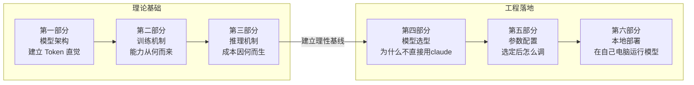

# 第一课：大模型基础

> **目标**：理解大模型"能力从何而来、成本因何而生"，为工程决策提供理性基线，明白"如何进行模型选型和参数配置"。

---

## 核心主线




你搭了一个 AI CR 工具，在 PR 合并前自动 review 代码。某天一个同事提交了这样一段 TypeScript：

```typescript
async function renderProfile(userId: string) {
  const res = await fetch(`/api/users/${userId}`)
  const user = res.ok ? await res.json() : null
  const name = user.name
  document.getElementById('name')!.textContent = name
}
```

你的 AI CR 工具给出了一条 review 意见：**"`user` 可能为 `null`，第 4 行直接访问 `.name` 会抛出 `TypeError`。建议使用可选链 `user?.name`。"**

它说对了。但跑了一段时间之后，问题越攒越多——

先是好奇：
1. 模型不认识文字，它到底是怎么"读"代码、"看出"空指针风险的？
2. 它"懂" `try-catch` 却不"懂"你的内部 API——能力的边界到底在哪？
3. output token 为什么比 input token 贵好几倍？追问为什么比首次提问快？

然后是工程决策：
4. 为什么不直接用最强的模型？
5. 选定模型后如何调参？
6. 前面讲了这么多，能不能不花钱、不申请 API key，自己跑一个模型试试？

这节课就跟着这六个问题，把大模型拆开来看清楚。前三个问题拆解原理（模型架构、训练机制、推理机制），后三个落地工程（模型选型、参数配置、本地部署）。整节课会反复回到这段代码——看看模型在每个阶段对它做了什么。

---

## 第一部分：模型架构——建立 Token 直觉

先从第一个问题开始：模型不认识文字，它到底是怎么"读"代码、"看出"空指针风险的？跟着一条请求进模型走一遍，看看从你按下发送到第一个字出来，中间经过了哪些步骤。

就用开头那条：你的 AI CR 工具把这段代码和指令 `「请 review 这段代码」` 一起发给了模型。

### 1.1 统一范式：预测下一个 Token

大模型（LLM）时代与传统 AI 模型（如传统的机器学习或早期的深度学习）相比，最核心的区别可以总结为**从“专才”向“通用通才”的范式转移**。

在大模型出现之前，不同的语言任务需要不同的模型和工程方案：分词一个模型、情感分析一个模型、翻译一个模型、问答又一个模型。每个任务单独收集数据、单独训练、单独部署。对于现在看起来很自然的 AI CR 任务，传统的做法是Snyk/DeepCode那样，从大量开源仓库的历史提交和 Bug 修复补丁中学习代码模式，用语义级静态分析模型自动发现缺陷并给出修复建议。

转折发生在模型规模跨过某个临界点之后。研究者发现，当**参数量**和**训练数据量**大到一定程度时，模型会突然"冒出"一些从未被显式训练过的能力——推理、类比、跨语言迁移、甚至零样本完成全新任务。这就是所谓的**涌现（Emergence）**。没有人在训练目标里写过"请学会 review 代码"，但当模型大到一定量级，给它开头那段 `renderProfile` 函数，它就能指出"`user` 可能为 `null`，直接访问 `.name` 会抛出 `TypeError`"——这就是你刚才看到的那条 review 意见，而这种空指针判断能力从未被显式训练过。

正是涌现，让"一个模型干所有事"从不切实际变成了工程现实。LLM **用一个"预测下一个 token"的统一范式，覆盖了几乎所有语言任务**。分类、摘要、翻译、代码生成、对话……全部可以转化为"给定前文，生成后续 token"的问题。

**工程视角**：
1. **不需要为每个任务搭专用模型**了。一个 API 接口 + 不同的 prompt 就能处理大部分语言任务。这极大降低了 AI 应用的工程门槛，也是为什么"提示词工程"（第二课）变得如此重要。
	1. 对于极端追求**低延迟、低成本、高并发**的单一简单任务（例如千万级日活的垃圾评论过滤、或者高频的情感极性打分），企业依然会选择微调部署一个小巧的专用模型（如 BERT 或轻量级分类器），因为调用大模型 API 太慢且太贵。
2. **涌现**让模型的能力边界变得**不可预测**，每次基座模型升级都可能解锁之前做不到的任务。很多能力不是模型没有，是你没"激活"它。比如加一句"let's think step by step"，推理能力就涌现出来了。你今天用 prompt 搞不定的事，换一个更大或更新的模型可能就通了。所以**好的 AI 工程架构应该把模型当作可替换的组件**，而不是把业务逻辑绑死在某个模型的特定行为上

---

### 1.2 Tokenizer：文本切分与基础单元

**模型不认识文字。** 开头那段 `renderProfile` 代码发给模型后，第一步不是"理解"——而是切词。文本必须先被切成一个个 **token**——介于字符和单词之间的子词单元：

```
"user.name" → ["user", ".", "name"] → token ID: [882, 13, 2601]

"写代码"     → ["写", "代码"]          → token ID: [35946, 99257]
```

hugging face 的 tokenizer.json 文件示例:
```json
{
  "version": "1.0",
  "truncation": null,
  "padding": null,
  "added_tokens": [
    { "id": 0, "content": "<s>", "special": true },
    { "id": 1, "content": "</s>", "special": true }
  ],
  "model": {
    "type": "BPE",
    "dropout": null,
    "unk_token": "<unk>",
    "continuing_subword_prefix": null,
    "end_of_word_suffix": null,
    "fuse_unk": false,
    "byte_fallback": true,
    "vocab": {
      "<s>": 0,
      "</s>": 1,
      "Ġ": 3,
      "t": 4,
      "h": 5,
      "e": 6,
      "Ġthe": 7
    },
    "merges": [
      "Ġ t",
      "Ġt h",
      "Ġth e",
      "Ġ t h e"
    ]
  }
}
```

**工程视角**：

1. **钱（成本与模型选型）**：API 严格按 Token 计费。在早期 GPT-4 等采用传统词表的模型中，同样语义的中文通常比英文消耗多 1.5-2 倍 Token，直接推高成本。但在最新的国产原生多语言模型（如 DeepSeek/Qwen）或采用新词表（如 GPT-4o）的模型中，这种差异已缩小至 1.3 倍甚至逼近 1:1。处理大量中文文档时，选对模型的底层词表就是省钱。

2. **容量与本地显存瓶颈**：128K 上下文窗口 ≠ 128K 字符。实际能放多少内容取决于分词效率（早期词表下 128K 可能只够放 8-10 万中文字）。更致命的是，在受限的硬件环境（例如 16GB 统一内存的机器）进行本地推理时，输入越多的 Token，生成的 KV Cache 显存占用就越庞大，这不仅容易引发内存溢出（OOM），还会造成首字响应时间（TTFT）的严重卡顿。

3. **代码与 API 场景的隐形消耗**：连续的空格、代码缩进、长变量名都会吞噬 Token。此外，前端开发中常见的大型 JSON 数据、OpenAPI 接口规范、或是层级极深的 DOM 结构，往往伴随着极高的 Token 冗余。这就是为什么高效的 AI 终端工作流和编码工具，在将上下文喂给模型前，都必须先执行代码压缩、AST（抽象语法树）裁剪或 API 规范精简等预处理步骤。

4. **AI CR 场景**：一个 PR 的完整 diff 往往包含大量空行、缩进变更和上下文行，Token 消耗远超你直觉。设计 CR 工具时，对 diff 做预处理（只保留有实质变更的 hunk、去掉纯格式调整）能显著降本。

> **动手验证**：用 [OpenAI Tokenizer](https://platform.openai.com/tokenizer) 或[HuggingFace - Tokenizer Playground](https://huggingface.co/spaces/Sagicc/tokenizer-playground)把你项目里的一段带缩进的 JSON 响应，和一段纯中文需求文档分别粘贴进去，看看各消耗多少 token，建立直觉。可以明显看到，GPT-5的中文分词比GPT-4的中文分词更加优秀，QWEN 3.5 (和QWEN 3 用的同一款分词器)又比GPT-5的中文分词更加优秀。同时，GPT-5的英文分词比中文分词优秀。


```
多个单词通常对应一个 token，但也有例外：比如 indivisible 可能不会被当作单个token。

像表情符号这类 Unicode 字符，可能会被拆成多个 token（对应其底层字节）：🤚🏾

一些经常连在一起出现的字符序列也可能会被合并成一个 token：1234567890
```

| GPT-4 中文 (104)                       | GPT-5 中文 (82)                        | Qwen-3 中文 (75)                       | GPT-5 英文 (53)                        |
| ------------------------------------ | ------------------------------------ | ------------------------------------ | ------------------------------------ |
| ![[Pasted image 20260225163540.png]] | ![[Pasted image 20260225163512.png]] | ![[Pasted image 20260225163447.png]] | ![[Pasted image 20260225163609.png]] |

---

### 1.3 Embedding：词的向量化与语义表示

Tokenizer 把文本切成了 token 并编上 ID，但 ID 只是编号，不含任何语义信息。**Embedding 的作用是把每个 token ID 映射成一个数字向量**，让语义相近的词在向量空间中距离也近。

**向量就是一组数字**，每个维度隐含某种语义特征。回到开头那段代码——AI CR 建议把 `user.name` 改成 `user?.name`。模型是怎么把这两者关联起来的？用一个简化的 3 维例子感受一下：

```
                [访问属性,  函数调用,  安全防御]
user.name    → [0.9,      0.1,       0.1]
user?.name   → [0.9,      0.1,       0.9]
callback()    → [0.1,      0.9,       0.1]
callback?.()  → [0.1,      0.9,       0.9]
```

于是 user.name - callback() + callback?.()：

```
[0.9, 0.1, 0.1] - [0.1, 0.9, 0.1] + [0.1, 0.9, 0.9] = [0.9, 0.1, 0.9] ≈ user?.name
```

直觉上也说得通：`user.name`（不安全的属性访问）加上"安全防御"维度，就得到了 `user?.name`（可选链访问）。这就是为什么 AI review 开头那段代码时，看到 `user.name` 能联想到 `user?.name`——因为两者在向量空间中只差一个"安全防御"维度，模型能据此建议你"这里可能 NPE，需要加 `?.`"。

模型通过训练，把语义关系编码进了向量的方向和距离。真实的 embedding 维度通常是几百到几千维，但原理相同。


**工程视角**：
1. Embedding 的原理直接支撑了 RAG（检索增强生成）的核心逻辑——把文档转成向量存起来，查询时也转成向量，找距离最近的片段返回给模型。"语义相近的内容向量距离近"就是语义搜索能工作的根本原因。选 Embedding 模型时，核心指标就是它对你的领域数据能否准确捕捉语义相似度。
2. 传统AI Coding工具如Cursor会对整个代码仓库做向量化，但会打破代码的结构性逻辑，导致上下文割裂。新的 AI Coding 工具如 Claude Code 更多采用 Agentic Search 的方式。

---

### 1.4 Attention：捕捉上下文间的关联

#### 为什么需要 Attention

但静态词向量有一个局限：每个词只有一个固定向量，无法区分多义词。还是开头那段代码——第 5 行有个 `!`（`document.getElementById('name')!.textContent`），而如果你在前面加一个判空 `if (!user)`，这里也有个 `!`。两处 `!` 含义完全相反：前者是非空断言（"我保证不为空"），后者是逻辑取反（"user 是否为空"）——前者是在跳过空值检查，后者是在检查空值。但在早期词向量时代，两处的 `!` 是同一个向量。

Transformer 解决了这个问题：token 经过 Attention 的上下文交互之后，最终表示会随语境变化——同一个词在不同句子里的向量是不同的（机制见 1.4）。
#### Q-K-V 机制

回到开头那段 `renderProfile` 代码。模型读到第 4 行 `user.name` 时，要判断这行有没有问题。如果只盯着 `user.name` 本身，语法完全正确。它需要回头找线索——`user` 是怎么来的？有没有可能为空？

Attention 做的事情就是：**让当前位置去"查询"前文，给每个位置打一个相关性分数，再按分数加权汇总信息。**

Q/K/V 是这个过程的三个角色：
- **Q（Query）**：当前位置发出的"我在找什么"——`user.name` 的 Q 在问："user 是什么？能不能安全地访问它的属性？"
- **K（Key）**：前文每个位置的"我是什么"，用来和 Q 匹配打分——`const user = res.ok ? await res.json() : null` 的 K 标识着"我是 user 的定义"
- **V（Value）**：前文每个位置真正要传递的内容，按得分加权汇总后输出——这一行的 V 携带的信息是"user 来自三元表达式，当请求失败时值为 `null`"

在这个例子里，`user.name` 的 Q 会对 `const user = res.ok ? ... : null` 打出高分（变量定义 vs 属性访问，高度相关），而对 `const res = await fetch(...)` 打出较低的分（间接相关，不是 `user` 的直接来源）。高分位置的 V 被重点吸收——于是模型能发现：`user` 可能为 `null`，直接访问 `.name` 会抛出 `TypeError: Cannot read properties of null`。

**工程视角**：

- **超长上下文的难点**：Attention 的计算量与序列长度的平方成正比（每个位置i和前文每个位置j计算相关分数，O(n²)），这就是超长上下文是技术难题的根本原因，也是为什么各家都在做 Attention 优化（GQA、MQA、稀疏注意力等）。

- **Lost In Middle**：自回归模型的训练是预测下一个 token，最直接、最常出现的有效信号通常来自最近的前文；而开头天然是所有token都看得到的公共前缀，容易被多层、多头反复读到。研究发现模型对开头和结尾的信息关注更多，中间部分容易被"忽略"（Lost in the Middle 现象）。这直接关系到提示词工程和上下文工程——关键信息该放哪里、怎么组织。[# Lost in the Middle: How Language Models Use Long Contexts](https://arxiv.org/abs/2307.03172)

- **AI CR 场景**：如果你用 AI 做过长文件的 code review，可能已经注意到——文件越长，中间部分的问题越容易被漏掉，这正是 Lost in the Middle 的直接体现。应对策略：把长文件按函数/类拆分成多段分别 review，而不是整个文件一次性喂进去。

---

### 1.5 Transformer：大模型的网络架构

前面我们跟着 `renderProfile` 走过了切词（Tokenizer）、向量化（Embedding）、通过 Attention 回溯发现 `user` 可能为 `null`。但这些只是独立组件。**Transformer 是把 Embedding、 Attention 和其他模块组合成完整架构的方案。**

一个 Transformer Block 的结构：
![[Pasted image 20260225204203.png]]
> **注**：上图展示的是经典 Transformer 的 **Encoder-Decoder 架构**（包含左侧encoder和右侧decoder），也是最初用于机器翻译设计的结构。但**现代大语言模型（LLM）几乎全部转向了纯解码器（ecoder-only）架构**，只有右侧。


几个要点：

- **残差连接**：让信息可以"跳过"某一层直接传递，解决深层网络的训练困难——没有它，96层的网络根本训不动。

- **FFN（前馈网络）**：Attention 负责"在 token 间传递信息"，FFN 负责"在每个位置上做深层加工"。可以理解为 Attention 是"开会讨论"，FFN 是"独立思考"。回到那段代码——Attention 把 `const user = res.ok ? ... : null` 的信息传递给了 `user.name` 这个位置，接下来 FFN 在这个位置独立加工：综合"user 可能为 null"和"直接访问属性"这两条信息，得出"这里有空指针风险"的判断。

- **堆叠 N 层**：每一层都在上一层的基础上做更深层的理解。浅层捕捉语法，中层捕捉语义，深层捕捉复杂推理。还是那段代码：浅层就能发现 `user.name` 缺少 `?.`（语法层面的模式匹配），但要真正理解 `res.ok ? await res.json() : null` 这个三元表达式的分支逻辑，推断出"当请求失败时 user 为 null"——这需要深层的跨行推理，小模型做不到。

#### Encoder vs Decoder vs Decoder-Only

| 架构               | 特点         | 代表                             |
| ---------------- | ---------- | ------------------------------ |
| Encoder-Only     | 双向看全文，擅长理解 | BERT（分类、NER 等）                 |
| Encoder-Decoder  | 先理解再生成     | T5、早期翻译模型                      |
| **Decoder-Only** | 只看前文，自回归生成 | **GPT、Claude、Gemini、DeepSeek** |

在问答场景下，Encoder-Decoder 和 Decoder-Only 的区别在哪里？

还是开头那段代码。你的 AI CR 工具把 `renderProfile` 函数和指令 `”请 review 这段代码，指出潜在的空指针问题”` 发给了模型。

*   **Encoder-Decoder（像”闭卷考试”）**：
    模型有两个大脑。**大脑 A (Encoder)** 负责审题，它会反复阅读你提交的代码和指令，理解你要找的是”空指针问题”而不是”代码风格”，然后把这个理解封装成一个”意图包”传给 **大脑 B (Decoder)**。大脑 B 拿到意图包后，开始在另一张白纸上从头写 review 意见。代码和 review 结果在模型里是**物理隔绝**的。
    
*   **Decoder-Only（像”即兴接话”）**：
    模型只有一个大脑。它不觉得你在考它，它觉得你只是给了一段文本：代码 + `”请 review 这段代码，指出潜在的空指针问题”`。它的本能是把这段文本接下去。于是它顺着上下文，自然而然地输出：`”第 4 行 user.name 存在空指针风险：当 res.ok 为 false 时 user 为 null...”`。在模型看来，**你的代码、指令和它的 review 意见其实是同一段长文本的前后部分**。

**为什么现代 LLM 统一选择了 Decoder-Only？**
虽然 Encoder-Decoder 在翻译任务上很强，但 Decoder-Only 在处理问答时展现了更强的“联想”和“推理”能力。它把全世界的知识都看作是一个无止境的“续写任务”，这种**问答即续写**的统一范式，让它能更容易地通过海量互联网文本学会逻辑和常识。此外，Decoder-Only 在推理时可以极大利用 KV Cache 缓存（详见 3.2），在大规模并发场景下工程效率更高。

**工程视角**：Decoder-Only 的自回归特性意味着——模型是**逐 token 生成**的，每个 token 都依赖前面所有 token。这直接导致了生成速度受限（无法跳过中间内容直接输出结论），也解释了为什么 output token 比 input token 贵（详见第三部分）。

到这里，第一个问题有了答案：模型通过 Tokenizer 把代码切成 token，通过 Embedding 赋予语义，通过 Attention 让 `user.name` 回溯到 `const user = res.ok ? ... : null` 发现空值风险，再通过多层 Transformer 逐步深化推理——这就是它从"不认识文字"到"看出空指针"的完整链路。但架构只解释了"怎么处理"，还没回答"为什么它懂空指针检查却对你的内部 API 说错"——这是训练决定的。

---

## 第二部分：训练机制——能力从何而来

第一部分回答了模型怎么从纯文本中"看出"空指针风险。但第二个问题还没解——**它"懂" try-catch 却不"懂"你的内部 API，有时候指出的"问题"根本不是问题，有时候又一本正经地引用一个不存在的参数。能力的边界到底在哪？**

答案藏在训练过程里。

**Pre-train 给能力，CPT 补知识，SFT 教行为，Alignment 调偏好。**

### 2.1 预训练（Pre-training）

在海量无标注文本上做 next-token prediction。这个阶段让模型学会语言本身——语法、语义、常识推理、世界知识。训练完的模型本质上是一个强大的文本补全器：给它一段前文，它能续写出统计意义上合理的下文。

但它不理解"指令"，也没有对话意识。如果你给它一段代码然后写"请 review 以上代码"，它可能补全为"请 review 以上代码的测试覆盖率。请 review 以上代码的文档完整性。请 review……"——因为它认为你在列举 review checklist 条目，而不是在下指令。

**工程视角**：
1. **不要直接用Base模型**：除非要做微调，不要用 Base 模型——它不会回答你，只会续写

### 2.2 后训练（Post-training）

预训练结束后，模型是个通才补全器。后训练这里**粗略**分三步，依次解决不同问题：

#### 2.2.1 持续预训练 (CPT)：从"广博"到"精深"

**为什么需要 CPT？**

Base 模型用互联网文本训练，什么都懂一点，但对专业领域只是"扫过"——代码、医学论文、法律文书在通用数据中占比有限，深度不够。

问题在于：**SFT 教的是"怎么回答"，不是"懂什么"**。底层知识储备不够，SFT 无法无中生有。CPT 在 SFT 之前，用大量领域数据对模型做"浸泡式"深化训练，把知识基础打厚，再交给 SFT 雕刻行为。

以代码领域为例，CPT 阶段会喂入海量 GitHub、Stack Overflow 数据，让模型真正理解代码的结构逻辑：`if-else`/`try-catch` 的深层语义、跨几百行的函数依赖关系、不同语言中语义等价的写法（Python 的 `list.append` vs C++ 的 `vector.push_back`）。

**工程视角**：

1. **CPT 是模型厂商做的事，不是应用开发者的事**。但你能看到它的结果——这就是为什么 Qwen2.5-Coder 和通用 Qwen2.5 在代码任务上有显著差距：前者经过了代码领域的 CPT，底层知识储备更深厚。选模型时，同等规模下优先选经过领域 CPT 的专项模型。
2. **知识截止日期**：模型的知识锁死在预训练结束那一刻。问它你们内部的 API 会"幻觉"，这是 RAG 存在的根本原因

#### 2.2.2 SFT（监督微调）：从"续写"到"响应指令"

**SFT 不改变模型知道什么，而是改变模型的行为模式**——让它从"续写文本"切换到"响应指令"。

最直接的体现：问 Base 模型"帮我写个总结"，它可能续写、偏题；问 Instruct 模型，它会稳定输出总结结构。SFT 教的是"怎么回答"，而不是"懂什么"——底层知识储备不够，SFT 无法无中生有。

SFT 覆盖几个方向，每个方向决定了一类能力：

- **指令微调**：教模型学会"对话范式"——听从指令、按期望格式输出，而不是续写。这是 Chat / Instruct 版本和 Base 版本最本质的区别。
- **链式思维微调（CoT SFT）**：在训练数据里不只提供最终答案，还包含推理步骤，让模型学会"先思考再回答"。这是推理模型（o1、DeepSeek-R1）能力的基础之一。
- **工具调用微调**：让模型学会在合适时机生成结构化函数调用（JSON schema），而不是用自然语言回答。AI CR 工具能调用 linter、返回结构化 review 结果，就来自这里。
- **代码微调**：用大量（需求 → 代码）样本训练，让模型输出可编译、可运行的代码产物，覆盖补全、修 bug、重构等场景。

**工程视角**：

1. **专用 Coder 模型 vs 通用模型**：同等规模下，经过代码 CPT + Code SFT 的模型在代码任务上显著优于通用模型——选模型时优先看是否有专项训练
2. **不要给推理模型加"请一步一步思考"**：o1、DeepSeek-R1 这类通过 RLVR 训练的模型已经内置了推理链，手动加这句会干扰它，反而降低效果
3. **SFT 能修行为，补不了知识**：模型文风不对、格式不稳，可以通过 SFT 调整；但如果底层逻辑本身不行，少量 SFT 很难有质变

#### 2.2.3 Alignment（对齐）：从"能回答"到"回答得好"

SFT 后的模型能响应指令，但回答质量参差不齐——该拒绝的不拒绝、过于冗长或过于保守。Alignment 通过对比"好回答 vs 差回答"的偏好信号，让模型在多个可行答案里选更符合人类期望的那个。

两种主要路径：

- **偏好对齐（RLHF / DPO）**：RLHF 先训练一个"奖励模型"来模拟人类偏好，再用它指导语言模型优化；DPO 跳过奖励模型，直接用好/差回答对比优化，效率更高。两者目标相同：让模型更有用、更安全。GPT-4、Claude 系列走的是这条路。
- **客观验证（RLVR）**：用编译器、测试用例等客观标准给分——代码能跑就是对，跑不了就是错。不依赖人类主观评价，模型可以通过大量自我博弈不断进化。DeepSeek-R1、o1 系列走的是这条路，这也是为什么它们在代码和数学上表现突出——代码是少数"答案对错极度明确"的领域，天然适合强化学习。

**Alignment Tax（对齐税）**：过度对齐会让模型变得瞻前顾后，损失部分原始的直接性和创造力。你在 AI CR 里看到的"建议考虑是否……"而不是直接说"这里有个 bug"，大多来自这里。这是训练机制带来的，不是 prompt 能完全解决的。

**工程视角**：

1. **为什么代码任务最适合强化学习 (RLVR)**：代码是少数几个”答案对错极度明确”的领域（能运行 vs 报错）。这就是为什么 DeepSeek-R1 等模型在代码任务上表现极其惊艳，因为它们在训练阶段被编译器”毒打”过无数次，练就了极强的纠错本领。
2. **AI CR 场景**：Alignment Tax 是 CR 工具中一个常见痛点——review 结论太保守（”建议考虑是否……”而非”这里有 bug”）是对齐机制带来的，不是 prompt 写得不好。适当降低 temperature 有帮助，但治不了根；在 prompt 里明确要求”直接指出问题，不要用建议性措辞”可以部分缓解。通过强行让模型先输出 JSON，强制其在一个严苛的枚举值中做判定，也可以部分缓解。

```typescript
{
	"severity": "BLOCKER", // 强约束：只能选 BLOCKER, WARNING, NIT 
	"confidence_score": 0.95, 
	"direct_issue": "NPE at line 4: user.name accessed without null check, user is null when res.ok is false.", 
}
```

### 2.3 延伸思考：哪些投入不会被模型吞掉

> 这一节跳出训练机制本身，从工程投资的角度做一个短暂的反思——理解了模型能力的来源后，哪些方向值得长期投入？

**与模型发展方向保持"15度夹角"**（Respect To 秒哒产品经理 2026 年 2 月访谈）：

```
0度（做模型即将内化的事）→ 下一代模型淘汰你的工作
90度（和 AI 完全无关）→ 无法借 AI 杠杆
15度（构建模型增强但不会替代的能力层）→ 模型越强，你越值钱
```

短期不会被内化的方向：

- 领域私有数据的检索、集成与权限控制
- 与外部系统深度集成（CI/CD、数据库、监控、审批流）
- 评估体系与可观测性（trace、debug、回放）
- 发现"哪些问题值得用 AI 解决"的判断力——这个能力需要同时理解业务和模型能力边界

**AI CR 场景**：模型会越来越强，review 代码的能力会持续提升——这部分是 0 度。但把 CR 结果接入 CI pipeline、根据团队代码规范定制规则、集成权限控制（哪些仓库能送审、谁有权 approve）、建立 CR 质量的评估体系——这些是 15 度的工作，模型越强你做得越值钱。


---

## 第三部分：推理机制——成本因何而生

前两部分回答了模型怎么"读"代码、能力边界在哪。第三个问题关于钱：output token 为什么比 input token 贵好几倍？追问为什么比首次提问快？

这是推理机制决定的。

### 3.1 Prefill 与 Decode：两个完全不同的阶段

**一句话本质**：处理输入和生成输出是两个瓶颈完全不同的过程。


|      | Prefill                                                            | Decode                                                             |
| ---- | ------------------------------------------------------------------ | ------------------------------------------------------------------ |
| 做什么  | 并行处理整个输入，计算所有 token 的 KV<br><br>"[renderProfile代码] + 请review空指针风险" | 逐个生成新 token，每步读取全部已有 KV<br><br>"第 / 4 / 行 / user / . / name / ..." |
| 瓶颈   | GPU 算力                                                             | 显存带宽                                                               |
| 关键指标 | TTFT（Time To First Token）                                          | TPS（Tokens Per Second）                                             |

**这解释了你日常体验中的很多现象**：
- **长 prompt 要等更久才出第一个字**：Prefill 处理全部输入 token，输入越长 TTFT 越高。
- **Output token 比 Input token 贵 3-5 倍**：Decode 阶段每生成一个 token 都要过一遍模型，串行执行，GPU 利用率低但没法省。
- **Thinking 模型更贵**：Extended Thinking 在 Decode 阶段生成大量推理 token，全按 Output 价格计费。
- **"流式输出"并不加速生成**：生成速度由 Decode 决定，流式只是让你提前看到已生成的部分，体验上感觉更快。

---

### 3.2 KV Cache 与 Prompt Cache

#### KV Cache：空间换时间

Decode 阶段，每生成一个新 token 理论上要对所有前面的 token 重算 Attention。KV Cache 把已算过的 Key 和 Value 缓存起来，避免重复计算：

```

无 KV Cache: 每步重算全部，计算量 O(n²)

有 KV Cache: 每步只算新 token 的 KV 并追加到缓存，计算量 O(n)

代价: KV Cache 随序列增长不断膨胀，长上下文场景占几十 GB 显存

```

#### Prompt Cache：跨请求复用

当多次请求共享相同前缀（比如同一个 system prompt），可以跨请求复用已计算的 KV Cache：

```

请求 1: [系统指令 | 代码库上下文 | 用户问题A]

├── 共同前缀 (首次计算) ──┤

请求 2: [系统指令 | 代码库上下文 | 用户问题B]

├── 命中缓存! 直接复用 ──┤├ 只算新部分 ┤

```

**真实产品中的应用**：

- **Claude Code**：系统提示词 + 代码库上下文首次请求后缓存，后续对话只为新输入付全价。缓存命中的 token 只有原价 ~10%。这就是为什么 Claude Code 鼓励用详细的 CLAUDE.md 和 system prompt——前期投入更多 input token 换后续每轮的大幅降本。

- **Kimi（月之暗面）**：通过激进的 KV Cache 管理支持超长上下文，首次加载慢（Prefill 大量内容），但后续追问非常快（缓存命中）。

**工程决策启示**：

1. **设计 prompt 时考虑缓存友好性**：稳定内容（system prompt、规则、参考文档）放前面，变化内容（用户输入）放后面，最大化缓存命中。

2. **理解"首次慢、后续快"**：Agent 多轮调用中，第一轮最慢最贵，后续因缓存命中大幅提速降本。这也是为什么一些 Agent 框架会刻意"预热"缓存。

3. **长上下文不免费**：128K 窗口虽然支持，但 KV Cache 的显存开销意味着长上下文请求占用的资源远超短请求，部分服务商会对超长上下文加价。

4. **AI CR 场景**：这就解释了为什么同一个 PR 里追问第二个问题明显更快——system prompt + 代码库上下文 + 团队规范这些不变的前缀在第一次请求时已被缓存。设计 CR 工具时，把团队编码规范、review checklist 等稳定内容放在 prompt 最前面，每个文件的 diff 放在最后，就能最大化利用 Prompt Cache，review 多个文件时后续文件的成本和延迟都大幅下降。

---

### 3.3 加速与降本技术全景

| 技术                              | 做什么                                | 工程价值                         |
| ------------------------------- | ---------------------------------- | ---------------------------- |
| **量化**                          | 降低参数精度 FP16→INT8→INT4              | 显存降 2-4 倍，私有化部署首选，但有精度损失     |
| **KV Cache 优化 (GQA/MQA)**       | 多个 Query 头共享 KV 头                  | 降低长上下文显存压力                   |
| **Prompt Cache**                | 跨请求复用 KV Cache                     | Agent 场景降本 90%+              |
| **推测解码**                        | 小模型快速草拟 + 大模型验证                    | 生成速度 2-3× 提升，质量不降            |
| **专用芯片 (ASIC)**                 | 为 Transformer 定制硬件                 | Google TPU、Groq LPU——极致推理速度  |
| **连续批处理 (Continuous Batching)** | 词级迭代请求，不等前一个任务完全结束即开始新任务           | 显著提升系统吞吐量（Throughput），降低排队时延 |
| **Paging (vLLM)**               | 像 OS 虚拟内存一样管理 KV Cache 碎片          | 显存利用率近 100%，支撑更多并发用户         |
| **混合专家模型 (MoE)**                | 每次推理仅激活 1/N 的参数（如 DeepSeek, GPT-4） | 以极低推理功耗换取巨量模型性能              |
| **蒸馏 (Distillation)**           | 大模型指导小模型训练，将“智慧”迁移到更小的模型           | 1.5B/7B 模型能达到接近大模型的垂直领域水平    |

**工程视角**：
- 作为 API 调用者，你不需要实现这些技术，但理解它们有助于你：在选推理服务商时评估技术栈（Groq 的 LPU 极快但模型选择有限）；理解同一模型在不同平台上价格和速度差异的原因；在私有化部署时做精度-成本权衡（INT4 量化的 70B 模型可能比 FP16 的 7B 模型效果好且成本相当）。
- **AI CR 场景**：CR 是高频但非交互式的任务，批处理（Batch API）值得关注——把一个 PR 里的多个文件 review 请求打包提交，API 厂商通常给 50% 折扣，代价是延迟从秒级变成分钟级，但 CR 本身不需要实时响应，这个 trade-off 非常划算。

---

## 第四部分：模型选型

前面三部分建立了理性基线——你知道了模型怎么处理代码、能力边界在哪、成本花在了哪里。现在进入工程决策。第四个问题：为什么不直接用最强的模型？

### 4.1 为什么不直接用最强模型

旗舰模型（Opus 4.6、GPT-4.1 等）代表能力上限，但不是工程默认选项：

| 场景                 | 问题                                                | 更合适的方案                       |
| ------------------ | ------------------------------------------------- | ---------------------------- |
| 高频简单任务（分类、摘要、格式转换） | Opus 单价高，千次调用成本失控                                 | Claude Haiku / GPT-4o mini   |
| 延迟敏感（实时补全、流式交互）    | Opus 响应慢，P95 延迟难达标                                | 小参数量快速模型                     |
| 大量中文处理             | 部分模型 tokenizer 中文效率较低，同样内容多消耗 1.3×+ token（具体取决于模型版本） | Qwen 系列等原生多语言模型              |
| 私有数据 / 合规要求        | Claude 是纯 API，数据必须出境                              | 本地部署开源模型（Qwen、Llama）         |
| 垂直专项任务（代码补全、特定领域）  | 经过专项 SFT 的小模型在窄任务上不输 Opus，但便宜数十倍                  | Qwen2.5-Coder、DeepSeek-Coder |

**AI CR 场景**：如果你的仓库是私有的且不允许代码出境，直接排除所有纯 API 模型；如果 CR 触发频率很高（每天上百个 PR），旗舰模型的成本可能比招一个人还贵——这些约束比"哪个模型 review 质量最高"优先级更高。

**即使同为主流模型，各家强项不同**

| 模型 | 差异化强项 | 典型适用场景 |
| --- | --- | --- |
| **Claude Sonnet / Opus** | 长上下文、Agentic 编码、指令跟随精确 | 多步代码工程、长文档分析、复杂 Agent |
| **GPT-4o / GPT-4.1** | 通用综合、结构化输出稳定、视觉理解 | 通用问答、JSON 提取、视觉任务 |
| **o3 / o4（OpenAI 推理系列）** | 数学推理、竞赛编程、硬逻辑 | 复杂算法、数学证明、架构方案设计 |
| **Codex（OpenAI）** | 代码补全与生成专项优化，低延迟（工具型，非通用旗舰） | IDE 内联补全、函数生成、代码翻译 |
| **Gemini 2.5 Pro** | 超长上下文（1M+）、视频理解 | 超长文档处理、视频分析、Google 生态集成 |
| **DeepSeek V3 / R1** | 成本极低、代码与推理能力强、中文友好 | 代码任务的低成本替代、中文场景 |

> 这些差异在 Benchmark 上体现有限，需要在你的真实任务上实测。OpenRouter 单模型详情页和 Chatbot Arena 的任务分类排名是比较好的参考起点。

---

### 4.2 判断维度：选型看什么

把约束写成可检查的六个问题：

| 维度          | 关键问题                          | 对选型的影响                   |
| ----------- | ----------------------------- | ------------------------ |
| **任务类型**    | 问答 / 代码 / 视觉 / 多模态？           | 决定是否需要 Coder / Vision 变体 |
| **部署模式**    | API 调用还是本地？数据能出境吗？            | 本地部署只能选开源可自托管模型          |
| **显存 / 硬件** | 本地有多少显存（或统一内存）？               | 直接决定能跑的最大参数量和精度（见下方粗估）   |
| **成本上限**    | 每次调用的预算是多少？                   | 直接划掉高于预算的模型层级            |
| **延迟要求**    | 用户能等几秒？P95 延迟要求？              | 旗舰模型 TTFT 通常比小模型慢 2–5×   |
| **输出格式**    | 需要稳定 JSON / function calling？ | 必须选 Instruct/Chat 版本并实测  |

**知识策略**（影响选型：如果最终需要 SFT，则必须选开源模型）：先 Prompt，够用就不升级；Prompt 拿不到新知识再加 RAG；RAG 之后行为仍不稳定才考虑 SFT。

**路由策略**：同一系统不必所有调用用同一模型。工程中常见三种路由实现（[参考](https://portkey.ai/blog/task-based-llm-routing/)）：

| 路由方式 | 做法 | 适用阶段 |
| --- | --- | --- |
| **规则路由** | 按输入特征（文件大小、任务类型等）硬编码分流 | 大多数团队的起步方式 |
| **分类器路由** | 训练一个小模型（如 BERT）判断请求难度，动态分流 | 请求量大、规则难穷举时 |
| **级联路由** | 先用便宜模型跑，质量不达标再自动升级到强模型 | 对质量有硬指标时 |

> 路由的收益已有实证：有团队通过规则路由将月度 LLM 开销从 $42k 降至 $18k，客户满意度不变（[案例来源](https://www.swfte.com/blog/intelligent-llm-routing-multi-model-ai)）。

**AI CR 场景**：CR 是规则路由的典型应用——按文件变更复杂度分流，先用 Haiku 级别的快模型扫一遍明显的代码风格和格式问题（低成本高频），只对包含复杂逻辑变更的文件升级到 Sonnet/Opus 做深度 review（高成本低频），同样的 review 覆盖率，成本降 60%+。

---

### 4.3 实践四步：初筛 → 比价 → Benchmark 排除 → 私有评测集定夺

#### Step 1：从模型名字做粗略判断

**为什么要学会读模型名字？** 本地部署时，你面对的往往只有一个文件名——从 HuggingFace 下载的 `.gguf`、Ollama 拉取的镜像名、或者 llama.cpp 加载的模型路径。没有 OpenRouter 这样的平台帮你过滤、比价、查功能列表；能提取出哪些信息，完全取决于你能不能读懂这个字符串。

模型名字里藏着关键信息，快速判断"值不值得进候选池"：

| 名字线索 | 常见标记 | 代表什么 | 对选型的含义 |
| --- | --- | --- | --- |
| **模型家族 / 代次** | `Qwen2.5`、`Llama-3.1`、`DeepSeek-V3` | 能力谱系和代际 | 同系列代次越新，对齐越稳 |
| **参数规模** | `3B/7B/14B/32B/70B` | 稠密参数量 | 越大质量越高但越慢越贵 |
| **MoE 标记** | `MoE`、`671B/37B active` | 每次仅激活部分专家 | 不要只看总参数，看激活参数 |
| **指令对齐** | `Instruct`、`Chat` | 经过指令微调 | 应用默认选 Instruct/Chat |
| **任务域变体** | `Coder`、`Vision`、`Reasoning` | 领域强化版本 | 代码任务优先 Coder |
| **量化/精度** | `Q4/Q8`、`INT4`、`GGUF` | 权重压缩精度 | 本地部署必看，省显存但有精度损失 |
| **上下文长度** | `32k/128k/1M` | 最大窗口 | "能塞下"≠"都能用好" |
| **版本日期** | `-20250214`、`v1.1` | 具体快照 | 生产中固定版本，避免 `latest` 漂移 |

例：`Qwen2.5-Coder-7B-Instruct-Q4_K_M.gguf` = Qwen2.5 家族 / 代码优化 / 7B / 指令对齐 / 4bit 量化 / 本地推理格式。

**从名字粗估显存占用**：参数量和上下文长度是两个主要变量。

```
模型权重显存 ≈ 参数量(B) × 每参数字节数
  FP16:  7B × 2 字节 ≈ 14 GB
  INT8:  7B × 1 字节 ≈  7 GB
  Q4:    7B × 0.5字节 ≈  4 GB（含开销约 4–5 GB）

KV Cache 显存 ≈ 随上下文长度线性增长
  7B 模型，128k context，FP16 KV ≈ 额外 16 GB+

实际可用规则（本地/消费级）：
  8 GB  显存/统一内存 → Q4 量化的 7B 以内
  16 GB → Q4 量化的 13B，或 FP16 的 7B（上下文受限）
  32 GB → Q4 量化的 32B，或 FP16 的 14B
```

> 名字只是初筛，命名没有行业统一标准，最终靠实测。

#### Step 2：用 OpenRouter 比较候选，并顺手做经济性校验

[OpenRouter](https://openrouter.ai/models) 是一个聚合了 200+ 模型的统一 API 平台，选型时有五个实用入口：

- **发现候选**（[/models](https://openrouter.ai/models)）：按任务类型、上下文长度、是否支持工具调用过滤，几分钟看到满足约束的所有模型。
- **实时比价**：每个模型都列出每百万 token 的 Input / Output 单价，同档位不同模型价格可差 5–10 倍，横向对比一目了然。
- **全局排行**（[/rankings](https://openrouter.ai/rankings)）：按调用量、Token 消耗量排名，反映真实工程场景下哪些模型被大量使用——比单纯看 Benchmark 分数更贴近生产。
- **单模型详情页**：每个模型有独立页面，列出该模型的 Benchmark 成绩、定价明细、上下文窗口、支持的功能（工具调用、JSON 模式、视觉等），以及 Playground 可直接测试——是做候选对比时的标准查阅入口。
- **统一 API 测试**：切换模型只需改 `model` 字段，不用为每家申请单独 API key，快速用真实任务对比输出质量。

看到定价页时，不要只“看贵不贵”，顺手做一遍经济性校验：

```text
总费用 = (Input tokens × Input 单价) + (Output tokens × Output 单价)
端到端延迟 ≈ 排队时间 + TTFT + 输出 token 数 / TPS
```

| 定价要素           | 说明                      | 价格关系            |
| -------------- | ----------------------- | --------------- |
| Input Token    | 发给模型的全部内容               | 基准              |
| Output Token   | 模型生成的回答                 | 通常比 Input 贵     |
| Cached Input   | 命中 Prompt Cache 的 token | 通常远低于普通 Input   |
| Thinking Token | Extended Thinking 推理过程  | 通常按 Output 口径计费 |

降本优先顺序：**先选对模型层级** → **控制 output 长度** → **利用 Prompt Cache** → **合理设 `max_tokens`**。  
也就是说，经济性校验最好就在 OpenRouter 比较阶段一起做，不要等 shortlist 定完才回头补算。

#### Step 3：用 Benchmark 排除明显差的

Benchmark 是"入围赛"，用来排除明显不达标的选项，不是最终决策依据（[为什么公开 Benchmark 不够用](https://www.evidentlyai.com/llm-guide/llm-benchmarks)）：

| Benchmark                 | 测什么                | 工程参考价值        |
| ------------------------- | ------------------ | ------------- |
| **SWE-Bench Verified**    | 真实 GitHub Issue 修复 | 最接近真实工程的代码评测  |
| **Aider Polyglot**        | 多语言代码编辑            | 贴近日常编码场景      |
| **HumanEval / MBPP**      | 函数级代码生成            | Python 为主，偏简单 |
| **MMLU / MMLU-Pro**       | 多学科知识              | 综合能力广度        |
| **Chatbot Arena (LMSYS)** | 综合人类偏好             | 众包盲评，最难作弊     |
| **LiveBench**             | 动态更新评测             | 对抗数据污染        |

**理性使用 Benchmark 的四条原则：**

1. 静态 Benchmark 可能被训练数据覆盖，分数虚高；优先看 Chatbot Arena、LiveBench。
2. 榜单高分 ≠ 你的任务好用；公开 Benchmark 只做排除，真正定夺靠下一步的私有评测集。
3. 只关心 pass@1（一次通过），pass@5 对工程无意义。
4. 分数差 1–2% 不值得换模型；迁移成本远超你以为的。

#### Step 4：构建私有评测集做最终决策

这是工程团队选型时**最被低估但最关键的一步**（[参考：如何构建 LLM 评测集](https://hamel.dev/blog/posts/evals/)）。公开 Benchmark 测的是通用能力，但你的任务有自己的分布——只有用真实数据评测才能做出靠谱决策。

**做法：**

1. **从生产数据中抽样 50–100 个典型 case**（AI CR 场景：选真实 PR diff + 期望的 review 意见）
2. **定义评分维度**：准确性、格式合规、误报率等——和你的业务指标对齐
3. **用 LLM-as-Judge 做自动评测**：让一个强模型对候选模型的输出打分，可以低成本地跑多轮对比（[LLM-as-Judge 指南](https://www.anthropic.com/research/evaluating-ai-systems)）
4. **人工抽检 10–20%**：确认自动评分和人类判断一致

> 构建评测集的门槛不高——50 条带标注的真实样本就能比任何公开 Benchmark 更准确地预测模型在你任务上的表现。投入一个下午，省下反复换模型的周级折腾。

**AI CR 场景**：收集 50 个历史 PR（覆盖不同复杂度和语言），用人工标注出"应该指出的问题"，作为评测集。让候选模型跑一遍，比较召回率和误报率——这比看 SWE-Bench 分数可靠得多。

**工程视角**：

1. **先排约束，再比能力**：成本、延迟、数据合规优先于模型能力排名
2. **路由 + 知识策略联动**：路由决定"哪些调用用哪个模型"，知识策略决定"选定模型后怎么补知识"——两者共同影响最终选型
3. **Benchmark 排除，私有评测集定夺**：公开 Benchmark 用来去掉明显差的；最终选谁，由你自己的 50–100 条真实 case 说了算

---

## 第五部分：参数配置

模型选好了，第五个问题：`temperature`、`max_tokens`、`thinking`——这些参数到底影响多大？

答案可能出乎你意料：**大多数时候，影响不大。** 选型决定了"谁来干活"，参数决定"怎么干"——但在调参之前，先建立一个正确的预期。

**调参的真实影响层级：**

```
80% 的输出质量问题 → 来自 Prompt 写得不够好
15% → 来自上下文信息不足
 4% → 来自参数设置不对
 1% → 来自模型本身的能力瓶颈
```

大多数时候，你以为需要"调参"的问题，其实是 prompt 的问题。参数是锦上添花，不是救命稻草。**先改 prompt，再调参数，最后才考虑换模型。**

---

### 5.1 采样参数：temperature

`temperature` 控制输出的"随机程度"——数值越低，模型越倾向于选概率最高的 token；数值越高，低概率 token 被选中的机会越大。

| temperature | 效果 | 典型场景 |
| --- | --- | --- |
| 0 – 0.2 | 几乎确定性输出 | 代码生成、JSON 提取、分类 |
| 0.3 – 0.5 | 稳定但有灵活性 | 代码审查、技术问答、摘要 |
| 0.6 – 0.8 | 自然流畅 | 日常对话、文档写作 |
| 0.9 – 1.2 | 多样、发散 | 头脑风暴、创意写作 |

**三条容易踩的坑：**

1. `temperature=0` 不等于"完全确定"——浮点精度和 batch 策略会带来微小变异。严格复现需要加 `seed` 参数。
2. 低 temperature 不等于"更正确"——它只影响从分布中怎么选，不改变分布本身。模型如果对某事实本来就不确定，降 temperature 只会让它更坚定地选错误答案。
3. 代码任务推荐 0.1–0.2 而非 0——完全贪心解码有时会陷入重复模式。

**AI CR 场景**：`temperature` 建议 0.1–0.3。太高会导致同一段代码每次 review 结论不一致，开发者失去信任；太低（0）则容易陷入重复的模板化评语。如果你需要 CR 结果可复现（比如用于审计），加上 `seed` 参数固定随机状态。

`top_p` 和 `top_k` 是另两个采样控制参数，与 temperature 效果部分重叠。**实操建议：只调 temperature，top_p 保持默认 1.0，top_k 通常不需要碰。**

---

### 5.2 输出控制：max_tokens 与 stop

**`max_tokens`** 是输出的硬性上限，不是目标——模型遇到自然结束符会提前停止。

| 场景 | 推荐值 | 注意 |
| --- | --- | --- |
| 分类 / 判断 | 50–200 | 限制住可以减少废话 |
| JSON / 结构化提取 | 预期大小 × 1.5 | 留余量，别开太大烧钱 |
| 代码生成（函数级） | 4096–8192 | 太大模型可能"过度生成" |
| Agentic 工具调用 | 4096–8192 | 需要包含工具调用 JSON |
| 长文档 / 多文件重构 | 16384+ | 复杂任务需要足够空间 |

输出被截断（JSON 没闭合、代码缺 `}`）是最常见的 bug 之一，通常就是 `max_tokens` 不够。

**AI CR 场景**：CR 输出通常是结构化的 review 评论列表，建议设 `max_tokens` 为 2048–4096；如果你的 CR 工具要求输出 JSON 格式（文件路径 + 行号 + 评论），配合 `stop` 参数防止模型在 JSON 结束后继续"解释"。

**`stop` 参数**：指定字符串，模型生成到任何一个就立即停止。在 Agent 和结构化输出中很实用：

```typescript
const stop = ["\n\n", "```"]              // JSON 输出后防止模型继续解释
const stop = ["User:", "Human:"]          // 多轮模拟中防止模型演其他角色
const stop = ["\nfunction ", "\nclass "]  // 只要一个函数，不让模型继续生成
```

注意：stop 是前缀匹配，`stop=["}"]` 在嵌套 JSON 中会提前终止。

---

### 5.3 logit_bias：限制输出范围

`logit_bias` 允许你直接调整特定 token 的生成概率：正值让该 token 更可能被选中，负值（如 -100）让它几乎不可能出现。

**Agent 场景中的典型用途**：当 Agent 在某个状态下只允许调用特定工具子集时，直觉上的做法是"把不可用工具从列表里删掉"——但这会改变 prompt 前缀，破坏 KV Cache 命中率（参见 3.2）。Manus 的做法是**保持 prompt 不变，控制输出**：

- **logit masking**：在 decode 阶段直接屏蔽不可用工具对应的 token，模型物理上无法选择（需要底层推理框架支持）
- **Response prefilling**：把回复前缀预填为 `browser_`，模型只能续写浏览器相关工具——大多数 API 直接支持，无需底层访问

配合一致的工具命名规范（`browser_*`、`shell_*`），prefilling 就能实现精细的工具访问控制，同时不影响 KV Cache。

**工程视角**：大多数场景用 `stop` 或 prefilling 已经足够；`logit_bias` 适合对输出有精确约束的场景（强制 JSON 格式、硬性禁止某个词）。直接操作 logits 需要知道 token ID，维护成本高，轻易不要碰。

---

### 5.4 Thinking 模式：何时开启推理增强

Claude Extended Thinking、OpenAI o 系列等推理模型在生成答案前会先进行长链推理。**思考 token 按 output 价格计费，动辄数千 token——用错场景成本翻 5–10 倍效果几乎不变。**

| 场景 | 是否开启 | 原因 |
| --- | --- | --- |
| 复杂算法设计 / 架构决策 | ✅ 开 | 需要多步推理和权衡 |
| 跨文件 Bug 追踪 | ✅ 开 | 需要跨文件追踪因果链 |
| 数学 / 逻辑推理 | ✅ 开 | 思维链显著提升准确率 |
| 简单代码补全 / 格式转换 | ❌ 不开 | 浪费 token |
| 长文档摘要 | ❌ 通常不开 | 主要靠理解而非推理 |

Claude 的 `budget_tokens` 可以控制思考长度——复杂任务给 10000–20000，中等给 5000–8000，避免过度思考。

如果问题的难度来自"上下文不足"（模型不知道你的项目结构），开 Thinking 无济于事——它只是让模型"想得更久"，但没有新信息可以想。这种情况改善上下文比开 Thinking 更有效。

**AI CR 场景**：大部分 review（代码风格、命名、简单逻辑）不需要开 Thinking；但对于涉及并发安全、分布式一致性、安全漏洞等需要多步推理的复杂变更，开启 Thinking 能显著提高发现深层问题的概率。实操建议：默认关闭，对标记为"核心模块"或"安全相关"的文件路径自动开启。

---

### 5.5 常见任务配置速查

| 任务 | model 层级 | temperature | max_tokens | thinking |
| --- | --- | --- | --- | --- |
| 代码生成（函数级） | Sonnet | 0.2 | 8192 | 关 |
| 代码审查 / 深度 Debug | Sonnet | 0.3 | 4096 | 开，budget 8000 |
| Agent 工具调用 | Sonnet | 0.1 | 4096 | 关 |
| 数据提取 / JSON 输出 | Haiku | 0 | 2048 | 关 |
| 头脑风暴 / 方案探索 | Sonnet | 0.9 | 4096 | 关 |
| 复杂架构 / 算法设计 | Opus | 0.3 | 8192 | 开，budget 16000 |

这些是起点，不是终点。**调参方法：从模板出发 → 跑 5–10 个真实 case → 识别哪些不满意 → 一次只改一个参数 → 对比效果。**

**AI CR 场景**：一个实用的起点配置——`model=Sonnet, temperature=0.2, max_tokens=4096, thinking=关`。先用这个跑 10 个历史 PR 的 review，和人工 review 结果对比，再决定哪个参数需要调。

---


## 第六部分：模型部署

最后一个问题：前面讲了这么多，能不能不花钱、不申请 API key，自己跑一个模型试试？

> 能。这一部分只做一件事：在你自己的 Mac 上把本地模型和 AI 编码工具跑通。用 Ollama 拉一个开源模型，零成本、零注册，亲手感受 token、推理速度、模型大小这些概念。同时，如果你的团队有代码不能出境的合规要求，本地部署也是 AI CR 的唯一路径。

### 6.1 任务目标

完成三件事：

1. **本地模型跑通**：用 Ollama 拉起一个模型并成功对话。
2. **AI 编码工具跑通**：用 OpenCode 完成一次代码相关对话。
3. **记录选型理由**：用 200 字以内说明你为什么这样选模型。

---

### 6.2 模型选型：先想清楚再动手

#### 第一步：确认你的硬件

先看芯片和内存：

```bash
sysctl -n machdep.cpu.brand_string
sysctl -n hw.memsize | awk '{print $0/1024/1024/1024 " GB"}'
```

只需要记住两项：**芯片型号**和**统一内存大小**。

#### 第二步：根据硬件选本地模型

Apple Silicon 的统一内存既给系统，也给模型。**粗略规则：模型大小不要超过总内存的 70%-80%**。

| 你的内存   | 可用于模型的空间 | 推荐模型                                        | 参数量    | 模型大小（量化后） |
| ------ | -------- | ------------------------------------------- | ------ | --------- |
| 8 GB   | ~5 GB    | Qwen2.5-Coder:3b                            | 3B     | ~2 GB     |
| 16 GB  | ~10 GB   | Qwen2.5-Coder:7b / DeepSeek-Coder-V2-Lite   | 7B     | ~4-5 GB   |
| 24 GB  | ~16 GB   | Qwen2.5-Coder:14b / DeepSeek-Coder:33b (Q4) | 14-33B | ~8-12 GB  |
| 32 GB+ | ~22 GB+  | Qwen2.5-Coder:32b / CodeLlama:34b           | 32-34B | ~18-20 GB |
| 64 GB+ | ~45 GB+  | DeepSeek-V2.5 / Llama3:70b (Q4)             | 70B+   | ~35-40 GB |

- **只想跑通流程**：`qwen2.5-coder:3b`
- **日常本地编码辅助**：`qwen2.5-coder:7b`
- **本地尽量追求质量**：`qwen2.5-coder:32b`
- **追求最好效果**：直接用 API，本地模型主要胜在免费和隐私

核心原则不是“越大越好”，而是**速度、质量、硬件约束三者平衡**。

---

### 6.3 Ollama 安装与本地部署

#### 第一步：安装 Ollama

```bash
brew install ollama
```

也可以直接去官网下载安装包：`https://ollama.com/download`。

#### 第二步：拉取模型

```bash
ollama pull qwen2.5-coder:7b
ollama list
```

如果机器较小，把模型名换成 `qwen2.5-coder:3b`。

#### 第三步：验证——发出你的第一句话

```bash
ollama run qwen2.5-coder:7b
```

进入交互模式后，把开头那段代码喂给它试试：

```
请 review 以下 TypeScript 函数，指出潜在问题：
async function renderProfile(userId: string) {
  const res = await fetch(`/api/users/${userId}`)
  const user = res.ok ? await res.json() : null
  const name = user.name
  document.getElementById('name')!.textContent = name
}
```

按 `Ctrl+D` 或输入 `/bye` 退出对话。

#### 验证 API 服务

Ollama 默认提供本地 API，后面 OpenCode 会直接用到：

```bash
curl http://localhost:11434/api/chat -d '{"model":"qwen2.5-coder:7b","messages":[{"role":"user","content":"你好，请用一句话介绍你自己"}],"stream":false}'
```

返回 JSON 就说明服务正常。

#### 常见问题排查

| 问题 | 处理方式 |
|------|------|
| `ollama: command not found` | 重新安装，或检查 PATH |
| 拉取超时 | 检查网络或代理 |
| 生成极慢 | 模型太大，换小一档 |
| 内存不足 | 关闭其他应用，或换小模型 |

---

### 6.4 OpenCode 安装与配置

OpenCode 是终端里的 AI 编程助手，可以连本地 Ollama，也可以连云端 API。

#### 第一步：安装 OpenCode

```bash
brew install opencode
```

也可以用 `go install github.com/opencode-ai/opencode@latest` 安装。

#### 第二步：配置模型连接

先用本地 Ollama 跑通最省事。在项目目录创建 `opencode.json`：

```json
{
  "provider": "ollama",
  "model": "qwen2.5-coder:7b"
}
```

如果要连云端 API，再切换 provider 和模型即可，例如先设置：

```bash
export ANTHROPIC_API_KEY=your_key
```

建议顺序：**先本地跑通，再切到 API 对比效果**。

#### 第三步：在项目中启动 OpenCode

```bash
cd ~/your-project
opencode
```

#### 第四步：发出你的第一条编码指令

进入交互界面后，先试两类问题：

```
这个项目是做什么的？主要用了什么技术栈？

检查 [某个文件路径] 中的代码，指出潜在的 bug 和优化建议
```

能基于项目上下文正常回答，就说明环境已经搭好。

---

### 6.5 对比实验

选同一个编码任务，让三种配置各做一次，对比**响应时间、代码质量、是否一次通过**：

| 配置 | 模型 |
|------|------|
| 本地小模型 | `qwen2.5-coder:3b` |
| 本地中模型 | `qwen2.5-coder:7b` |
| 云端模型 | 你常用的 API 模型 |

这个实验的目的不是分胜负，而是建立”什么叫够用”的体感。

现在你不只会调 API——你也多了一个不走外网的选项。

---

## 回到那段代码

回头看开头那段 `renderProfile`：

```typescript
async function renderProfile(userId: string) {
  const res = await fetch(`/api/users/${userId}`)
  const user = res.ok ? await res.json() : null
  const name = user.name
  document.getElementById('name')!.textContent = name
}
```

你的 AI CR 工具说："`user` 可能为 `null`，第 4 行直接访问 `.name` 会抛出 `TypeError`。"

现在你知道这句话背后发生了什么：

1. **架构**：Tokenizer 把代码切成 token，Embedding 赋予语义，Attention 让 `user.name` 回溯到 `res.ok ? ... : null` 打出高分——模型因此"看到"了跨行的空值风险。
2. **训练**：它之所以懂 null check，是因为预训练扫过了 GitHub 上数十亿行代码；它对你的内部 API 说错，是因为那些代码从未出现在训练数据里——知识的边界就是训练数据的边界。
3. **推理**：你等的那几秒是 Prefill 在并行处理整个输入；追问变快是因为 Prompt Cache 复用了上一轮的 KV Cache；output token 比 input 贵，是因为 Decode 阶段逐 token 串行生成。
4. **选型**：你没必要用最贵的旗舰模型来做 CR——先排约束（成本、延迟、合规），再用路由策略把 80% 的简单 review 交给快模型。
5. **参数**：review 太模糊不是 temperature 的锅，80% 的概率是 prompt 写得不够好。参数是锦上添花，不是救命稻草。
6. **部署**：在你自己的 Mac 上就能跑一个 Coder 模型，零成本验证以上所有概念。

这六层理解构成了一个工程师使用大模型的**理性基线**。有了这个基线，你不会再把模型当黑盒——你知道它能做什么、做不到什么、贵在哪里、该怎么选。

但这节课只回答了"模型本身怎么回事"。你可能已经注意到，很多工程视角里反复提到同一件事：**prompt 决定了 80% 的输出质量**。怎么写 prompt、怎么组织上下文、怎么让模型稳定地按你的意图输出——这是下一课的内容。

---

## 参考资料

- [Datawhale - Happy LLM](https://github.com/datawhalechina/happy-llm/tree/main)（2025.6）

- [3Blue1Brown - Transformers 可视化](https://www.youtube.com/watch?v=wjZofJX0v4M)

- [Understanding KV Cache and Prompt Cache Basics](https://yuanchaofa.com/post/understanding-kv-cache-and-prompt-cache-basics)

- [Prompt Cache Design for LLM Agents](https://yuanchaofa.com/post/prompt-cache-design-for-llm-agents)

- [Factory Droid - Why Use Mixed Models](https://docs.factory.ai/cli/configuration/mixed-models#why-use-mixed-models)

- [LMSYS Chatbot Arena](https://chat.lmsys.org/) / [Aider LLM Leaderboards](https://aider.chat/docs/leaderboards/) / [LiveBench](https://livebench.ai/)

- [Ollama](https://ollama.com/) —— 本地模型部署

- [OpenCode](https://github.com/opencode-ai/opencode) —— 开源终端 AI 编程助手

- [Ollama Model Library](https://ollama.com/library) —— 可用模型列表与规格
