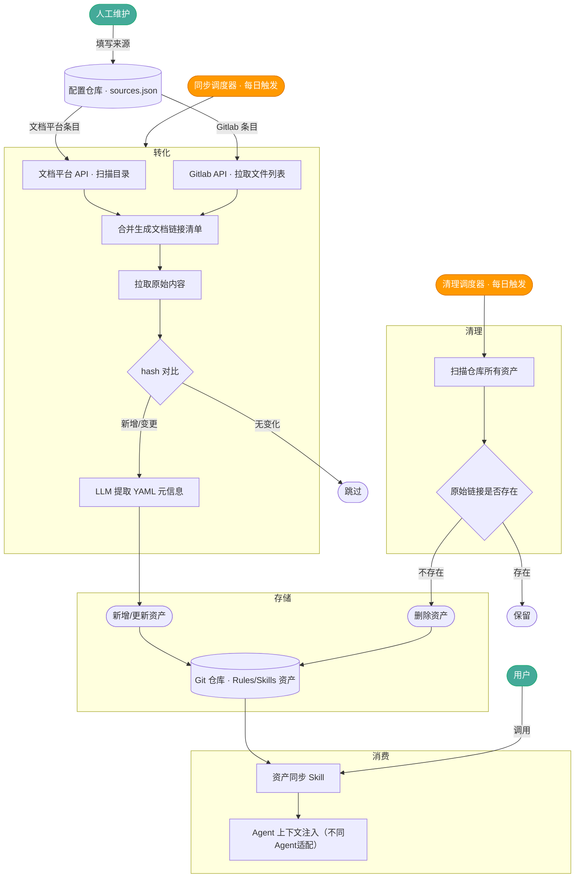

> 本文为通用方法论记录，已移除具体公司内部系统名称、内部文档链接与排期。文中「内部文档平台」「内部 Agent A/B」为占位代称。

## 背景

**研发组织未来的竞争力，取决于能否把个体经验、流程规则、故障案例、CR规则、排障经验、业务上下文，持续沉淀为可检索、可组合、可迭代的知识资产，并以低成本、高命中、易分发的方式被AI所消费。**围绕**AI业务资产**，目前主要存在以下3个问题：

1. **消费困难**：团队在业务迭代中积累了大量组件、工具函数、最佳实践等研发资产，但：
	1. **原始上下文资产分散**：这些资产散落在 内部文档平台、README等异构来源中，散落在不同的上下文市场和Skills市场中。以业务为中心的上下文资产没有得到聚合，Agent和开发者难以感知和消费。
	2. **Agent资产需求存在差异**：不同Agent（Cursor、内部 Agent A、内部 Agent B）需要的资产结构存在差异（如skills存在定制yaml头，AGENTS.md 并非所有 Agent 都支持等），且不断发展（如rules=>skills）。需要通过某种方式来抹平差异，简化进行分发和迭代过程。
2. **内容腐化**：随着时间推移，无论是仓库里的Rules&Skills，还是原始文档，都面临着腐化问题。在 AI 编码场景下，腐化的 Rules/Skills 比没有 Rules 更危险——Agent 会以高置信度执行过时指令，产出看似正确实则有害的代码，且开发者难以察觉（因为他们信任了 Agent 的输出）。
	1. **仓库内的腐化**：开发者的更新习惯集中在在线文档和组件库 README，代码仓库中的 Rules/Skills 缺乏与来源的绑定与更新，内容腐化不可避免。
	2. **源文档的腐化**：这个问题在业界有专门术语：documentation drift 或 doc rot。Atlassian 的工程博客曾指出，超过 60% 的内部技术文档在发布 6 个月后与实际代码产生偏差。
3. **个人经验未沉淀为组织经验**：个人经验 不等于 团队经验，个人提效 不等于 组织提效。大量有价值的经验存在于个人与Agent的对话历史和交互过程中，但尚未得到有效利用，尚未提升为整个组织级经验。
	1. **沉淀**：用户对 Agent 建议的接受、拒绝与修正行为是判断资产是否有效的天然信号，对话中涌现的高价值技术决策也可沉淀为新资产——但这条回路目前完全缺失。
	2. **防腐**：RLHF 的核心洞察就是人类反馈是模型改进最直接的信号。在团队 AI 编码场景中，每一次开发者对 Agent 建议的 accept/reject/edit 都是一个隐式标注行为，其信噪比高于事后收集的问卷或 review。

## 问题定义与解决方案

核心障碍不是"没有知识"，而是**知识难以沉淀、沉淀了难以被 AI 稳定消费、以及难以保持新鲜**。

**本阶段解决：**
- **消费困难** → 构建文档到 Rules/Skills 的转化流水线，统一格式与元信息，通过 Git 仓库做资产版本管理与分发
- **内容腐化** → 以 hash 绑定来源，周期增量同步，检测并更新变更内容

**暂不涉及：**
- **人类反馈回路**：对话决策沉淀、用户行为信号采集

## 系统设计

### 流程设计

整个流程中有两处需要人工参与：

1. **维护 sources.json**：新增或下线来源时，手动更新配置仓库中的 `sources.json`，其余同步均由调度器自动完成。注意：sources.json 是资产覆盖率的上限——未在此处声明的来源永远不会入库。建议在团队 onboarding 文档中明确维护责任人，并在每次新增组件库/文档站时将其纳入更新 sources.json 的 checklist。
2. **调用资产同步 Skill**：开发者在项目中首次接入、或需要拉取最新资产时，手动调用一次同步 Skill，将资产注入本地 Agent 上下文。



### 配置结构（sources.json）

人工维护，存于独立配置仓库，声明需要同步的来源列表：

```json
{
  "sources": [
    { "type": "internal-docs", "url": "https://docs.example.com/root", "name": "组件库文档", "recursive": true },
    { "type": "gitlab", "url": "https://gitlab.example.com/fe/repo/-/tree/main/docs", "name": "RN 基础库", "recursive": false }
  ]
}
```

### 存储结构

```
/
├── manifest.json          # 资产索引：name、path、link、hash、updated_at
├── internal-docs/         # 来自内部文档平台的资产
│   ├── component-a.md
│   └── ...
└── gitlab/                # 来自 Gitlab README 的资产
    ├── repo-name-a.md
    └── ...
```

每份资产文件格式：

```md
---
name: xxx
description: xxx        # 优先读取来源文档头部的手动声明；缺失时由 LLM 自动填充
source: internal-docs | gitlab
link: https://...
hash: abc123
updated_at: 2026-03-17
---

# Title
...
```

来源文档（内部文档平台 / Gitlab）可在文件头手动声明元信息，同步管道会直接复用，无需 LLM 提取：

```md
---
name: Button 组件
description: 基础按钮组件，支持 primary/secondary/ghost 三种变体，内置 loading 状态与无障碍支持
---

# Button
...
```

## 模块设计

### 转化

- **输入**：`sources.json`
- **输出**：新增/更新的 AI 资产（Rules/Skills 格式 Markdown）
- **方法**：
  - **扫描**：内部文档平台 API 遍历目录生成文件链接；Gitlab API 拉取指定目录下的文件列表；合并为文档链接清单
  - **拉取内容**：两种来源拉取到的均为 Markdown
    - 内部文档平台：调用其「转 Markdown」接口；兜底走内部文档解析接口
    - Gitlab：通过 raw 文件 URL 直接获取
  - **hash 对比**：对拉取内容计算 hash，与仓库中已有值比对，相同则跳过
  - **YAML 头提取**：优先使用原始文档头部手动声明的 `name`/`description`（如来源文件已包含 YAML front matter，直接复用）；缺失时由 LLM 自动提取，以 JSON Schema 约束输出格式；提取失败时 fallback 使用文件名作为 `name`、原文首段作为 `description`，确保管道不中断。优先级：**手动声明 > LLM 提取 > fallback**
  - **内容过滤（待定）**：AI 筛选过滤低价值内容

### 存储

- **输入**：生产模块输出的 Markdown 资产
- **输出**：Git 仓库（含资产文件与 `manifest.json`）
- **方法**：
  - 新增/更新资产写入对应目录，同步更新 `manifest.json`
  - 通过 Git 提交记录每次变更，版本历史即变更日志

### 消费

- **输入**：Git 仓库地址
- **输出**：注入 Rules/Skills 的 Agent 上下文
- **方法**：
  - Claude Code：通过 `.claude/skills/` 目录加载 Skills，可将资产仓库作为 submodule 或通过脚本同步
  - Cursor：通过 Project Rules 加载，指向仓库中对应资产文件
- **注入策略**：
  - **早期小规模**：全量注入，通过 `manifest.json` 摘要让 Agent 按需引用具体资产
  - **大规模**：启用「资产检索 Skill」（见后续 1）

### 周期任务调度

- **同步任务（每日）**：触发梳理 → 生产 → 存储链路，增量更新资产内容
- **清理任务（每日）**：扫描仓库所有资产，检查 `link` 字段对应的原始地址是否有效，失效则删除对应文件并更新 `manifest.json`

## 评估
### 评测集构建
参考之前 Rules
### 效果评估

- **上下文占用**：不要召回超过20%上下文的占用量。
- **召回效果**：给定编码任务，Agent 能召回相关资产并正确引用（构造测试用例评审）
- **端到端**：开发者对 Agent 建议的接受率，作为资产有效性的长期反馈信号

## Timeline

1. 第 1 周开始（文档平台提供返回 md 的接口后）
2. 第 3 周完成 转化和存储
3. 第 5 周完成消费
4. 评估待定

## 后续

1. **召回效果退化（规模瓶颈）**：随资产规模增大，原生 Skill 的召回精度会下降，且全量注入开始挤占有效 context。**这是当前消费策略的硬上限，预计在资产超过 50–100 个时触发**，届时需构建独立的「资产检索 Skill」，专门优化资产的向量索引与召回策略，参考 [PageIndex](https://github.com/VectifyAI/PageIndex)。

2. **知识腐化的主动感知**：当前依赖 hash 被动检测变更，无法感知「来源未更新但内容已过时」的场景（如依赖版本升级、业务规范变化、接口废弃）。hash 不变 ≠ 内容仍然正确，这是当前 doc rot 防御的盲区。后续可结合人类反馈信号（接受/拒绝建议）主动识别失效资产。

3. **对话知识沉淀**：日常与 Agent 对话中产生的高价值技术决策目前仍流失。后续可探索从对话中自动提取并结构化为新资产，参考 [lossless-claw](https://github.com/martian-engineering/lossless-claw)。

4. **知识图谱**：当前资产之间相互孤立，缺乏关联。可参考 Obsidian 的 Graph View，为资产建立双向链接（如组件依赖、规范引用关系），让 Agent 在召回一个资产时能顺带发现相关联的资产，提升上下文的完整性。

5. **基于 Graph 的长期记忆管理**：资产仓库天然是一个结构化的团队知识库，可基于此构建 RAG 问答机器人，让开发者直接通过对话查询组件用法、接口规范、最佳实践等，降低查文档的成本。可以考虑作为一个 Skill 接入内部 Agent B。
