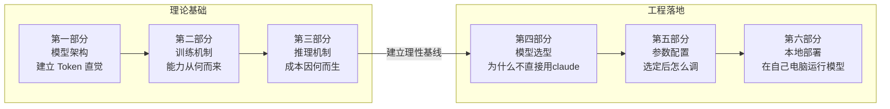

# 第一课：大模型基础
# 第一课：大模型基础

> **目标**：理解大模型"能力从何而来、成本因何而生"，为工程决策提供理性基线，明白"如何进行模型选型和参数配置"。

---

## 核心主线



工程师在落地 LLM 时，面对的困惑往往不是技术难题，而是**缺乏理性基线**：同样的任务换个模型效果天差地别，该信谁？output token 比 input 贵 3-5 倍，但不知道为什么？微调到底能解决什么、解决不了什么？

前三部分建立这个基线——理解架构，就能看懂为什么中文 token 比英文贵、为什么超长上下文会让首字响应变慢（第一部分）；理解训练，就知道什么时候该用推理模型、SFT 能改什么改不了什么（第二部分）；理解推理机制，才能算清每次调用的真实成本结构（第三部分）。有了这三层，后三部分的工程决策才有依据：针对任务选对模型（第四部分）、配置关键参数（第五部分）、必要时自己部署（第六部分）。

---

## 第一部分：从语言任务到大模型——能力从何而来

### 1.1 统一范式：预测下一个 Token

在大模型出现之前，不同的语言任务需要不同的模型和工程方案：分词一个模型、情感分析一个模型、翻译一个模型、问答又一个模型。每个任务单独收集数据、单独训练、单独部署。

LLM 的突破在于——**用一个"预测下一个 token"的统一范式，覆盖了几乎所有语言任务**。分类、摘要、翻译、代码生成、对话……全部可以转化为"给定前文，生成后续 token"的问题。

**工程视角**：
1. 这意味着你不需要为每个任务搭专用模型了。一个 API 接口 + 不同的 prompt 就能处理大部分语言任务。这极大降低了 AI 应用的工程门槛，也是为什么"提示词工程"（第二课）变得如此重要。
2. 对于极端追求**低延迟、低成本、高并发**的单一简单任务（例如千万级日活的垃圾评论过滤、或者高频的情感极性打分），企业依然会选择微调部署一个小巧的专用模型（如 BERT 或轻量级分类器），因为调用大模型 API 太慢且太贵。

---

### 1.2 Tokenizer：文本切分与基础单元

**模型不认识文字。** 在任何计算发生之前，文本必须先被切成一个个 **token**——介于字符和单词之间的子词单元：

```
"unhappiness" → ["un", "happi", "ness"] → token ID: [1043, 28937, 2494]

"写代码" → ["写", "代码"] → token ID: [35946, 99257]
```

hugging face 的 tokenizer.json 文件示例:
```json
{
  "version": "1.0",
  "truncation": null,
  "padding": null,
  "added_tokens": [
    { "id": 0, "content": "<s>", "special": true },
    { "id": 1, "content": "</s>", "special": true }
  ],
  "model": {
    "type": "BPE",
    "dropout": null,
    "unk_token": "<unk>",
    "continuing_subword_prefix": null,
    "end_of_word_suffix": null,
    "fuse_unk": false,
    "byte_fallback": true,
    "vocab": {
      "<s>": 0,
      "</s>": 1,
      "Ġ": 3,
      "t": 4,
      "h": 5,
      "e": 6,
      "Ġthe": 7
    },
    "merges": [
      "Ġ t",
      "Ġt h",
      "Ġth e",
      "Ġ t h e"
    ]
  }
}
```

**工程视角**：

1. **钱（成本与模型选型）**：API 严格按 Token 计费。在早期 GPT-4 等采用传统词表的模型中，同样语义的中文通常比英文消耗多 1.5-2 倍 Token，直接推高成本。但在最新的国产原生多语言模型（如 DeepSeek/Qwen）或采用新词表（如 GPT-4o）的模型中，这种差异已缩小至 1.3 倍甚至逼近 1:1。处理大量中文文档时，选对模型的底层词表就是省钱。

2. **容量与本地显存瓶颈**：128K 上下文窗口 ≠ 128K 字符。实际能放多少内容取决于分词效率（早期词表下 128K 可能只够放 8-10 万中文字）。更致命的是，在受限的硬件环境（例如 16GB 统一内存的机器）进行本地推理时，输入越多的 Token，生成的 KV Cache 显存占用就越庞大，这不仅容易引发内存溢出（OOM），还会造成首字响应时间（TTFT）的严重卡顿。

3. **代码与 API 场景的隐形消耗**：连续的空格、代码缩进、长变量名都会疯狂吞噬 Token。此外，前端开发中常见的大型 JSON 数据、OpenAPI 接口规范、或是层级极深的 DOM 结构，往往伴随着极高的 Token 冗余。这就是为什么高效的 AI 终端工作流和编码工具，在将上下文喂给模型前，都必须先执行代码压缩、AST（抽象语法树）裁剪或 API 规范精简等预处理步骤。

> **动手验证**：用 [OpenAI Tokenizer](https://platform.openai.com/tokenizer) 或[HuggingFace - Tokenizer Playground](https://huggingface.co/spaces/Sagicc/tokenizer-playground)把你项目里的一段带缩进的 JSON 响应，和一段纯中文需求文档分别粘贴进去，看看各消耗多少 token，建立直觉。可以明显看到，GPT-5的中文分词比GPT-4的中文分词更加优秀，QWEN 3.5 (和QWEN 3 用的同一款分词器)又比GPT-5的中文分词更加优秀。同时，GPT-5的英文分词比中文分词优秀。


```
多个单词通常对应一个 token，但也有例外：比如 indivisible 可能不会被当作单个token。

像表情符号这类 Unicode 字符，可能会被拆成多个 token（对应其底层字节）：🤚🏾

一些经常连在一起出现的字符序列也可能会被合并成一个 token：1234567890
```

| GPT-4 中文 (104)                       | GPT-5 中文 (82)                        | Qwen-3 中文 (75)                       | GPT-5 英文 (53)                        |
| ------------------------------------ | ------------------------------------ | ------------------------------------ | ------------------------------------ |
| ![[Pasted image 20260225163540.png]] | ![[Pasted image 20260225163512.png]] | ![[Pasted image 20260225163447.png]] | ![[Pasted image 20260225163609.png]] |

---

### 1.3 Embedding：词的向量化与语义表示

Tokenizer 把文本切成了 token 并编上 ID，但 ID 只是编号，不含任何语义信息（ID 35946 和 35947 并不意味着语义相近）。**Embedding 的作用是把每个 token ID 映射成一个数字向量**，让语义相近的词在向量空间中距离也近。

在 1.2 里，`"写代码" → ["写", "代码"] → token ID: [35946, 99257]`。进入 Embedding 层后，模型会先查向量表，而不是直接拿整数 ID 做计算：

- `35946 ("写") → [0.18, -0.27, ..., 0.44]`
- `99257 ("代码") → [0.91, 0.03, ..., -0.12]`

这些高维向量才是后续 Attention 和 FFN 真正处理的输入；也正因为向量里有语义结构，模型才能学到“写代码”和“写文档”既有相近部分，也有差异部分。

文本表示经历了几代演进：


| 阶段  | 方法                                         | 特点                                                                                         | 示例                                                                                                                                                                                                                    | 局限                                          |
| --- | ------------------------------------------ | ------------------------------------------------------------------------------------------ | --------------------------------------------------------------------------------------------------------------------------------------------------------------------------------------------------------------------- | ------------------------------------------- |
| 第一代 | One-hot                                    | 每个词一个 one-hot 维度，向量极度稀疏，词与词之间完全正交、无相似度                                                     | 设词表：{"cat","dog","apple"}，维度=3；<br><br>cat → [1,0,0]，dog → [0,1,0]，apple → [0,0,1]                                                                                                                                    | 维度随词表线性增长；无法表达“cat”和“dog”相似；无法泛化未登录词        |
| 第二代 | Word2Vec / GloVe                           | 低维稠密向量；能捕捉静态语义关系（king - man + woman ≈ queen）                                               | 例如 3 维 toy 向量：<br><br>king=[0.8, 0.6, 0.1]；<br>man=[0.7, 0.2, 0.0]；<br>woman=[0.6,0.1,0.4]；<br>queen≈king−man+woman≈[0.7,0.5,0.5]                                                                                     | 一词一个固定向量，多义词如“bank”（银行/河岸）只能一个向量；不随上下文变化    |
| 第三代 | Transformer 时代的上下文嵌入（Contextual Embedding） | 每个 token 先查 embedding，再通过上下文交互得到**上下文相关**表示；同一 token 在不同句子里向量不同（机制详见 1.4 的 self attention） | 比如词表里有 token "bank"，embedding 层给它初始向量 e_bank；<br><br>句1："I deposited money in the bank." 中最终 hidden state h_bank^① ≈ [0.2, 1.3, -0.7,…]；<br><br>句2："He sat on the river bank." 中 h_bank^② ≈ [-0.9, 0.4, 0.8,…]，二者明显不同 | 需要训练整个 Transformer；训练/推理算力和显存开销大；内部表示难以直接解释 |

**关键跃迁**：在 Transformer 之前，"苹果"永远是同一个向量，无法区分水果和公司。Transformer 让 token 的最终表示从"静态词向量"变成**上下文相关**表示——"苹果很甜"和"苹果发布会"中的"苹果"向量完全不同（机制细节见 1.4）。

**工程视角**：你不需要自己训练 Embedding，但理解"上下文影响表示"这一点非常重要——同一段文字放在不同的上下文（不同的 system prompt、不同的对话历史）中，模型对它的"理解"是不同的。这也是为什么上下文工程（第三课）如此关键。

---

### 1.4 Attention：捕捉上下文间的关联

#### 为什么需要 Attention

模型每一步只做一件事：**预测下一个token**。要预测得准，就得看前文。而Attention的作用是，把“**当前位置相关的上下文**”变成“**面向下一步决策的上下文向量**“。最后，通过简单的线性层 + softmax 就可以把这个向量解释为词表上的概率分布，输出下一个token；

从前文里计算这个向量，本质是在用当前位置的查询表示（Q）去给前文每个位置打分(Q · K)，然后按分数对这些位置的表示 (V) 做加权汇总（加权求和）。
#### Q-K-V 机制
先看一个例子：

上下文：`"小明把苹果递给了小红，她很"`  
此时模型要预测下一个词，候选可能是 `"开心"`、`"生气"`、`"尴尬"`。  
如果只盯着最近的 `"她很"`，模型很难判断该给哪个词更高概率；它需要利用更早的上下文信息（谁把苹果递给了谁）。


Q-K-V 是把"打分选重点"这件事拆成 3 个角色（直接对应上面的“小红”例子）：
- **Query (Q)**：当前计算位置发出的"检索问题"。在这个例子里，预测下一个词时使用的是最后一个已知 token `"很"` 的 Query，记作 `Q_很`。  
- **Key (K)**：前文每个 token 的"匹配键"，只负责和 `Q_很` 计算相关性分数。  
- **Value (V)**：每个 token 真正可被取用的语义内容，只在加权求和时被读取  。

每个 token 通过线性变换得到一对 **(K,V)**：K 用来和查询 Q 计算相似度从而得到注意力权重，V 则用这些权重做加权和，作为最终输出的内容表示。

流程只要记 3 步：

1. **算相关性分数**：`score_i = (Q_很 · K_i) / sqrt(d_k)`（自回归掩码下只对可见前文打分）。
2. **分数转权重**：`alpha_i = softmax(score_i)`。
3. **加权汇总内容**：`context_很 = Σ alpha_i * V_i`，再用于得到下一个词分布。

回到例子（显式写 Q/K/V）：
- 当前 Query：`Q_很`（来自 `"很"` 这个位置）。
- 前文 token 的 Key/Value（示意）：
  - `"递给"`：`K_递给 = [动作, 给予关系]`，`V_递给 = 给予动作语义`
  - `"小红"`：`K_小红 = [人物, 女性, 受事]`，`V_小红 = 小红相关语义`
  - `"她"`：`K_她 = [代词, 女性, 指代]`，`V_她 = 指代相关语义`
  - `"很"`：`K_很 = [程度副词]`，`V_很 = 情绪/状态强化语义`
- 打分（`Q_很 · K_i`）后（示意）：`[2.4, 3.1, 2.9, 1.2]`
- softmax 权重（示意）：`[0.22, 0.40, 0.32, 0.06]`
- 加权聚合输出：`context_很 = 0.22*V_递给 + 0.40*V_小红 + 0.32*V_她 + 0.06*V_很`
- 结论：该位置会更多吸收“递给/小红/她”这些线索，因此 `"开心"` 的概率会被拉高（相对 `"生气"`、`"尴尬"`）。
#### Multi-Head Attention

Multi-head attention 可以把它想成：同一段前文，模型不只用一双眼睛看，而是用多双“不同偏好的眼睛”同时看。

每个 head 都会用不同的投影方式去算一套注意力权重：有的更擅长盯实体/代词指代，有的更关注语法结构，有的擅长抓长距离管理；

最后把这些 head 各自“看到的重点摘要”拼在一起再融合，得到一个更信息丰富、更稳的上下文表示。

**工程视角**：

- 超长上下文的难点：Attention 的计算量与序列长度的平方成正比（每个位置i和前文每个位置j计算相关分数，O(n²)），这就是超长上下文是技术难题的根本原因，也是为什么各家都在做 Attention 优化（GQA、MQA、稀疏注意力等）。

- Lost In Middle：自回归模型的训练是预测下一个 token，最直接、最常出现的有效信号通常来自最近的前文；而开头天然是所有token都看得到的公共前缀，容易被多层、多头反复读到。研究发现模型对开头和结尾的信息关注更多，中间部分容易被"忽略"（Lost in the Middle 现象）。这直接关系到提示词工程和上下文工程——关键信息该放哪里、怎么组织。[# Lost in the Middle: How Language Models Use Long Contexts](https://arxiv.org/abs/2307.03172)

---

### 1.5 Transformer：大模型的网络架构

Attention 解决了"token 间如何交互"的问题，但它只是一个组件。**Transformer 是把 Embedding、 Attention 和其他模块组合成完整架构的方案。**

一个 Transformer Block 的结构：
![[Pasted image 20260225204203.png]]
> **注**：上图展示的是经典 Transformer 的 **Encoder-Decoder 架构**（包含左侧encoder和右侧decoder），也是最初用于机器翻译设计的结构。但**现代大语言模型（LLM）几乎全部转向了纯解码器（ecoder-only）架构**，只有右侧。


几个要点：

- **残差连接**：让信息可以"跳过"某一层直接传递，解决深层网络的训练困难——没有它，96层的网络根本训不动。

- **FFN（前馈网络）**：Attention 负责"在 token 间传递信息"，FFN 负责"在每个位置上做深层加工"。可以理解为 Attention 是"开会讨论"，FFN 是"独立思考"。

- **堆叠 N 层**：每一层都在上一层的基础上做更深层的理解。浅层捕捉语法，中层捕捉语义，深层捕捉复杂推理。

#### Encoder vs Decoder vs Decoder-Only

| 架构               | 特点         | 代表                             |
| ---------------- | ---------- | ------------------------------ |
| Encoder-Only     | 双向看全文，擅长理解 | BERT（分类、NER 等）                 |
| Encoder-Decoder  | 先理解再生成     | T5、早期翻译模型                      |
| **Decoder-Only** | 只看前文，自回归生成 | **GPT、Claude、Gemini、DeepSeek** |

在问答场景下，Encoder-Decoder 和 Decoder-Only 的区别在哪里？

假设你问模型一个问题：`“帮我写一段冒泡排序的代码”`

*   **Encoder-Decoder（像“闭卷考试”）**：
    模型有两个大脑。**大脑 A (Encoder)** 负责审题，它会反复阅读你的问题，理解你要的是“冒泡排序”而不是“快速排序”，然后把这个理解封装成一个“意图包”传给 **大脑 B (Decoder)**。大脑 B 拿到意图包后，开始在另一张白纸上从头写代码。问题和答案在模型里是**物理隔绝**的。
    
*   **Decoder-Only（像“即兴接话”）**：
    模型只有一个大脑。它不觉得你在考它，它觉得你只是说了一句话：`“帮我写一段冒泡排序的代码”`。它的本能是把这句话接下去。于是它顺着你的语气，自然而然地输出：`“好的，以下是 Python 实现的冒泡排序：...”`。在模型看来，**你的问题和它的答案其实是同一段长文本的前后半部分**。

**为什么现代 LLM 统一选择了 Decoder-Only？**
虽然 Encoder-Decoder 在翻译任务上很强，但 Decoder-Only 在处理问答时展现了更强的“联想”和“推理”能力。它把全世界的知识都看作是一个无止境的“续写任务”，这种**问答即续写**的统一范式，让它能更容易地通过海量互联网文本学会逻辑和常识。此外，Decoder-Only 在推理时可以极大利用 KV Cache 缓存（详见 3.2），在大规模并发场景下工程效率更高。

**工程视角**：Decoder-Only 的自回归特性意味着——模型是**逐 token 生成**的，每个 token 都依赖前面所有 token。这直接导致了生成速度受限（无法跳过中间内容直接输出结论），也解释了为什么 output token 比 input token 贵（详见第三部分）。

---

## 第二部分：训练机制——能力如何生长

现代大模型的研发通常遵循“预训练 + 后训练”的生命周期：从海量文本中学习基础知识，到学会遵循人类指令，再到自主进化出复杂逻辑。

### 2.1 预训练（Pre-training）：构建“Base 模型”的基石
*   **核心逻辑**：预测下一个 token（Next Token Prediction）。
*   **数据**：数以万亿计的互联网文本、书籍、代码。
*   **产物**：**Base Model（基座模型）**。
*   **特点**：此时的模型是一个超强的“续写器”。如果你问它：“法国的首都是什么？”，它可能补全为：“德国的首都是什么？意大利的首都是什么？”，因为它认为你在列举地理考题，而不是在提问。

### 2.2 后训练（Post-training）：从“通才”到“助手”的跨越
后训练是让模型真正“好用”的关键，也是模型从“学富五车”进化到“严谨理性”的过程[A SURVEY ON POST-TRAINING OF LARGE LANGUAGE MODELS](https://arxiv.org/pdf/2503.06072)：

#### 2.2.1 持续预训练 (CPT) 
易在这一步，团队会将海量的 GitHub、Stack Overflow 数据喂给模型：

1. **逻辑重组：** 代码不仅仅是文本，它是结构化的。模型在这个阶段学习 `if-else`、`try-catch` 的深层逻辑关系。
2. **长依赖学习：** 预训练时会使用超长的 Context Window（如 32k 或 128k）。模型学习如何联系 500 行前的函数定义来写出当前的调用。
3. **多语言对齐：** 让模型理解 Python 的 `list.append` 和 C++ 的 `vector.push_back` 其实在逻辑上是“语义等价”的。
#### 2.2.2 能力定向微调（主要是 SFT，Supervised Fine-Tuning）
持续预训练是为了“懂代码”（存储知识），SFT 是为了“会写代码”（调用知识）。核心是用（输入→输出）的监督数据重塑模型行为，常见包含四个方向：
*   **指令微调 (Instruction Tuning)**：  
	* 通过高质量的（指令, 回答）数据，教模型学会“对话范式”。本质是让模型模仿人类助手的表达方式，学会听从指令。  举个现实例子：
		* 问 Base“帮我写个总结”，它可能续写、偏题、或者继续编故事。
		* 问 Instruct：它会稳定输出“总结结构”。
	* 代表产品：ChatGPT（GPT-3.5/4 Instruct）、Claude 系列、Gemini Chat 版本、Qwen-Instruct。

*   **链式思维监督微调 (CoT SFT)**：  
	* 在 SFT 数据中不仅提供最终答案，还包含详尽的推理步骤（思维链）。这是激活模型复杂推理能力的关键开关，让模型学会“先思考，后回答”。  
	* 代表产品：DeepSeek-R1 / DeepSeek-Reasoner、GPT-4（数学/代码增强版本）、Claude（推理强化版本）。

*   **工具调用监督微调 (Tool SFT / Function Calling SFT)**：  
	* 在训练数据中引入“工具定义 + 结构化调用输出”，让模型学会在合适时机生成函数调用（如 JSON schema），而不是自然语言回答。本质是让模型从“语言生成器”升级为“系统调度器”。  
	* 代表产品：GPT-4 Function Calling、Claude Tool Use、Gemini Function Calling、DeepSeek Chat（API 结构化输出支持）、Mistral Large Function Calling。

*   **代码能力监督微调 (Code SFT / Code Instruct SFT)**：
	* 用（需求/注释/上下文 → 代码）这类监督样本，把模型的输出分布偏向“可编译、可运行、可维护”的代码产物；常见会覆盖：补全、重构、修 bug、解释代码、跨语言迁移等。
	* 代表产品：OpenAI Codex（Codex-tuned 模型，如 `gpt-5.2-codex`）、Qwen2.5-Coder-Instruct（如 Qwen2.5-Coder-7B-Instruct）、Claude（Sonnet/Opus 等强调 coding 的型号）。
#### 2.2.3 对齐（Alignment）：让模型具备价值观与逻辑深度
这是模型后训练最前沿的阶段。虽然统称为“对齐”，但其实现路径和目标有着本质区别：

| 维度 | 偏好对齐 (Preference Alignment) | 逻辑对齐 (RLVR - 强化学习) |
| :--- | :--- | :--- |
| **对齐标准** | **主观偏好**：人类觉得哪个回答更好（有用、无害）。 | **客观真理**：系统验证答案是否正确（代码/数学）。 |
| **技术路径** | **RLHF** / **DPO** | **RLVR (Reinforcement Learning)** |
| **实现逻辑** | **RLHF (PPO)**：训练一个奖励模型 (RM) 模拟人类偏好，再通过 PPO 算法优化。上限极高，是 GPT-4 等顶级模型的标配。<br>**DPO**：跳过奖励模型，直接通过数据对比优化。效率极高，是目前开源微调的主流。 | **RLVR**：模型在客观环境（如编译器）中不断尝试，根据结果进行实时策略调整。这是实现“自我进化”的关键。 |
| **典型代表** | GPT-4, Claude 3.5, Llama 3 | **DeepSeek-R1**, OpenAI o1 |

**关键区别 (Deep Insight)**：
*   **RLHF** 是目前大模型对齐的“天花板”，它能通过奖励模型学习到极其细微的人类偏好，但需要极高的算力和算法调优经验。
*   **DPO** 则是让模型以更低成本“对齐”人类价值观的利器。
*   **RLVR** 则是教模型“思考的深度”，强制模型在没有人工干预的情况下，通过成千上万次的自我博弈（Self-play）悟出最严谨的推理路径。

#### 2.2.4 **工程视角——训练阶段如何影响你的开发决策：**

1.  **区分 Base 与 Instruct 版本**：在调用 API 时，除非你要做大规模微调，否则**永远选择 Instruct/Chat 版本**。Base 模型通常无法直接进行对话。
2.  **理解 SFT 的局限性**：如果你发现模型文风不合要求，可以通过 SFT 修改其“肌肉记忆”；但如果模型逻辑本身不行，单纯靠少量 SFT 很难发生质变。
3.  **对齐税 (Alignment Tax)**：过度追求安全性或特定的对话格式（RLHF 过度）会导致模型变得“瞻前顾后”，损失一部分原始的推理和创造力。
4.  **知识截止日期 (Knowledge Cutoff)**：模型的知识锁死在预训练结束那一刻。问最新的新闻它必然会“幻觉”，这是 RAG（检索增强生成）存在的根本意义。
5.  **推理模型的提示词策略**：对于 DeepSeek-R1 或 o1 这种通过 RLVR 训练出的模型，**不要**在 Prompt 中手动加入“Think step by step”。这会干扰模型原生的思维链逻辑，甚至导致性能下降。
6.  **理解“Thinking”的成本**：推理模型生成的长串“思维过程”也是按 Output Token 计费的。开发者应根据任务复杂度判断何时该开启“推理模式”。

**【代码场景专项建议】**：
7.  **通用模型 vs 专用 Coder 模型**：在处理纯编程任务（补全、修 Bug）时，优先选择经过 `Code SFT` 专项强化的模型（如 Qwen2.5-Coder）。这些模型在后训练阶段接触了海量的代码重构和 Debug 样本，对 API 调用和语法规范的“肌肉记忆”远强于同参数量的通用模型。
8.  **小模型补全 vs 大模型重构**：
    *   **实时补全 (Auto-complete)**：选择 1B-7B 的极小模型（配合 FIM 补全技术），追求的是毫秒级的输入跟随。
    *   **逻辑重构 (Refactor)**：必须选择具备 RLVR 推理能力的大模型。只有经过“自我反思”训练的模型，才能真正理解跨文件的代码依赖，避免改了 A 坏了 B。
9.  **为什么代码任务最适合强化学习 (RLVR)**：代码是少数几个“答案对错极度明确”的领域（能运行 vs 报错）。这就是为什么 DeepSeek-R1 等模型在代码任务上表现极其惊艳，因为它们在训练阶段被编译器“毒打”过无数次，练就了极强的纠错本领。

---

## 第三部分：推理机制——成本因何而生

### 3.1 Prefill 与 Decode：两个完全不同的阶段

**一句话本质**：处理输入和生成输出是两个瓶颈完全不同的过程。

```

用户输入 (Prompt) 模型输出 (Completion)

"请解释量子计算的基本原理" → "量 / 子 / 计 / 算 / 是 / ..."

├──── Prefill 阶段 ────┤├─────── Decode 阶段 ──────────────┤

并行处理所有输入 token 逐个生成输出 token

计算密集 (Compute-bound) 内存带宽密集 (Memory-bound)

决定: TTFT (首token延迟) 决定: TPS (每秒生成token数)

```

|      | Prefill                   | Decode                  |
| ---- | ------------------------- | ----------------------- |
| 做什么  | 并行处理整个输入，计算所有 token 的 KV  | 逐个生成新 token，每步读取全部已有 KV |
| 瓶颈   | GPU 算力                    | 显存带宽                    |
| 关键指标 | TTFT（Time To First Token） | TPS（Tokens Per Second）  |

**这解释了你日常体验中的很多现象**：
- **长 prompt 要等更久才出第一个字**：Prefill 处理全部输入 token，输入越长 TTFT 越高。
- **Output token 比 Input token 贵 3-5 倍**：Decode 阶段每生成一个 token 都要过一遍模型，串行执行，GPU 利用率低但没法省。
- **Thinking 模型更贵**：Extended Thinking 在 Decode 阶段生成大量推理 token，全按 Output 价格计费。
- **"流式输出"并不加速生成**：生成速度由 Decode 决定，流式只是让你提前看到已生成的部分，体验上感觉更快。

---

### 3.2 KV Cache 与 Prompt Cache

#### KV Cache：空间换时间

Decode 阶段，每生成一个新 token 理论上要对所有前面的 token 重算 Attention。KV Cache 把已算过的 Key 和 Value 缓存起来，避免重复计算：

```

无 KV Cache: 每步重算全部，计算量 O(n²)

有 KV Cache: 每步只算新 token 的 KV 并追加到缓存，计算量 O(n)

代价: KV Cache 随序列增长不断膨胀，长上下文场景占几十 GB 显存

```

#### Prompt Cache：跨请求复用

当多次请求共享相同前缀（比如同一个 system prompt），可以跨请求复用已计算的 KV Cache：

```

请求 1: [系统指令 | 代码库上下文 | 用户问题A]

├── 共同前缀 (首次计算) ──┤

请求 2: [系统指令 | 代码库上下文 | 用户问题B]

├── 命中缓存! 直接复用 ──┤├ 只算新部分 ┤

```

**真实产品中的应用**：

- **Claude Code**：系统提示词 + 代码库上下文首次请求后缓存，后续对话只为新输入付全价。缓存命中的 token 只有原价 ~10%。这就是为什么 Claude Code 鼓励用详细的 CLAUDE.md 和 system prompt——前期投入更多 input token 换后续每轮的大幅降本。

- **Kimi（月之暗面）**：通过激进的 KV Cache 管理支持超长上下文，首次加载慢（Prefill 大量内容），但后续追问非常快（缓存命中）。

**工程决策启示**：

1. **设计 prompt 时考虑缓存友好性**：稳定内容（system prompt、规则、参考文档）放前面，变化内容（用户输入）放后面，最大化缓存命中。

2. **理解"首次慢、后续快"**：Agent 多轮调用中，第一轮最慢最贵，后续因缓存命中大幅提速降本。这也是为什么一些 Agent 框架会刻意"预热"缓存。

3. **长上下文不免费**：128K 窗口虽然支持，但 KV Cache 的显存开销意味着长上下文请求占用的资源远超短请求，部分服务商会对超长上下文加价。

---

### 3.3 加速与降本技术全景

| 技术                              | 做什么                                | 工程价值                         |
| ------------------------------- | ---------------------------------- | ---------------------------- |
| **量化**                          | 降低参数精度 FP16→INT8→INT4              | 显存降 2-4 倍，私有化部署首选，但有精度损失     |
| **KV Cache 优化 (GQA/MQA)**       | 多个 Query 头共享 KV 头                  | 降低长上下文显存压力                   |
| **Prompt Cache**                | 跨请求复用 KV Cache                     | Agent 场景降本 90%+              |
| **推测解码**                        | 小模型快速草拟 + 大模型验证                    | 生成速度 2-3× 提升，质量不降            |
| **专用芯片 (ASIC)**                 | 为 Transformer 定制硬件                 | Google TPU、Groq LPU——极致推理速度  |
| **连续批处理 (Continuous Batching)** | 词级迭代请求，不等前一个任务完全结束即开始新任务           | 显著提升系统吞吐量（Throughput），降低排队时延 |
| **Paging (vLLM)**               | 像 OS 虚拟内存一样管理 KV Cache 碎片          | 显存利用率近 100%，支撑更多并发用户         |
| **混合专家模型 (MoE)**                | 每次推理仅激活 1/N 的参数（如 DeepSeek, GPT-4） | 以极低推理功耗换取巨量模型性能              |
| **蒸馏 (Distillation)**           | 大模型指导小模型训练，将“智慧”迁移到更小的模型           | 1.5B/7B 模型能达到接近大模型的垂直领域水平    |

**工程视角**：作为 API 调用者，你不需要实现这些技术，但理解它们有助于你：在选推理服务商时评估技术栈（Groq 的 LPU 极快但模型选择有限）；理解同一模型在不同平台上价格和速度差异的原因；在私有化部署时做精度-成本权衡（INT4 量化的 70B 模型可能比 FP16 的 7B 模型效果好且成本相当）。

---

## 第四部分：模型选型——从问题定义到验收

前面三部分回答了：模型能力从哪来、推理怎么跑、成本与时延为何产生。到了工程落地，你会面对一个更现实的问题：**在你的业务约束下，到底该用哪一个（或哪一组）模型**。

这一部分按一个固定顺序展开（从上到下走就行）：

问题定义 → 需求拆解 → 候选方案（模型 + 路由 + 知识策略）→ 成本/延迟校验 → Benchmark + 真实场景验收 → 固定版本

### 4.1 问题定义：选型是在交付什么

模型选型不是"找最强模型"，而是：

**在给定业务约束下，选择一组可落地的模型方案（主模型/辅模型/降级模型 + 关键规格 + 知识注入方式：Prompt / RAG / SFT），让任务成功率最大，同时满足成本、延迟和风险边界。**

**为什么不直接用 Claude Opus 4.6（旗舰模型）？**

旗舰模型代表能力上限，但不是工程默认选项。五个典型场景说明问题：

| 场景                 | 问题                                                | 更合适的方案                       |
| ------------------ | ------------------------------------------------- | ---------------------------- |
| 高频简单任务（分类、摘要、格式转换） | Opus 单价高，千次调用成本失控                                 | Claude Haiku / GPT-4o mini   |
| 延迟敏感（实时补全、流式交互）    | Opus 响应慢，P95 延迟难达标                                | 小参数量快速模型                     |
| 大量中文处理             | Claude tokenizer 中文效率低于 Qwen，同样内容多消耗 1.3–2× token | Qwen 系列                      |
| 私有数据 / 合规要求        | Claude 是纯 API，数据必须出境                              | 本地部署开源模型（Qwen、Llama）         |
| 垂直专项任务（代码补全、特定领域）  | 经过专项 SFT 的小模型在窄任务上不输 Opus，但便宜数十倍                  | Qwen2.5-Coder、DeepSeek-Coder |

选型的第一步不是"找最强"，而是"排除超出约束的"。

你真正要交付的不是"一个模型名"，而是一个可运行、可复现的决策结果：

1. **主模型 + 版本快照**（避免 `latest` 漂移）。

2. **备选模型与路由规则**（什么任务走快模型，什么任务走强模型）。

3. **知识策略**（哪些任务用上下文工程，哪些必须接 RAG/实时检索，哪些在 Prompt+RAG 仍不稳定时需要 SFT）。

4. **验收指标**（成功率、P95 延迟、单任务成本三条线都达标）。

> 接下来按顺序走：先把任务讲清楚并形成候选方案（4.2）→ 把成本与延迟算清楚（4.3）→ 用 Benchmark + 真实场景验收并固定版本（4.4）。

### 4.2 需求拆解：先把任务讲清楚

**没有"最好的模型"，只有"对你的任务最合适的方案"。**

选型第一步不是看榜单，而是把需求写成可检查的约束。至少回答四个问题：

1. **任务能力**：这是问答/代码/抽取/工具调用，还是多模态（截图、图表、语音、文档 OCR）？不需要多模态，就不要为多模态溢价买单。

2. **输出与接口**：你需要严格 JSON、稳定 function calling、可控拒答/不确定性表达吗？这些会显著影响模型选择（尤其是 `Base` vs `Instruct/Chat`）。

3. **知识与时效**：任务是否依赖最新事实或私有知识？时效敏感/私有数据默认考虑 RAG / 实时检索；不敏感任务（通用编程、写作润色）可更多依赖参数知识。

4. **风险边界**：错误代价有多大（法律/财务/生产事故/隐私泄露）？边界越严，越需要可控的失败模式（拒答、追问、引用证据、可回放日志等）。

先确保“基本需求”成立，再去算成本/延迟（4.3），最后才值得做 Benchmark 验收（4.4）。

#### 知识策略补充：Prompt / RAG / SFT 怎么选

模型参数知识有限且会过时，RAG 在推理时检索外部知识补充输入：

```
传统 LLM: 问题 → 模型（仅凭参数回答）→ 可能过时/幻觉
RAG: 问题 → 检索相关文档 → [文档+问题] 一起输入 → 有据可依的回答
```

**工程视角——RAG 的角色在演变**：
上下文窗口越来越大（128K → 200K → 1M），很多简单 RAG 场景可以被"直接塞全文"替代。但 RAG 不会消失：数据量远超窗口时仍需检索；检索可以做权限控制和数据隔离；只塞相关片段比塞全量文本便宜得多。
> RAG 的工程细节将在第三课"上下文工程"中展开。

先从成本最低、迭代最快的方案开始，再逐级升级：

1. **先用上下文工程（Prompt）**：适合规则还在变、样本不多、希望快速迭代的任务。  
   典型做法：system prompt 模板、few-shot 示例、输出格式约束、上下文重排。

2. **再用 RAG 补知识**：适合"知识会变"或"知识在外部文档"的任务。  
   原则：把可更新事实交给检索层，不要把这类知识主要压进参数。

3. **最后考虑 SFT 补行为模式**：适合高频、稳定、可标注、强一致性要求的任务。  
   例如固定文风、固定决策流程、固定工具调用顺序、行业术语表达规范。

一句话判断：

- **拿不到新知识导致错答** → 优先 RAG / 上下文工程。  
- **拿到知识仍不按要求执行** → 再考虑 SFT。

#### 把需求翻译成规格：先看哪些维度？

把上面的约束翻译成模型参数/规格，一般优先看这些维度：

| 条件              | 优先选择的模型参数/规格  | 常见决策                               |
| --------------- | ------------- | ---------------------------------- |
| 任务类型（代码/通用/视觉）  | 任务域变体 + 对齐形态  | `Coder` / `Vision` / `Instruct`    |
| 输出约束（JSON/工具调用） | 指令对齐与结构化输出稳定性 | 优先 `Instruct/Chat`，实测函数调用成功率        |
| 知识时效（最新/私有）     | 是否接 RAG/实时检索  | 时效敏感任务默认检索增强                       |
| 行为一致性（高频稳定流程）   | 是否做 SFT       | 当 Prompt+RAG 仍不稳定，且有足量高质量标注时再上 SFT |
| 上下文长度需求         | 上下文窗口 + 检索策略  | 超长材料优先"检索后再喂"而非全量硬塞                |
| 部署资源（本地内存/显存）   | 参数量 + 精度/量化   | `7B/14B/32B` + `Q4/Q8/FP16`        |
| 延迟目标（TTFT/P95）  | 规模、架构、推理模式    | 先过"可用性门槛"，再在 4.3 里量化校验             |
| 成本上限（单任务预算）     | 模型层级 + 输出长度控制 | 先过"可持续门槛"，再在 4.3 里量化校验             |

有了上面的需求清单，就可以开始“生成候选池”：先读懂模型名里的关键信息，再按场景分层，最后补一个混合模型（路由）策略。

#### 读懂参数与模型名字：从字符串快速判断模型形态

**参数（Parameters）** 是模型中可学习的权重数值，是衡量模型规模的核心指标：

| 规模  | 参数量       | 典型定位            |
| --- | --------- | --------------- |
| 小型  | 1B-7B     | 端侧推理、单一任务       |
| 中型  | 7B-70B    | 通用任务、企业私有部署     |
| 大型  | 70B+      | 前沿综合能力          |
| MoE | 数百B-万亿总参数 | 顶尖能力，但每次只激活部分参数 |

**工程视角**：参数量 ≠ 能力。MoE 架构让模型总参数很大但每次只激活一部分——DeepSeek-V3 总参数 671B，每次激活仅 37B。选模型时，不能只看总参数量，还要看 Benchmark 和实测。

这一步的目标不是把细节全读懂，而是快速判断“值不值得进入候选池”。

| 名字线索 | 常见标记 | 代表什么 | 对选型的含义 |
|---------|---------|---------|-------------|
| **模型家族 / 代次** | `Qwen2.5`、`Llama-3.1`、`DeepSeek-V3` | 能力谱系和代际 | 同系列通常代次越新，综合能力和对齐更稳 |
| **参数规模** | `3B/7B/14B/32B/70B` | 稠密参数量（Dense） | 一般越大质量越高、越慢越贵；本地部署更吃内存 |
| **MoE 标记** | `MoE`、`A x B`、`671B/37B active` | 总参数很大，但每次仅激活部分专家 | 往往兼顾质量和推理成本；不要只看总参数 |
| **指令对齐** | `Instruct`、`Chat` | 经过指令微调和对齐 | 大多数应用默认选 `Instruct/Chat`；`Base` 更适合继续训练 |
| **任务域变体** | `Coder`、`Math`、`Reasoning`、`Vision` | 领域强化版本 | 代码任务优先 `Coder`；图像任务需要 `Vision` 等多模态版本 |
| **量化/精度** | `Q4/Q5/Q8`、`INT4/INT8`、`FP16/BF16`、`AWQ/GPTQ` | 模型权重的压缩或数值精度 | 量化后更省显存更快，但可能损失质量；本地部署必须重点看 |
| **上下文长度** | `32k/128k/200k/1M` | 最大上下文窗口 | 决定能塞多少材料，但"能塞下"不等于"都能用好" |
| **版本日期** | `-20250214`、`-0613`、`v1.1` | 具体快照版本 | 关系到可复现和回归风险；生产中应固定版本，避免 `latest` 漂移 |

快速例子（名字拆解）：

`Qwen2.5-Coder-7B-Instruct-Q4_K_M.gguf` https://huggingface.co/Triangle104/Qwen2.5-Coder-7B-Instruct-Q4_K_M-GGUF

- `Qwen2.5`：家族与代次  
- `Coder`：代码优化版本  
- `7B`：参数规模  
- `Instruct`：指令对齐版本  
- `Q4_K_M`：4bit 量化方案（本地部署友好）  
- `gguf`：本地推理常见格式

> 注意：命名不是行业统一标准，尤其云厂商 API 常隐藏底层细节（如是否 MoE、激活参数）。名字只能做初筛，最终仍要靠实测。

#### 形成候选池：按场景分层

| 场景                                         | 核心需求           | 策略         | 示例模型                          |
| ------------------------------------------ | -------------- | ---------- | ----------------------------- |
| **Agentic Coding** (Claude Code, OpenCode) | 复杂推理、长上下文、工具调用 | 质量优先       | Claude Sonnet/Opus, GPT-4.1   |
| **代码补全** (Copilot, Cline 补全)               | 极低延迟、高频调用      | 速度优先       | Claude Haiku, GPT-4o mini     |
| **代码审查 / 深度 Debug**                        | 精确理解、全局分析      | 质量优先       | Claude Sonnet/Opus            |
| **测试/文档批量生成**                              | 格式化、可模板化       | 成本优先       | Claude Haiku, DeepSeek        |
| **多模态（图→代码、UI 截图分析）**                      | 视觉理解           | 多模态能力      | GPT-4o, Gemini, Claude Sonnet |
| **需求分析 / 方案设计**                            | 深度思考、长输出       | 质量优先（可接受慢） | Claude Opus, o1/o3            |

> 示例模型仅用于说明分层思路；实际选型以你可用的供应商、私有化部署条件和实测结果为准。

#### 路由策略：混合模型

如果你的系统里同时存在“规划/实现/补全/批量任务”，单一模型往往不是最优解。混合模型（多模型路由）是最常见、也最具性价比的工程答案之一。

```

任务路由器

├── 规划 / 架构决策 → 强模型 (Opus/Sonnet) ← 这些 token 值钱

├── 代码实现 → 中型模型 (Sonnet) ← 平衡

├── 补全 / 小修改 → 快速模型 (Haiku) ← 速度为王

├── 批量测试生成 → 经济模型 (Haiku/DS) ← 成本为王

└── 格式化 / lint → 规则引擎，不用 LLM ← 零成本

```

**核心思想：不是所有 token 都值同一个价钱。** 一个 Agent 系统中可能 80% 的调用用 Haiku 级就够了，只有 20% 的关键决策节点需要 Sonnet/Opus。把贵的推理能力留给真正需要的环节。

**工程实操**：如果你在搭 Agent 系统，可以做一个简单的任务分类器（甚至用规则就行），按复杂度路由到不同模型。监控每种任务的模型调用分布和输出质量，持续优化路由策略。

到这里，你应该得到一个“候选池 + 路由草案”。下一节把预算变成可计算的成本/延迟模型，验证这套方案是否可持续。

---

### 4.3 经济性校验：成本与延迟

在 4.2 里你写了预算和延迟目标；这里要做的是把它们变成能"算得出来、监控得起来"的指标。

```

总费用 = (Input tokens × Input 单价) + (Output tokens × Output 单价)

```

```

端到端延迟 ≈ 排队时间 + 首 token 延迟 (TTFT) + 生成时长 + 重试开销

生成时长 ≈ 输出 token 数 / tokens per second

```

这一节对应定义里的"满足成本与时延边界"：你不是在追求最低单价，而是在追求可持续的端到端效率。

| 定价要素           | 说明                      | 价格关系         |
| -------------- | ----------------------- | ------------ |
| Input Token    | 发给模型的全部内容               | 基准           |
| Output Token   | 模型生成的回答                 | Input 的 3-5× |
| Cached Input   | 命中 Prompt Cache 的 token | Input 的 ~10% |
| Thinking Token | Extended Thinking 推理过程  | 按 Output 价格计 |

**成本 / 延迟优化实操清单**：

1. **用对模型层级**——不需要 Opus 的地方别用 Opus。
2. **控制 output 长度**——output 最贵。如果模型输出大量你不需要的解释，调 prompt 让它精简。
3. **设合理的 `max_tokens`**——别为"保险"开到几万。
4. **利用 Prompt Cache**——稳定前缀放前面，变化部分放后面。
5. **减少不必要的多轮**——一次给足信息，减少来回（每轮重传上下文）。
6. **控制 system prompt 长度**——但别过度压缩导致质量下降，找平衡。
7. **考虑 batch API**——批量非实时任务通常有 50% 折扣。
8. **把 TTFT 和 P95 延迟纳入日常监控**——别只盯均值，真实用户体感由尾部延迟决定。

---

### 4.4 验收与定版：Benchmark + 真实场景

当候选池形成、成本/延迟算清之后，最后一步就是验收：你需要证明它在"质量、成本、时延"三条线上都达标。

#### Benchmark 之外：时效性验证

Benchmark 主要测"能力上限"，但通常不测"知识是否新"。如果你的任务依赖最新事实或内部资料，必须补一组时效性用例（例如过去 7 天的事件问答、最新版本变更、内部知识检索问答），并且评估"检索失败时是否稳健拒答"。

这一节对应定义里的"验收指标"：Benchmark 负责初筛，真实任务指标负责最终拍板。

#### 主流 Benchmark

| Benchmark                 | 测什么                | 特点            |
| ------------------------- | ------------------ | ------------- |
| **MMLU / MMLU-Pro**       | 多学科知识              | 广度测试，57+ 学科   |
| **GPQA**                  | 博士级科学推理            | 真正的难题         |
| **HumanEval / MBPP**      | 函数级代码生成            | Python 为主，偏简单 |
| **SWE-Bench Verified**    | 真实 GitHub Issue 修复 | 最接近真实工程的代码评测  |
| **MATH / GSM8K**          | 数学推理               | 从小学到竞赛级       |
| **ARC-AGI**               | 抽象推理               | 测泛化而非记忆       |
| **SimpleQA**              | 事实准确性              | 幻觉检测          |
| **Aider Polyglot**        | 多语言代码编辑            | 贴近日常编码        |
| **Chatbot Arena (LMSYS)** | 综合人类偏好             | 众包盲评，最难作弊     |
| **LiveBench**             | 动态更新评测             | 对抗数据污染        |

#### 怎么理性使用 Benchmark

**Benchmark 是"入围赛"，不是"决赛"。**

1. **数据污染问题**：静态 Benchmark 可能被训练数据覆盖，分数虚高。优先看持续更新的评测（Chatbot Arena、LiveBench）。

2. **榜单高分 ≠ 你的任务好用**：MMLU 高分的模型在你的代码库上可能不如分数低但代码能力更强的模型。

3. **SWE-Bench 的局限**：任务分布偏向特定类型 Python 项目修复，建议和 Aider Polyglot 排行榜交叉参考。

4. **pass@1 vs pass@5**：一次通过 vs 五次至少一次通过，差异很大。工程场景关心 pass@1——你不想让 Agent 每次跑五遍选一个。

5. **微小分数差无意义**：差 1-2% 不值得换模型。迁移成本（prompt 调整、测试回归等）远大于你以为的。

> **推荐选型流程**：先写清需求约束（任务能力/输出接口/知识时效/风险边界）→ 形成候选池与路由草案（按场景分层）→ 算清成本与延迟（淘汰不可持续方案）→ 对应领域 Benchmark 初筛 → 在自己的 5-10 个真实 case 上同时评估成功率、P95 延迟、单任务成本 → 固定版本并持续回归。

---

### 4.5 面向未来：哪些投入不会被模型吞掉

**核心问题**：模型能力快速增长，你今天的工程投入，6个月后还有价值吗？

#### 模型能力的内化趋势

```

已经被内化（别再重复造轮子了）:

✅ 简单 RAG → 上下文窗口大到直接塞全文

✅ 基础思维链 → 模型自带 CoT

✅ 简单 function calling → 模型原生支持

✅ 基础代码补全 → IDE 插件已标配

正在被内化（谨慎投入，注意时间窗口）:

🔄 多步推理与自我纠错

🔄 复杂代码生成（单文件 → 多文件 → 跨项目）

🔄 简单 Agent 工作流（搜索-总结、提取-格式化）

短期不会被内化（值得深入投入）:

❌ 领域私有数据的检索、集成、权限控制

❌ 多 Agent 协作与复杂编排

❌ 与外部系统深度集成（CI/CD、数据库、监控、审批流）

❌ 组织级合规、审计、可追溯

❌ 评估体系与质量保证

❌ 可观测性（trace、debug、回放）

```

#### "15度夹角"原则
Respect To 秒哒产品经理26年2月份的访谈

**与模型发展方向保持15度夹角**：

- **0度**（做模型即将内化的事）→ 你的工作被下一代模型淘汰。比如花大力气优化基础 CoT prompt，下一代模型自带更好推理。

- **90度**（做和模型完全无关的事）→ 无法借 AI 杠杆，效率不会指数提升。

- **15度**（构建模型增强但不会替代的能力层）→ 模型再强也需要好的输入、可靠的评估、系统级编排。

**具体投入建议**：

1. **上下文工程能力**（→第三课）：如何为模型构建最优输入。模型再强也需要好的 prompt 和上下文，这个技能随模型升级只会更有价值。

2. **评估体系**（→第四课）：如何判断输出好不好。模型不能可靠地评估自己，你的评估能力越强，用模型的效果越好。

3. **系统编排**（→第四课）：单次 API 调用 ≠ 可靠系统。把模型组合成端到端的可靠工作流是纯工程能力。

4. **领域知识结构化**：把团队的规范、经验、流程变成模型可消费的结构化知识（rules、skills、CLAUDE.md 等），这是别人无法复制的壁垒。

5. **发现"可 AI 化"问题的判断力**：最稀缺的不是用 AI 的技术，而是识别哪些问题值得用 AI 解决、以何种粒度拆解的判断力。这个能力需要同时理解业务和模型能力边界。

---

## 第五部分：模型参数配置——从"能用"到"好用"的工程经验

> 前四部分讲了模型是什么、推理怎么跑、选哪个模型。这一部分回答最后一个问题：**选定模型之后，怎么调参数才能把效果调到最好？**

### 5.1 采样参数：控制模型"怎么选下一个 token"

模型每生成一个 token，实际上是从整个词表的概率分布中"选"一个。采样参数控制的就是这个"选"的过程。

#### temperature：核心旋钮

`temperature` 控制概率分布的"锐利程度"：

```

原始概率分布 (logits): "巴黎":0.7 "伦敦":0.15 "柏林":0.08 "东京":0.05 ...

temperature = 0.2 (低温，分布更尖锐):

"巴黎":0.95 "伦敦":0.03 "柏林":0.01 ... → 几乎必选"巴黎"

temperature = 1.0 (原始分布):

"巴黎":0.70 "伦敦":0.15 "柏林":0.08 ... → 大概率选"巴黎"，偶尔选别的

temperature = 1.5 (高温，分布更平坦):

"巴黎":0.45 "伦敦":0.22 "柏林":0.16 ... → 更多样、更"创意"、也更不可预测

```

**分任务推荐值**：

| temperature 范围 | 适用场景                 | 为什么             |
| -------------- | -------------------- | --------------- |
| 0 - 0.2        | 代码生成、数据提取、JSON 输出、分类 | 确定性任务，需要最高概率的答案 |
| 0.3 - 0.5      | 代码审查、技术问答、摘要         | 需要一定灵活性但不能太发散   |
| 0.5 - 0.7      | 日常对话、文档写作            | 自然流畅，偶尔有意外之喜    |
| 0.8 - 1.2      | 头脑风暴、创意写作、广告文案       | 鼓励多样性和意外组合      |

**常见误区**：

1. **temperature=0 ≠ 完全确定**：大部分 API 在 temperature=0 时仍有微小变异（浮点精度、batch 策略、硬件差异等）。如果你需要严格相同的输出（比如做 A/B 测试），必须加上 `seed` 参数（如果 API 支持），或者在后处理中校验。

2. **低 temperature ≠ 更正确**：temperature 控制的是"从分布中怎么选"，不改变分布本身。如果模型对一个事实本身就"不确定"（比如错误概率 60%、正确概率 40%），降 temperature 只会让它更坚定地选错误答案。

3. **代码场景不要用 temperature=0**：虽然直觉上代码需要"确定性"，但实践中 0.1-0.2 通常比 0 好——完全贪心解码有时会陷入重复模式或局部最优。

#### top_p（Nucleus Sampling）

`top_p` 从另一个角度限制采样范围：只从累积概率达到 p 的最小 token 集合中选。

```

top_p = 0.9: 只在概率前 90% 的 token 中选（排除尾部长尾噪声）

top_p = 0.5: 只在概率前 50% 的 token 中选（非常保守）

top_p = 1.0: 不限制（默认）

```

**实操建议**：temperature 和 top_p 二选一调，不要同时调两个——效果叠加不可预测。大部分场景只调 temperature 就够了，top_p 保持默认 1.0。如果你发现 temperature 调低后模型仍然偶尔输出离谱内容，可以试试降低 top_p 到 0.9。

#### top_k

`top_k` 更粗暴：只从概率最高的 k 个 token 中选。部分 API 支持（如 Google Gemini），Claude 和 OpenAI 的 API 通常不暴露这个参数。了解即可，一般不需要手动设置。

---

### 5.2 输出控制参数

#### max_tokens：输出长度上限

`max_tokens` 设置模型最多生成多少个 token。它是**上限不是目标**——模型生成到自然结束（遇到 EOS token）就会停止，不会因为 max_tokens 设得大就生成更多。

**工程经验**：

| 场景               | 推荐 max_tokens    | 为什么                  |
| ---------------- | ---------------- | -------------------- |
| JSON/结构化输出       | 按预期输出大小的 1.5-2 倍 | 留余量，但别太大以免失控时烧钱      |
| 代码生成             | 4096 - 8192      | 函数级任务够用，太大模型可能"过度生成" |
| 长文档/多文件重构        | 16384+           | 复杂任务需要足够空间           |
| 分类/判断（yes/no）    | 50 - 200         | 不需要多，限制住可减少废话        |
| Agentic 场景（工具调用） | 4096 - 8192      | 需要包含工具调用的 JSON 和简短推理 |

**常见问题**：

- **输出被截断**：最常见的 bug 之一。模型正在输出代码，突然停了——大概率 max_tokens 不够。特征是输出尾部不完整（JSON 没闭合、代码缺 `}`）。解决方案：加大 max_tokens，或在 prompt 中让模型先输出最重要的部分。

- **输出过长废话多**：max_tokens 设太大，模型会"不知道什么时候停"，尤其在开放式任务中。解决方案：在 prompt 中明确要求格式和长度（如"用3句话总结"），配合合理的 max_tokens。

#### stop sequences：显式终止

`stop` 参数让你指定一组字符串，模型生成到任何一个就立即停止。

**实用场景**：

```python

# 1. JSON 输出：防止模型在 JSON 后面加解释

stop = ["\n\n", "```"]

# 2. 多轮对话模拟：模型扮演某角色时，防止它"演"其他角色

stop = ["User:", "Human:"]

# 3. 代码生成：只要一个函数，不要模型继续生成下一个

stop = ["\ndef ", "\nclass "]

```

**工程经验**：stop sequences 在 Agent 和结构化输出场景中非常好用，但要注意——stop 字符串是前缀匹配的，小心误杀。比如 stop=["}"] 在嵌套 JSON 中会提前终止。

---

### 5.3 结构化输出：让模型输出你能 parse 的东西

对于程序消费（而非人阅读）的输出，需要严格的格式控制。

#### response_format / JSON Mode

大部分 API 支持强制 JSON 输出：

```python

# OpenAI

response_format = {"type": "json_object"}

# Claude - 通过 prompt 约束（无专属参数，但遵从性很高）

# 在 prompt 中: "输出严格 JSON 格式，不要包含任何其他文字"

# OpenAI Structured Outputs - 更严格，强制匹配 JSON Schema

response_format = {

"type": "json_schema",

"json_schema": {

"name": "code_review",

"schema": {

"type": "object",

"properties": {

"issues": {"type": "array"},

"score": {"type": "number"}

},

"required": ["issues", "score"]

}

}

}

```

**工程经验**：

1. **优先用 API 级别的约束**：如果 API 支持 `json_mode` 或 `structured_outputs`，优先用它们——比 prompt 约束更可靠。

2. **Prompt 兜底仍然必要**：即使用了 JSON Mode，在 prompt 中仍要描述清楚 JSON 结构。JSON Mode 只保证输出是合法 JSON，不保证字段对。

3. **永远做 try-catch**：即使有格式约束，实际工程中仍要做异常处理。模型偶尔会输出合法但不符合预期的 JSON（比如字段缺失、类型错误）。

4. **结构化输出有隐含成本**：JSON Schema 约束会在一定程度上影响模型的"创造力"和输出质量——它被限制在了一个狭窄的输出空间里。对于需要灵活推理的任务，先让模型自由推理，最后一步再格式化。

---

### 5.4 System Prompt：最重要的"参数"

严格来说 system prompt 不是"参数"，但它对输出行为的影响远大于任何数字参数。第二课会深入讲提示词工程，这里只讲参数配置层面的工程经验。

**System Prompt 的角色**：

```

API 请求结构:

{

"system": "你是一个资深代码审查员...", ← System Prompt

"messages": [

{"role": "user", "content": "审查这段代码..."} ← User Message

],

"temperature": 0.3,

"max_tokens": 4096

}

```

System prompt 通常放在输入的最前面，享受 Prompt Cache 的最大收益。

**工程经验**：

1. **越具体越好**：不要 "你是一个有帮助的助手"，要 "你是一个 Python 后端工程师，熟悉 FastAPI 和 SQLAlchemy，输出代码时遵循 PEP 8，优先使用 type hints"。

2. **明确输出格式**：在 system prompt 中规定输出结构（XML tags、JSON schema、markdown 格式），比在 user message 里说更稳定。

3. **负面约束和正面指令一样重要**："不要解释代码，直接输出" "不要用 print 调试，用 logging" "如果不确定，说'我不确定'而不是编造"。

4. **长 system prompt 不是问题**：因为有 Prompt Cache，长 system prompt 只在首次请求时付全价，后续几乎免费。所以不必在 system prompt 里"节省 token"。把规则写清楚写完整，远比省几个 token 重要。

5. **System prompt 的内容顺序影响缓存命中**：如果你的 system prompt 有动态部分（如当前时间、用户信息），把动态部分放到最后面，确保前面的稳定部分能命中缓存。

---

### 5.5 Extended Thinking / 推理模式

部分模型支持"思考模式"（Claude Extended Thinking、OpenAI o1/o3），让模型在输出答案前先进行长链推理。

**什么时候开启 Thinking**：

| 场景               | 是否开启   | 为什么                              |
| ---------------- | ------ | -------------------------------- |
| 复杂算法设计 / 架构决策    | ✅ 开    | 需要多步推理和权衡                        |
| 复杂 Bug 调试（涉及多文件） | ✅ 开    | 需要跨文件追踪因果链                       |
| 数学 / 逻辑推理        | ✅ 开    | 思维链显著提升准确率                       |
| 简单代码补全           | ❌ 不开   | 浪费 token，Thinking 过程也按 output 计费 |
| 格式转换 / 数据提取      | ❌ 不开   | 任务简单不需要推理                        |
| 分类 / 判断          | 视复杂度   | 简单分类不需要，多因素判断可以开                 |
| 长文档摘要            | ❌ 通常不开 | 摘要主要靠理解而非推理                      |

**工程经验**：

1. **Thinking token 很贵**：思考过程的 token 按 output 价格计费，动辄数千 token。对于简单任务，开启 Thinking 可能让成本翻 5-10 倍而效果几乎不变。

2. **budget_tokens 是好用的控制手段**：Claude Extended Thinking 支持设置 `budget_tokens` 来限制思考长度。复杂任务给 10000-20000，中等任务给 5000-8000，避免模型"过度思考"。

3. **Thinking 和 temperature 的交互**：开启 Thinking 模式时，通常 temperature 影响的是最终输出而非思考过程。思考过程一般用较低的 temperature 以保持推理链的连贯性。

4. **不是所有"难题"都需要 Thinking**：如果难度来自于上下文不足（模型不知道你的项目结构），Thinking 无法弥补——它只是让模型"想得更久"，但没有新信息可以想。这种情况下，改善上下文（第三课）比开 Thinking 更有效。

---

### 5.6 参数组合：常见任务的配置模板

以下是经过实践验证的参数配置起点，可以在此基础上根据实际效果微调：

#### 代码生成（函数/模块级）

```json

{

"model": "claude-sonnet-4-20250514",

"temperature": 0.2,

"max_tokens": 8192,

"system": "你是一个高级软件工程师。输出完整可运行的代码，包含类型注解和必要注释。不要解释代码，直接输出。",

"stop": ["\n\n\n"]

}

```

#### Agent 工具调用

```json

{

"model": "claude-sonnet-4-20250514",

"temperature": 0.1,

"max_tokens": 4096,

"tools": [...],

"tool_choice": "auto"

}

```

低 temperature 确保工具调用参数的稳定性；max_tokens 适中，工具调用 JSON + 简短推理不需要太长。

#### 代码审查

```json

{

"model": "claude-sonnet-4-20250514",

"temperature": 0.3,

"max_tokens": 4096,

"thinking": { "type": "enabled", "budget_tokens": 8000 },

"system": "你是一个严格的代码审查员。按以下格式输出：\n1. 严重问题（必须修复）\n2. 建议优化\n3. 正面评价\n对每个问题引用具体代码行号。"

}

```

开启 Thinking 帮助深度分析；budget 控制在合理范围避免过度思考。

#### 数据提取 / 结构化输出

```json

{

"model": "claude-haiku-4-5-20251001",

"temperature": 0,

"max_tokens": 2048,

"system": "从给定文本中提取信息，严格按以下 JSON Schema 输出，不要包含任何其他内容:\n{schema}"

}

```

用经济模型就够；temperature=0 最大化确定性；严格的格式约束。

#### 头脑风暴 / 方案探索

```json

{

"model": "claude-sonnet-4-20250514",

"temperature": 0.9,

"max_tokens": 4096,

"system": "你是一个创意技术顾问。为每个方案列出优劣势和适用条件。鼓励非常规思路。"

}

```

高 temperature 鼓励多样性；不限制格式，让模型自由发挥。

---

### 5.7 调参的方法论：不是玄学

**核心原则：一次只调一个变量，用真实 case 验证。**

#### 调参工作流

```

1. 从上面的模板出发，选最接近你任务的配置

2. 准备 5-10 个有明确预期输出的测试用例

3. 用默认配置跑一遍，标注哪些 case 不满意

4. 分析不满意的原因：

- 输出太随机/不稳定 → 降 temperature

- 输出太呆板/重复 → 升 temperature

- 输出被截断 → 加 max_tokens

- 输出废话太多 → 调 prompt，加 stop sequences

- 复杂任务答错 → 开 Thinking 或换更强模型

- 格式不对 → 加结构化约束 (JSON mode / XML tags)

5. 调一个参数，重跑全部 case，对比效果

6. 重复直到满意

```

#### 什么时候该调参数 vs 调 prompt vs 换模型

```

输出质量问题的排查顺序:

1. 先看 Prompt（80%的问题在这里）

→ 指令是否清晰？约束是否完整？有没有给例子？

2. 再看上下文（15%的问题在这里）

→ 模型有没有足够的信息？关键信息是否在合理位置？

3. 最后调参数（5%的问题在这里）

→ temperature、max_tokens、thinking 等

4. 换模型（参数调完还不行才考虑）

→ 可能任务超出了当前模型的能力边界

```

**一条反直觉的经验**：大部分时候，你觉得需要"调参"的问题其实是 prompt 写得不够好。花 10 分钟改 prompt 的收益通常大于花 1 小时调参数。参数是锦上添花，prompt 才是根基。

---

## 第六部分：模型部署 ——在你的 Mac 上跑通第一个大模型

> 前五部分全是"认知输入"。这一部分是"动手验证"——在你自己的 Mac 上完成模型选型、本地部署和 AI 编程工具的首次使用。

### 6.1 任务目标

完成以下三件事，截图提交：

1. **本地模型跑通**：用 Ollama 在 Mac 上部署一个本地模型，发出一句话并收到回复。

2. **AI 编码工具跑通**：用 OpenCode 连接模型（本地或 API），在终端中完成一次代码相关对话。

3. **选型决策记录**：写一段 200 字以内的说明，解释你选了什么模型、为什么选它（结合第四/五部分的内容）。

---

### 6.2 模型选型：先想清楚再动手

在安装任何东西之前，先根据你的 Mac 配置和使用场景做一次选型决策。

#### 第一步：确认你的硬件

打开终端，运行：

```bash

# 查看芯片型号和内存

sysctl -n machdep.cpu.brand_string

sysctl -n hw.memsize | awk '{print $0/1024/1024/1024 " GB"}'

# 或者直接看"关于本机"

# Apple 菜单 → 关于本机

```

关键信息：**芯片型号**（M1/M2/M3/M4，基础版还是 Pro/Max/Ultra）和**统一内存大小**（8GB/16GB/24GB/32GB/...）。

#### 第二步：根据硬件选本地模型

Apple Silicon 的统一内存（Unified Memory）既用于系统也用于模型推理。**粗略规则：模型文件大小不要超过可用内存的 70-80%**（要留空间给系统和应用）。

| 你的内存   | 可用于模型的空间 | 推荐模型                                        | 参数量    | 模型大小（量化后） |
| ------ | -------- | ------------------------------------------- | ------ | --------- |
| 8 GB   | ~5 GB    | Qwen2.5-Coder:3b                            | 3B     | ~2 GB     |
| 16 GB  | ~10 GB   | Qwen2.5-Coder:7b / DeepSeek-Coder-V2-Lite   | 7B     | ~4-5 GB   |
| 24 GB  | ~16 GB   | Qwen2.5-Coder:14b / DeepSeek-Coder:33b (Q4) | 14-33B | ~8-12 GB  |
| 32 GB+ | ~22 GB+  | Qwen2.5-Coder:32b / CodeLlama:34b           | 32-34B | ~18-20 GB |
| 64 GB+ | ~45 GB+  | DeepSeek-V2.5 / Llama3:70b (Q4)             | 70B+   | ~35-40 GB |

**选型思路**：

- **只想快速跑通体验**（8GB 机器也行）：选 `qwen2.5-coder:3b` 或 `llama3.2:3b`，秒级响应，质量一般但足以验证流程。

- **日常本地辅助编码**（16GB+）：选 `qwen2.5-coder:7b`，代码能力不错，响应速度合理。

- **希望本地有较高质量**（32GB+）：选 `qwen2.5-coder:32b`，本地最强的代码体验之一。

- **追求最好效果**：放弃本地，直接用 API（Claude Sonnet、GPT-4.1）。本地模型再大也和前沿 API 模型有代差。

> **记住第四部分的认知**：选型不是追求"最大的模型"，而是在硬件约束下找到速度和质量的平衡点。8GB 内存硬跑 14B 模型，速度慢到不可用，还不如流畅跑 3B。

---

### 6.3 Ollama 安装与本地部署

#### 第一步：安装 Ollama

```bash

# 方法 1：从官网下载（推荐）

# 访问 https://ollama.com/download 下载 macOS 版本，拖入 Applications

# 方法 2：Homebrew

brew install ollama

```

安装完成后，Ollama 会作为后台服务运行，默认监听 `http://localhost:11434`。

#### 第二步：拉取模型

```bash

# 根据你的选型拉取模型（以 7B 为例）

ollama pull qwen2.5-coder:7b

# 如果内存小，选小模型

ollama pull qwen2.5-coder:3b

# 查看已下载的模型

ollama list

```

首次拉取需要下载模型文件，7B 模型大约 4-5GB，视网速可能需要几分钟。

#### 第三步：验证——发出你的第一句话

```bash

# 直接在终端对话

ollama run qwen2.5-coder:7b

```

进入交互模式后，输入：

```

写一个 Python 函数，接受一个整数列表，返回其中所有偶数的平方和。

```

你应该能看到模型逐步生成代码。**这就是你在本地跑通的第一个大模型。**

按 `Ctrl+D` 或输入 `/bye` 退出对话。

#### 验证 API 服务

Ollama 同时提供了兼容 OpenAI 格式的 API 接口，后续 OpenCode 等工具会用到：

```bash

# 测试 API 是否正常

curl http://localhost:11434/api/chat -d '{

"model": "qwen2.5-coder:7b",

"messages": [{"role": "user", "content": "你好，请用一句话介绍你自己"}],

"stream": false

}'

```

如果返回了 JSON 格式的响应，说明本地 API 已就绪。

#### 常见问题排查

| 问题 | 可能原因 | 解决 |

|------|---------|------|

| `ollama: command not found` | 未正确安装或未加入 PATH | 用官网 .dmg 安装，或 `brew install ollama` |

| 拉取模型超时 | 网络问题 | 设置代理，或从镜像源拉取 |

| 生成极慢（每 token 数秒） | 模型太大，内存不够，触发了 swap | 换小一号模型 |

| 内存不足报错 | 模型 + 系统超出总内存 | 关闭其他大型应用，或换小模型 |

| 输出全是英文，中文能力差 | 小模型中文训练数据少 | 正常现象，Qwen 系列中文最好 |

---

### 6.4 OpenCode 安装与配置

OpenCode 是一个开源的终端 AI 编程助手，支持连接本地模型（通过 Ollama）和云端 API。

#### 第一步：安装 OpenCode

```bash

# 方法 1：Homebrew（推荐）

brew install opencode

# 方法 2：Go install（需要 Go 1.23+）

go install github.com/opencode-ai/opencode@latest

# 方法 3：手动下载

# 访问 https://github.com/opencode-ai/opencode/releases 下载对应平台的二进制

```

#### 第二步：配置模型连接

OpenCode 支持多种模型提供商。你可以选择连接本地 Ollama 或者云端 API。

**方案 A：连接本地 Ollama（免费，隐私友好，质量取决于本地模型）**

在你的项目目录下创建 `opencode.json`：

```json

{

"provider": "ollama",

"model": "qwen2.5-coder:7b"

}

```

或通过环境变量配置：

```bash

export OPENCODE_PROVIDER=ollama

export OPENCODE_MODEL=qwen2.5-coder:7b

```

**方案 B：连接 Anthropic API（质量最好，需要 API Key）**

```bash

# 设置 API Key

export ANTHROPIC_API_KEY=sk-ant-xxxxx

# 配置文件

cat > opencode.json << 'EOF'

{

"provider": "anthropic",

"model": "claude-sonnet-4-20250514"

}

EOF

```

**方案 C：连接 OpenAI 兼容 API（适用于各种服务商）**

```bash

export OPENAI_API_KEY=sk-xxxxx

cat > opencode.json << 'EOF'

{

"provider": "openai",

"model": "gpt-4.1"

}

EOF

```

> **选型建议**：先用方案 A（Ollama）跑通流程，体验本地模型的能力和局限。然后切到方案 B（Anthropic API）感受前沿模型的差距。这个对比本身就是一次很好的选型实践。

#### 第三步：在项目中启动 OpenCode

```bash

# 进入你的任何一个代码项目目录

cd ~/your-project

# 启动 OpenCode

opencode

```

OpenCode 会自动读取当前目录的代码上下文。启动后你进入一个终端交互界面。

#### 第四步：发出你的第一条编码指令

在 OpenCode 的交互界面中，尝试这些指令：

```

# 指令 1：理解项目（验证上下文能力）

这个项目是做什么的？主要用了什么技术栈？

# 指令 2：生成代码（验证代码能力）

在当前项目中创建一个新的工具函数文件 utils/string_helpers.py，

包含以下功能：驼峰命名转下划线、下划线转驼峰、字符串截断（支持省略号）

# 指令 3：审查代码（验证分析能力）

检查 [某个文件路径] 中的代码，指出潜在的 bug 和优化建议

```

当你收到模型的回复，并且能看到它基于你的项目上下文给出了合理的响应——**恭喜，你的 AI 编程环境搭建完成了。**

---

### 6.5 对比实验（加分项）

如果你完成了基础作业，可以尝试这个对比实验来加深理解：

**实验：同一个任务，不同模型，对比效果**

选一个具体的编码任务（比如"写一个函数解析 crontab 表达式"），分别用以下配置完成，记录每种的响应时间、代码质量、是否一次通过：

| 配置 | 模型 | 代价 | 你的记录 |

|------|------|------|---------|

| Ollama 本地小模型 | qwen2.5-coder:3b | 免费 | 响应时间:___ 质量:___ |

| Ollama 本地中模型 | qwen2.5-coder:7b | 免费 | 响应时间:___ 质量:___ |

| Anthropic API | claude-sonnet-4 | ~$0.01-0.05 | 响应时间:___ 质量:___ |

这个实验会帮你直观感受到：参数量 vs 质量的关系、本地 vs API 的差距、"够用"的标准是什么——这些都是第四部分纸面知识的体感验证。

---

### 6.6 课后任务

#### 必做

1. **截图 1**：Ollama 运行本地模型并成功对话的终端截图。

2. **截图 2**：OpenCode 连接模型后，在你的一个项目中完成一次代码相关对话的截图。

3. **选型说明**（200 字以内）：回答以下问题——

- 你的 Mac 是什么配置？（芯片 + 内存）

- 你选了什么本地模型？为什么？

- 本地模型能满足你的日常编码需求吗？如果不能，瓶颈在哪里？

#### 选做（加分）

4. **对比实验记录**：完成 5.5 的对比实验，填写结果表格，写一段不超过 300 字的分析：不同模型在你的任务上表现差异有多大？这对你日常的模型选型有什么启发？

5. **参数实验**：用同一个模型和同一个 prompt，分别用 temperature=0、0.5、1.0 跑三次，观察输出差异。截图并用一句话总结 temperature 对输出的影响。

---

## 总结：带走这些认知

| 认知 | 工程启示 |
|------|---------|
| LLM = 下一个 token 预测器，能力是规模涌现的副产品 | 不要拟人化，用它的长处规避短板 |
| 文本 → Token → Embedding → 进模型 | 关注 token 消耗，影响成本和容量 |
| Attention 让上下文中信息位置影响输出质量 | 关键信息的组织方式很重要（→第三课） |
| Transformer 的 Decoder-Only 架构决定了逐 token 生成 | Output token 贵、生成速度有上限 |
| Pre-train → SFT → RLHF 三阶段各解决不同问题 | 大多数场景好 prompt 就够了，不需要微调 |
| Prefill + Decode 瓶颈完全不同 | 解释了 Input/Output 价格差、TTFT 等现象 |
| KV Cache / Prompt Cache 是推理降本核心 | 设计 prompt 时考虑缓存友好性 |
| 没有最好的模型，只有最合适的模型 | 按任务选型，混合模型策略 |
| Benchmark 是参考不是判决 | 初筛用排行榜，决策靠真实场景实测 |
| 参数调优是锦上添花，prompt 是根基 | 80% 的输出质量问题通过改 prompt 解决 |
| 投入"模型增强"而非"模型替代"的能力 | 上下文工程、评估、编排、领域知识——越来越值钱 |
| 纸上得来终觉浅，动手跑一遍胜过读十篇 | 本地部署 + API 对比，建立对模型能力的体感直觉 |

---

## 参考资料

- [Datawhale - Happy LLM](https://github.com/datawhalechina/happy-llm/tree/main)（2025.6）

- [3Blue1Brown - Transformers 可视化](https://www.youtube.com/watch?v=wjZofJX0v4M)

- [Understanding KV Cache and Prompt Cache Basics](https://yuanchaofa.com/post/understanding-kv-cache-and-prompt-cache-basics)

- [Prompt Cache Design for LLM Agents](https://yuanchaofa.com/post/prompt-cache-design-for-llm-agents)

- [Factory Droid - Why Use Mixed Models](https://docs.factory.ai/cli/configuration/mixed-models#why-use-mixed-models)

- [LMSYS Chatbot Arena](https://chat.lmsys.org/) / [Aider LLM Leaderboards](https://aider.chat/docs/leaderboards/) / [LiveBench](https://livebench.ai/)

- [Ollama](https://ollama.com/) —— 本地模型部署

- [OpenCode](https://github.com/opencode-ai/opencode) —— 开源终端 AI 编程助手

- [Ollama Model Library](https://ollama.com/library) —— 可用模型列表与规格
