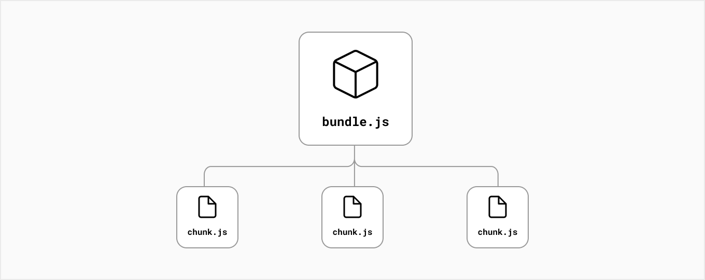

# Code Spliting

- [What is code spliting?](#what-is-code-spliting)
- [Why we need code spliting?](#why-we-need-code-spliting)
- [How to use code spliting?](#how-to-use-code-spliting)
- [References](#references)

---

# What is code spliting?
Developers usually split their applications into **multiple pages** that can be accessed from different URLs. Each of these pages becomes a unique **entry point** into the application.

Code-splitting is the process of **splitting the application’s bundle into smaller chunks required by each entry point**. 

# Why we need code spliting?
The goal is to** improve the application's initial load time** by only loading the code required to run that page.

# How to use code spliting?
Next.js has built-in support for code splitting. Each file inside your pages/ directory will be automatically code split into its own JavaScript bundle during the build step.

Further:

+ Any code shared between pages is also split into another bundle to avoid re-downloading the same code on further navigation.
+ After the initial page load, Next.js can start [pre-loading the code](https://nextjs.org/docs/api-reference/next/link#:~:text=Defaults%20to%20false-,prefetch,-%2D%20Prefetch%20the%20page) of other pages users are likely to navigate to. （with [next/link](https://nextjs.org/docs/api-reference/next/link) in that page）
+ [Dynamic imports](https://nextjs.org/docs/advanced-features/dynamic-import) are another way to manually split what code is initially loaded. (to gain the purpose of **lazy loading** external libraries )

# References
[https://nextjs.org/learn/foundations/how-nextjs-works/code-splitting](https://nextjs.org/learn/foundations/how-nextjs-works/code-splitting)

[https://nextjs.org/docs/api-reference/next/link](https://nextjs.org/docs/api-reference/next/link)

[Advanced Features: Dynamic Import | Next.js](https://nextjs.org/docs/advanced-features/dynamic-import)

> 更新: 2023-05-03 10:17:05  
> 原文: <https://www.yuque.com/viruspc/el3mi0/vxtbn5usstx5c8lm>