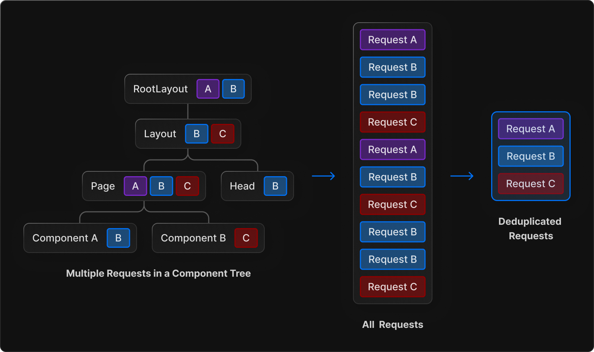
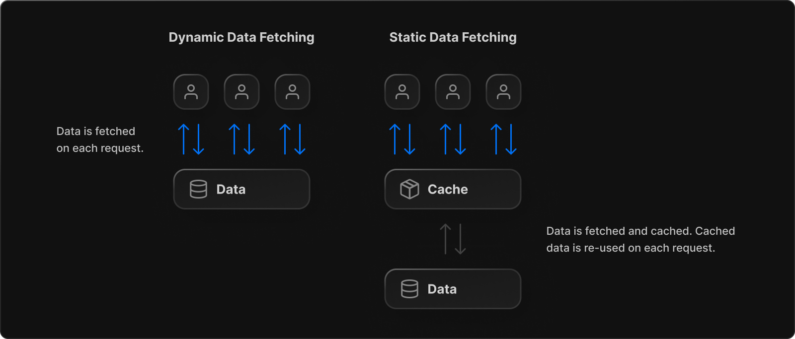
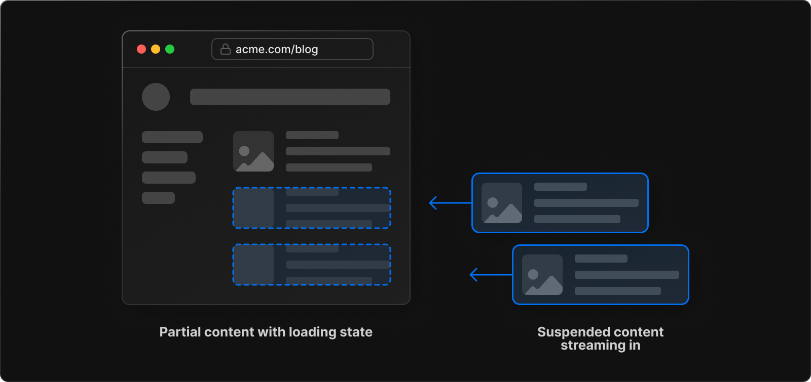
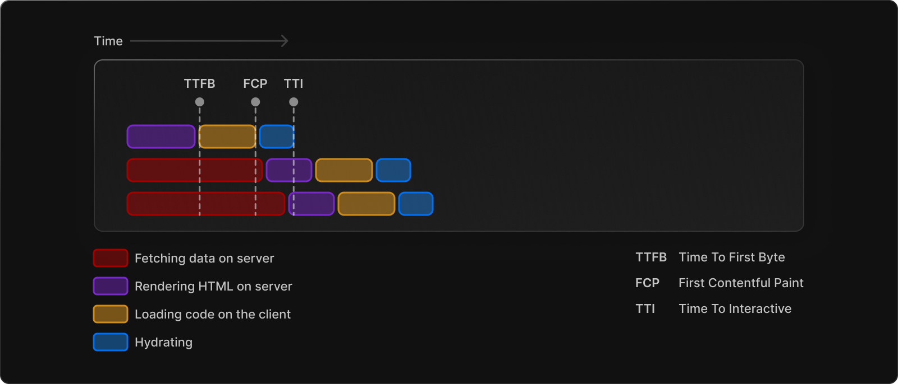

# Data Fetching

- [Fundamentals](#fundamentals)
  * [Overview](#overview)
  * [The `fetch()` API](#the-fetch-api)
  * [Fetching Data on the Server](#fetching-data-on-the-server)
  * [Component-level Data Fetching](#component-level-data-fetching)
    + [Parallel and Sequential Data Fetching](#parallel-and-sequential-data-fetching)
    + [Automatic `fetch()` Request Deduping](#automatic-fetch-request-deduping)
  * [Server Component Data Fetches (Static and Dynamic Data Fetches）](#server-component-data-fetches-static-and-dynamic-data-fetches)
  * [Client Component Data Fetches](#client-component-data-fetches)
- [Fetching](#fetching)
  * [Server Components And Client Components Data Fetching](#server-components-and-client-components-data-fetching)
    + [`async`/`await` in Server Comopnents](#asyncawait-in-server-comopnents)
    + [`use`in Client Components](#usein-client-components)
  * [Static and Dynamic Data Fetching](#static-and-dynamic-data-fetching)
    + [Static Data Fetching](#static-data-fetching)
    + [Dynamic Data Fetching](#dynamic-data-fetching)
  * [Data Fetching Patterns](#data-fetching-patterns)
    + [Parallel Data Fetching](#parallel-data-fetching)
    + [Sequential Data Fetching](#sequential-data-fetching)
    + [Blocking Rendering in a Route](#blocking-rendering-in-a-route)
  * [Data Fetching without `fetch()`](#data-fetching-without-fetch)
- [Caching](#caching)
- [Revaliating](#revaliating)
- [Mutating](#mutating)
- [Streaming and Suspense](#streaming-and-suspense)
  * [What is Streaming](#what-is-streaming)
  * [Streaming in Next.js](#streaming-in-nextjs)
  * [Streaming and SEO](#streaming-and-seo)
- [Generating static Params](#generating-static-params)
- [API Routes](#api-routes)

---

> **Good to know**: Previous Next.js data fetching methods such as [getServerSideProps](https://nextjs.org/docs/basic-features/data-fetching/get-server-side-props), [getStaticProps](https://nextjs.org/docs/basic-features/data-fetching/get-static-props), and [getInitialProps](https://nextjs.org/docs/api-reference/data-fetching/get-initial-props) are **not** supported in the new app directory.

# Fundamentals

## Overview

Here's a quick overview of the recommendations on this page:

1. [Fetch data on the server](https://beta.nextjs.org/docs/data-fetching/fundamentals#fetching-data-on-the-server) using Server Components.
2. [Fetch data in parallel](https://beta.nextjs.org/docs/data-fetching/fundamentals#parallel-and-sequential-data-fetching) to minimize waterfalls and reduce loading times.
3. For Layouts and Pages, [fetch data where it's used](https://beta.nextjs.org/docs/data-fetching/fundamentals#automatic-fetch-request-deduping). Next.js will automatically dedupe requests in a tree.
4. Use [Loading UI, Streaming and Suspense](https://beta.nextjs.org/docs/data-fetching/fundamentals#streaming-and-suspense) to progressively render a page and show a result to the user while the rest of the content loads.

## The `fetch()` API

The new data fetching system is built on top of the native [fetch()Web API](https://developer.mozilla.org/en-US/docs/Web/API/Fetch_API) and makes use of async/await in Server Components.

* React extends fetch to provide [automatic request deduping](https://beta.nextjs.org/docs/data-fetching/fundamentals#automatic-fetch-request-deduping).
* Next.js extends the fetch options object to allow each request to set its own [caching and revalidating](https://beta.nextjs.org/docs/data-fetching/caching) rules.

[Learn how to usefetchin Next.js](https://beta.nextjs.org/docs/data-fetching/fetching).

## Fetching Data on the Server

Whenever possible, we recommend fetching data inside [Server Components](https://beta.nextjs.org/docs/rendering/server-and-client-components). Server Components **always fetch data on the server**. This allows you to:

* Have direct access to backend data resources (e.g. databases).
* Keep your application more secure by preventing sensitive information, such as access tokens and API keys, from being exposed to the client.
* Fetch data and render in the same environment. This reduces both the back-and-forth communication between client and server, as well as the work on the main thread on the client.
* Perform multiple data fetches with single round-trip instead of multiple individual requests on the client.
* Reduce client-server [waterfalls](https://beta.nextjs.org/docs/data-fetching/fundamentals#parallel-and-sequential-data-fetching).
* Depending on your region, data fetching can also happen closer to your data source, reducing latency and improving performance.

[Learn more about Client and Server Components](https://beta.nextjs.org/docs/rendering/server-and-client-components).

> **Good to know:** It's still possible to fetch data client-side. We recommend using a third-party library such as [SWR](https://swr.vercel.app/) or [React Query](https://tanstack.com/query/v4/) with Client components. In the future, it'll also be possible to fetch data in Client Components using React's [use()hook](https://beta.nextjs.org/docs/data-fetching/fetching#use-in-client-components).

## Component-level Data Fetching

> **Good to know:** For layouts, it's not possible to pass data between a parent layout and its children. We recommend **fetching data directly inside the layout that needs it**, even if you're requesting the same data multiple times in a route. Behind the scenes, React and Next.js will [cache and dedupe](https://beta.nextjs.org/docs/data-fetching/fundamentals#automatic-fetch-request-deduping) requests to avoid the same data being fetched more than once.

### Parallel and Sequential Data Fetching

### Automatic `fetch()` Request Deduping



* On the server, the cache lasts the lifetime of a server request until the rendering process completes.
  * This optimization applies to fetch requests made in Layouts, Pages, Server Components, generateMetadata and generateStaticParams.
  * This optimization also applies during [static generation](https://beta.nextjs.org/docs/rendering/fundamentals#static-rendering).
* On the client, the cache lasts the duration of a session (which could include multiple client-side re-renders) before a full page reload.

## Server Component Data Fetches (Static and Dynamic Data Fetches）

There are two types of data: **Static** and **Dynamic**.

* **Static Data** is data that doesn't change often. For example, a blog post.
* **Dynamic Data** is data that changes often or can be specific to users. For example, a shopping cart list.



By default, Next.js automatically does static fetches. This means that the data will be fetched at build time, cached, and reused on each request. As a developer, you have control over how the static data is [cached](https://beta.nextjs.org/docs/data-fetching/fundamentals#caching-data) and [revalidated](https://beta.nextjs.org/docs/data-fetching/fundamentals#revalidating-data).

There are two benefits to using static data:

1. It reduces the load on your database by minimizing the number of requests made.
2. The data is automatically cached for improved loading performance.

However, if your data is personalized to the user or you want to always fetch the latest data, you can mark requests as *dynamic* and fetch data on each request without caching.

[Learn how to do Static and Dynamic data fetching](https://beta.nextjs.org/docs/data-fetching/fetching#static-data-fetchingmd).

## Client Component Data Fetches

It's still possible to fetch data client-side. We recommend using a third-party library such as [SWR](https://swr.vercel.app/) or [React Query](https://tanstack.com/query/v4/) with Client components. In the future, it'll also be possible to fetch data in Client Components using React's [use()hook](https://beta.nextjs.org/docs/data-fetching/fetching#use-in-client-components).

# Fetching

## Server Components And Client Components Data Fetching

### `async`/`await` in Server Comopnents

```tsx
async function getData() {
  const res = await fetch('https://api.example.com/...');
  // The return value is *not* serialized
  // You can return Date, Map, Set, etc.

  // Recommendation: handle errors
  if (!res.ok) {
    // This will activate the closest `error.js` Error Boundary
    throw new Error('Failed to fetch data');
  }

  return res.json();
}

export default async function Page() {
  const data = await getData();

  return <main></main>;
}
```

> **Async Server Component TypeScript Error**
>
> * An async Server Components will cause a '`Promise<Element>`' is not a valid JSX element type error where it is used.
> * This is a known issue with TypeScript and is being worked on upstream.
> * As a temporary workaround, you can add `{/* @ts-expect-error Async Server Component */}` above the component to disable type checking for it.

### `use`in Client Components

use is a new React function that **accepts a promise** conceptually similar to await. use **handles the promise** returned by a function in a way that is compatible with components, hooks, and Suspense. Learn more about use in the [React RFC](https://github.com/acdlite/rfcs/blob/first-class-promises/text/0000-first-class-support-for-promises.md#usepromise).

Wrapping fetch in use is currently **not** recommended in Client Components and may trigger multiple re-renders. For now, if you need to fetch data in a Client Component, we recommend using a third-party library such as [SWR](https://swr.vercel.app/) or [React Query](https://tanstack.com/query/v4).

## Static and Dynamic Data Fetching

### Static Data Fetching

By default, fetch will automatically fetch and [cache data](https://beta.nextjs.org/docs/data-fetching/caching) indefinitely.

```tsx
fetch('https://...'); // cache: 'force-cache' is the default
```

To revalidate [cached data](https://beta.nextjs.org/docs/data-fetching/caching) at a timed interval, you can use the next.revalidate option in `fetch()` to set the cache lifetime of a resource (in seconds).

```tsx
fetch('https://...', { next: { revalidate: 10 } });
```

### Dynamic Data Fetching

To fetch fresh data on every fetch request, use the `cache: 'no-store'` option.

```tsx
fetch('https://...', { cache: 'no-store' });
```

## Data Fetching Patterns

### Parallel Data Fetching

```tsx
export default async function Page({ params: { username } }) {
  // Initiate both requests in parallel
  const artistData = getArtist(username);
  const albumData = getArtistAlbums(username);

  // Wait for the artist's promise to resolve first
  const artist = await artistData;

  return (
    <>
      <h1>{artist.name}</h1>
      {/* Send the artist information first,
      and wrap albums in a suspense boundary */}
      <Suspense fallback={<div>Loading...</div>}> {/* fallback */}
        <Albums promise={albumData} />
      </Suspense>
    </>
  );
}

```

### Sequential Data Fetching

父组件和子组件的`fetch`顺序执行

By fetching data inside the component, each fetch request and nested segment in the route cannot start fetching data and rendering until the previous request or segment has completed.

### Blocking Rendering in a Route

In the `pages` directory, pages using server-rendering would show the browser loading spinner until `getServerSideProps` had finished, then render the React component for that page. This can be described as "all or nothing" data fetching. Either you had the entire data for your page, or none.

In the `app` directory, you have additional options to explore:

1. First, you can use `loading.js` to show an instant loading state from the server while streaming in the result from your data fetching function.
2. Second, you can move data fetching ***lower***\*\* \*\*in the component tree to only block rendering for the parts of the page that need it. For example, moving data fetching to a specific component rather than fetching it at the root layout.

Whenever possible, it's best to fetch data in the segment that uses it. This also allows you to show a loading state for only the part of the page that is loading, and not the entire page.

## Data Fetching without `fetch()`

You might not always have the ability to use and configure fetch requests directly if you're using a third-party library such as an ORM or database client.

In cases where you cannot use fetch but still want to control the caching or revalidating behavior of a layout or page, you can rely on the [default caching behavior](https://beta.nextjs.org/docs/data-fetching/fetching#default-caching-behavior) of the segment or use the [segment cache configuration](https://beta.nextjs.org/docs/data-fetching/fetching#segment-cache-configuration).

# Caching

# Revaliating

# Mutating

# Streaming and Suspense

## What is Streaming

**Streaming** allows you to break down the page's HTML into smaller chunks and progressively send those chunks from the server to the client.



This enables parts of the page to be displayed sooner, without waiting for all the data to load before any UI can be rendered.

Streaming works well with React's component model because each component can be considered a chunk. Components that have higher priority (e.g. product information) or that don't rely on data can be sent first (e.g. layout), and React can start hydration earlier. Components that have lower priority (e.g. reviews, related products) can be sent in the same server request after their data has been fetched.



Streaming is particularly beneficial when you want to prevent long data requests from blocking the page from rendering as it can reduce the [Time To First Byte (TTFB)](https://web.dev/ttfb/) and [First Contentful Paint (FCP)](https://web.dev/first-contentful-paint/). It also helps improve [Time to Interactive (TTI)](https://developer.chrome.com/en/docs/lighthouse/performance/interactive/), especially on slower devices.

## Streaming in Next.js

You can implement streaming in Next.js using [loading.js](https://beta.nextjs.org/docs/data-fetching/streaming-and-suspense#example-using-loadingjs) (for an entire route segment) or with [Suspense boundaries](https://beta.nextjs.org/docs/data-fetching/streaming-and-suspense#example-using-suspense-boundaries) (for more granular control).

Using streaming requires implementing fallback UI that will render while your route is being suspended. This UI should be designed to match the real content that will eventually load.

You can view an [example of streaming here](https://app-dir.vercel.app/streaming/edge/product/1).

## Streaming and SEO

* Next.js will wait for data fetching inside [generateMetadata](https://beta.nextjs.org/docs/api-reference/metadata) to complete before streaming UI to the client. This guarantees the first part of a streamed response includes <head> tags.
* Since streaming is server-rendered, it does not impact SEO. You can use the [Mobile Friendly Test](https://search.google.com/test/mobile-friendly) tool from Google to see how your page appears to Google's web crawlers and view the serialized HTML ([source](https://web.dev/rendering-on-the-web/#seo-considerations)).

# Generating static Params

# API Routes


> 更新: 2023-04-21 07:36:53  
> 原文: <https://www.yuque.com/viruspc/el3mi0/qpwes75fctrntmzm>