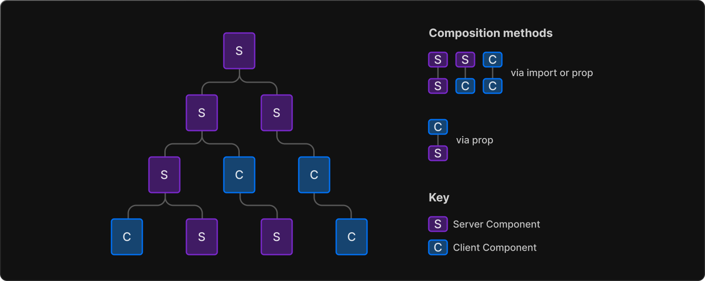
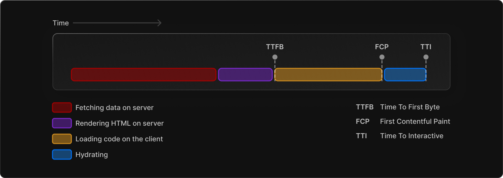

# Rendering Fundamentals

- [Rendering Environments](#rendering-environments)
- [Component-level Client and Server Rendering](#component-level-client-and-server-rendering)
- [Static and Dynamic Rendering on the Server](#static-and-dynamic-rendering-on-the-server)
  * [Static Rendering](#static-rendering)
    + [Server and Client components](#server-and-client-components)
    + [deployment](#deployment)
    + [Client Component + static rendering的优点](#client-component--static-rendering%E7%9A%84%E4%BC%98%E7%82%B9)
  * [Dynamic Rendering](#dynamic-rendering)
    + [Pipeline](#pipeline)
  * [Usage](#usage)
    + [Static rendering](#static-rendering)
      - [In `page` directory](#in-page-directory)
      - [In `app` directory](#in-app-directory)
    + [Dynamic rendering](#dynamic-rendering)
      - [In `page` directory: `getServerSideProps()`](#in-page-directory-getserversideprops)
      - [In `app` directory: using dynamic functions](#in-app-directory-using-dynamic-functions)
    + [Client Component](#client-component)
- [Client Rendering](#client-rendering)
- [Edge and Node.js Runtimes](#edge-and-nodejs-runtimes)
- [References](#references)

---

# Rendering Environments

* The \*\*client \*\*refers to the browser on a user’s device that sends a request to a server for your application code. It then turns the response from the server into an interface the user can interact with.
* The **server** refers to the computer in a data center that stores your application code, receives requests from a client, does some computation, and sends back an appropriate response.

[**Note:** ](https://beta.nextjs.org/docs/rendering/fundamentals)Server is a general name that can refer to computers in [Origin Regions](https://vercel.com/docs/concepts/edge-network/overview#regions) where your application is deployed to, the [Edge Network](https://vercel.com/docs/concepts/edge-network/overview) where your application code is distributed, or [Content Delivery Networks (CDNs)](https://developer.mozilla.org/en-US/docs/Glossary/CDN) where the result of the rendering work can be cached.

# Component-level Client and Server Rendering

You can interleave Server and Client Components in a component tree by importing a Client Component into a Server component, or by passing a Server Component as a child or a prop to a Client Component. Behind the scenes, React will merge the work of both environments.



默认采用server component。

# Static and Dynamic Rendering on the Server

In addition to client-side and server-side rendering with React components, Next.js gives you the option to optimize rendering on the **server** with **Static** and **Dynamic** Rendering.

> Note: Client components can also be pre-rendered on the server and hydrated on the client.

<font style="color:rgb(0, 0, 0);">We </font>**<font style="color:rgb(0, 0, 0);">recommend</font>**<font style="color:rgb(0, 0, 0);"> using </font>**<font style="color:rgb(0, 0, 0);">Static Generation</font>**<font style="color:rgb(0, 0, 0);"> over Server-side Rendering for performance reason.</font>

<font style="color:rgb(0, 0, 0);">在新版</font><code><font style="color:rgb(0, 0, 0);">app</font></code><font style="color:rgb(0, 0, 0);">目录下，二者只有data fetching时</font><code><font style="color:rgb(0, 0, 0);">cache: 'store'</font></code><font style="color:rgb(0, 0, 0);">和</font><code><font style="color:rgb(0, 0, 0);">cache: 'no-store'</font></code><font style="color:rgb(0, 0, 0);">的区别。</font>

## Static Rendering

With **Static Rendering**, both Server *and* Client Components can be prerendered on the server at **build time**. The result of the work is [cached](https://beta.nextjs.org/docs/data-fetching/caching) and reused on subsequent requests. The cached result can also be [revalidated](https://beta.nextjs.org/docs/data-fetching/fundamentals#revalidating-data).

> **Note:** This is equivalent to [Static Site Generation (SSG)](https://nextjs.org/docs/basic-features/data-fetching/get-static-props) and [Incremental Static Regeneration (ISR)](https://nextjs.org/docs/basic-features/data-fetching/incremental-static-regeneration).

### Server and Client components

Server and Client components are rendered differently during Static Rendering:

* Client Components have their HTML and JSON prerendered and cached on the server. The cached result is then sent to the client for hydration. **To use a Client Component in Next.js, create a file inside **<code>**/app**</code>** and add the ‘use client’ directive at the top of the file, before any imports (next 14 beta).**
* Server Components are rendered on the server by React, and their payload is used to generate HTML. The same rendered payload is also used to hydrate the components on the client, resulting in no JavaScript needed on the client.\*\* \*\***All components inside the Next.js **<code>**/app**</code>** directory are Server Components by default (next 14 beta).**

### deployment

注意，直接对项目进行build会得到一个`.next`目录，目录下包含一些配置文件，Vercel等工具可以借助这些配置来部署项目。技术上来说，这个目录包含整个项目。但是，它并不可直接拿来静态部署（比如，没有任何html文件，即使页面使用了static rendering）。为了进行SSG（static site generation），在build之后通过export来进一步导出静态网页。完整命令如下：`next build && next export`。

### Client Component + static rendering的优点

1. 可被缓存。不必重新向服务端重新请求，以实现offline。
2. 性能和SEO优化。
3. 当api数据离客户端更近时，加速数据获取。

This can be useful for scenarios where you need to fetch data from an API or a dynamic data source on the client side, but still want to take advantage of static rendering for performance and SEO purposes.

## Dynamic Rendering

With **Dynamic Rendering**, both Server *and* Client Components are rendered on the server at **request time**. The result of the work is **not cached**.

> **Note:** This is equivalent to [Server-Side Rendering (getServerSideProps())](https://nextjs.org/docs/api-reference/data-fetching/get-server-side-props). (`app`不支持`getServerSideProps()`，`page`支持。)

To learn more about static and dynamic behavior, see the [Static and Dynamic Rendering](https://beta.nextjs.org/docs/rendering/static-and-dynamic-rendering) page. To learn more about caching, see the [Caching and Revalidating](https://beta.nextjs.org/docs/data-fetching/fundamentals#caching-data) sections.

<font style="color:rgb(0, 0, 0);">You should use </font>[getServerSideProps](https://nextjs.org/docs/basic-features/data-fetching#getserversideprops-server-side-rendering)<font style="color:rgb(0, 0, 0);"> only if you need to pre-render a page whose data must be fetched at request time. Time to first byte (</font>[TTFB](https://web.dev/time-to-first-byte/)<font style="color:rgb(0, 0, 0);">) will be slower than </font>[getStaticProps](https://nextjs.org/docs/basic-features/data-fetching#getstaticprops-static-generation)<font style="color:rgb(0, 0, 0);"> because the server must compute the result on every request, and the result cannot be cached by a </font>[CDN](https://vercel.com/docs/edge-network/overview)<font style="color:rgb(0, 0, 0);"> without extra configuration.</font>

### Pipeline

With SSR, there's a series of steps that need to be completed before a user can see and interact with a page:

1. First, all data for a given page is fetched on the server.
2. The server then renders the HTML for the page.
3. The HTML, CSS, and JavaScript for the page are sent to the client.
4. A non-interactive user interface is shown using the generated HTML, and CSS.
5. Finally, React [hydrates](https://beta.reactjs.org/reference/react-dom/client/hydrateRoot#hydrating-server-rendered-html) the user interface to make it interactive.



## Usage

### Static rendering

next.js 13 默认采用static rendering。

#### In `page` directory

1. 在`page`目录下，页面默认采用server component 的static rendering。
2. 也可通过导出[getStaticProps](https://nextjs.org/docs/basic-features/data-fetching#getstaticprops-static-generation)<font style="color:rgb(0, 0, 0);"> 函数来显式声明static rendering。</font>

<font style="color:rgb(0, 0, 0);">注意，这一函数不能用于</font><code><font style="color:rgb(0, 0, 0);">app</font></code><font style="color:rgb(0, 0, 0);">目录。</font>

#### In `app` directory

1. 在`app`目录下，页面默认采用server component 的static rendering。
2. 如果组件里存在static`fetch`函数，这个组件也会采用static rendering。

```tsx
const staticData = await fetch(`https://...`, { cache: 'force-cache' });
```

### Dynamic rendering

#### In `page` directory: `getServerSideProps()`

export an function called `getServerSideProps()`

#### In `app` directory: using dynamic functions

During static rendering, if a **dynamic function** or a **dynamic **<code>**fetch()**</code>** request (no caching)** is discovered, Next.js will switch to dynamically rendering the whole route at request time. Any cached data requests can still be re-used during dynamic rendering.

Dynamic functions rely on information that can only be known at request time such as a user's cookies, current requests headers, or the URL's search params. In Next.js, these dynamic functions are:

* Using [cookies()](https://beta.nextjs.org/docs/api-reference/cookies) or [headers()](https://beta.nextjs.org/docs/api-reference/headers) in a Server Component will opt the whole route into dynamic rendering at request time.
* Using [useSearchParams()](https://beta.nextjs.org/docs/api-reference/use-search-params) in Client Components will skip static rendering and instead render all client components up to the nearest parent Suspense boundary on the client.
  * We recommend wrapping the client component that uses useSearchParams() in a <Suspense/> boundary. This will allow any client components above it to be statically rendered. [Example](https://beta.nextjs.org/docs/api-reference/use-search-params#static-rendering).
* Using the [searchParams](https://beta.nextjs.org/docs/api-reference/file-conventions/page#searchparams-optional) [Pages](https://beta.nextjs.org/docs/api-reference/file-conventions/page) prop will opt the page into dynamic rendering at request time.

> **Note:** Setting the [dynamicroute segment config option](https://beta.nextjs.org/docs/api-reference/segment-config#dynamic) to force-dynamic can be used to force dynamic rendering.

<font style="color:rgb(0, 0, 0);">With </font><code><font style="color:rgb(0, 0, 0);">app</font></code><font style="color:rgb(0, 0, 0);">directory, you should use follows:</font>

```tsx
export default async function Page() {
  // This request should be cached until manually invalidated.
  // Similar to `getStaticProps`.
  // `force-cache` is the default and can be omitted.
  const staticData = await fetch(`https://...`, { cache: 'force-cache' });

  // This request should be refetched on every request.
  // Similar to `getServerSideProps`.
  const dynamicData = await fetch(`https://...`, { cache: 'no-store' });

  // This request should be cached with a lifetime of 10 seconds.
  // Similar to `getStaticProps` with the `revalidate` option.
  const revalidatedData = await fetch(`https://...`, {
    next: { revalidate: 10 },
  });

  return <div>...</div>;
}

```

### Client Component

在`app`目录下，要想使用client compnent需要在组件文件第一行加上`"use client"`提示。`page`目录下不区分server component和client component。

# <font style="color:rgb(0, 0, 0);">Client Rendering</font>

<font style="color:rgb(0, 0, 0);">Why you should use client rendering? </font>

Private, user-specific pages where SEO is not relevant.

<font style="color:rgb(0, 0, 0);"></font>

<font style="color:rgb(0, 0, 0);">Next.js can also support client rendering with </font>[dynamic import](https://nextjs.org/docs/advanced-features/dynamic-import)<font style="color:rgb(0, 0, 0);">.</font>

<font style="color:rgb(0, 0, 0);">To dynamically load a component on the client side, you can use the </font><font style="color:rgb(0, 0, 0);">ssr</font><font style="color:rgb(0, 0, 0);"> option to disable server-rendering. This is useful if an external dependency or component relies on browser APIs like </font><font style="color:rgb(0, 0, 0);">window</font><font style="color:rgb(0, 0, 0);">.</font>

```javascript
import dynamic from 'next/dynamic'

const DynamicHeader = dynamic(() => import('../components/header'), {
  ssr: false,
})
```

# Edge and Node.js Runtimes

On the server, there are two runtimes where your pages can be rendered:

* The **Node.js Runtime** (default) has access to all Node.js APIs and compatible packages from the ecosystem.
* The **Edge Runtime** is based on [Web APIs](https://nextjs.org/docs/api-reference/edge-runtime).

Both runtimes support [streaming](https://beta.nextjs.org/docs/data-fetching/streaming-and-suspense) from the server, depending on your deployment infrastructure.

By default, the app directory uses the Node.js runtime. However, you can opt into different runtimes (e.g. Edge) on a per-route basis.

# References

* [Rendering: Server and Client Components | Next.js](https://beta.nextjs.org/docs/rendering/server-and-client-components)
* [Rendering: Fundamentals | Next.js](https://beta.nextjs.org/docs/rendering/fundamentals)
* [Advanced Features: Dynamic Import | Next.js](https://nextjs.org/docs/advanced-features/dynamic-import)
* [Data Fetching: Streaming and Suspense | Next.js](https://beta.nextjs.org/docs/data-fetching/streaming-and-suspense)
* [Upgrade Guide | Next.js](https://beta.nextjs.org/docs/upgrade-guide#step-6-migrating-data-fetching-methods)


> 更新: 2023-04-21 03:48:31  
> 原文: <https://www.yuque.com/viruspc/el3mi0/aqhnhwa2fduybc9i>