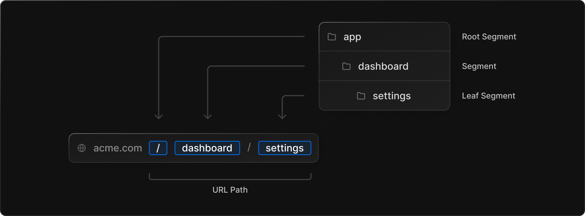
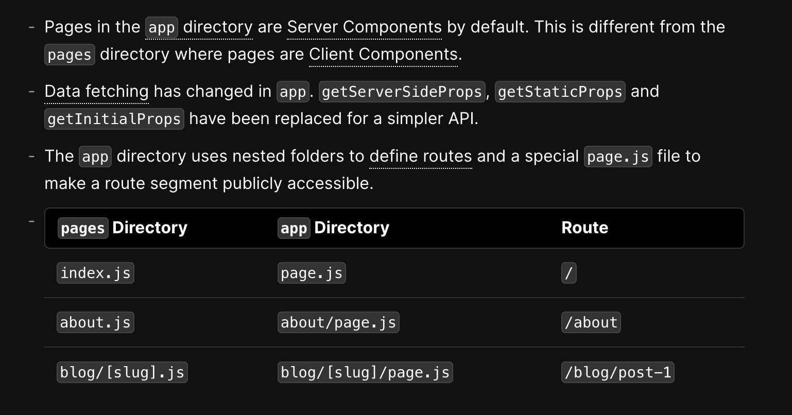
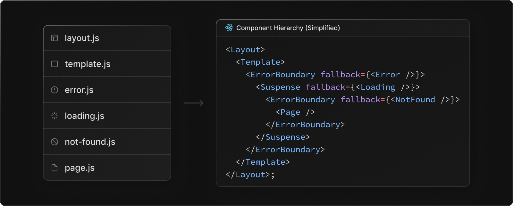
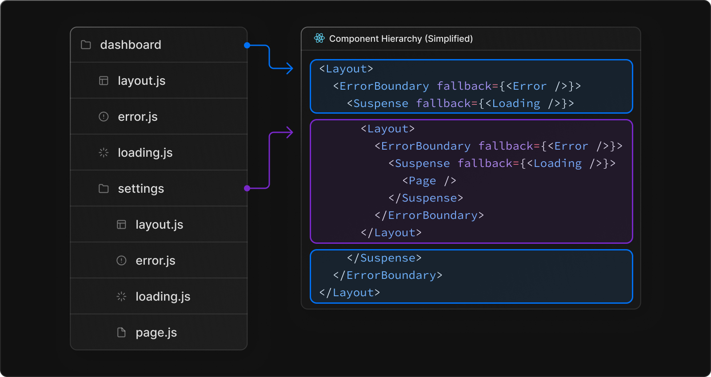
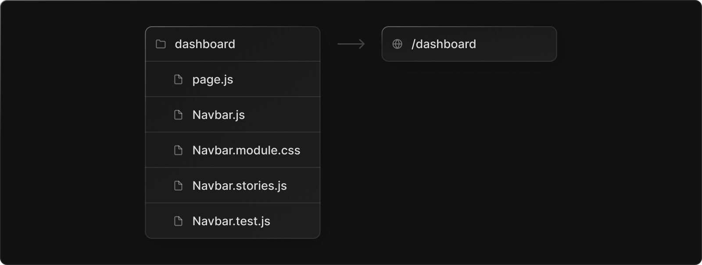
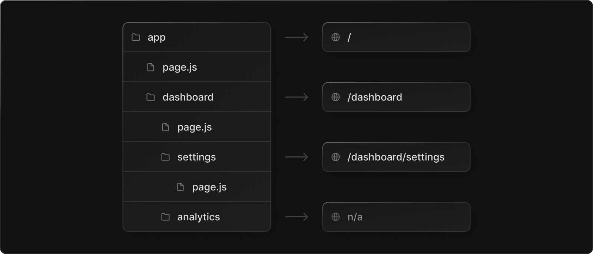
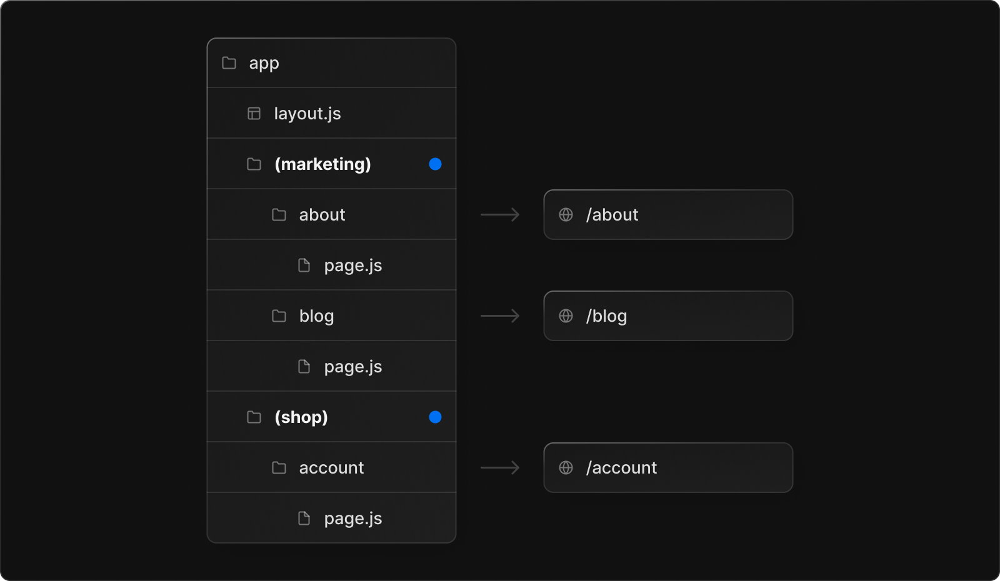
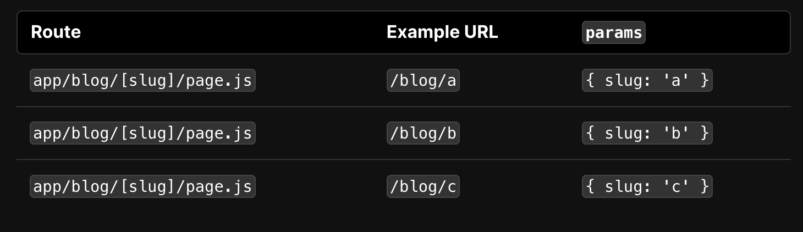
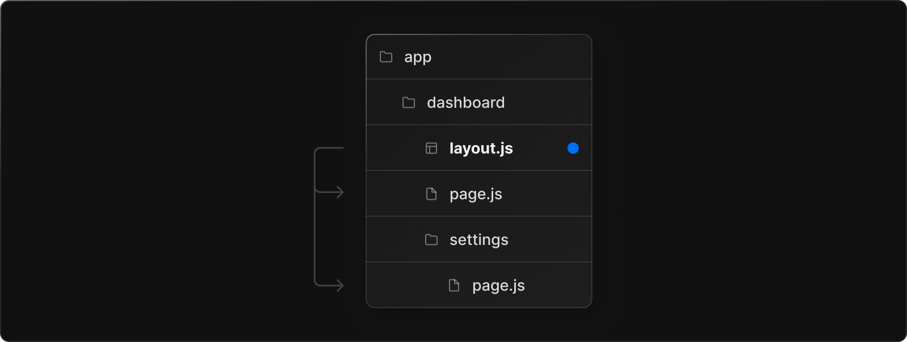

# Routing

- [Fundamentals](#fundamentals)
  * [Terminology](#terminology)
  * [What is](#what-is)
  * [Folders, Files and Routes](#folders-files-and-routes)
  * [File Conventions](#file-conventions)
  * [Colocation](#colocation)
  * [Server-Centric Routing with Client-side Navigation](#server-centric-routing-with-client-side-navigation)
  * [Partial Rendering](#partial-rendering)
  * [Advanced Routing Patterns](#advanced-routing-patterns)
- [Defining Routes](#defining-routes)
  * [Creating Routes](#creating-routes)
  * [Creating UI](#creating-ui)
  * [Route Groups](#route-groups)
  * [Dynamic segments](#dynamic-segments)
- [Pages and Layouts](#pages-and-layouts)
  * [Pages](#pages)
  * [Layouts](#layouts)
  * [Root Layout](#root-layout)
  * [Nested Layout](#nested-layout)
  * [Templates](#templates)
  * [Modifying ``](#modifying-)
- [Linking and Navigation](#linking-and-navigation)
  * [Link](#link)
  * [`useRouter()`Hook](#userouterhook)
  * [Recommendations](#recommendations)
  * [How Navigation Works](#how-navigation-works)
    + [Client-side Caching of Rendered Server Components](#client-side-caching-of-rendered-server-components)
    + [Invalidating the Cache](#invalidating-the-cache)
    + [Prefetching](#prefetching)
    + [Hard Navigation](#hard-navigation)
    + [Soft Navigation](#soft-navigation)
    + [Back/Forward Navigation](#backforward-navigation)
    + [Focus and Scroll Management](#focus-and-scroll-management)
  * [Route Handler (Serverless Function)](#route-handler-serverless-function)
    + [Convention](#convention)
- [Parallel Routes](#parallel-routes)
  * [Convention](#convention-1)
  * [URL](#url)
  * [`default.js`](#defaultjs)
- [Loading UI](#loading-ui)
- [Intercepting Routes](#intercepting-routes)
- [References](#references)

---

Next.js 13 introduced the new **App Router** built on top of [React Server Components](https://beta.nextjs.org/docs/rendering/server-and-client-components) with support for layouts, nested routing, loading states, error handling, and more.

# Fundamentals

## Terminology

**URL Segment**: Part of the URL path delimited by slashes.

**URL Path**: Part of the URL that comes after the domain (composed of segments).


## What is

**Routing** refers to the process of **mapping a URL or a path to a specific piece of content or functionality within a web application**. In other words, it determines how the user's request for a specific URL is handled by the application.

In a client-side application, routing is typically handled by a router component that listens for changes in the URL and updates the view accordingly. In a server-side application, routing is typically handled by the server, which maps incoming requests to the appropriate route handler.

In the context of Next.js, routing is handled by the framework itself. `pages` directory which uses **client-side routing**, the new router in the `app` directory uses \*\*server-centric routing \*\***with Client-side Navigation**[**#**](#g1VZK).

Next.js provides a\*\* file-based routing system\*\*, which means that you can define your routes by creating files in your project's `pages`/`app` directory. For example, if you create a file named `pages/about.js`, Next.js will automatically map the URL `/about` to the content defined in that file. This file-based routing system makes it easy to manage and organize your application's routes.

Routing is a fundamental concept in web development, and Next.js provides a powerful, easy-to-use routing system that can help you build scalable, high-performance web applications.

## Folders, Files and Routes

<font style="color:rgb(255, 255, 255);background-color:rgb(17, 17, 17);"></font>In the app directory:

* **Folders** are used to define routes. A route is a single path of nested folders, following the hierarchy from the **root folder** down to a final **leaf folder** that includes a page.js file.
* **Files** are used to create UI that is shown for the route segment. See [special files](https://beta.nextjs.org/docs/routing/fundamentals#file-conventions).

To create a nested route, you can nest folders inside each other.





## File Conventions

* [page.js](https://beta.nextjs.org/docs/routing/pages-and-layouts#pages): Create the unique UI **of a route** and make the path publicly accessible.
  * [route.js](https://beta.nextjs.org/docs/routing/route-handlers): Create server-side API endpoints for a route.
* [layout.js](https://beta.nextjs.org/docs/routing/pages-and-layouts#layouts): Create shared UI for a segment and its children. A layout wraps a page or child segment.
  * [template.js](https://beta.nextjs.org/docs/routing/pages-and-layouts#templates): Similar to layout.js, except a new component instance is mounted on navigation. Use layouts unless you need this behavior.
* [loading.js](https://beta.nextjs.org/docs/routing/loading-ui): Create loading UI for a segment and its children. loading.js wraps a page or child segment in a [React Suspense Boundary](https://beta.reactjs.org/apis/react/Suspense#suspense), showing the loading UI while they load.
* [error.js](https://beta.nextjs.org/docs/routing/error-handling): Create error UI for a segment and its children. error.js wraps a page or child segment in a [React Error Boundary](https://reactjs.org/docs/error-boundaries.html), showing the error UI if an error is caught.
  * [global-error.js](https://beta.nextjs.org/docs/routing/error-handling): Similar to error.js, but specifically for catching errors in the root layout.js.
* [not-found.js](https://beta.nextjs.org/docs/api-reference/file-conventions/not-found): Create UI to show when the [notFound](https://beta.nextjs.org/docs/api-reference/notfound) function is thrown within a route segment or when a URL is not matched by any route.



In a nested route, the components of a segment will be nested inside the components of its parent segment.



## Colocation

In addition to special files, you have the option to colocate your own files inside folders. For example, stylesheets, tests, components, and more.



## Server-Centric Routing with Client-side Navigation

Unlike the `pages` directory which uses client-side routing, the new router in the `app` directory uses **server-centric routing** to align with [Server Components](https://beta.nextjs.org/docs/rendering/server-and-client-components) and [data fetching on the server](https://beta.nextjs.org/docs/data-fetching/fundamentals#fetching-data-with-server-components). With server-centric routing, the client does not have to download a route map and the same request for Server Components can be used to look up routes. This optimization is useful for all applications, but has a larger impact on applications with many routes.

<font style="color:rgb(255, 255, 255);background-color:rgb(17, 17, 17);"></font>Although routing is server-centric, the router uses **client-side navigation** with the [Link Component](https://beta.nextjs.org/docs/routing/linking-and-navigating#linking) - resembling the behavior of a Single-Page Application. This means when a user navigates to a new route, the browser will not reload the page. Instead, the URL will be updated and Next.js will [only render the segments that change](https://beta.nextjs.org/docs/routing/fundamentals#partial-rendering).

Additionally, as users navigate around the app, the router will store the result of the React Server Component payload in an **in-memory client-side cache**. The cache is split by route segments which allows invalidation at any level and ensures consistency across concurrent renders. This means that for certain cases, the cache of a previously fetched segment can be re-used, further improving performance.

Checkout the [Linking and Navigating](https://beta.nextjs.org/docs/routing/linking-and-navigating) page to learn how to use the Link component.

## Partial Rendering

When navigating between sibling routes (e.g. `/dashboard/settings` and `/dashboard/analytics` below), Next.js will only fetch and render the layouts and pages in routes that change. It will **not** re-fetch or re-render anything above the segments in the subtree.

## Advanced Routing Patterns

In the future, the Next.js Router will provide a set of conventions to help you implement more advanced routing patterns. These include:

* **Parallel Routes**: Allow you to simultaneously show two or more pages in the same view that can be navigated independently. You can use them for split views that have their own sub-navigation. E.g. Dashboards.
* **Intercepting Routes**: Allow you to intercept a route and show it in the context of another route. You can use these when keeping the context for the current page is important. E.g. Seeing all tasks while editing one task or expanding a photo in a feed.
* **Conditional Routes**: Allow you to conditionally render a route based on a condition. E.g. Showing a page only if the user is logged in.

These patterns and conventions will allow you to build richer, more complex UIs in your Next.js applications.

# Defining Routes

## Creating Routes

<font style="color:rgb(255, 255, 255);background-color:rgb(17, 17, 17);"></font>Each folder represents a [routesegment](https://beta.nextjs.org/docs/routing/fundamentals#route-segments) that maps to a **URL** segment. To create a [nested route](https://beta.nextjs.org/docs/routing/fundamentals#nested-routes), you can nest folders inside each other.

A special [page.jsfile](https://beta.nextjs.org/docs/routing/pages-and-layouts#pages) is used to make route segments publicly accessible.



## Creating UI

See [#](#PGwYR)

## Route Groups

在不影响URL的前提下，对页面进行分组。

The hierarchy of the app folder maps directly to URL paths. However, it’s possible to break out of this pattern by creating a **route group**. Route groups can be used to:

* Organize routes without affecting the URL structure.
* Opting-in specific route segments into a [layout](https://beta.nextjs.org/docs/routing/pages-and-layouts).
* Create multiple [root layouts](https://beta.nextjs.org/docs/routing/pages-and-layouts#root-layout) by splitting your application.

A route group can be created by wrapping a folder’s name in parenthesis: `(folderName)`



Even though routes inside (marketing) and (shop) share the same URL hierarchy, you can create a different layout for each group by adding a layout.js file inside their folders. 如果没有route groups，为了给不同组的页面添加不同的layout，用户需要把每一组页面放到一个真实的segemet下面，URL变长。


## Dynamic segments

> **Note:** Dynamic Segments are equivalent to [Dynamic Routes](https://nextjs.org/docs/routing/dynamic-routes) in the pages directory.

When you don't know the exact segment names ahead of time and want to create routes from dynamic data, you can use Dynamic Segments that are filled in at request time or [prerendered](https://beta.nextjs.org/docs/data-fetching/generating-static-params) at build time.

A Dynamic Segment can be created by wrapping a folder’s name in square brackets: `[folderName]`. For example, `[id]` or `[slug]`.

Dynamic Segments are passed as the params prop to [layout](https://beta.nextjs.org/docs/api-reference/file-conventions/layout), [page](https://beta.nextjs.org/docs/api-reference/file-conventions/page), [route](https://beta.nextjs.org/docs/routing/route-handlers), and [generateMetadata](https://beta.nextjs.org/docs/api-reference/metadata#generatemetadata) functions.



See the [generateStaticParams()](https://beta.nextjs.org/docs/data-fetching/generating-static-params) page to learn how to generate the params for the segment.

# Pages and Layouts

## Pages

A page is UI that is **unique** to a route. You can define pages by exporting a component from a page.js file. Use nested folders to [define a route](https://beta.nextjs.org/docs/routing/defining-routes) and a page.js file to make the route publicly accessible.

* A page is always the [leaf](https://beta.nextjs.org/docs/routing/fundamentals#terminology) of the [route subtree](https://beta.nextjs.org/docs/routing/fundamentals#terminology).
* `.js`, `.jsx`, or `.tsx` file extensions can be used for Pages.
* A page.js file is required to make a route segment publicly accessible.
* Pages are [Server Components](https://beta.nextjs.org/docs/rendering/server-and-client-components) by default but can be set to a [Client Component](https://beta.nextjs.org/docs/rendering/server-and-client-components#client-components).
* Pages can fetch data. View the [Data Fetching](https://beta.nextjs.org/docs/data-fetching/fundamentals) section for more information.

## Layouts

A layout is UI that is **shared** between multiple pages. On navigation, layouts preserve state, remain interactive, and do not re-render. Layouts can also be [nested](https://beta.nextjs.org/docs/routing/pages-and-layouts#nesting-layouts).

You can define a layout by default exporting a React component from a layout.js file. The component should accept a children prop that will be populated with a child layout (if it exists) or a child page during rendering.

```tsx
export default function RootLayout({ children }: {
  children: React.ReactNode;
}) {
  return (
    <html lang="en">
      <body>{children}</body>
    </html>
  );
}
```



* The top-most layout is called the [Root Layout](https://beta.nextjs.org/docs/routing/pages-and-layouts#root-layout-required). This **required** layout is shared across all pages in an application. Root layouts must contain html and body tags.
* Any route segment can optionally define its own [Layout](https://beta.nextjs.org/docs/routing/pages-and-layouts#nesting-layouts). These layouts will be shared across all pages in that segment.
* Passing data between a parent layout and its children is not possible. However, you can fetch the same data in a route more than once, and React will [automatically dedupe the requests](https://beta.nextjs.org/docs/data-fetching/fundamentals#automatic-fetch-request-deduping) without affecting performance.

## Root Layout

* The app directory **must** include a root layout.
* The root layout must define `<html>` and `<body>` tags since Next.js does not automatically create them.
* You can use the [built-in SEO support](https://beta.nextjs.org/docs/guides/seo) to manage `<head>` HTML elements, for example, the `<title>` element.
* You can use [route groups](https://beta.nextjs.org/docs/routing/defining-routes#route-groups) to create multiple root layouts. See an [example here](https://beta.nextjs.org/docs/routing/defining-routes#example-creating-multiple-root-layouts).
* The root layout is a [Server Component](https://beta.nextjs.org/docs/rendering/server-and-client-components) by default and **can not** be set to a [Client Component](https://beta.nextjs.org/docs/rendering/server-and-client-components#client-components).

**Note:** The root layout replaces the [\_app.js](https://nextjs.org/docs/advanced-features/custom-app) and [\_document.js](https://nextjs.org/docs/advanced-features/custom-document) files. [View the migration guide](https://beta.nextjs.org/docs/upgrade-guide#create-the-app-directory-and-a-root-layout-required).

## Nested Layout

Layouts defined inside a folder (e.g. `app/dashboard/layout.js`) apply to specific route segments (e.g. `acme.com/dashboard`) and render when those segments are active. By default, layouts in the file hierarchy are **nested**, which means they wrap child layouts via their children prop.

## Templates

Templates are similar to layouts in that they wrap each child layout or page. Unlike layouts that persist across routes and maintain state, templates create a new instance for each of their children on navigation. This means that when a user navigates between routes that share a template, a new instance of the component is mounted, DOM elements are recreated, state is **not** preserved, and effects are re-synchronized.

There may be cases where you need those specific behaviors, and templates would be a more suitable option than layouts. For example:

* Enter/exit animations using CSS or animation libraries.
* Features that rely on useEffect (e.g logging page views) and useState (e.g a per-page feedback form).
* To change the default framework behavior. For example, Suspense Boundaries inside layouts only show the fallback the first time the Layout is loaded and not when switching pages. For templates, the fallback is shown on each navigation.

A template can be defined by exporting a default React component from a template.js file. The component should accept a children prop which will be nested segments


```jsx
export default function Template({ children }: {
  children: React.ReactNode
}) {
  return <div>{children}</div>;
}
```

```jsx
<Layout>
  {/* Note that the template is given a unique key. */}
  <Template key={routeParam}>{children}</Template>
</Layout>
```

## Modifying `<head>`

In the `app` directory, you can modify the `<head>` HTML elements such as title and meta using the [built-in SEO support](https://beta.nextjs.org/docs/guides/seo).

Metadata can be defined by exporting a [metadataobject](https://beta.nextjs.org/docs/api-reference/metadata#static-metadata) or [generateMetadatafunction](https://beta.nextjs.org/docs/api-reference/metadata#generatemetadata) in a [layout.js](https://beta.nextjs.org/docs/api-reference/file-conventions/layout) or [page.js](https://beta.nextjs.org/docs/api-reference/file-conventions/page) file.

```tsx

export const metadata = {
  title: 'Next.js'
};

export default function Page() {
  return '...'
}
```

> \*\*<font style="color:rgb(250, 250, 250);background-color:rgb(0, 0, 0);"></font>\*\***Good to know:** You should **not** manually add <head> tags such as <title> and <meta> to root layouts. Instead, you should use the [Metadata API](https://beta.nextjs.org/docs/api-reference/metadata) which automatically handles advanced requirements such as streaming and de-duplicating <head> elements.

# Linking and Navigation

The Next.js router uses [server-centric routing](https://beta.nextjs.org/docs/routing/fundamentals#server-centric-routing-with-client-side-navigation) with [client-side navigation](https://beta.nextjs.org/docs/routing/linking-and-navigating#how-navigation-works). It supports [instant loading states](https://beta.nextjs.org/docs/routing/loading-ui) and [concurrent rendering](https://react.dev/reference/react/startTransition). This means navigation maintains client-side state, avoids expensive re-renders, is interruptible, and doesn't cause race conditions.

There are two ways to navigate between routes:

* [<Link>Component](https://beta.nextjs.org/docs/routing/linking-and-navigating#link-component)
* [useRouterHook](https://beta.nextjs.org/docs/routing/linking-and-navigating#userouter-hook)

## Link

<Link> is a React component that extends the HTML <a> element to provide [prefetching](https://beta.nextjs.org/docs/routing/linking-and-navigating#prefetching) and client-side navigation between routes. It is the primary way to navigate between routes in Next.js.

```jsx
import Link from 'next/link';

export default function PostList({ posts }) { // dynamic routing
  return (
    <ul>
      {posts.map((post) => (
        <li key={post.id}>
          <Link href={`/blog/${post.slug}`}>
            {post.title}
          </Link>
        </li>
      ))}
    </ul>
  );
}

```

## `useRouter()`Hook

The `useRouter` hook allows you to programmatically change routes inside [Client Components](https://beta.nextjs.org/docs/rendering/server-and-client-components).

```jsx
'use client';

import { useRouter } from 'next/navigation';

export default function Page() {
  const router = useRouter();

  return (
    <button type="button" onClick={() => router.push('/dashboard')}>
      Dashboard
    </button>
  );
}
```

## Recommendations

**Recommendation:** Use the <Link> component to navigate between routes unless you have a specific requirement for using useRouter.

## How Navigation Works

* A route transition is initiated using `<Link>` or calling `router.push()`.
* The router updates the URL in the browser’s address bar.
* The router avoids unnecessary work by re-using segments that haven't changed (e.g. shared layouts) from the [client-side cache](https://beta.nextjs.org/docs/routing/linking-and-navigating#client-side-caching-of-rendered-server-components). This is also referred to as [partial rendering](https://beta.nextjs.org/docs/routing/fundamentals#partial-rendering).
* If the [conditions of soft navigation](https://beta.nextjs.org/docs/routing/linking-and-navigating#conditions-for-soft-navigation) are met, the router fetches the new segment from the cache rather than the server. If not, the router performs a [hard navigation](https://beta.nextjs.org/docs/routing/linking-and-navigating#hard-navigation) and fetches the Server Component payload from the server. (类似[强缓存和协商缓存](https://www.yuque.com/pengcheng-fuigs/qg6z7c/in3sdg))
* If created, [loading UI](https://beta.nextjs.org/docs/routing/loading-ui) is shown from the server while the payload is being fetched.
* The router uses the cached or fresh payload to render the new segments on the client.

### Client-side Caching of Rendered Server Components

### Invalidating the Cache

### Prefetching

### Hard Navigation

### Soft Navigation

### Back/Forward Navigation

### Focus and Scroll Management

## Route Handler (<font style="color:rgb(0, 0, 0);">Serverless Function</font>)

Route Handlers allow you to create custom request handlers for a given route using the Web [Request](https://developer.mozilla.org/en-US/docs/Web/API/Request) and [Response](https://developer.mozilla.org/en-US/docs/Web/API/Response) APIs.

Route Handlers are only available inside the app directory. They are the equivalent of [API Routes](https://beta.nextjs.org/docs/data-fetching/api-routes) inside the `pages` directory meaning you **do not** need to use API Routes and Route Handlers together.

### Convention

Route Handlers are defined in a [route.js|tsfile](https://beta.nextjs.org/docs/api-reference/file-conventions/route) inside the `app` directory:

app/api/route.ts

```plain
export async function GET(request: Request) {}
```

Route Handlers can be nested inside the app directory, similar to page.js and layout.js. But there **cannot** be a route.js file at the same route segment level as page.js.

# Parallel Routes

Parallel Routes allow you to simultaneously render one or more pages in the same view that can be navigated independently. For highly dynamic sections of an app, such as dashboards and feeds on social sites, Parallel Routes can be used to implement complex routing patterns. (parallel rendering multiple views on dashboard)

## Convention

Parallel Routes are created using named **slots**. Slots are defined with the `@folder` convention.

For example, the following file structure defines two explicit slots for a video analytics dashboard, `@audience` and `@views`:

```plain
dashboard
├── @audience
│   ├── demographics
│   │   └── page.js
│   ├── subscribers
│   │   └── page.js
│   └── page.js
├── @views
│   ├── impressions
│   │   └── page.js
│   ├── view-duration
│   │   └── page.js
│   └── page.js
├── layout.js
└── page.js
```

The folder structure above means `/dashboard/layout.js` Layout component now accepts the slots `@audience` and `@views` as props and can render them in parallel alongside the `children` prop:

```tsx
function AudienceNav() {
  return <nav>...</nav>;
}

function ViewsNav() {
  return <nav>...</nav>;
}

export default function Layout({
  children,
  audience,
  views,
}: {
  children: React.ReactNode;
  audience: React.ReactNode;
  views: React.ReactNode;
}) {
  return (
    <>
      <h1>Tab Bar Layout</h1>
      {children}

      <h2>Audience</h2>
      <AudienceNav />
      {audience}

      <h2>Views</h2>
      <ViewsNav />
      {views}
    </>
  );
}
```

The `children` prop is an implicit slot that does not need to be mapped to a folder. This means `dashboard/page.js` is equivalent to `dashboard/@children/page.js`.

## URL

Slots do not affect the URL structure. The file path /dashboard/@audience/subscribers would be accessible at /dashboard/subscribers.

## `default.js`

On refresh (or [hard navigation](https://beta.nextjs.org/docs/routing/linking-and-navigating#hard-navigation)), the browser will render the slot that matches the current URL but cannot know which other parallel slot was active.

You can define a default.js file to render as a fallback when the browser cannot restore the previous state.

# Loading UI

`loading.js`with [React Suspense](https://beta.reactjs.org/apis/react/Suspense).

# Intercepting Routes

Intercepting routes allow you to load a new route within the current layout while masking the browser URL, this is useful when keeping the context for the current page is important. For example, seeing all tasks while editing one task, opening a cart in a side modal, or expanding a photo in a feed.

Intercepting routes can be defined with the (..) convention, similar to relative paths ../. You can also use the (...) convention to create a path relative to the app directory.

```jsx
[feed]
├── (..)photo/[id]
│   └── page.tsx
└── layout.tsx
photo/[id]
├── page.tsx
└── layout.tsx
```

# References

* [Routing: Fundamentals | Next.js](https://beta.nextjs.org/docs/routing/fundamentals)
* [Routing: Defining Routes | Next.js](https://beta.nextjs.org/docs/routing/defining-routes)
* [Routing: Pages and Layouts | Next.js](https://beta.nextjs.org/docs/routing/pages-and-layouts)
* [Routing: Linking and Navigating | Next.js](https://beta.nextjs.org/docs/routing/linking-and-navigating)
* [Routing: Loading UI | Next.js](https://beta.nextjs.org/docs/routing/loading-ui)
* [Routing: Route Handlers | Next.js](https://beta.nextjs.org/docs/routing/route-handlers)
* [Routing: Parallel Routes | Next.js](https://beta.nextjs.org/docs/routing/parallel-routes)
* [Routing: Intercepting Routes | Next.js](https://beta.nextjs.org/docs/routing/intercepting-routes)
* [Upgrade Guide | Next.js](https://beta.nextjs.org/docs/upgrade-guide)
* chatgpt


> 更新: 2023-04-20 14:15:54  
> 原文: <https://www.yuque.com/viruspc/el3mi0/idcetdpovc26wgpu>