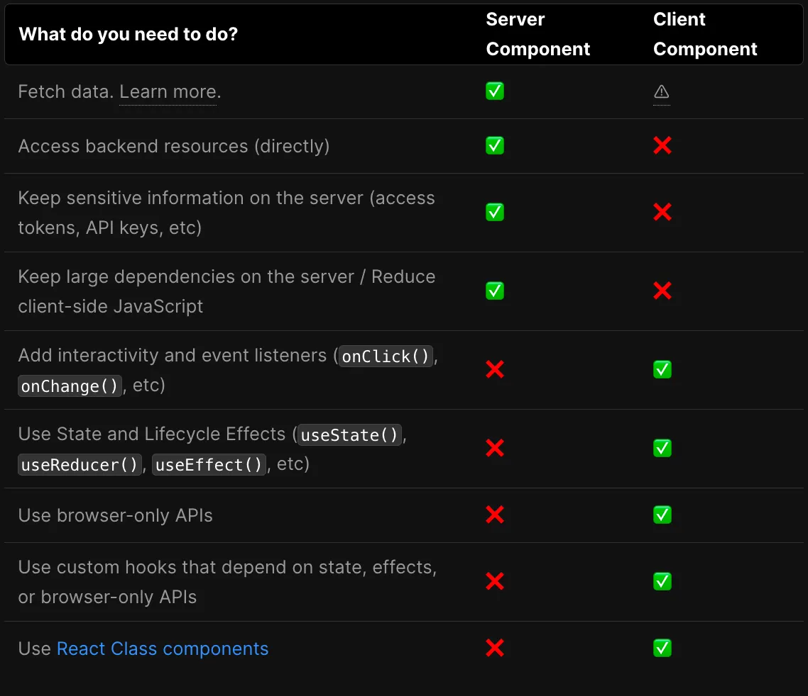

# Server and Client Components

- [What is](#what-is)
- [When to use](#when-to-use)
  * [Why Server Component](#why-server-component)
  * [Why Client component](#why-client-component)
  * [Comparision](#comparision)
- [How to use](#how-to-use)
  * [单独使用](#%E5%8D%95%E7%8B%AC%E4%BD%BF%E7%94%A8)
  * [组合使用](#%E7%BB%84%E5%90%88%E4%BD%BF%E7%94%A8)
  * [Passing props from Server to Client Components (Serialization)](#passing-props-from-server-to-client-components-serialization)
  * [状态管理](#%E7%8A%B6%E6%80%81%E7%AE%A1%E7%90%86)
  * [Performance optimization](#performance-optimization)
- [References](#references)

---

注：使用beta版本的`/app`目录时才分server component 和 client component。

在`/pages`目录中，不存在这种区分，所有的组件都为client component。[#](https://beta.nextjs.org/docs/rendering/server-and-client-components#client-components)

此外，可通过`dynamic`来禁用ssr以实现client rendering。client component 主要采用client rendering，但next.js默认利用ssr/ssg来做首屏渲染(而后利用hydration技术在客户端增强)，来进行首屏加载时间、SEO优化。[#](https://nextjs.org/docs/advanced-features/dynamic-import#with-no-ssr)

核心技术：React hydrate

# What is

[Server](https://beta.nextjs.org/docs/rendering/server-and-client-components#server-components) and [Client Components](https://beta.nextjs.org/docs/rendering/server-and-client-components#client-components) allow developers to build applications that span the server and client, combining the rich interactivity of client-side apps with the improved performance of traditional server rendering

**Server Component** is a component that is fetched and rendered **ON THE SERVER.**

**Client Component** is the one that is fetched and rendered **ON THE CLIENT**(browser).

二者代码分开打包。

* Components in the Server Component module graph are guaranteed to be **only rendered on the server.**
* Components in the Client Component module graph are primarily rendered on the client, but with Next.js, they can aluseso be prerendered on the server and hydrated on the client.
* 

# When to use

## Why Server Component

1. HTML生成过程转移到服务端。
   1. 首屏渲染速度快。省去浏览器首次渲染的工作, 加快首屏显示速度。特别是借助static rendering（static site generation）技术的组件。
   2. 低性能设备友好。渲染压力转移到服务端。
   3. SEO友好。爬虫通常只请求HTML, 不请求JS。
   4. 可访问性（ accessibility）好。
2. 一部分js转移到服务端。只在客户端保留交互性相关的javascript，将其他javascript保留在服务端。
   1. 打包体积小。
   2. 安全性高。敏感数据和商业逻辑保持在服务端。

适用于静态网站。

## Why Client component

1. 保护客户隐私。比如dashboard场景中，客户的数据可能不允许上传到服务器。
2. 交互体验好。
3. 节省服务端资源。
4. 离线功能。通过在客户端缓存数据和逻辑来提供离线功能， 网络不稳定或断网后用户也可以继续使用网页的很多功能。

适用于交互丰富的web应用，页面数据更新频繁，不注重SEO而注重客户隐私的场景。

注：client component结合ssg/ssr（static rendering, dynamic rendering）也可以做SEO优化。

## Comparision

* Components in the **Server Component** module graph are guaranteed to be only rendered on the server.
* Components in the **Client Component** module graph are primarily rendered on the client, but with Next.js, they can also be\*\* prerendered on the server \*\*and hydrated on the client.[#](https://nextjs.org/learn/basics/data-fetching/request-time)

# How to use

## 单独使用

* Server component：next.js 13 `src/page`目录下或`src/_app`目录下的页面默认采用server component 。
* Client component：要想使用client compnent需要在组件文件第一行加上`"use client"`提示。一旦在文件中定义了`use cient`，导入其中的所有其他模块（包括子组件）都被视为客户端bundle的一部分。client component的子组件都会被视为client component，故只需在入口点组件田间`use client`即可。

## 组合使用

* 如果希望在client component里使用server component，需要将server component通过props传入client component。[#](https://beta.nextjs.org/docs/rendering/server-and-client-components#importing-server-components-into-client-components)
* 如果希望在client component里使用server component，直接引用即可

## Passing props from Server to Client Components (Serialization)

服务端组件与客户端组件通信需要经过网络传输，数据传输前需要先序列化。

Props passed from the Server Components to Client components need to be serializable. This means that values such as functions, Dates, etc, cannot be passed directly to client components.

In the `app` directory, the network boundary is between Server Components and Client Components. This is different from the `pages` directory where the boundary is between `getStaticProps`/`getServerSideProps` and Page Components. Data fetched inside Server Components do not need to be serialized as it doesn't cross the network boundary unless it is passed to a Client Component.

## 状态管理

Server Components have no React state (since they're not interactive)

## Performance optimization

1. 尽可能地少用client component
2. 尽可能地将client component放到叶子（尽可能地使client component最小化）。
3. 如果一个组件需要请求服务端数据来进行渲染，尽可能地将该组件及数据请求逻辑放到服务端。

# References

* [React Labs: What We’ve Been Working On – March 2023 – React](https://react.dev/blog/2023/03/22/react-labs-what-we-have-been-working-on-march-2023#react-server-components)
* [Introducing Zero-Bundle-Size React Server Components – React](https://react.dev/blog/2020/12/21/data-fetching-with-react-server-components)
* [Rendering: Server and Client Components | Next.js](https://beta.nextjs.org/docs/rendering/server-and-client-components)
* [Rendering: Fundamentals | Next.js](https://beta.nextjs.org/docs/rendering/fundamentals)
* [hydrate – React](https://react.dev/reference/react-dom/hydrate#hydrating-server-rendered-html)
* [What is Static Site Generation? How Next.js Uses SSG for Dynamic Web Apps](https://www.freecodecamp.org/news/static-site-generation-with-nextjs/)
* [Learn | Next.js](https://nextjs.org/learn/basics/data-fetching/request-time)
* [Data Fetching: Client side | Next.js](https://nextjs.org/docs/basic-features/data-fetching/client-side#client-side-data-fetching-with-swr)
* [Client Components and use client in Next.js App Directory](https://thetombomb.com/posts/use-client-nextjs)

> 更新: 2023-05-23 15:39:18  
> 原文: <https://www.yuque.com/viruspc/el3mi0/ss2gmshomz03li1z>