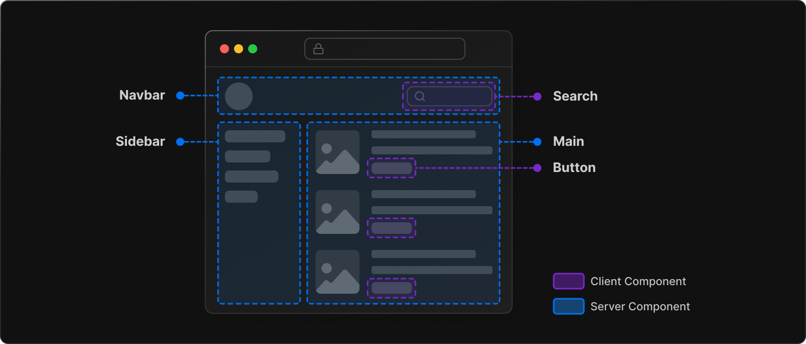

# Next.js (v13 beta)

- [Background](#background)
- [Main Idea](#main-idea)
- [References](#references)

---

# Background
Next.js is a framework for building server-side rendered (SSR) and statically generated (SSG) React applications. It was created to solve a few problems that developers faced when building React applications, particularly around **performance** and **SEO**.

Before Next.js, React applications were typically built as client-side rendered (CSR) applications, where the initial HTML was generated by the browser after downloading the JavaScript code. This could lead to **slower initial load times **and **poor SEO performance**, since search engines may not be able to crawl JavaScript-heavy pages effectively.

# Main Idea
Next.js solves this problem by allowing developers to generate static HTML at build time** **(**SSG**) or serve HTML dynamically from the server (**SSR**). This allows for faster initial load times and better SEO performance, since search engines can easily crawl static HTML pages.

In addition to performance and SEO benefits, Next.js also provides a number of other features that make it easier to build React applications, such as **automatic code splitting**, **optimized asset loading**, and support for **server-side rendering of data fetching**.

Overall, Next.js is a powerful framework that solves a number of challenges faced by developers when building React applications, particularly around performance and SEO.

React Server Components introduce a** new mental model **for building hybrid applications that leverage the server and the client.

Instead of React rendering your whole application client-side, React now gives you the flexibility to **choose where to render your components** based on their purpose.

By default, it create **Server Components,** and you can optionally opt-in to **Client Components** when needed.

#   

# 
# References
+ [Rendering: Server and Client Components | Next.js](https://beta.nextjs.org/docs/rendering/server-and-client-components)
+ [Rendering: Fundamentals | Next.js](https://beta.nextjs.org/docs/rendering/fundamentals)
+ [https://react.dev/reference/react-dom/hydrate#hydrating-server-rendered-html](https://react.dev/reference/react-dom/hydrate#hydrating-server-rendered-html)
+ [What is Static Site Generation? How Next.js Uses SSG for Dynamic Web Apps](https://www.freecodecamp.org/news/static-site-generation-with-nextjs/)
+ [Learn | Next.js](https://nextjs.org/learn/basics/data-fetching/request-time)
+ [Data Fetching: Client side | Next.js](https://nextjs.org/docs/basic-features/data-fetching/client-side#client-side-data-fetching-with-swr)

> 更新: 2023-04-20 02:47:56  
> 原文: <https://www.yuque.com/viruspc/el3mi0/nq7fvf2n13pgqylk>