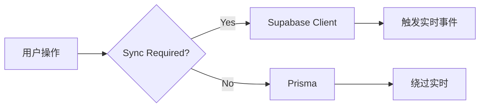
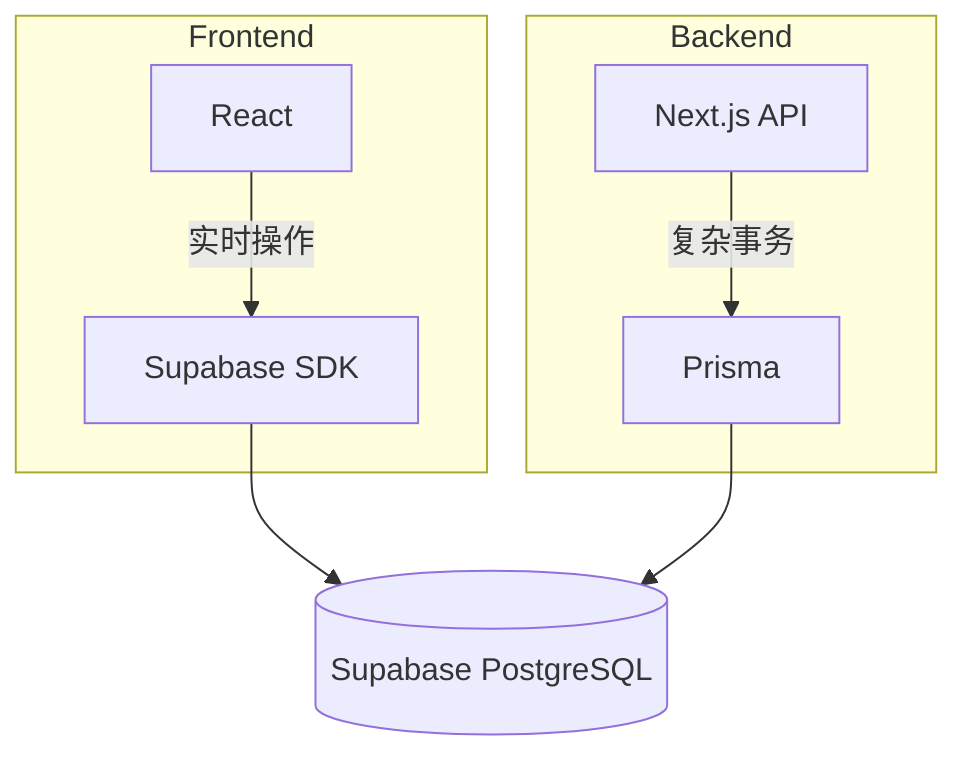
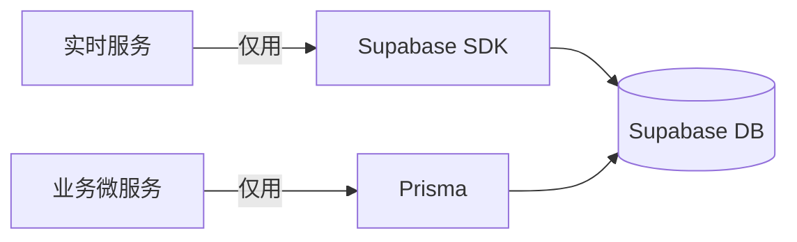

# Prisma 与 Supabase 集成的主要问题及解决方案

- [Prisma 与 Supabase 集成的主要问题及解决方案](#prisma-%E4%B8%8E-supabase-%E9%9B%86%E6%88%90%E7%9A%84%E4%B8%BB%E8%A6%81%E9%97%AE%E9%A2%98%E5%8F%8A%E8%A7%A3%E5%86%B3%E6%96%B9%E6%A1%88)
  * [**1. 实时同步失效**](#1-%E5%AE%9E%E6%97%B6%E5%90%8C%E6%AD%A5%E5%A4%B1%E6%95%88)
  * [**2. RLS（行级安全）被破坏**](#2-rls%E8%A1%8C%E7%BA%A7%E5%AE%89%E5%85%A8%E8%A2%AB%E7%A0%B4%E5%9D%8F)
  * [**3. 数据源冲突**](#3-%E6%95%B0%E6%8D%AE%E6%BA%90%E5%86%B2%E7%AA%81)
  * [**4. 迁移管理冲突**](#4-%E8%BF%81%E7%A7%BB%E7%AE%A1%E7%90%86%E5%86%B2%E7%AA%81)
  * [**5. 认证系统干扰**](#5-%E8%AE%A4%E8%AF%81%E7%B3%BB%E7%BB%9F%E5%B9%B2%E6%89%B0)
- [终极方案：微服务隔离](#%E7%BB%88%E6%9E%81%E6%96%B9%E6%A1%88%E5%BE%AE%E6%9C%8D%E5%8A%A1%E9%9A%94%E7%A6%BB)

---

### Prisma 与 Supabase 集成的主要问题及解决方案

***

#### **1. 实时同步失效**

* **问题**：\
  Prisma 写入的数据**无法触发 Supabase 实时事件**（Supabase 的监听依赖 PostgreSQL 逻辑复制，但 Prisma 的查询引擎会绕过此机制）。
* **解决**：\
  **隔离数据流**



```
- 需要实时同步的操作 → 用 Supabase 客户端  
- 后台任务/复杂事务 → 用 Prisma
```

***

#### **2. RLS（行级安全）被破坏**

* **问题**：\
  Prisma 使用 `service_role` 密钥连接数据库，**绕过所有 RLS 规则**，导致数据泄露风险。
* **解决**：\
  **分级权限控制**
  * 为 Prisma 创建**专用数据库角色**（非 `postgres` 或 `service_role`）
  * 手动为该角色配置有限权限：

```sql
CREATE ROLE prisma_app LOGIN PASSWORD 'secure_pwd';
GRANT SELECT, INSERT ON public.users TO prisma_app;
REVOKE ALL ON public.auth_tokens FROM prisma_app; -- 权限隔离
```

***

#### **3. 数据源冲突**

* **问题**：\
  混用 Supabase 客户端和 Prisma 操作同一张表时，可能因**缓存/时序问题**导致数据不一致。
* **解决**：\
  **明确分层架构**



```
- **前端**：仅用 Supabase SDK 处理实时/简单操作  
- **后端 API**：用 Prisma 处理支付/批处理等复杂逻辑
```

***

#### **4. 迁移管理冲突**

* **问题**：\
  Supabase 的在线表编辑器与 Prisma Migrate 可能**修改冲突**。
* **解决**：\
  **单向迁移流程**
  * 开发环境：只用 `prisma migrate dev`
  * 生产环境：禁用 Supabase 控制台直接改表
  * 在 Supabase 设置中开启 **“禁止 Web 修改”** 开关

***

#### **5. 认证系统干扰**

* **问题**：\
  Prisma 无法直接使用 Supabase Auth 的 JWT 进行 RLS 过滤。
* **解决**：\
  **上下文注入 RLS**\
  在 API 中手动设置 PostgreSQL 会话变量：

```typescript
// Next.js API 示例
import { createClient } from '@supabase/supabase-js';

export async function handler(req, res) {
  const supabase = createClient(SUPABASE_URL, SERVICE_KEY);
  
  // 1. 验证用户 JWT
  const user = await supabase.auth.getUser(req.headers.authorization);
  
  // 2. 为 Prisma 连接注入 RLS 上下文
  await prisma.$executeRaw`SET app.current_user_id = ${user.id}`;
  
  // 3. 执行 Prisma 操作（受 RLS 约束）
  await prisma.orders.findMany();
}
```

***

### 终极方案：微服务隔离

若问题复杂，直接拆分服务：



* **实时服务**：处理聊天、通知等场景（纯 Supabase SDK）
* **业务服务**：处理订单、报表等场景（纯 Prisma）
* 通过 **Supabase Webhooks** 或 **PostgreSQL NOTIFY** 协调服务间通信

> **核心原则**：避免在同一数据流中混用两者，通过架构隔离化解冲突。


> 更新: 2025-08-15 16:38:58  
> 原文: <https://www.yuque.com/viruspc/el3mi0/dmwselublzgydkku>