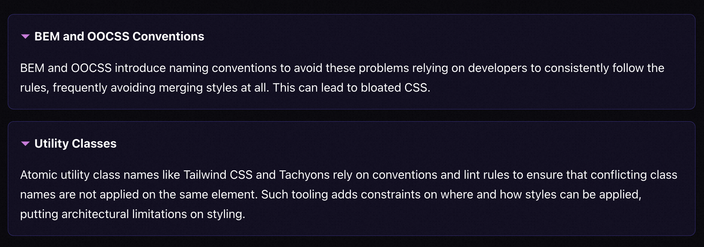

# StyleX

  * [Core Principles](#core-principles)
    + [Co-location](#co-location)
    + [Deterministic resolution](#deterministic-resolution)
- [如何解决问题](#%E5%A6%82%E4%BD%95%E8%A7%A3%E5%86%B3%E9%97%AE%E9%A2%98)
  * [参考资料](#%E5%8F%82%E8%80%83%E8%B5%84%E6%96%99)

---

## Core Principles
To understand why StyleX exists and the reasoning behind its decisions, it may be beneficial to familiarize oneself with the fundamental principles that guide it. This may help you decide if StyleX is the right solution for you.

These principles should also be helpful when designing new APIs for StyleX.

### Co-location
There are benefits of DRY code, but we don't think that's usually true when it comes to authoring styles. The best and most readable way to write styles is to write them in the same file as the markup.

StyleX is designed for authoring, applying, and reasoning about styles locally.

为什么把css和js放在一起更好？因为把样式和标记语言本身放在一起更好。

html和css放在一起更好。随着 html 到 jsx 的演进，css 也应该随着搬到 js 中去。

### Deterministic resolution
CSS is a powerful and expressive language. However, it can sometimes feel fragile. Some of this stems from a **misunderstanding **of how CSS works, but a lot of it stems from the discipline and organization required to keep CSS selectors with different specificities from **conflicting**.

Most existing solutions to this problem rely on rules and conventions.

**StyleX aims to improve on both the consistency and predictability of styles **_**and**_** the expressive power available. **We believe this is possible through build-tools.

StyleX provides a completely predictable and deterministic styling system that works across files. It produces deterministic results not only when merging multiple selectors, but also when merging multiple shorthand and longhand properties. (e.g. margin vs margin-top).

> "The last style applied always wins."
>

# 如何解决问题
1. html与css分离的问题
    1. 把css拿到js中
2. 不理解css如何工作的问题
3. 冲突问题

## 参考资料
[https://stylexjs.com/docs/learn/thinking-in-stylex/](https://stylexjs.com/docs/learn/thinking-in-stylex/)

> 更新: 2023-12-08 09:20:12  
> 原文: <https://www.yuque.com/viruspc/el3mi0/pfv2czfbgazb1vk8>