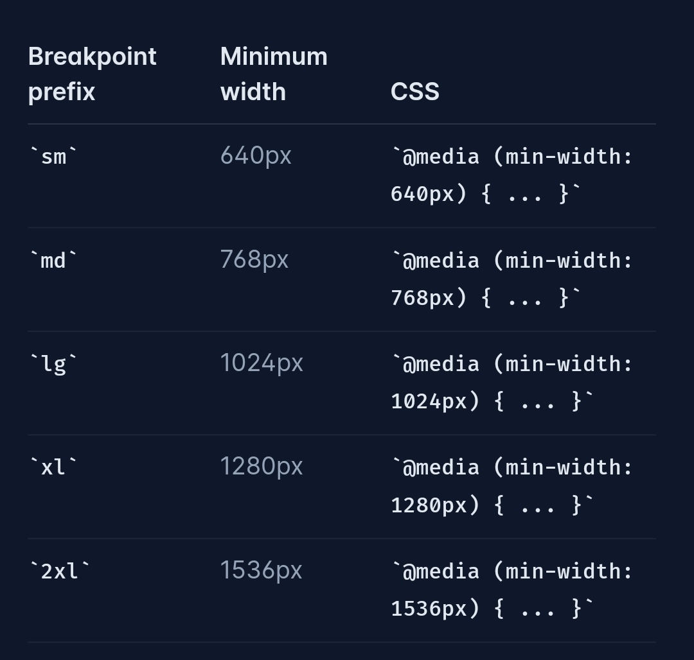

# tailwind.css

- [main idea](#main-idea)
- [优点](#%E4%BC%98%E7%82%B9)
- [缺点](#%E7%BC%BA%E7%82%B9)
- [有意思的特性](#%E6%9C%89%E6%84%8F%E6%80%9D%E7%9A%84%E7%89%B9%E6%80%A7)
  * [apply class conditionally](#apply-class-conditionally)
  * [nested groups](#nested-groups)
  * [sibling](#sibling)
  * [Responsive Design](#responsive-design)
    + [Customize](#customize)
  * [Dark Mode](#dark-mode)
  * [Resusing Styles](#resusing-styles)
  * [Adding Custom Styles](#adding-custom-styles)
  * [Functions & Directives](#functions--directives)
- [References](#references)

---

# main idea
Atomic CSS/Utility-First CSS

# 优点
+ You aren’t wasting energy inventing class names. 
+ Your CSS stops growing. 
+ Making changes feels safer.
+ Rapidly build modern websites without ever leaving your HTML. （个人更喜欢html与css分离。。。）
+ “semantic HTML” , which means using content-derived class names (and even then, only as a last resort),

# 缺点
jsx里混着太多class名，太乱了

# 有意思的特性
## apply class conditionally
Every utility class in Tailwind can be applied conditionally by adding a modifier to the beginning of the class name that describes the condition you want to target.

```html
<button class="dark:md:hover:bg-fuchsia-600 ...">
  Save changes
</button>
```

## nested groups
避免深层嵌套的样式需要先flatten的情况。

```html
<ul role="list">
  {#each people as person}
    <li class="group/item hover:bg-slate-100 ...">
      
      <div>
        <a href="{person.url}">{person.name}</a>
        <p>{person.title}</p>
      </div>
      <a class="group/edit invisible hover:bg-slate-200 group-hover/item:visible ..." href="tel:{person.phone}">
        <span class="group-hover/edit:text-gray-700 ...">Call</span>
        <svg class="group-hover/edit:translate-x-0.5 group-hover/edit:text-slate-500 ...">
          <!-- ... -->
        </svg>
      </a>
    </li>
  {/each}
</ul>
```

## sibling
peer

```html
<form>
  <label class="block">
    <span class="block text-sm font-medium text-slate-700">Email</span>
    <input type="email" class="peer ..."/>
    <p class="mt-2 invisible peer-invalid:visible text-pink-600 text-sm">
      Please provide a valid email address.
    </p>
  </label>
</form>
<fieldset>
  <legend>Published status</legend>

  <input id="draft" class="peer/draft" type="radio" name="status" checked />
  <label for="draft" class="peer-checked/draft:text-sky-500">Draft</label>

  <input id="published" class="peer/published" type="radio" name="status" />
  <label for="published" class="peer-checked/published:text-sky-500">Published</label>

  <div class="hidden peer-checked/draft:block">Drafts are only visible to administrators.</div>
  <div class="hidden peer-checked/published:block">Your post will be publicly visible on your site.</div>
</fieldset>
```


## Responsive Design
By default, Tailwind uses a mobile-first breakpoint system.

```html
<!-- Width of 16 by default, 32 on medium screens, and 48 on large screens -->

<div class="md:max-xl:flex"></div>
<div class="min-[320px]:text-center max-[600px]:bg-sky-300"></div>
```



Tailwind generates a corresponding max-* modifier for each breakpoint to support breakpoint range. 


### Customize
```javascript
module.exports = {
  theme: {
    screens: {
      'tablet': '640px',
      // => @media (min-width: 640px) { ... }

      'laptop': '1024px',
      // => @media (min-width: 1024px) { ... }

      'desktop': '1280px',
      // => @media (min-width: 1280px) { ... }
    },
  }
}
```


## Dark Mode
## Resusing Styles
## Adding Custom Styles
## Functions & Directives


# References
+ [Utility-First Fundamentals - Tailwind CSS](https://tailwindcss.com/docs/utility-first)
+ [Composing the Uncomposable with CSS Variables](https://adamwathan.me/composing-the-uncomposable-with-css-variables/)


> 更新: 2023-04-22 09:15:24  
> 原文: <https://www.yuque.com/viruspc/el3mi0/ugzesqknf58ltvmg>