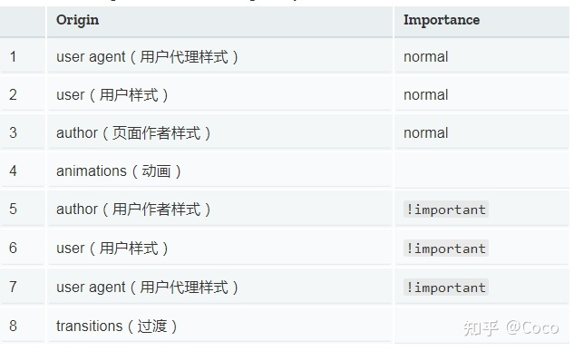
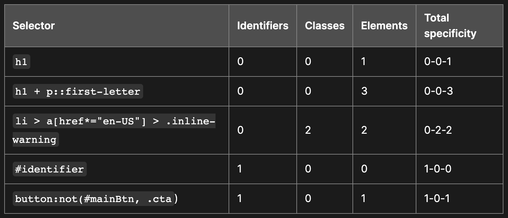

# Cascade, Specificity and Inheritance

- [Cascade](#cascade)
  * [Origin and Importance （来源与重要性）](#origin-and-importance-%E6%9D%A5%E6%BA%90%E4%B8%8E%E9%87%8D%E8%A6%81%E6%80%A7)
- [@layer （层）](#layer-%E5%B1%82)
  * [Specificity](#specificity)
  * [Source Order](#source-order)
  * [Inheritance](#inheritance)

---

# Cascade

从上往下依次判断：

1. **来源与重要性**\
   `!important` 的用户代理样式 > `!important` 的用户样式 > `!important` 的作者样式 > 动画样式 > 普通作者样式 > 普通用户样式 > 普通用户代理样式
2. **层（Layer）位置**\
   **非层样式**（不在 `@layer` 中） > **匿名层**、**命名层** 、**嵌套内层**（按出现顺序，后定义优先）。优先级比较特殊，外层>内层 。
3. **选择器优先级**（Specificity）\
   内联样式 > ID > 类/伪类/属性 > 元素/伪元素
4. **源代码顺序**（Source Order）\
   后出现的规则覆盖先出现的规则

## Origin and Importance （来源与重要性）

！important无视inline和specificity和source order规则

过渡>重要>动画>普通

user agent是浏览器默认样式， user是此网页开发者写的样式，author是页面通过dev tools添加的样式

2022最新的@layer可以控制样式的优先级

# @layer （层）

CSS `@layer`（级联层）是 CSS Cascading and Inheritance Level 5 规范引入的核心特性，用于**结构化组织样式规则并显式控制优先级**，解决传统 CSS 中因选择器权重冲突导致的样式管理难题。

优先级比较特殊，外层>内层

## Specificity

利用inline，id, class, element 四个来计算

Inline样式specificity最高，占1xxx。

The universal selector (\*), combinators (+, >, ~, ' '), and specificity adjustment selector (:where()) have no effect on specificity.

## Source Order

specificity相同时，后面的优先级高

## Inheritance

默认情况下：

1. 一些属性可以被继承. initial value只被作用于root元素，其他元素从父元素继承：color

2. 一些不可以被继承，initial value作用于所有元素：width, height, margin, padding, border

3. **哪些属性默认继承？**\
   *答：文本/字体/列表属性（如 color/font-family/list-style）*

4. *哪些属性不默认继承？*
   * *盒模型width, height, margin, padding, border*
   * *定位 position, top, left, z-index*
   * *背景 background, background-color*

5. **如何强制元素继承父级背景色？**\
   *答：*`background-color: inherit`

6. **为什么 width 不可继承？**\
   *答：盒模型属性需独立控制，避免布局冲突（如width, height, margin, padding, border）*

修改继承规则：

1. unset(默认，根据属性决定是否继承)
2. inherit(继承)
3. initial(不继承，选用规范中定义的表中的值)
4. revert(不继承，选用浏览器默认值)
5. revert-layer（将应用于选定元素的属性值重置为在前一级联层中建立的值。）

<https://developer.mozilla.org/en-US/docs/Web/CSS/Cascade>

2022 年最受瞩目的新特性 CSS @layer 到底是个啥？ - Coco的文章 - 知乎 https://zhuanlan.zhihu.com/p/485263788

> 更新: 2025-06-09 18:06:32  
> 原文: <https://www.yuque.com/viruspc/el3mi0/ak4c9r>