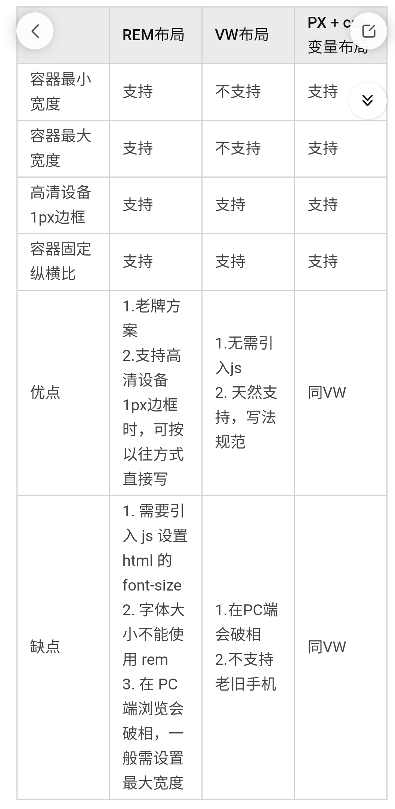

# 移动端适配

- [自适应方案](#%E8%87%AA%E9%80%82%E5%BA%94%E6%96%B9%E6%A1%88)
- [1px问题](#1px%E9%97%AE%E9%A2%98)
- [图片适配和优化](#%E5%9B%BE%E7%89%87%E9%80%82%E9%85%8D%E5%92%8C%E4%BC%98%E5%8C%96)
- [总结](#%E6%80%BB%E7%BB%93)

---

要适配各终端的 CSS 像素以及不同 DPR 下，出现的 1 像素问题、图片高清问题等

## 自适应方案
rem,vh,media query




## 1px问题
我们以 CSS 为最小单位来写代码的，展示在屏幕上也是以 CSS 为最小单位来展示，也就是说在 DPR 为 2 时，我们想要模拟 1 单位物理像素是做不到的。(不支持0.5px)


既然 1 个 CSS 像素代表 2（DPR 为2）、3（DPR为3）物理像素，设备又不认识 0.5px 的写法，那就画 1px，然后想办法将宽度减少一半


+ 渐变实现: background-image: linear-gradient(to top, ,,,)
+ 使用缩放实现: transform: scaleY(0.333)
+ 使用图片实现: base64
+ 使用 SVG 实现: 嵌入 background url
+ border-image: 低端机下支持度不好

以上都是通过媒体查询实现

```css
@media only screen and (-webkit-min-device-pixel-ratio: 2),
    only screen and (min-device-pixel-ratio: 2) {}
@media only screen and (-webkit-min-device-pixel-ratio: 3),
    only screen and (min-device-pixel-ratio: 3) {
        
}
```

## 图片适配和优化
图像通常占据了网页上下载资源绝大部分，优化图像通常可以最大限度地减少从网站下载的字节数以及提高网站性能

通常可以，有一些通用的优化手段：为不同 DPR 屏幕提供最适合的图片尺寸

## 总结
+ 使用 rem 方案
+ 引入 amfe-flexible 库
+ 安装 px2rem 之类的 px 转 rem 工具
+ 配置 px2rem
+ 在项目中写 px ，输出时是 rem
+ 适用任何场景
+ 使用 vw 方案
+ 安装 px2vw 之类的 px 转 vw 工具
+ 配置 px2vw
+ 在项目中写 px，输出时是 vw
+ 适用任何场景
+ 使用 px 方案
+ 该怎么样就怎么写，不过因为有设计规划，按钮的大中小尺寸固定、icon 的尺寸有标准、TabBar 的高度也是写死的，当一切都有标准后，写页面就方便了
+ 例如
+ 左边固定 100 * 50，右边 flex 布局
+ 左边固定 100 * 50，右边 calc(100% - 100px)（使用 CSS3 中的 calc 计算）
+ 其他

[移动端适配目前最好的解决方案是什么？ - 知乎](https://www.zhihu.com/answer/2439525582)


> 更新: 2022-10-08 18:46:02  
> 原文: <https://www.yuque.com/viruspc/el3mi0/qgzkci>