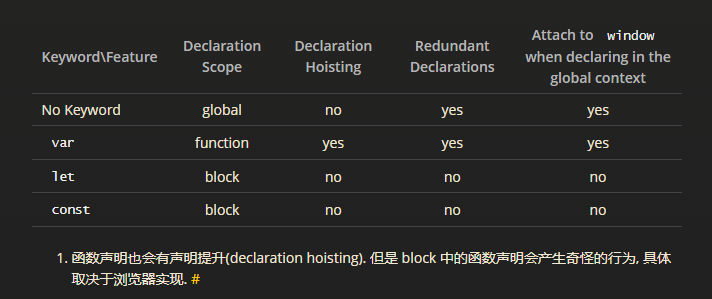
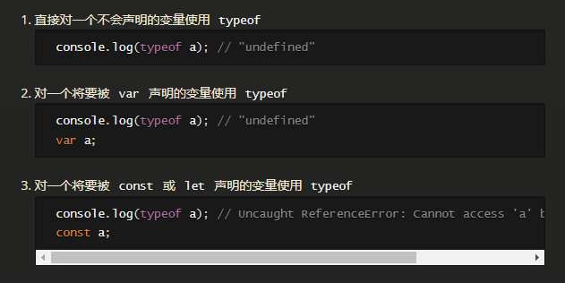
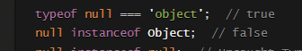
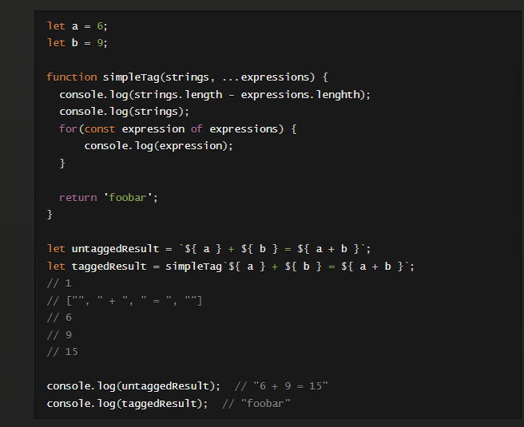
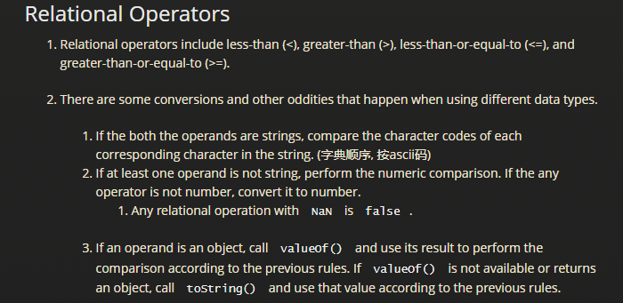

# Professional JS

1. script 类型：inline/external/dynamic
2. async vs defer: 
    1. async: 立即下载，不保证按顺序执行（谁先下完谁执行），不保证DOMContentLoaded之后执行 （所以async script 不要操作DOM）
    2. defer: 立即下载，按下载顺序执行，在DOMContentLoaded之后执行
3. 声明
4. 区分变量未声明和声明后未赋值。

5. Calling typeof null returns a value of “object”, as the special value null is considered to be an empty object reference. However, null instanceof Object will return false.
6. 
    1. 这是历史bug。instanceof是准确的。typeof是因为，object类型的机器码是000，和空指针全0机器码撞车了。
7. parseInt VS Number VS parseFloat:
    1. Number 不允许字符串中有非数字字符。 parseInt 允许字符串中有非数字字符（在第一个非空字符为数字或正负号的前提下）
    2. parseInt不能解析浮点数，只会取小数点之前的数字
    3. parseFloat 和 parseInt 差不多，但不支持八进制十六进制。
8. Template Literal Tag Functions: 
9. The purpose of a symbol is to be a guaranteed unique identifier for object properties that does not risk property collision.
10. Symbol("key"), Symbol.for("key"), Symbol.keyFor(symbol)
    1. for 与 keyFor 配合使用，在全局仓库进行操作。直接用Symbol创建不会放到全局仓库
11. Relational Operators
    1. 
12. ===与==的不同之处在于，===不会进行强制类型抓换。
    1. == 当两边类型不同时，undefined==null 为true，其他要强制类型转换为数字
13.  以下三者相等(假设test是一个async函数)
    1. const result = await test(1);
    2. const result = await Promise.resovle(1).then(test);
    3. const result = await new Promise((resolve) => resolve(1)).then(test);
    4. 

> 更新: 2025-06-07 18:41:56  
> 原文: <https://www.yuque.com/viruspc/el3mi0/xckdkl>