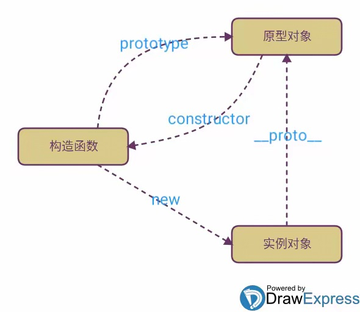

# 原型链

<https://zhuanlan.zhihu.com/p/35790971?share_code=20NrtLIrX1v2&utm_psn=1928634544711500643>

原型链是 **JavaScript 实现继承的机制**，通过 `__proto__` 属性（现规范为 `[[Prototype]]` 内部槽）形成对象间的**链式关联**，实现属性和方法的查找路径。

原型链是 JavaScript **实现继承的核心机制**。当访问对象属性时，引擎会沿 `__proto__` 链向上查找，直到 `Object.prototype`（终点为 `null`）。构造函数通过 `prototype` 共享方法，`instanceof` 通过原型链检测类型。ES6 的 `class` 本质是原型链的语法糖。

> 更新: 2025-07-15 18:00:19  
> 原文: <https://www.yuque.com/viruspc/el3mi0/yrbdrqdu1gg1dd51>