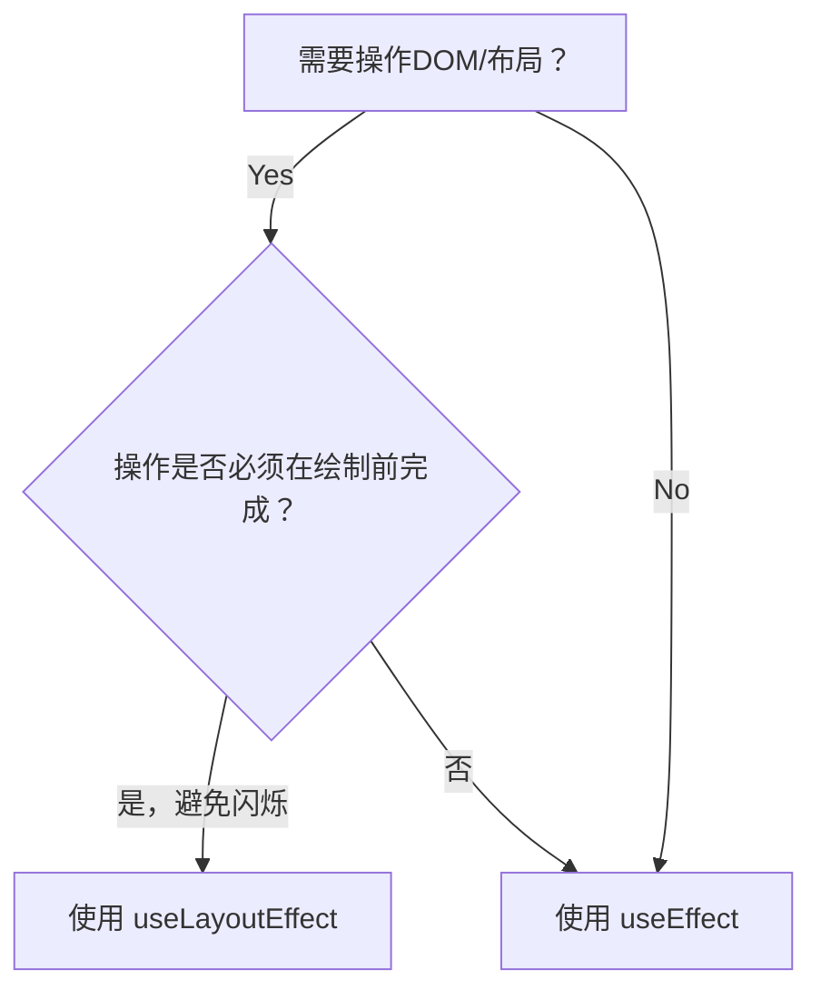

# 无标题文档

- [核心解决问题：视觉不一致性](#%E6%A0%B8%E5%BF%83%E8%A7%A3%E5%86%B3%E9%97%AE%E9%A2%98%E8%A7%86%E8%A7%89%E4%B8%8D%E4%B8%80%E8%87%B4%E6%80%A7)
- [与 `useEffect` 的关键区别](#%E4%B8%8E-useeffect-%E7%9A%84%E5%85%B3%E9%94%AE%E5%8C%BA%E5%88%AB)
- [典型使用场景](#%E5%85%B8%E5%9E%8B%E4%BD%BF%E7%94%A8%E5%9C%BA%E6%99%AF)
- [为什么需要同步执行？案例解析](#%E4%B8%BA%E4%BB%80%E4%B9%88%E9%9C%80%E8%A6%81%E5%90%8C%E6%AD%A5%E6%89%A7%E8%A1%8C%E6%A1%88%E4%BE%8B%E8%A7%A3%E6%9E%90)
- [注意事项](#%E6%B3%A8%E6%84%8F%E4%BA%8B%E9%A1%B9)
- [决策流程图](#%E5%86%B3%E7%AD%96%E6%B5%81%E7%A8%8B%E5%9B%BE)
- [总结](#%E6%80%BB%E7%BB%93)

---

在 React 中，`useLayoutEffect` 解决了 **需要在浏览器执行绘制（Paint）之前同步执行 DOM 操作或布局计算** 的问题。它的核心价值在于避免用户看到因异步更新导致的 **视觉闪烁（Flicker）或布局跳动（Layout Shift）**。

### 核心解决问题：视觉不一致性

当某些操作（如 DOM 测量、样式调整、动画初始化等）需要在渲染结果被绘制到屏幕前完成时，使用 `useEffect`（异步执行，在绘制后触发）会导致以下问题：

1. **用户看到中间状态**：例如，元素位置/尺寸突变造成的闪烁。
2. **布局跳动（CLS）**：页面元素在绘制后突然移动，影响用户体验。

***

### 与 `useEffect` 的关键区别

| **特性** | `useLayoutEffect` | `useEffect` |
| --- | --- | --- |
| **执行时机** | DOM 更新后，**浏览器绘制前**（同步） | DOM 更新后，**浏览器绘制后**（异步） |
| **阻塞绘制** | ✅ 会阻塞浏览器渲染 | ❌ 不阻塞渲染 |
| **适用场景** | 需要同步修改 DOM/布局的场景 | 数据获取、订阅等无需立即操作 DOM 的场景 |
| **性能影响** | 过度使用可能导致性能问题 | 更安全，不影响渲染流程 |

```jsx
function Example() {
  const [width, setWidth] = useState(0);
  const divRef = useRef(null);

  // 场景：测量 DOM 元素宽度并同步更新
  useLayoutEffect(() => {
6    const measuredWidth = divRef.current.offsetWidth;
    setWidth(measuredWidth); // 在绘制前更新，避免闪烁
  }, []);

  return <div ref={divRef}>Width: {width}px</div>;
}
```

***

### 典型使用场景

1. **DOM 尺寸/位置测量**\
   获取元素宽高、滚动位置等，用于后续布局计算。
2. **同步样式调整**\
   如根据测量结果动态设置元素位置（Tooltip 定位、响应式布局）。
3. **动画初始状态设置**\
   避免动画从默认状态突变到目标状态。
4. **依赖 DOM 的第三方库初始化**\
   某些库（如 D3.js）要求 DOM 就绪后立即操作。

***

### 为什么需要同步执行？案例解析

假设你需要实现一个「根据内容自动调整高度的文本框」：

```jsx
function AutoResizeTextarea() {
  const textareaRef = useRef(null);
  
  useLayoutEffect(() => {
    const textarea = textareaRef.current;
    // 1. 测量内容高度
    textarea.style.height = 'auto';
    const newHeight = textarea.scrollHeight + 'px';
    // 2. 同步设置高度
    textarea.style.height = newHeight;
  }, [value]);

  return <textarea ref={textareaRef} value={value} />;
}
```

* 若使用 `useEffect`：用户会先看到文本框默认高度，然后突然跳变到新高度。
* 使用 `useLayoutEffect`：高度调整在绘制前完成，用户感知不到跳变。

***

### 注意事项

1. **服务端渲染（SSR）警告**\
   `useLayoutEffect` 在 SSR 中会触发 React 警告（因无 DOM 环境），解决方案：
   * 条件执行：`if (typeof window !== 'undefined') { useLayoutEffect(...) }`
   * 用 `useEffect` 替代（牺牲同步性）
2. **性能风险**\
   内部逻辑应轻量，避免长时间阻塞渲染（大计算量操作需用 `useEffect`）。
3. **依赖项处理**\
   与 `useEffect` 一样需正确处理依赖数组，避免无限循环。

***

### 决策流程图



### 总结

`useLayoutEffect` 是 React 为 **解决浏览器绘制前的同步布局需求** 提供的底层 API。它的存在填补了 `useEffect` 异步执行导致的视觉不一致性缺口，但需谨慎使用以避免性能问题。在面试中回答此问题时，务必强调 **执行时机** 和 **真实场景案例**（如 DOM 测量），这是面试官考察的核心点。


> 更新: 2025-06-04 18:01:33  
> 原文: <https://www.yuque.com/viruspc/el3mi0/zyyqfsu7b7uqqcci>