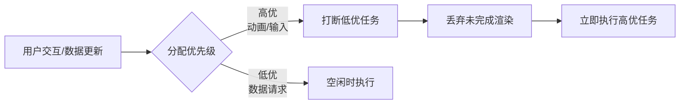

# Fiber

- [核心答案（30秒版）](#%E6%A0%B8%E5%BF%83%E7%AD%94%E6%A1%8830%E7%A7%92%E7%89%88)
- [深度解析（3分钟版）](#%E6%B7%B1%E5%BA%A6%E8%A7%A3%E6%9E%903%E5%88%86%E9%92%9F%E7%89%88)
  * [1. **解决关键性能问题**（核心动机）](#1-%E8%A7%A3%E5%86%B3%E5%85%B3%E9%94%AE%E6%80%A7%E8%83%BD%E9%97%AE%E9%A2%98%E6%A0%B8%E5%BF%83%E5%8A%A8%E6%9C%BA)
  * [2. **重构数据结构**（实现基础）](#2-%E9%87%8D%E6%9E%84%E6%95%B0%E6%8D%AE%E7%BB%93%E6%9E%84%E5%AE%9E%E7%8E%B0%E5%9F%BA%E7%A1%80)
  * [3. **双缓冲机制**（核心优化）](#3-%E5%8F%8C%E7%BC%93%E5%86%B2%E6%9C%BA%E5%88%B6%E6%A0%B8%E5%BF%83%E4%BC%98%E5%8C%96)
  * [4. **分阶段渲染**（核心流程）](#4-%E5%88%86%E9%98%B6%E6%AE%B5%E6%B8%B2%E6%9F%93%E6%A0%B8%E5%BF%83%E6%B5%81%E7%A8%8B)
  * [5. **优先级调度**（响应式关键）](#5-%E4%BC%98%E5%85%88%E7%BA%A7%E8%B0%83%E5%BA%A6%E5%93%8D%E5%BA%94%E5%BC%8F%E5%85%B3%E9%94%AE)
  * [6. **对开发者的价值**](#6-%E5%AF%B9%E5%BC%80%E5%8F%91%E8%80%85%E7%9A%84%E4%BB%B7%E5%80%BC)
- [面试金句](#%E9%9D%A2%E8%AF%95%E9%87%91%E5%8F%A5)
- [常见追问及应对](#%E5%B8%B8%E8%A7%81%E8%BF%BD%E9%97%AE%E5%8F%8A%E5%BA%94%E5%AF%B9)

---

从面试角度回答 React Fiber 的核心职责，可以聚焦以下关键点（按重要性排序）：

***

### 核心答案（30秒版）

**Fiber 的核心使命：实现可中断的异步渲染，解决主线程阻塞问题。** 它通过：

1. **将虚拟 DOM 拆解为可暂停/恢复的工作单元**（Fiber 节点）
2. **引入优先级调度机制**（高优任务如动画/输入优先响应）
3. **分离渲染过程为可中断的协调阶段（Reconciliation）和不可中断的提交阶段（Commit）**

***

### 深度解析（3分钟版）

#### 1. **解决关键性能问题**（核心动机）

* **传统 Stack Reconciler 的缺陷**：递归遍历 VDOM 会**阻塞主线程**，导致动画卡顿/输入延迟（掉帧）
* **Fiber 的突破**：将渲染拆分为**增量式任务**，利用浏览器的 `requestIdleCallback` 在空闲时间执行

#### 2. **重构数据结构**（实现基础）

* **Fiber 节点** = 增强版虚拟 DOM 节点，包含：

```typescript
interface Fiber {
  type: ComponentType | string,  // 组件类型
  stateNode: HTMLElement | null, // 关联的 DOM 节点
  return: Fiber | null,          // 父节点
  child: Fiber | null,            // 第一个子节点
  sibling: Fiber | null,          // 兄弟节点
  alternate: Fiber | null,        // 连接当前树和 workInProgress 树
  effectTag: Update | Placement | Deletion, // 标记变更类型
  lanes: Lanes,                   // 优先级车道
}
```

* **链表结构**：用 `child/sibling/return` 指针替代树结构，实现**非递归遍历**

#### 3. **双缓冲机制**（核心优化）

* **Current Tree**：当前渲染的树（用户可见）
* **WorkInProgress Tree**：内存中构建的新树
* **优势**：
  * 更新过程不阻塞用户交互
  * 更新失败可回滚（错误边界基础）
  * 复用未变更节点（`alternate` 指针）

#### 4. **分阶段渲染**（核心流程）

| **阶段** | **可中断？** | **主要工作** | 输出 |
| --- | --- | --- | --- |
| **Reconciliation** | ✅ 是 | 生成 Fiber 树，计算 Diff | 副作用列表（Effect List） |
| **Commit** | ❌ 否 | 同步执行 DOM 更新/生命周期 | 更新后的 UI |

#### 5. **优先级调度**（响应式关键）



* **优先级示例**：
  * 立即执行（Immediate）：文本框输入
  * 用户阻塞（UserBlocking）：按钮点击
  * 普通（Normal）：数据更新
  * 低（Low）：预加载
  * 空闲（Idle）：日志上报

#### 6. **对开发者的价值**

* **流畅性**：60fps 动画不卡顿
* **响应速度**：用户输入 < 100ms 响应
* **新特性基础**：为 Concurrent Mode/Suspense 提供底层支持

***

### 面试金句

> "Fiber 本质是 **React 的微型操作系统**，通过任务分片、优先级调度和双缓冲机制，将同步渲染革命为异步可中断渲染，解决了复杂应用的核心性能瓶颈。"

***

### 常见追问及应对

1. **为什么用链表结构？**\
   → 实现非递归遍历，支持暂停/恢复（递归调用栈无法中断）
2. **如何实现高优先级打断？**\
   → 通过 `lanes` 模型标记优先级，调度器会丢弃低优先级任务的未完成渲染
3. **Fiber 如何优化大型列表渲染？**\
   → 增量渲染避免主线程阻塞 + 优先级调度保证交互响应
4. **和传统 Diff 算法关系？**\
   → Fiber 是协调器（Reconciler）重构，Diff 算法在 Reconciliation 阶段运行

掌握这些要点，能系统展示对 React 架构演进的深刻理解。


> 更新: 2025-07-07 05:03:14  
> 原文: <https://www.yuque.com/viruspc/el3mi0/hg6czeai6ex4sbzk>