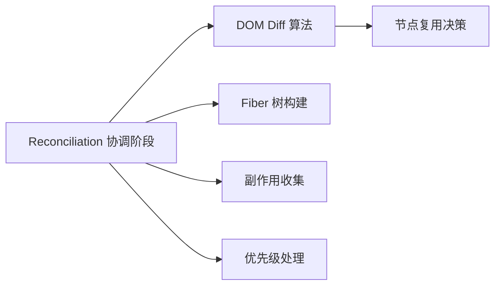
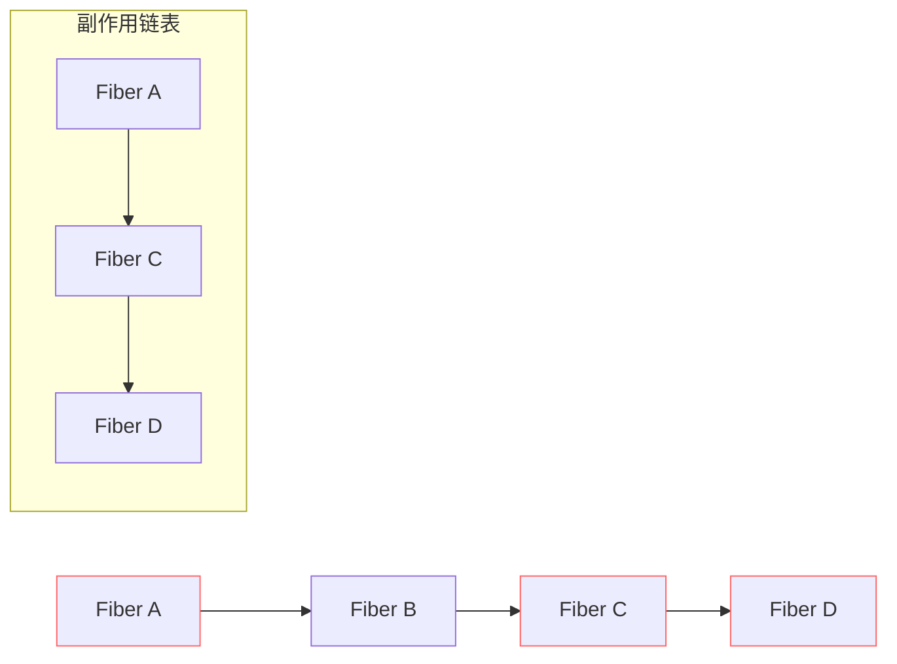

# Reconciliation 与 DOM Diff

- [🧩 Reconciliation 与 DOM Diff 的关系](#%F0%9F%A7%A9-reconciliation-%E4%B8%8E-dom-diff-%E7%9A%84%E5%85%B3%E7%B3%BB)
- [🔍 关键区别（DOM Diff vs Reconciliation）](#%F0%9F%94%8D-%E5%85%B3%E9%94%AE%E5%8C%BA%E5%88%ABdom-diff-vs-reconciliation)
- [🌰 具体工作流程（Reconciliation = Diff + More）](#%F0%9F%8C%B0-%E5%85%B7%E4%BD%93%E5%B7%A5%E4%BD%9C%E6%B5%81%E7%A8%8Breconciliation--diff--more)
- [💡 为什么说“不仅仅是 Diff”？](#%F0%9F%92%A1-%E4%B8%BA%E4%BB%80%E4%B9%88%E8%AF%B4%E4%B8%8D%E4%BB%85%E4%BB%85%E6%98%AF-diff)
- [✅ 总结：两者的包含关系](#%E2%9C%85-%E6%80%BB%E7%BB%93%E4%B8%A4%E8%80%85%E7%9A%84%E5%8C%85%E5%90%AB%E5%85%B3%E7%B3%BB)

---

可以这样理解，但**Reconciliation 不仅仅是 DOM diff，而是包含 DOM diff 的完整协调过程**。让我用更精确的表述来解释两者的关系：

***

### 🧩 Reconciliation 与 DOM Diff 的关系



1. **DOM Diff 是 Reconciliation 的核心算法**
   * 负责比较新旧虚拟 DOM 树的变化
   * 决定哪些节点需要更新/添加/删除
   * 输出最小变更集（**但这不是最终结果！**）
2. **Reconciliation 是包含 DOM Diff 的完整流程**
   * **树遍历**：深度优先遍历整个组件树
   * **节点处理**：创建/更新 Fiber 节点
   * **副作用标记**：收集需要执行的变更（如 `Placement`, `Update`, `Deletion`）
   * **优先级调度**：响应高优先级任务中断

***

### 🔍 关键区别（DOM Diff vs Reconciliation）

| **维度** | **DOM Diff** | **Reconciliation** |
| --- | --- | --- |
| **范围** | 算法核心（比较逻辑） | 完整流程（包含 Diff 的协调阶段） |
| **输出** | 变更列表 | Fiber 树 + 副作用链表 |
| **工作内容** | 纯计算（无副作用） | 构建数据结构 + 收集副作用 |
| **可中断性** | ❌ 纯计算不可中断 | ✅ 可被高优先级任务中断 |
| **实际案例** | `reconcileChildren()` 中的比较逻辑 | 从 `beginWork()` 到 `completeWork()` 的全过程 |

***

### 🌰 具体工作流程（Reconciliation = Diff + More）

```javascript
function performUnitOfWork(fiber) {
  // 1. DOM Diff 发生在这里（核心算法）
  const diffResult = reconcileChildren(fiber, newChildren);
  
  // 2. 构建 Fiber 树结构（超出 Diff 范围）
  if (fiber.child) {
    fiber.child.return = fiber; // 建立父子关系
  }
  
  // 3. 收集副作用（Diff 不负责的部分）
  if (fiber.effectTag !== NoEffect) {
    addToEffectList(fiber); // 添加到副作用链表
  }
  
  // 4. 优先级检查（可中断机制）
  if (shouldYieldToBrowser()) {
    return null; // 中断协调过程
  }
  
  // ...继续处理下一个节点
}
```

***

### 💡 为什么说“不仅仅是 Diff”？

1. **数据结构管理**\
   Reconciliation 需要构建完整的 Fiber 树结构（包含 `child`, `sibling`, `return` 指针）
2. **副作用收集系统**



标记需要更新的节点，形成高效遍历链表

3. **可中断机制集成**\
   每处理 5ms 检查浏览器是否需要控制权：

```javascript
while (workInProgress && !shouldYield()) {
  // 处理节点（包含 Diff 计算）
}
```

4. **生命周期处理**\
   在协调阶段触发：
   * `getDerivedStateFromProps`
   * `shouldComponentUpdate`
   * `render()`

***

### ✅ 总结：两者的包含关系

> **Reconciliation ≈ DOM Diff + Fiber 架构操作 + 副作用系统 + 优先级调度**

可以理解为：\
**DOM Diff 是 Reconciliation 的"大脑"（决策核心），而 Reconciliation 是包含大脑的完整"身体系统"（执行体系）。**

当面试官问这个问题时，最佳回答是：\
**“Reconciliation 阶段的核心工作是 DOM diff，但它还包含构建 Fiber 树、收集副作用、响应优先级调度等更完整的协调流程，这些共同构成了 React 的增量渲染能力。”**


> 更新: 2025-07-07 05:35:12  
> 原文: <https://www.yuque.com/viruspc/el3mi0/wo4ox86n8q3bhv1l>