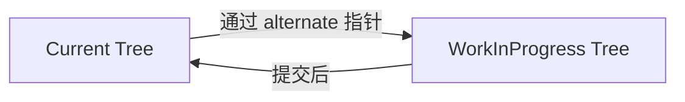
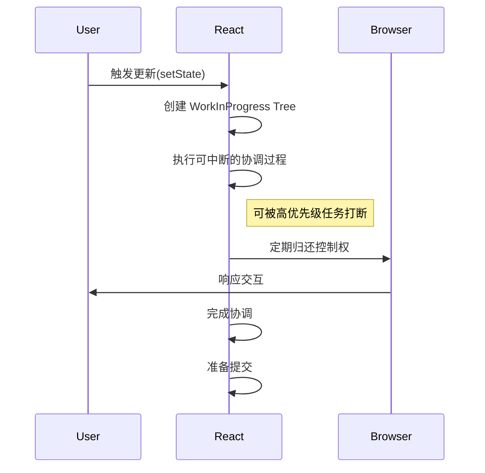
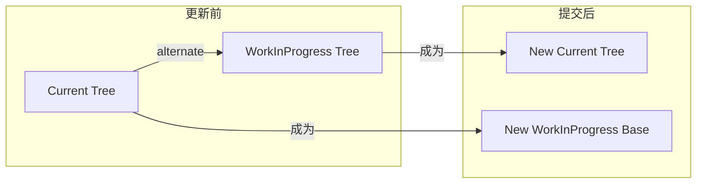
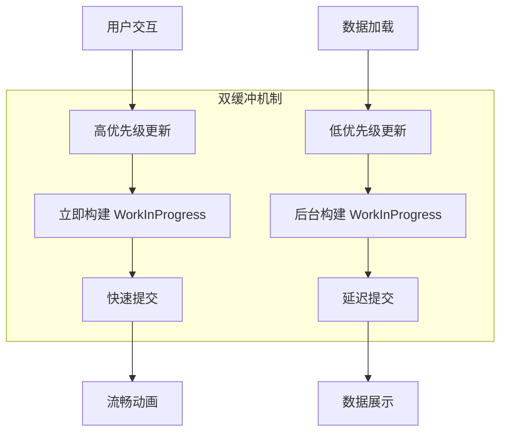

# 无标题文档

- [React 双缓冲机制详解](#react-%E5%8F%8C%E7%BC%93%E5%86%B2%E6%9C%BA%E5%88%B6%E8%AF%A6%E8%A7%A3)
  * [核心概念](#%E6%A0%B8%E5%BF%83%E6%A6%82%E5%BF%B5)
    + [两棵 Fiber 树](#%E4%B8%A4%E6%A3%B5-fiber-%E6%A0%91)
  * [工作机制](#%E5%B7%A5%E4%BD%9C%E6%9C%BA%E5%88%B6)
    + [1. 初始化阶段](#1-%E5%88%9D%E5%A7%8B%E5%8C%96%E9%98%B6%E6%AE%B5)
    + [2. 更新触发](#2-%E6%9B%B4%E6%96%B0%E8%A7%A6%E5%8F%91)
    + [3. 树构建过程](#3-%E6%A0%91%E6%9E%84%E5%BB%BA%E8%BF%87%E7%A8%8B)
    + [4. 协调过程 (Reconciliation)](#4-%E5%8D%8F%E8%B0%83%E8%BF%87%E7%A8%8B-reconciliation)
    + [5. 提交阶段 (Commit)](#5-%E6%8F%90%E4%BA%A4%E9%98%B6%E6%AE%B5-commit)
    + [6. 角色互换](#6-%E8%A7%92%E8%89%B2%E4%BA%92%E6%8D%A2)
  * [关键优势](#%E5%85%B3%E9%94%AE%E4%BC%98%E5%8A%BF)
    + [1. 无撕裂更新](#1-%E6%97%A0%E6%92%95%E8%A3%82%E6%9B%B4%E6%96%B0)
    + [2. 安全中断](#2-%E5%AE%89%E5%85%A8%E4%B8%AD%E6%96%AD)
    + [3. 资源复用](#3-%E8%B5%84%E6%BA%90%E5%A4%8D%E7%94%A8)
    + [4. 错误隔离](#4-%E9%94%99%E8%AF%AF%E9%9A%94%E7%A6%BB)
  * [实际应用场景](#%E5%AE%9E%E9%99%85%E5%BA%94%E7%94%A8%E5%9C%BA%E6%99%AF)
    + [并发渲染模式](#%E5%B9%B6%E5%8F%91%E6%B8%B2%E6%9F%93%E6%A8%A1%E5%BC%8F)
    + [动画流畅性](#%E5%8A%A8%E7%94%BB%E6%B5%81%E7%95%85%E6%80%A7)
  * [性能优化](#%E6%80%A7%E8%83%BD%E4%BC%98%E5%8C%96)
    + [复用策略](#%E5%A4%8D%E7%94%A8%E7%AD%96%E7%95%A5)
    + [内存管理](#%E5%86%85%E5%AD%98%E7%AE%A1%E7%90%86)
  * [总结](#%E6%80%BB%E7%BB%93)

---

# React 双缓冲机制详解
双缓冲机制是 React Fiber 架构实现**无撕裂渲染**和**并发更新**的核心设计，它通过维护两棵 Fiber 树来确保渲染过程的平滑过渡。

## 核心概念
### 两棵 Fiber 树
1. **当前树 (Current Tree)**
    - 代表当前已渲染到屏幕上的 UI 状态
    - 用户正在交互的 UI 对应这棵树
2. **工作进度树 (WorkInProgress Tree)**
    - 内存中正在构建的新 UI 状态
    - 所有更新都在此树上进行，不影响当前显示



## 工作机制
### 1. 初始化阶段
```jsx
// 首次渲染时创建
const root = ReactDOM.createRoot(document.getElementById('root'));
root.render(<App />);
```

+ 创建单棵 Fiber 树作为 Current Tree
+ 此时 WorkInProgress Tree 不存在

### 2. 更新触发
当状态更新时：

```javascript
// 内部调度器工作
function scheduleUpdateOnFiber(fiber) {
  // 1. 克隆当前树作为 WorkInProgress Tree
  const workInProgress = createWorkInProgress(fiber.current);
  
  // 2. 开始构建更新
  performConcurrentWorkOnRoot(workInProgress);
}
```

### 3. 树构建过程
```javascript
function createWorkInProgress(current, pendingProps) {
  let workInProgress = current.alternate;
  
  if (!workInProgress) {
    // 创建新节点并建立双缓冲链接
    workInProgress = createFiber(
      current.tag,
      pendingProps,
      current.key,
      current.mode
    );
    
    // 建立双缓冲关联
    workInProgress.alternate = current;
    current.alternate = workInProgress;
  }
  
  // 复制其他必要属性
  workInProgress.child = current.child;
  workInProgress.memoizedProps = current.memoizedProps;
  // ...
  
  return workInProgress;
}
```

### 4. 协调过程 (Reconciliation)
在 WorkInProgress Tree 上执行：

+ 组件渲染
+ Diff 计算
+ Effect 收集
+ **可随时中断**，不会影响 Current Tree



### 5. 提交阶段 (Commit)
```javascript
function commitRoot(root) {
  // 不可中断的同步操作
  const finishedWork = root.finishedWork;
  
  // 应用所有变更
  commitBeforeMutationEffects();
  commitMutationEffects(); // DOM 更新发生在这里
  commitLayoutEffects();
  
  // 关键：切换树指针
  root.current = finishedWork;
  
  // 清理工作
  root.finishedWork = null;
}
```

### 6. 角色互换
提交完成后：

+ WorkInProgress Tree 成为新的 Current Tree
+ 旧的 Current Tree 成为下次更新的 WorkInProgress Tree 基础



## 关键优势
### 1. 无撕裂更新
+ 所有 DOM 更新在提交阶段**一次性应用**
+ 用户不会看到中间状态

### 2. 安全中断
+ 协调过程可随时中断
+ 当前树始终完整可用

### 3. 资源复用
```javascript
// 复用未变更的节点
if (current !== null && !didReceiveUpdate) {
  // 完全复用现有 Fiber
  return bailoutOnAlreadyFinishedWork(current, workInProgress);
}
```

### 4. 错误隔离
```jsx
// 错误边界保护
class ErrorBoundary extends React.Component {
  componentDidCatch(error) {
    // 错误发生时，Current Tree 仍保持可用状态
    this.setState({ hasError: true });
  }
}
```

## 实际应用场景
### 并发渲染模式
```jsx
// 使用并发特性
function App() {
  const [resource, setResource] = useState(null);
  
  useEffect(() => {
    // 低优先级更新
    fetchData().then(data => {
      startTransition(() => {
        setResource(data); // 使用双缓冲后台更新
      });
    });
  }, []);
  
  return (
    <Suspense fallback={<Spinner />}>
      <DataComponent resource={resource} />
    </Suspense>
  );
}
```

### 动画流畅性


## 性能优化
### 复用策略
1. **节点复用**：未变化的组件复用 Fiber 节点
2. **属性复用**：未变化的 props 直接复制
3. **子树复用**：当 key 相同时复用整个子树

### 内存管理
+ 两棵树共享未变更节点
+ 变更节点在提交后垃圾回收
+ 最小化内存分配

## 总结
React 的双缓冲机制通过维护两棵 Fiber 树：

1. **当前树**：保持稳定 UI，响应用户交互
2. **工作树**：内存中处理更新，可中断可恢复

在提交阶段通过**原子性切换**实现无撕裂更新，为 Concurrent React 提供了基础保障，使 React 能够：

+ 实现时间切片
+ 支持优先级调度
+ 保证渲染一致性
+ 提供优秀的用户体验

这种机制类似于游戏开发中的双缓冲渲染，确保画面流畅不撕裂，是 React 高性能渲染的基石设计。


> 更新: 2025-07-07 05:30:11  
> 原文: <https://www.yuque.com/viruspc/el3mi0/slzs8k6x3rg9ydh6>