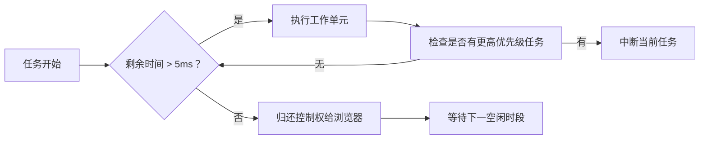

# scheduler

- [一、调度系统解决的三大核心问题](#%E4%B8%80%E8%B0%83%E5%BA%A6%E7%B3%BB%E7%BB%9F%E8%A7%A3%E5%86%B3%E7%9A%84%E4%B8%89%E5%A4%A7%E6%A0%B8%E5%BF%83%E9%97%AE%E9%A2%98)
- [二、调度系统核心机制](#%E4%BA%8C%E8%B0%83%E5%BA%A6%E7%B3%BB%E7%BB%9F%E6%A0%B8%E5%BF%83%E6%9C%BA%E5%88%B6)
  * [1. **任务优先级模型（Lane Model）**](#1-%E4%BB%BB%E5%8A%A1%E4%BC%98%E5%85%88%E7%BA%A7%E6%A8%A1%E5%9E%8Blane-model)
  * [2. **时间切片（Time Slicing）**](#2-%E6%97%B6%E9%97%B4%E5%88%87%E7%89%87time-slicing)
  * [3. **调度器工作流程**](#3-%E8%B0%83%E5%BA%A6%E5%99%A8%E5%B7%A5%E4%BD%9C%E6%B5%81%E7%A8%8B)
  * [4. **任务中断与恢复**](#4-%E4%BB%BB%E5%8A%A1%E4%B8%AD%E6%96%AD%E4%B8%8E%E6%81%A2%E5%A4%8D)
- [三、调度策略实例](#%E4%B8%89%E8%B0%83%E5%BA%A6%E7%AD%96%E7%95%A5%E5%AE%9E%E4%BE%8B)
- [四、底层 API 实现](#%E5%9B%9B%E5%BA%95%E5%B1%82-api-%E5%AE%9E%E7%8E%B0)
- [五、调度系统对开发的影响](#%E4%BA%94%E8%B0%83%E5%BA%A6%E7%B3%BB%E7%BB%9F%E5%AF%B9%E5%BC%80%E5%8F%91%E7%9A%84%E5%BD%B1%E5%93%8D)
- [六、调度系统演进](#%E5%85%AD%E8%B0%83%E5%BA%A6%E7%B3%BB%E7%BB%9F%E6%BC%94%E8%BF%9B)

---

React 的调度系统（Scheduler）是 Fiber 架构的核心引擎，负责管理所有渲染任务的优先级和执行时机。它的核心使命是：**在保证应用流畅交互的同时，最大化利用浏览器空闲时间**。以下是调度系统的关键解析：

***

### 一、调度系统解决的三大核心问题

1. **任务阻塞**：传统同步渲染会阻塞主线程，导致用户交互卡顿
2. **优先级混乱**：所有更新任务平等竞争，高优先级任务（如用户输入）无法及时响应
3. **资源浪费**：浏览器空闲时段未被充分利用

***

### 二、调度系统核心机制

#### 1. **任务优先级模型（Lane Model）**

React 定义 31 个优先级车道（Lanes）：

```javascript
export const SyncLane = 0b000000000000000000000000000001; // 同步任务
export const InputContinuousLane = 0b000000000000000000000000000100; // 连续输入
export const DefaultLane = 0b000000000000000000000000010000; // 普通更新
export const IdleLane = 0b100000000000000000000000000000; // 空闲任务
```

* **优先级规则**：\
  `用户交互 > 动画 > 普通数据更新 > 后台任务`

#### 2. **时间切片（Time Slicing）**



* 每个工作单元执行上限 **5ms**（避免阻塞渲染）
* 通过 `performance.now()` 精确计时

#### 3. **调度器工作流程**

```javascript
// 伪代码实现
function workLoop(deadline) {
  while (currentTask && deadline.timeRemaining() > 0) {
    currentTask = performUnitWork(currentTask); // 执行工作单元
  }
  
  if (currentTask) {
    requestIdleCallback(workLoop); // 继续调度
  } else {
    commitRoot(); // 提交更新
  }
}
```

#### 4. **任务中断与恢复**

* **中断场景**：
  * 更高优先级任务到达
  * 当前时间片用完
* **恢复机制**：
  * 使用 Fiber 节点的 `alternate` 指针保存进度
  * 通过链表结构快速定位中断点

***

### 三、调度策略实例

| **任务类型** | **优先级** | **调度行为** |
| --- | --- | --- |
| 文本框输入 | SyncLane | 立即执行，中断所有进行中任务 |
| 按钮点击 | InputContinuous | 当前任务完成后立即执行 |
| useState 更新 | DefaultLane | 空闲时执行，可被高优任务中断 |
| 离屏渲染 | OffscreenLane | 浏览器完全空闲时执行 |

***

### 四、底层 API 实现

1. **调度入口**：`scheduleCallback(priorityLevel, callback)`
2. **时间控制**：

```javascript
// 现代浏览器
requestIdleCallback(() => {...}, { timeout: 100 });

// 兼容方案：20ms 轮询 + MessageChannel
channel.port2.postMessage(null);
channel.port1.onmessage = handleWork;
```

3. **任务队列**：最小堆（Min-Heap）管理任务到期时间

***

### 五、调度系统对开发的影响

1. **性能提升**：确保动画流畅（60fps）和交互响应（<100ms）
2. **新特性支持**：
   * Suspense：暂停渲染等待数据
   * useTransition：低优先级状态更新
   * Offscreen：后台预渲染
3. **渲染行为可预测**：

```jsx
// 主动控制优先级
startTransition(() => {
  setResource(fetchData()); // 低优先级更新
});
```

***

### 六、调度系统演进

| **版本** | **调度机制** | **特点** |
| --- | --- | --- |
| React 15 | 递归同步渲染 | 阻塞主线程，无优先级 |
| React 16 | 基础调度器 | 时间切片，基础优先级控制 |
| React 18 | 并发调度器 | 全量并发渲染，车道优先级模型 |

> **面试金句**：\
> "React 调度系统本质是 **浏览器资源的智能分配系统**，通过优先级驱动的时间切片技术，在用户无感知的状态下平衡渲染性能和交互响应。"

掌握这些原理，能清晰解释为什么 React 应用在复杂场景下仍能保持流畅，这也是高级前端开发的区分点。


> 更新: 2025-07-07 05:26:51  
> 原文: <https://www.yuque.com/viruspc/el3mi0/auxaxuqn67ivo9wr>