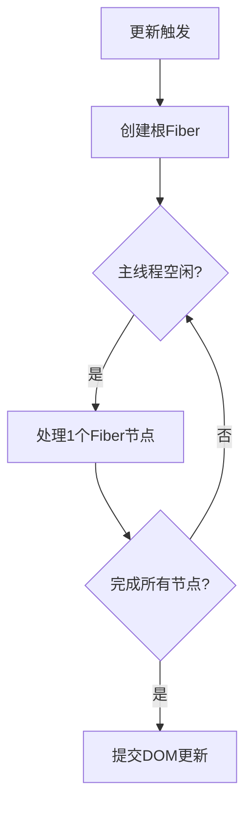

# 任务分片

- [切片](#%E5%88%87%E7%89%87)
    + [1. **问题根源：JavaScript 的单线程阻塞**](#1-%E9%97%AE%E9%A2%98%E6%A0%B9%E6%BA%90javascript-%E7%9A%84%E5%8D%95%E7%BA%BF%E7%A8%8B%E9%98%BB%E5%A1%9E)
    + [2. **任务切片的解决方案**](#2-%E4%BB%BB%E5%8A%A1%E5%88%87%E7%89%87%E7%9A%84%E8%A7%A3%E5%86%B3%E6%96%B9%E6%A1%88)
      - [✅ **步骤 1：拆分任务**](#%E2%9C%85-%E6%AD%A5%E9%AA%A4-1%E6%8B%86%E5%88%86%E4%BB%BB%E5%8A%A1)
      - [✅ **步骤 2：利用浏览器的空闲时间**](#%E2%9C%85-%E6%AD%A5%E9%AA%A4-2%E5%88%A9%E7%94%A8%E6%B5%8F%E8%A7%88%E5%99%A8%E7%9A%84%E7%A9%BA%E9%97%B2%E6%97%B6%E9%97%B4)
      - [✅ **步骤 3：优先响应用户交互**](#%E2%9C%85-%E6%AD%A5%E9%AA%A4-3%E4%BC%98%E5%85%88%E5%93%8D%E5%BA%94%E7%94%A8%E6%88%B7%E4%BA%A4%E4%BA%92)
    + [3. **性能提升的关键点**](#3-%E6%80%A7%E8%83%BD%E6%8F%90%E5%8D%87%E7%9A%84%E5%85%B3%E9%94%AE%E7%82%B9)
    + [4. **技术实现依赖**](#4-%E6%8A%80%E6%9C%AF%E5%AE%9E%E7%8E%B0%E4%BE%9D%E8%B5%96)
    + [5. **实际效果示例**](#5-%E5%AE%9E%E9%99%85%E6%95%88%E6%9E%9C%E7%A4%BA%E4%BE%8B)
    + [总结](#%E6%80%BB%E7%BB%93)
  * [任务](#%E4%BB%BB%E5%8A%A1)
    + [一、任务的核心构成](#%E4%B8%80%E4%BB%BB%E5%8A%A1%E7%9A%84%E6%A0%B8%E5%BF%83%E6%9E%84%E6%88%90)
    + [二、任务如何被切片？](#%E4%BA%8C%E4%BB%BB%E5%8A%A1%E5%A6%82%E4%BD%95%E8%A2%AB%E5%88%87%E7%89%87)
    + [三、任务切片的调度机制](#%E4%B8%89%E4%BB%BB%E5%8A%A1%E5%88%87%E7%89%87%E7%9A%84%E8%B0%83%E5%BA%A6%E6%9C%BA%E5%88%B6)
    + [四、任务 vs 传统更新流程](#%E5%9B%9B%E4%BB%BB%E5%8A%A1-vs-%E4%BC%A0%E7%BB%9F%E6%9B%B4%E6%96%B0%E6%B5%81%E7%A8%8B)
    + [五、具体示例分析](#%E4%BA%94%E5%85%B7%E4%BD%93%E7%A4%BA%E4%BE%8B%E5%88%86%E6%9E%90)
    + [六、为什么 Fiber 节点是理想的任务单元？](#%E5%85%AD%E4%B8%BA%E4%BB%80%E4%B9%88-fiber-%E8%8A%82%E7%82%B9%E6%98%AF%E7%90%86%E6%83%B3%E7%9A%84%E4%BB%BB%E5%8A%A1%E5%8D%95%E5%85%83)
    + [总结](#%E6%80%BB%E7%BB%93-1)

---

# 切片

React 通过 **任务切片（Task Slicing）** 优化性能的核心原理是 **避免长时间阻塞主线程**，从而提升用户体验。以下是详细解释：

***

### 1. **问题根源：JavaScript 的单线程阻塞**

* 浏览器中，JavaScript 执行、UI 渲染、用户交互共享同一个主线程。
* 当 React 同步渲染大型组件树时（例如大量 `setState` 或复杂计算），会长时间占用主线程（例如 100ms）。
* **后果**：
  * 用户交互（点击、滚动）无法及时响应，页面“卡死”。
  * 动画丢帧（浏览器每 16ms 需渲染一帧，否则卡顿）。

***

### 2. **任务切片的解决方案**

React 将同步的渲染任务拆分成多个 **可中断的小任务（切片）**，通过以下步骤优化：

#### ✅ **步骤 1：拆分任务**

* 将整个渲染过程分解为多个小单元（例如虚拟 DOM 的子树）。
* 每个切片执行时间控制在 **5ms 以内**（参考 [React 调度器](https://github.com/facebook/react/blob/main/packages/scheduler/src/forks/Scheduler.js)）。

#### ✅ **步骤 2：利用浏览器的空闲时间**

* 通过 `requestIdleCallback` 或 **优先级调度**（React Scheduler）执行任务。
* **逻辑**：

```javascript
// 伪代码：React 调度逻辑
while (任务未完成 && 当前帧有空闲时间) {
  执行一个任务切片();
}
```

* 如果当前帧时间不足，暂停任务并归还主线程。

#### ✅ **步骤 3：优先响应用户交互**

* 高优先级事件（如点击）可 **中断渲染任务**，立即处理交互。
* 示例：
  * 用户点击按钮 → 中断当前渲染 → 执行点击回调 → 再继续渲染。

***

### 3. **性能提升的关键点**

| **优化方向** | **传统同步渲染** | **任务切片（并发模式）** |
| --- | --- | --- |
| **主线程阻塞** | 长时间占用（不可中断） | 短时间分片（可中断） |
| **用户交互响应** | 延迟（卡顿） | 即时响应 |
| **动画/渲染流畅度** | 容易丢帧 | 保持 60fps 流畅 |
| **大型应用性能** | 随组件增长而恶化 | 保持稳定响应 |

***

### 4. **技术实现依赖**

* **并发模式（Concurrent Mode）**：React 18+ 的核心架构，启用任务切片。
* **API 支持**：
  * `useTransition()` / `startTransition()`：标记非紧急更新。
  * `<Suspense>`：配合数据加载时暂停切片。
* **调度算法**：React 内置的 [Scheduler](https://github.com/facebook/react/tree/main/packages/scheduler) 管理任务优先级。

***

### 5. **实际效果示例**

```jsx
// 传统同步渲染：一次性渲染 1000 个列表项（阻塞 200ms）
setItems(bigList); // 用户操作卡顿 200ms

// 使用任务切片：分片渲染（每次 5ms，共 20 个切片）
startTransition(() => {
  setItems(bigList); // 用户操作无卡顿，渲染在后台分片完成
});
```

***

### 总结

React 的任务切片通过 **将长任务拆解为微任务 + 动态调度**，实现了：

1. **主线程及时释放** → 用户交互零延迟。
2. **渲染任务可中断** → 高优先级操作优先执行。
3. **充分利用空闲时间** → 保持应用流畅性。

这本质上是将 **同步的 CPU 密集型任务** 转化为 **异步的协作式调度任务**，是 React 应对复杂应用性能挑战的核心策略。

## 任务

在 React 的任务切片（Task Slicing）机制中，"任务"指的是 **React 更新过程中的最小工作单元**，具体来说就是 **对单个 Fiber 节点的处理过程**。让我们深入解析：

***

### 一、任务的核心构成

每个"任务"包含以下核心操作：

1. **组件渲染**：调用函数组件或类组件的 `render()` 方法
2. **虚拟 DOM 计算**：生成新的 React 元素树
3. **Diff 比较**：比较新旧 Fiber 节点的变化（协调过程）
4. **副作用标记**：标记需要 DOM 操作的节点（如插入/更新/删除）

```javascript
// 伪代码：一个任务单元的工作内容
function processFiberNode(fiberNode) {
  // 1. 执行组件渲染
  const children = fiberNode.type(fiberNode.props);
  
  // 2. 创建子 Fiber 节点
  const newFiber = createNewFiber(children);
  
  // 3. Diff 算法比较
  const changes = diff(fiberNode, newFiber);
  
  // 4. 标记副作用
  if (changes) markForUpdate(fiberNode);
  
  return nextFiberToProcess; // 返回下一个待处理节点
}
```

***

### 二、任务如何被切片？

React 将整个更新过程分解为：

1. **任务单元**：单个 Fiber 节点的处理
2. **切片规则**：
   * 每个任务执行时间 ≤ 5ms（浏览器一帧的 1/3）
   * 通过 Fiber 链表结构实现可暂停/恢复



***

### 三、任务切片的调度机制

React 通过 **Scheduler** 管理任务队列：

1. **优先级队列**：

```javascript
const tasks = [
  { priority: Immediate, task: handleUserClick }, // 用户交互
  { priority: Normal,    task: renderComponent }   // 普通渲染
]
```

2. **执行控制**：

```javascript
while (currentTime < frameDeadline && taskQueue.length > 0) {
  performTask(taskQueue.pop()); // 执行单个任务
}
```

3. **中断恢复**：
   * 当更高优先级任务到来时，保存当前 Fiber 进度
   * 浏览器空闲时从断点继续执行

***

### 四、任务 vs 传统更新流程

| **特性** | 传统更新 | 任务切片 |
| --- | --- | --- |
| 执行单元 | 整个组件树 | 单个 Fiber 节点 |
| 可中断性 | ❌ 不可中断 | ✅ 任意节点可中断 |
| 耗时 | 可能数百 ms | ≤5ms/任务 |
| 用户交互阻塞 | 可能阻塞 | 几乎无阻塞 |
| 数据结构 | 递归树 | 链表结构（Fiber） |

***

### 五、具体示例分析

假设需要更新包含 1000 个 `<ListItem>` 的组件：

```jsx
function List() {
  return items.map(item => (
    <ListItem key={item.id} item={item} />
  ))
}
```

1. **传统模式**：
   * 一次性递归处理 1000 个节点（可能耗时 200ms）
   * 期间阻塞用户交互
2. **任务切片模式**：
   * 分解为 1000 个独立任务（每个节点一个任务）
   * 每帧处理 5-10 个节点（每任务 1-2ms）
   * 用户滚动/点击可随时中断渲染

***

### 六、为什么 Fiber 节点是理想的任务单元？

1. **链表结构**：子 → 兄弟 → 父的指针使恢复更高效

```javascript
fiber.child  // 第一个子节点
fiber.sibling // 下一个兄弟节点
fiber.return // 父节点
```

2. **原子性**：处理单个节点的时间可控
3. **状态隔离**：每个节点包含完整处理所需信息

```javascript
{
  stateNode,  // DOM 节点
  element,    // React 元素
  memoizedProps, // 上次的 props
  memoizedState, // 上次的 state
  // ... 其他元数据
}
```

***

### 总结

在 React 任务切片中：

1. **任务** = **单个 Fiber 节点的处理过程**
2. **切片原理**：将大型更新拆解为 ≤5ms 的微型任务
3. **性能提升关键**：
   * 通过微型任务避免主线程长阻塞
   * 高优先级任务可插队执行
   * 利用浏览器空闲时间（requestIdleCallback）
4. **底层支撑**：Fiber 架构的链表结构 + React Scheduler

> 💡 本质上是将 **"不可中断的递归渲染"** 转化为 **"可暂停/恢复的链式微任务队列"**


> 更新: 2025-07-04 05:22:34  
> 原文: <https://www.yuque.com/viruspc/el3mi0/xa90p9hyu4cf32df>