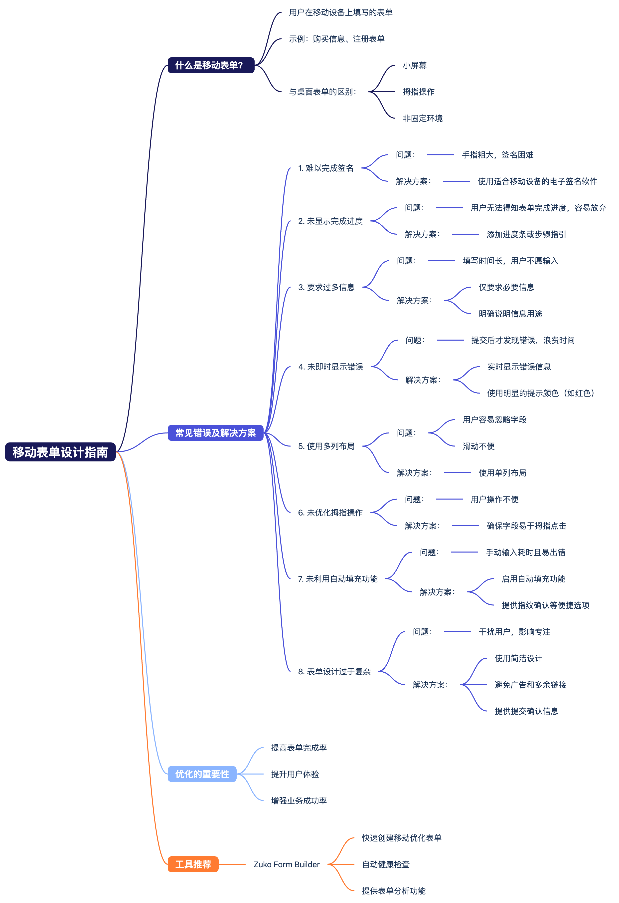

# A Beginner's Guide to Mobile Form Design (+Mistakes You Should be Aware of)

- [关键点](#%E5%85%B3%E9%94%AE%E7%82%B9)

---

[https://www.zuko.io/blog/a-beginners-guide-to-mobile-form-design-mistakes-you-should-be-aware-of](https://www.zuko.io/blog/a-beginners-guide-to-mobile-form-design-mistakes-you-should-be-aware-of)

随着人们越来越依赖移动设备，移动表单设计变得至关重要。文章探讨了优化移动表单设计时应避免的主要错误，并提供了相关建议，以提高表单完成率。

### 关键点
+ 移动表单需要考虑用户使用拇指、小键盘和小屏幕的特点，同时适应非传统环境如在火车上或步行时填写表单。
+ 避免难以完成的电子签名，确保使用能够准确识别指尖签名的软件。
+ 提供表单完成进度条以提高用户完成表单的动力。
+ 避免要求过多信息，仅收集必要数据以简化表单设计。
+ 清楚说明收集信息的用途以增强用户信任。
+ 实时显示错误信息以减少用户挫败感和表单放弃率。
+ 使用单列布局以适应移动屏幕的上下滚动习惯。
+ 优化表单设计以适应拇指操作，提高用户完成表单的舒适度。
+ 利用自动填充功能减少用户输入时间和错误。
+ 保持表单设计简洁，避免干扰用户完成任务。
+ 优化移动表单设计应优先考虑用户体验，以提高转化率。

> 更新: 2025-10-08 07:27:31  
> 原文: <https://www.yuque.com/viruspc/el3mi0/mr9gle0z3ut55gvi>