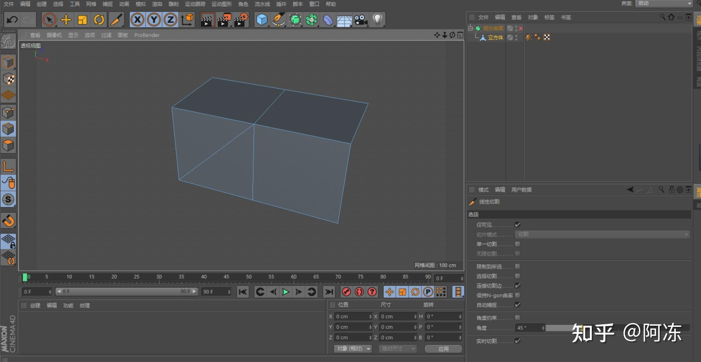
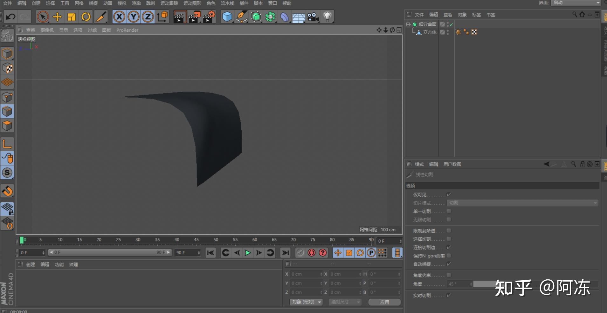

# 建模tips

1. 大多数场景下尽量采用四边形面建模。原因：
    1. 计算速度快。模型加载移动快。
    2. 方便修改编辑。切线可预测，方便使用切刀切线。
    3. 利用它的几何特点，用面的走势来描述对象的结构，例如拓扑头部时面的走势要符合肌肉的走势，这样在添加平滑组或是细分或是动画时才能有更合理更符合预期的结果。
    4. 曲面细分时不会出现奇怪的凸起。

曲面细分前:

曲面细分后：

[C4D常用的基础知识点 - InfoCG](https://www.infocg.cn/twjc/24772.html)

[C4D多边形建模为什么不能出现五边形三角形？ - 知乎](https://www.zhihu.com/answer/2211752619)

[C4D多边形建模为什么不能出现五边形三角形？ - 知乎](https://www.zhihu.com/answer/786849889)

> 更新: 2023-05-31 01:00:00  
> 原文: <https://www.yuque.com/viruspc/el3mi0/rgwhkgb2ygimt0rb>