# Galacean

- [Galacean Engine](#galacean-engine)
  * [Features](#features)
  * [Roadmap](#roadmap)
  * [引擎架构](#%E5%BC%95%E6%93%8E%E6%9E%B6%E6%9E%84)
- [Galacean Editor](#galacean-editor)
  * [重点方向](#%E9%87%8D%E7%82%B9%E6%96%B9%E5%90%91)
- [一些有意思的点](#%E4%B8%80%E4%BA%9B%E6%9C%89%E6%84%8F%E6%80%9D%E7%9A%84%E7%82%B9)

---

# Galacean Engine
## Features
+ 3D增强
    - 雾
    - 程序化天空/vs 天空盒
    - PBR材质增强
        * ClearCoat效果
        * 高光抗锯齿
        * ior
+ 2D增强
    - 精灵功能
        * 九宫绘制模式
        * 平铺绘制模式
    - 文字渲染器（单字符缓存，节省缓存）
+ shader提升
    - 全局替换shader
    - shader多pass
    - 文字自定义shader
    - Sprite自定义shader
+ 动画提升
    - 自定义任意属性动画
    - blend Shape提升
    - 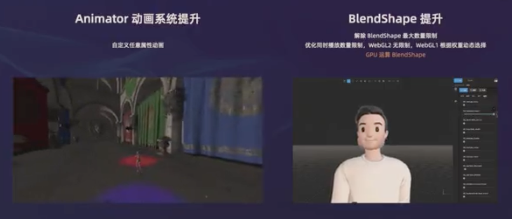
+ 物理增强
    - 新增动态碰撞器
    - 新增物理关节
    - 新增角色控制器
    - 脚本新增物理碰撞回调
    - 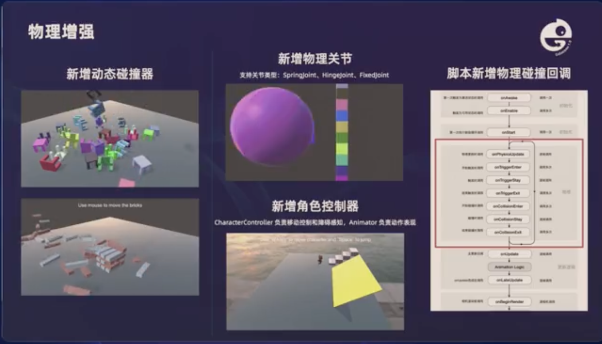
+ 新增input功能
    - 支持多种输入
    - 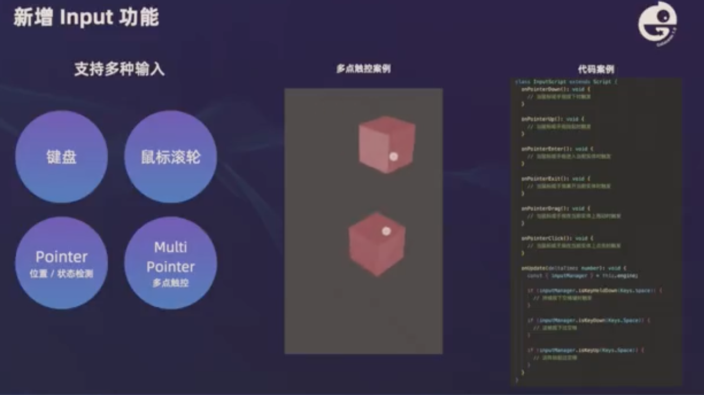
+ 资源增强
    - 资源结构增强
    - 资产loader增强
    - 稳定性增强（GPU为一种共享资源，具备回收控制权。会存在设备丢失的问题）
    - 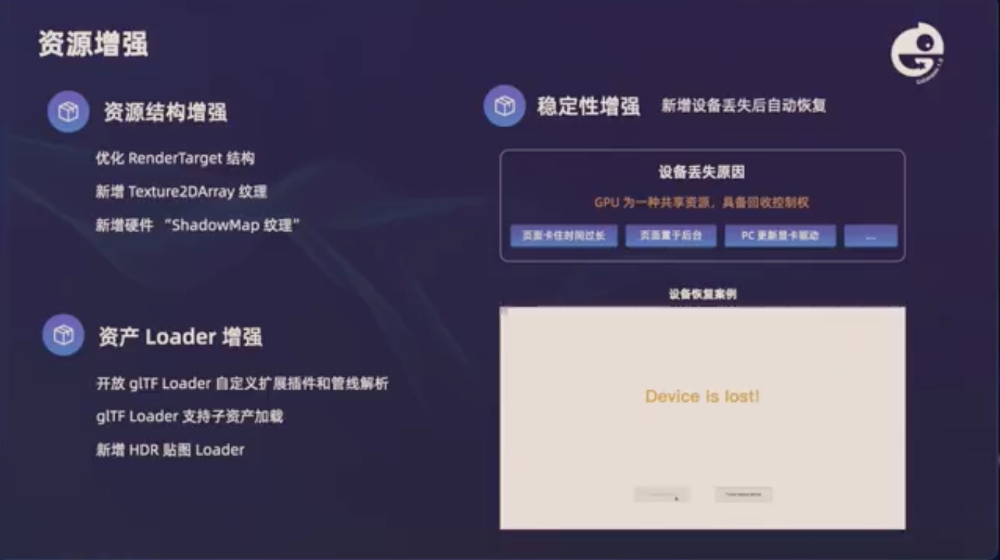
+ Engine toolkit 工具包（core 扩展）
    - 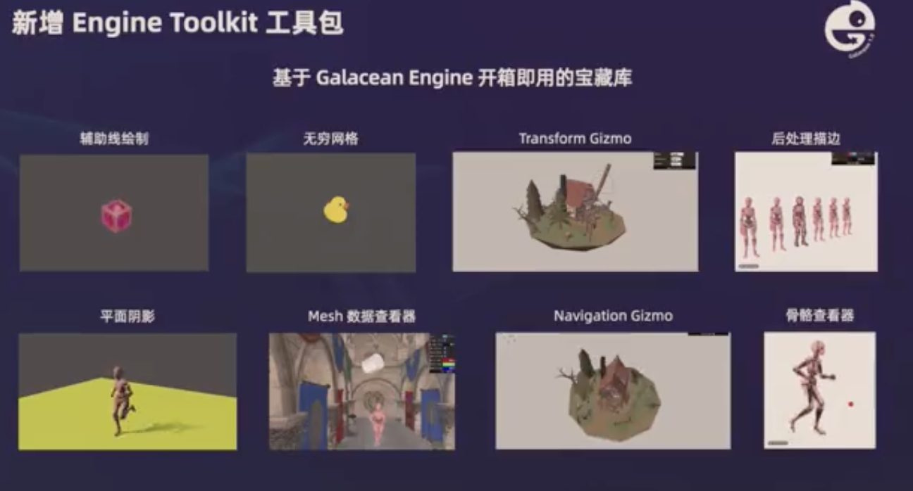

## Roadmap
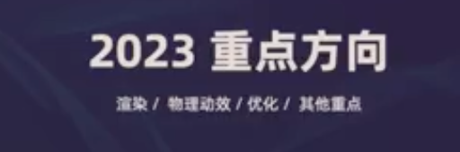

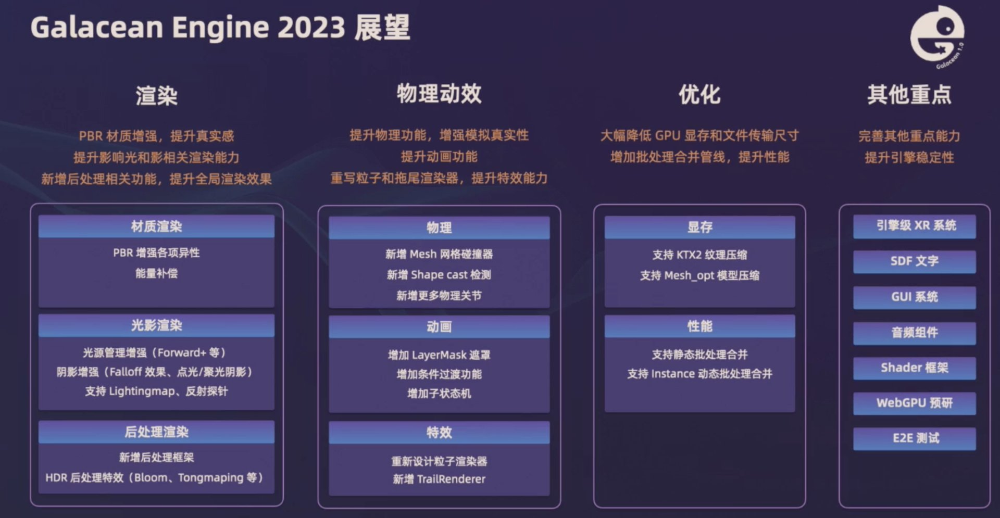

1. 继续增强 基于物理的 部分
2. GPU 显存性能优化
3. XR
4. GUI
5. 音频
6. 测试

有些图片格式适用于GPU

## 引擎架构
黄色是新增的

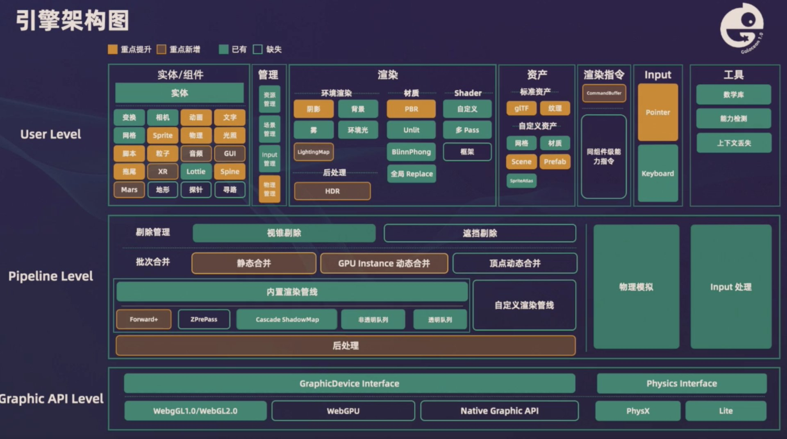

# Galacean Editor
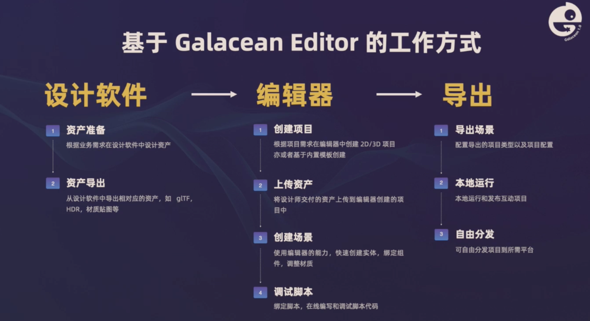

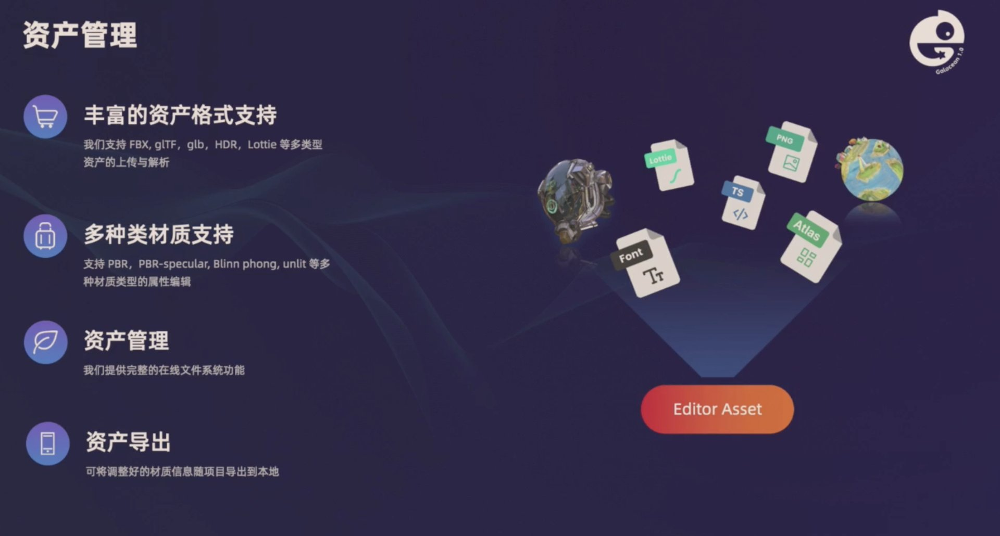

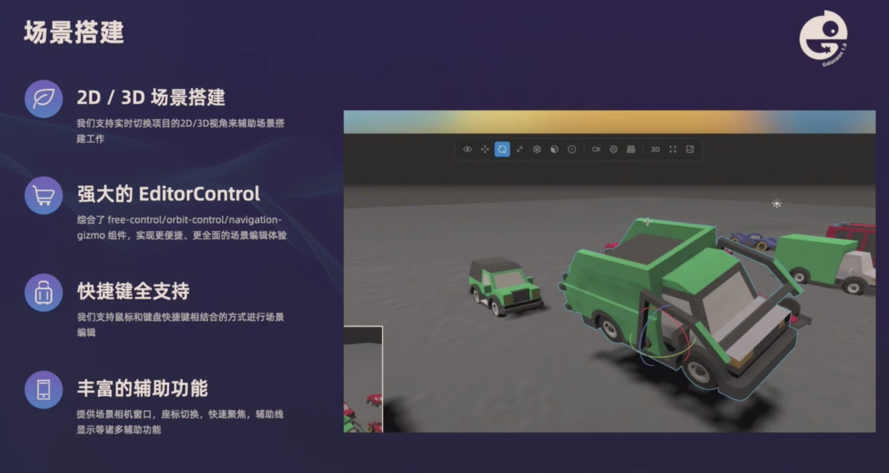

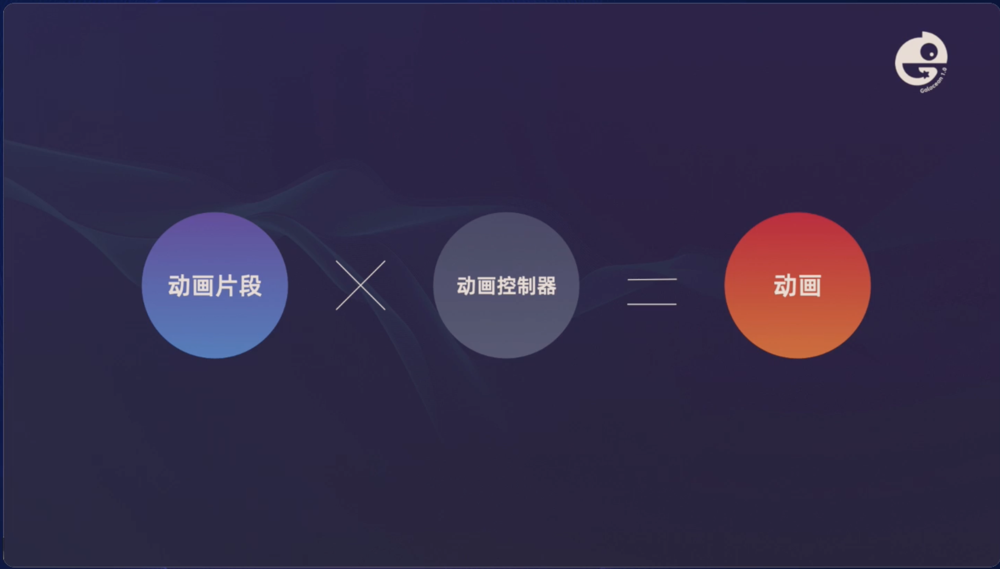

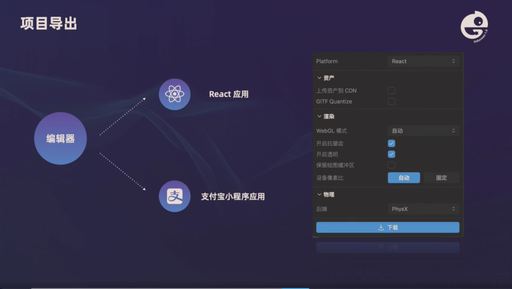

## 重点方向
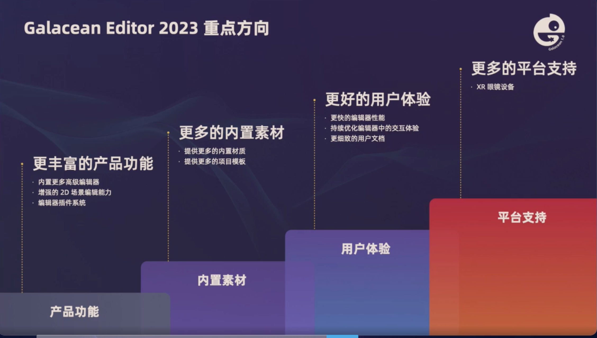

# 一些有意思的点

加了些基于物理的东西

1. 之前就做渲染、动画和资产了，2022年刚开始做物理和交互
2. 渲染
    1. 开始考虑大力建设2D能力
        1. 文字
    2.  
3. Animator 增强
    1. 状态机，子状态机？
4. 逐步淘汰webgl1，转webgl2
5. 交互
    1. 优点：
        1. 支持多种输入（键盘、鼠标滚轮、单点、多点）
        2. 实现一个新的交互：继承。用户只需写钩子
        3. 互动逻辑和脚本逻辑不能融为一体，互动是真循环
            1. 真循环 move 事件合并，压流
    2. 缺点：
        1. 不支持多模态
        2. 没有考虑到不同交互的状态机其实是不同的问题
            1. 不支持任意复杂度状态机
            2. 简单交互用这个会有冗余事件
6. 资源增强
    1. 稳定性增强（GPU为一种共享资源，具备回收控制权。会存在设备丢失的问题）

> 更新: 2023-11-16 12:55:08  
> 原文: <https://www.yuque.com/viruspc/el3mi0/xbz65whxnnzvfoq9>