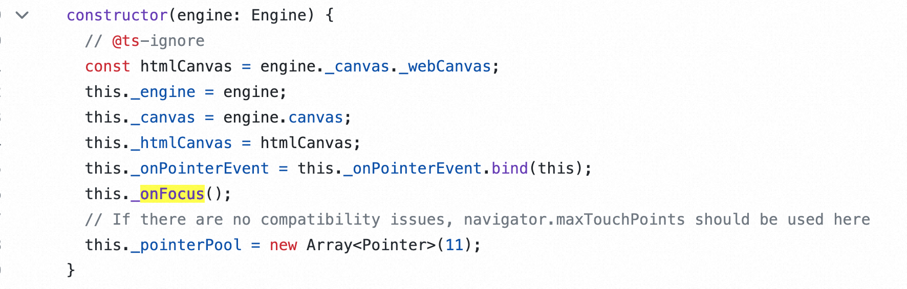
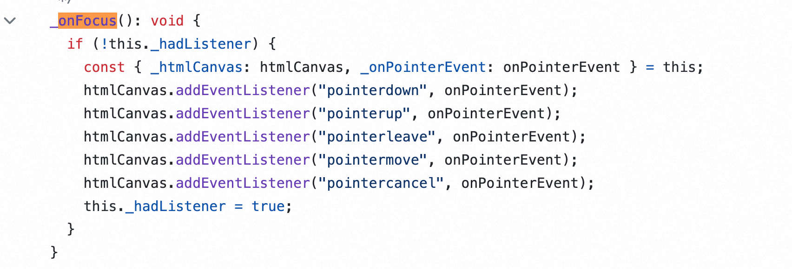
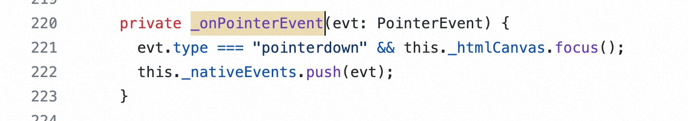
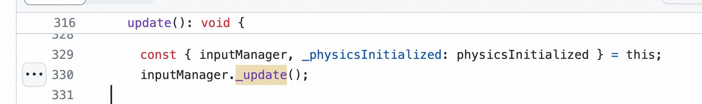
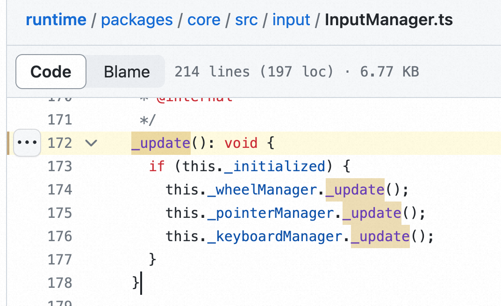
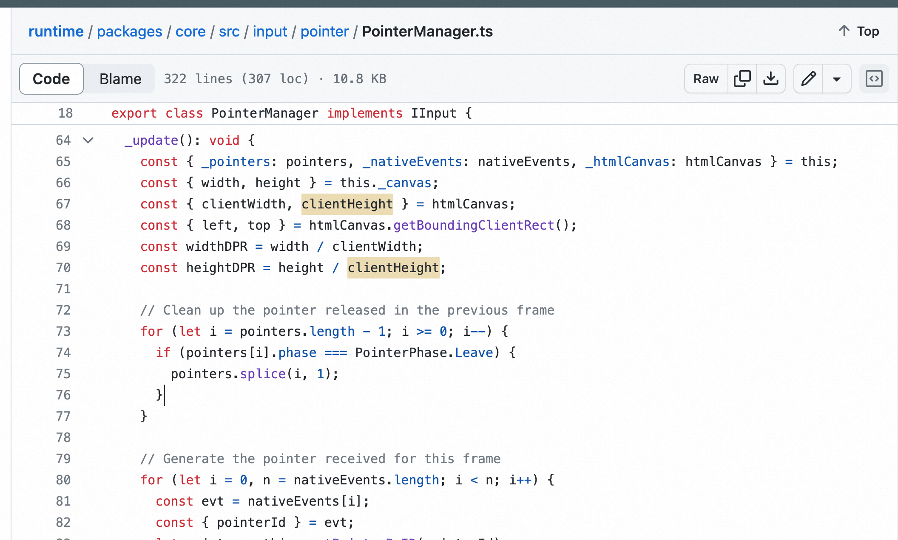
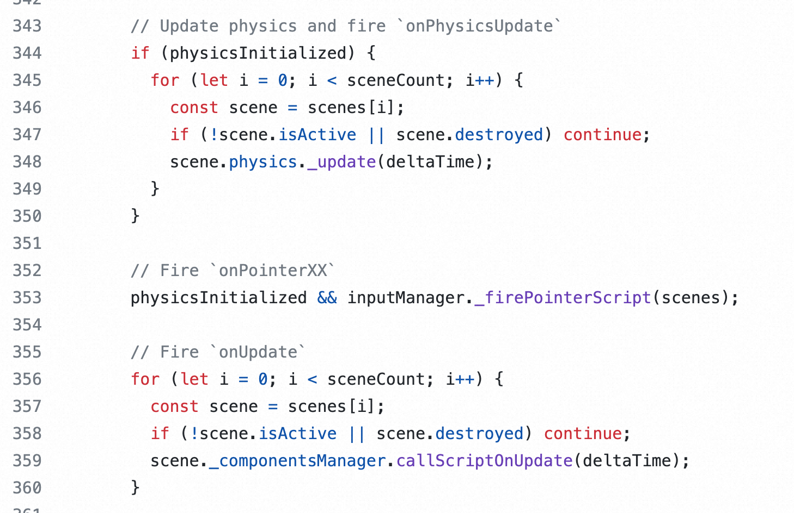
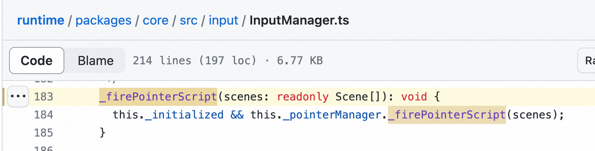
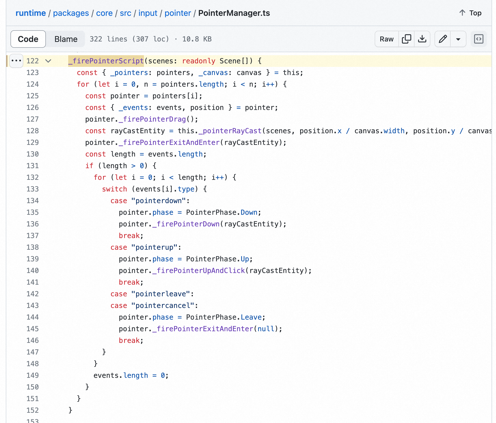
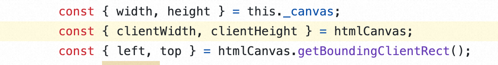

# InputManager

  * [PointerManager](#pointermanager)
    + [挂载监听事件，存储低级事件](#%E6%8C%82%E8%BD%BD%E7%9B%91%E5%90%AC%E4%BA%8B%E4%BB%B6%E5%AD%98%E5%82%A8%E4%BD%8E%E7%BA%A7%E4%BA%8B%E4%BB%B6)
    + [更新inputManager，计算生成高级事件](#%E6%9B%B4%E6%96%B0inputmanager%E8%AE%A1%E7%AE%97%E7%94%9F%E6%88%90%E9%AB%98%E7%BA%A7%E4%BA%8B%E4%BB%B6)
    + [触发脚本](#%E8%A7%A6%E5%8F%91%E8%84%9A%E6%9C%AC)
- [值得学习的地方](#%E5%80%BC%E5%BE%97%E5%AD%A6%E4%B9%A0%E7%9A%84%E5%9C%B0%E6%96%B9)
- [存在的问题](#%E5%AD%98%E5%9C%A8%E7%9A%84%E9%97%AE%E9%A2%98)
- [相关链接](#%E7%9B%B8%E5%85%B3%E9%93%BE%E6%8E%A5)

---

## PointerManager

### 挂载监听事件，存储低级事件
挂载监听事件，存储事件

1. constructor中，触发onFocus
    1. 
2. onFocus中，为 canvas 上的所有pointer事件，绑定 onPointerEvent回调
    1. 
3. onPointerEvent中，向this._nativeEvents push 事件
    1. 

### 更新inputManager，计算生成高级事件
engine update 中刚开始的时候，利用存储的事件更新inputManager

1. 更新inputManager
    1. 
2. 更新各个manager
    1. 
3. 生成高阶事件（nativeEvent转pointer）
    1. 

### 触发脚本
engine update 中的物理更新后，触发脚本

1. 在物理更新和更新之间，触发交互事件（动画跟新在更新之后）
    1. 
2. inputManager.firePointerScript
    1. 
3. pointerManager.firePointerScript
    1. 包含拾取逻辑
    2. 
4. 

# 值得学习的地方
转高级事件时，将client坐标转为画布坐标

[https://github.com/galacean/runtime/blob/1eaecf7917e75688133d69e91f3c96f580d9f64f/packages/core/src/input/pointer/PointerManager.ts#L67](https://github.com/galacean/runtime/blob/1eaecf7917e75688133d69e91f3c96f580d9f64f/packages/core/src/input/pointer/PointerManager.ts#L67)

# 存在的问题
# 相关链接
[https://github.com/galacean/runtime/blob/main/packages/core/src/input/pointer/PointerManager.ts#L114](https://github.com/galacean/runtime/blob/main/packages/core/src/input/pointer/PointerManager.ts#L114)

> 更新: 2023-11-23 03:36:23  
> 原文: <https://www.yuque.com/viruspc/el3mi0/uic0mrd6c02nsg3e>