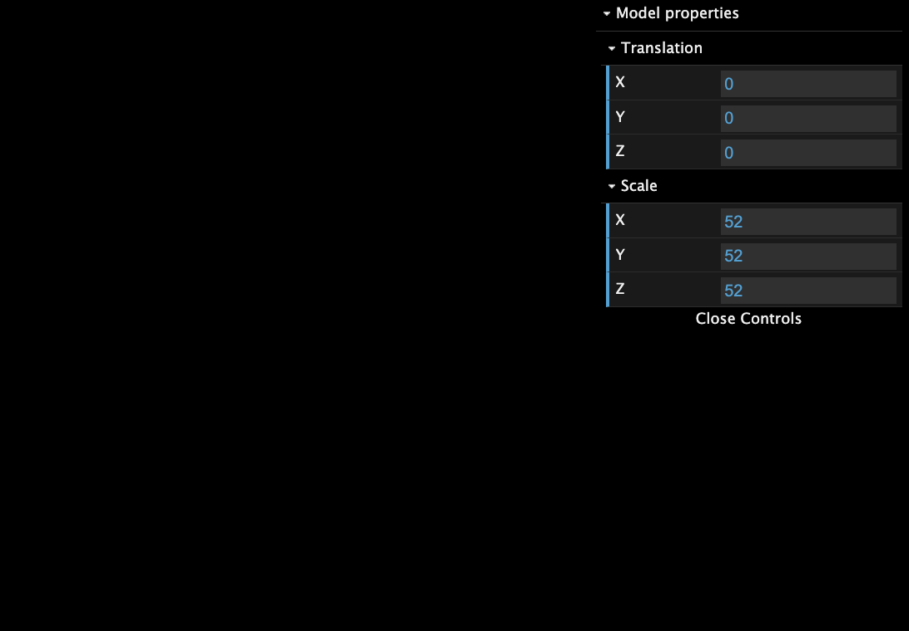
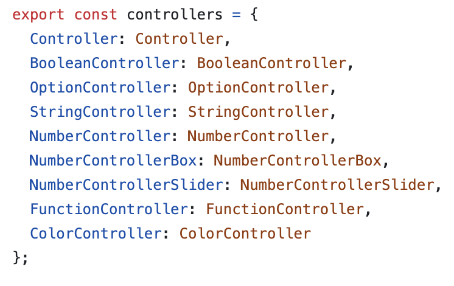
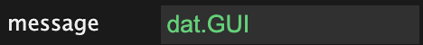
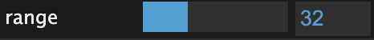
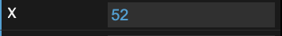
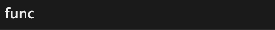
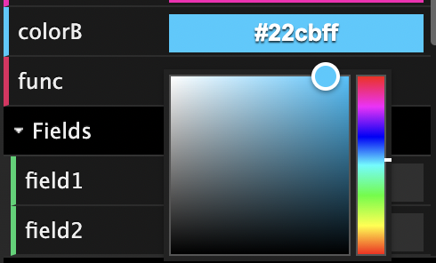

# Dat.GUI

- [Description](#description)
- [Basic Usage](#basic-usage)
  * [Example](#example)
  * [Result](#result)
- [Create Different Types of Controllers](#create-different-types-of-controllers)
  * [Mechanism](#mechanism)
  * [Controller Types](#controller-types)
    + [Settings](#settings)
    + [Boolean Controller](#boolean-controller)
    + [Option Controller](#option-controller)
    + [String Controller](#string-controller)
    + [Number Controller](#number-controller)
    + [NumberControllerSlider](#numbercontrollerslider)
    + [NumberControllerBox](#numbercontrollerbox)
    + [FunctionController](#functioncontroller)
    + [ColorController](#colorcontroller)
  * [Type Infer (Source Code)](#type-infer-source-code)

---

# Description

<font style="color:rgba(0, 0, 0, 0.87);">The </font>**<font style="color:rgba(0, 0, 0, 0.87);">Dat.GUI</font>**<font style="color:rgba(0, 0, 0, 0.87);"> is another very useful tool that we can use to learn about Three.js as it allows us to quickly add a very basic user interface which allows us to interact with our 3d scene and the objects within it.</font>

# <font style="color:rgba(0, 0, 0, 0.87);">Basic Usage</font>

## Example

From Games 202 homework0

```javascript
	// 0. 将参数都放在一个对象中
	const guiParams = {
		modelTransX: 0,
		modelTransY: 0,
		modelTransZ: 0,
    modelScaleX: 52,
		modelScaleY: 52,
		modelScaleZ: 52,
	}

	function createGUI() {
    // 1. 初始化 GUI 容器（分层的）
		const gui = new dat.gui.GUI();
		const panelModel = gui.addFolder('Model properties');
		const panelModelTrans = panelModel.addFolder('Translation');
    const panelModelScale = panelModel.addFolder('Scale');
    
    // 2. 为每个参数添加 controller。
    // add 有两个必选参数（操纵对象，操纵属性）和三个可选参数（min，max，step）。
    // add 会根据属性数据类型和传入的可选参数自动推断controller类型。
		const xController = panelModelTrans.add(guiParams, 'modelTransX').name('X');
		panelModelTrans.add(guiParams, 'modelTransY').name('Y');
		panelModelTrans.add(guiParams, 'modelTransZ').name('Z');
    panelModelScale.add(guiParams, 'modelScaleX').name('X');
		panelModelScale.add(guiParams, 'modelScaleY').name('Y');
		panelModelScale.add(guiParams, 'modelScaleZ').name('Z');

    // 3. 监听 controller 变化。
    xController.onChange((value) => {
			console.log('x changed: ', value);
		});
    
    // 4. 设置GUI状态。全部展开。
		panelModel.open();
		panelModelTrans.open();
		panelModelScale.open();
	}
	createGUI();
```

## Result



# Create Different Types of Controllers

## Mechanism

当调用`folder.add(params, property, ...)`时，`add`方法会根据`property`类型自动推断controller类型。特殊地，对于color controller，需要单独调用`folder.addColor`来创建。

## Controller Types



### Settings

```javascript
const settings = {
  checkbox: true,
  options:"Option 1",
  message: "dat.GUI",
  range: 50,
  X: 52,
  colorB: '#22CBFF', 
  func: function() 
  { 
      console.log(this.range);
  },
}
```

### Boolean Controller

当property是boolean类型时

```javascript
gui.add(settings, 'checkbox');
```


### Option Controller

当`add`的第三个参数是一个数组或一个对象时。

```javascript
gui.add(settings, 'options', [ 'Option 1', 'Option 2', 'Option 3' ] );
```


### String Controller

当 property 是 string 类型时

```javascript
gui.add(settings, 'message');
```



### Number Controller

当 property 是 number 类型时。包括 NumberControllerSlider 和 NumberControllerSlider 两种。

### NumberControllerSlider

当 property 是 number 类型，且设置了min/max （`add`的第3个和第4个参数存在）时。

```javascript
const [min, max, step] = [0, 100, 1]
gui.add(settings, 'range', min, max, step);
```



### NumberControllerBox

当 property 是 number 类型，且没有设置了 min/max （`add`的第3个和第4个参数不存在）时

looks the same as number controller slider, but with step limitation.

```javascript
gui.add(settings, 'X');
```



### FunctionController

当 property 是 function 类型时

Click to trigger function

```javascript
gui.add(settings, 'func');
```



### ColorController

当调用`addColor`而不是`add`时

```javascript
gui.addColor(settings, 'colorB');
```



## Type Infer (Source Code)

<https://github.com/dataarts/dat.gui/blob/19c4725d03456ce5049e7131907fc0470326d5ae/src/dat/controllers/ControllerFactory.js#LL22C1-L65C1>

```javascript

// common is an util object

const ControllerFactory = function(object, property) {
  const initialValue = object[property];

  // Providing options?
  if (common.isArray(arguments[2]) || common.isObject(arguments[2])) {
    return new OptionController(object, property, arguments[2]);
  }

  // Providing a map?
  if (common.isNumber(initialValue)) {
    // Has min and max? (slider)
    if (common.isNumber(arguments[2]) && common.isNumber(arguments[3])) {
      // has step?
      if (common.isNumber(arguments[4])) {
        return new NumberControllerSlider(object, property,
          arguments[2], arguments[3], arguments[4]);
      }

      return new NumberControllerSlider(object, property, arguments[2], arguments[3]);
    }

    // number box
    if (common.isNumber(arguments[4])) { // has step
      return new NumberControllerBox(object, property,
        { min: arguments[2], max: arguments[3], step: arguments[4] });
    }
    return new NumberControllerBox(object, property, { min: arguments[2], max: arguments[3] });
  }

  if (common.isString(initialValue)) {
    return new StringController(object, property);
  }

  if (common.isFunction(initialValue)) {
    return new FunctionController(object, property, '');
  }

  if (common.isBoolean(initialValue)) {
    return new BooleanController(object, property);
  }

  return null;
};

```

* [API](https://github.com/dataarts/dat.gui/blob/master/API.md#GUI+name)
* [Live Demo](https://codepen.io/viruspc/pen/PoyXoxK)


> 更新: 2023-05-21 11:20:03  
> 原文: <https://www.yuque.com/viruspc/el3mi0/rl8aeaf76wv7pogw>