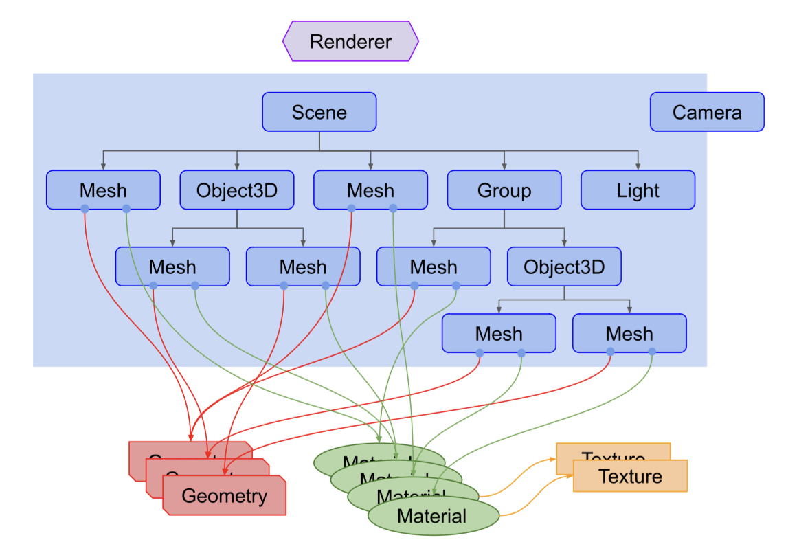
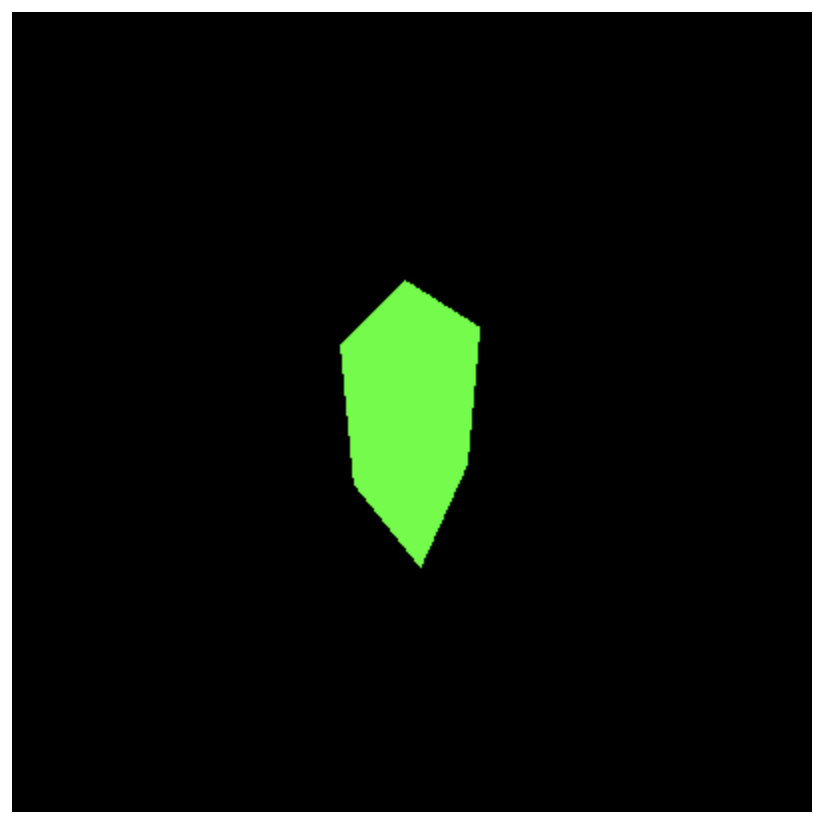

# Getting Started

- [Creating A Scene](#creating-a-scene)
- [Creating Text](#creating-text)
- [Loading 3D models](#loading-3d-models)
- [References](#references)

---

# Creating A Scene
1. 3个基本的事物： Scene/Camera/Renderer。其中最核心的是 Renderer。
2. Render: 
    1. 向 Renderer 传入一个 Scene 和一个 Camera，Renderer 会将结果渲染到画布上。
    2. 注意，Light 虽然在 Unity 中被单独拎出来，但在 Three.js 中是 Scene 的一部分。
    3. Camera 既可以独立出来，又可以放到 Scene 中。
3. Scene: 
    1. Scene 不仅代表 scenegraph 的根节点，还包含背景颜色、雾等属性。
    2. Scene 中充满了 Object3D (Mesh、Group、Line、Light、**Camera** 等等)，一个 Mesh 由 Geometry 和 Material 组成。Material 又包含 Texture。Geometry 存储几何顶点/面信息，Material 存储颜色信息。
    3. 




```typescript
export function render(canvas: HTMLCanvasElement): Controller[] {
  // Creating the scene

  // Three basic things: scene, camera and renderer
  // so that we can render the scene with camera.
  const scene = new THREE.Scene();
  const camera = new THREE.PerspectiveCamera( 75, window.innerWidth / window.innerHeight, 0.1, 1000 );
  //By default, when we call scene.add(), the thing we add will be added to the coordinates (0,0,0).
  // This would cause both the camera and the cube to be inside each other. 
  // To avoid this, we simply move the camera out a bit.
  camera.position.z = 3;
  // camera.position.set(0, 0, 3);
  // camera.lookAt(0, 0, 0);
  const renderer = new THREE.WebGLRenderer({canvas: canvas});
  renderer.setSize( canvas.clientWidth, canvas.clientHeight);


  // BoxGeometry. This is an object that contains all the points (vertices) and fill (faces) of the cube. 
  const geometry = new THREE.BoxGeometry( 1, 1, 1 );
  // const geometry = new THREE.BufferGeometry().setFromPoints( points );
  // In addition to the geometry, we need a material to color it. 
  const material = new THREE.MeshBasicMaterial( { color: 0x00ff00 } );

  // mesh = geometry + material
  const cube = new THREE.Mesh( geometry, material );
  scene.add( cube );


  function animate() {
    requestAnimationFrame( animate );
    cube.rotation.x += 0.01;
    cube.rotation.y += 0.01;
    renderer.render( scene, camera );
  }
  animate();

  return [];
}
```



# Creating Text
# Loading 3D models
# References
[three.js docs](https://threejs.org/docs/index.html#manual/en/introduction/Creating-a-scene)

[three.js manual](https://threejs.org/manual/#en/fundamentals)


> 更新: 2023-06-30 17:30:23  
> 原文: <https://www.yuque.com/viruspc/el3mi0/ygv5vb290p5h17gh>