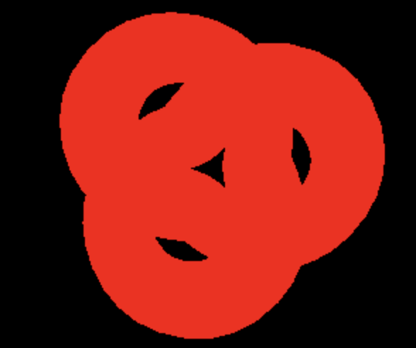
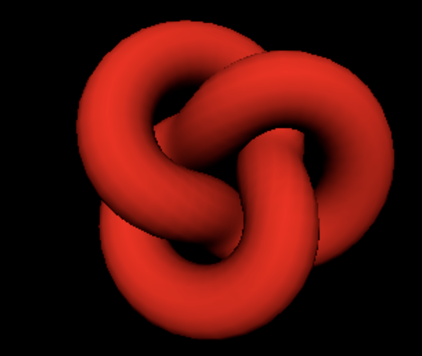
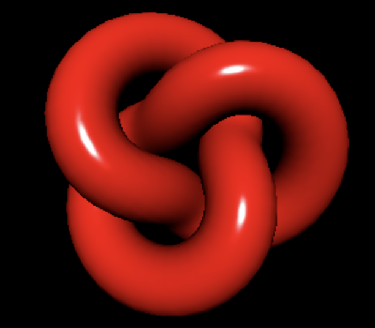
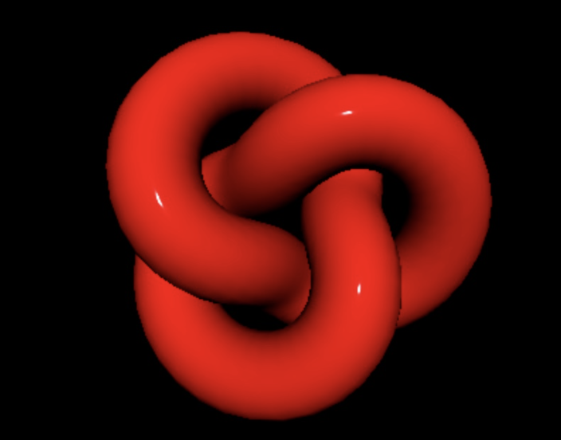
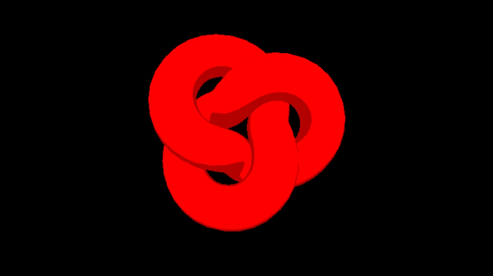
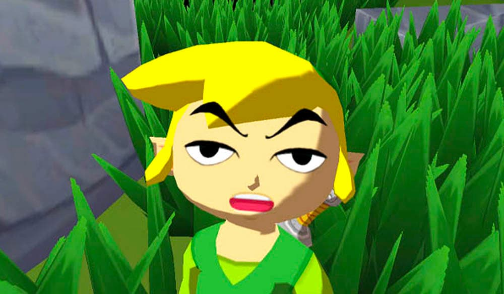

# Materials

- [Material](#material)
- [Mesh Material](#mesh-material)
  * [MeshBasicMaterial](#meshbasicmaterial)
  * [MeshLambertMaterial](#meshlambertmaterial)
  * [MeshPhongMaterial](#meshphongmaterial)
  * [MeshStandardMaterial](#meshstandardmaterial)
  * [MeshToonMaterial](#meshtoonmaterial)
  * [完整测试代码](#%E5%AE%8C%E6%95%B4%E6%B5%8B%E8%AF%95%E4%BB%A3%E7%A0%81)
- [Line Material](#line-material)
  * [LineBasicMaterial](#linebasicmaterial)
  * [LineDashedMaterial](#linedashedmaterial)
- [Point Material](#point-material)
  * [PointsMaterial](#pointsmaterial)
- [Special Material](#special-material)
  * [ShadowMaterial](#shadowmaterial)
  * [SpiriteMaterial](#spiritematerial)
- [Custom Material](#custom-material)
  * [ShaderMaterial](#shadermaterial)
  * [RawShaderMaterial](#rawshadermaterial)
- [参考资料](#%E5%8F%82%E8%80%83%E8%B5%84%E6%96%99)

---

# Material
# Mesh Material
## MeshBasicMaterial
1. 特点
    1. 唯一的作用就是指定颜色
    2. 不受光照影响，直接指定颜色
2. 应用
    1. 无需光照阴影的场景
3.  代码：

```typescript
const torusKnot = new THREE.Mesh(
  new THREE.TorusKnotGeometry(1, 0.4, 100, 16),
  new THREE.MeshBasicMaterial({ color: 0xff0000 }) // 只设置了颜色
)
scene.add(torusKnot)

const directionalLight = new THREE.DirectionalLight(0xffffff, 1)
directionalLight.position.z = 3
scene.add(directionalLight)
```




## MeshLambertMaterial


1. 特点
    1. 基于 Lambertian model，非基于物理的，只考虑漫反射，不考虑高光和环境光
    2. 比起 MeshBasicMaterial，带光照阴影效果
    3. 比起 MeshPhongMaterial, MeshStantardMaterial 和 MeshPhysicalMeterial 性能更好
2. 应用
    1. 可以反光的材质
3. 代码

```typescript
const torusKnot = new THREE.Mesh(
  new THREE.TorusKnotGeometry(1, 0.4, 100, 16),
  new THREE.MeshLambertMaterial({ color: 0xff0000 })  // 更换材质
)
scene.add(torusKnot)

const directionalLight = new THREE.DirectionalLight(0xffffff, 1)
directionalLight.position.z = 3
scene.add(directionalLight)
```


## MeshPhongMaterial


> <font style="color:rgb(187, 187, 187);">The material uses a non-physically based </font>[Blinn-Phong](https://en.wikipedia.org/wiki/Blinn-Phong_shading_model)<font style="color:rgb(187, 187, 187);"> model for calculating reflectance. Unlike the Lambertian model used in the </font>[MeshLambertMaterial](https://threejs.org/docs/index.html#api/en/materials/MeshLambertMaterial)<font style="color:rgb(187, 187, 187);"> this can simulate shiny surfaces with specular highlights (such as varnished wood). MeshPhongMaterial uses per-fragment shading.</font>  
  
<font style="color:rgb(187, 187, 187);">Performance will generally be greater when using this material over the </font>[MeshStandardMaterial](https://threejs.org/docs/index.html#api/en/materials/MeshStandardMaterial)<font style="color:rgb(187, 187, 187);"> or </font>[MeshPhysicalMaterial](https://threejs.org/docs/index.html#api/en/materials/MeshPhysicalMaterial)<font style="color:rgb(187, 187, 187);">, at the cost of some graphical accuracy.</font>
>

1. 特点
    1. 基于 blinn-phong model ，非基于物理的，不但考虑漫反射，还考虑高光和环境光
    2. 比起 MeshBasicMaterial，带光照阴影效果
    3. 比起 MeshLambertMaterial，可以模拟 shiny 表面 （有 specular light 高光）
    4. 比起 MeshStantardMaterial 和 MeshPhysicalMeterial 更快
2. 应用
    1. 磨砂效果
3. 代码

```typescript
const torusKnot = new THREE.Mesh(
  new THREE.TorusKnotGeometry(1, 0.4, 100, 16),
  new THREE.MeshPhongMaterial({ color: 0xff0000, shininess: 200 })  // 添加高光
)
scene.add(torusKnot)

const directionalLight = new THREE.DirectionalLight(0xffffff, 1)
directionalLight.position.z = 3
scene.add(directionalLight)
```


## MeshStandardMaterial


1. 特点。
    1. MeshStandardMaterial 是一个标准的 physically based material, 采用 Metallic-Roughness workflow.
    2. MeshStandardMaterial 提供比 MeshLambertMaterial 或 MeshPhongMaterial 更准确、更真实的结果，但代价是计算成本更高。
2. 代码

```typescript
const torusKnot = new THREE.Mesh(
  new THREE.TorusKnotGeometry(1, 0.4, 100, 16),
  new THREE.MeshPhongMaterial({ color: 0xff0000, roughness: 0 })  // 添加 roughness
)
scene.add(torusKnot)

const directionalLight = new THREE.DirectionalLight(0xffffff, 1)
directionalLight.position.z = 3
scene.add(directionalLight)
```

## MeshToonMaterial


1. 特点
    1. toon shading effect
2. 代码

```typescript
const torusKnot = new THREE.Mesh(
  new THREE.TorusKnotGeometry(1, 0.4, 100, 16),
  new THREE.MeshToonMaterial({
    color: 0xff0000
  })
)

scene.add(torusKnot)

const directionalLight = new THREE.DirectionalLight(0xffffff, 1)
directionalLight.position.z = 3
scene.add(directionalLight)
```


## 完整测试代码
```typescript
var scene = new THREE.Scene();
var camera = new THREE.PerspectiveCamera( 50, window.innerWidth/window.innerHeight, 0.1, 1000 );

var renderer = new THREE.WebGLRenderer();
renderer.setSize( window.innerWidth, window.innerHeight );
document.body.appendChild( renderer.domElement );

const torusKnot = new THREE.Mesh(
  new THREE.TorusKnotGeometry(1, 0.4, 100, 16),
  new THREE.MeshBasicMaterial({ color: 0xff0000 })
)
scene.add(torusKnot)

const directionalLight = new THREE.DirectionalLight(0xffffff, 1);
directionalLight.position.z = 3;
scene.add(directionalLight);

camera.position.z = 5;


var render = function () {
		renderer.render(scene, camera);
};

render();

```


# Line Material
## LineBasicMaterial 
A material for drawing wireframe-style geometries.

## LineDashedMaterial 
A material for drawing wireframe-style geometries with dashed lines.

# Point Material
## PointsMaterial
The default material used by Points.

# Special Material
## ShadowMaterial
This material can receive shadows, but otherwise is completely transparent.

## SpiriteMaterial
A material for a use with a Sprite.

# Custom Material
## ShaderMaterial
A material rendered with custom shaders.

## RawShaderMaterial
This class works just like ShaderMaterial, except that definitions of built-in uniforms and attributes are not automatically prepended to the GLSL shader code.

# 参考资料
+ [A Comprehensive Guide to Materials in Three.js](https://chriscourses.com/blog/a-comprehensive-guide-to-materials-in-threejs)


> 更新: 2023-07-30 05:25:53  
> 原文: <https://www.yuque.com/viruspc/el3mi0/ogunoqztpsgors5f>