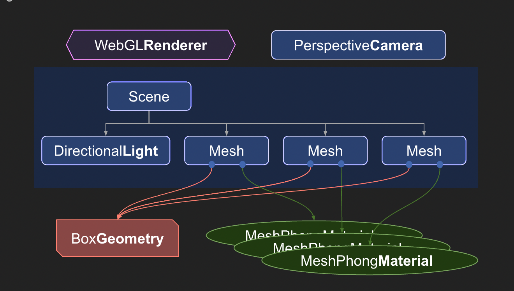

# Tricks (性能优化)

1. 材质可以复用，减少内存消耗
    1. 
    2. [https://threejs.org/manual/#en/fundamentals](https://threejs.org/manual/#en/fundamentals)
2. 响应式设计
    1. 自适应拉伸。始终让 camera的aspect ratio 与画布保持一致，有利于响应式设计。固定 aspect 会使得不同宽高比画布上的物体会发生不同程度的拉伸。[#](https://threejs.org/manual/#en/responsive)

```typescript
const canvas = renderer.domElement;
camera.aspect = canvas.clientWidth / canvas.clientHeight;
camera.updateProjectionMatrix();
```

    2. 自适应分辨率。保持 renderer 的 size 与 canvas 的 client width/height 一致。即 canvas 的像素宽高和 css 宽高保持一致。
        1. Canvas elements have 2 sizes. One size is the size the canvas is displayed on the page. That's what we set with CSS. The other size is the number of pixels in the canvas itself.
        2. A canvas's internal size, its resolution, is often called its **drawingbuffer size**. In three.js we can set the canvas's drawingbuffer size by calling `renderer.setSize`

```typescript
function resizeRendererToDisplaySize(renderer) {
  const canvas = renderer.domElement;
  const width = canvas.clientWidth;
  const height = canvas.clientHeight;
  const needResize = canvas.width !== width || canvas.height !== height;
  if (needResize) {
    renderer.setSize(width, height, false);
  }
  return needResize;
}
```

    3. HD-DPI （high-density dot per inch displays）
3. forceSinglePass

> [forceSinglePass](https://threejs.org/docs/index.html#api/en/materials/Material.forceSinglePass)<font style="color:rgb(187, 187, 187);"> : </font><font style="color:rgb(153, 153, 153);">Boolean</font>
>
> <font style="color:rgb(187, 187, 187);">Whether double-sided, transparent objects should be rendered with a single pass or not. Default is </font><font style="color:rgb(48, 176, 48);background-color:rgb(51, 51, 51);">false</font><font style="color:rgb(187, 187, 187);">.  
  
</font><font style="color:rgb(187, 187, 187);">The engine renders double-sided, transparent objects with two draw calls (back faces first, then front faces) to mitigate transparency artifacts. There are scenarios however where this approach produces no quality gains but still doubles draw calls e.g. when rendering flat vegetation like grass sprites. In these cases, set the </font><font style="color:rgb(170, 170, 170);background-color:rgb(51, 51, 51);">forceSinglePass</font><font style="color:rgb(187, 187, 187);"> flag to </font><font style="color:rgb(48, 176, 48);background-color:rgb(51, 51, 51);">true</font><font style="color:rgb(187, 187, 187);"> to disable the two pass rendering to avoid performance issues.</font>
>


4. three.js 并不自动释放内存，注意通过 dispose 来释放创建的各个对象 [three.js docs](https://threejs.org/docs/#manual/en/introduction/How-to-dispose-of-objects)
5. matrixAutoUpdate：如果物体是静态的，可以通过将matrixAutoUpdate设为false来关闭local matrix的自动更新 


> 更新: 2023-09-23 14:38:50  
> 原文: <https://www.yuque.com/viruspc/el3mi0/ewq8ge7i0k14safb>