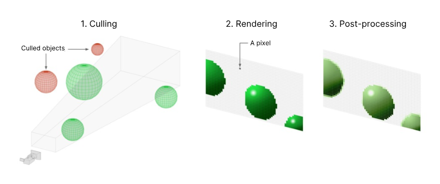
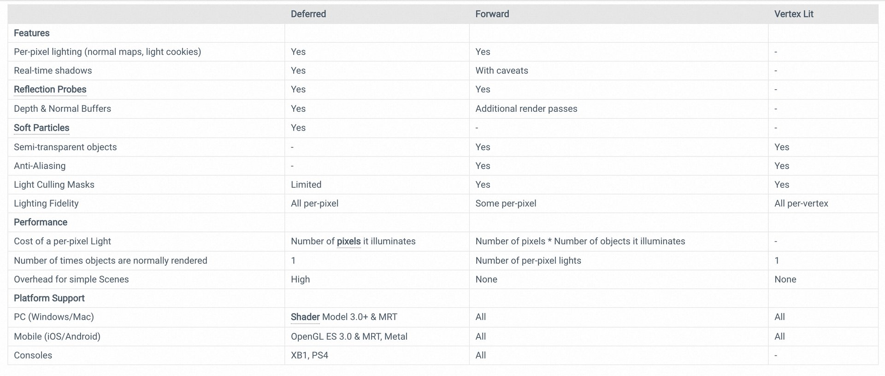
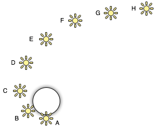
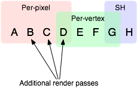

# Render pipelines

- [How a render pipeline works](#how-a-render-pipeline-works)
- [Three Render pipelines in Unity](#three-render-pipelines-in-unity)
- [Three Rendering paths in the Built-in Render Pipeline](#three-rendering-paths-in-the-built-in-render-pipeline)
  * [Forward rendering path](#forward-rendering-path)
  * [Deferred Shading rendering path](#deferred-shading-rendering-path)
  * [Vertex Lit Rendering Path](#vertex-lit-rendering-path)
- [Rendering order in the Built-in Render Pipeline](#rendering-order-in-the-built-in-render-pipeline)
- [References](#references)

---

## How a render pipeline works

[Unity - Manual: Introduction to render pipelines](https://docs.unity3d.com/Manual/render-pipelines-overview.html)

A render pipleline follows these steps:

1. Culling。通常指视锥剔除([frustum culling](https://docs.unity3d.com/Manual/UnderstandingFrustum.html)) 和遮挡剔除 ([occlusion culling](https://docs.unity3d.com/Manual/OcclusionCulling.html)）
2. Rendering。渲染。
3. Post-processing。通常用于模拟物理相机和电影效果。 (A process that improves product visuals by applying filters and effects before the image appears on screen. You can use post-processing effects to simulate physical camera and film properties, for example Bloom and Depth of Field. )

## Three Render pipelines in Unity

1. Built-In Render Pipeline
   1. Unity 默认渲染管线。通用管道，但可定制项有限。
   2. Target Uses:
      1. Projects that need rendering scalability across all platforms.
      2. 2D or 3D
   3. Customization through artist tooling
      1. Shader Graph
      2. Built-in Particle System
2. Universal Render Pipeline (URP)：
   1. 可自定义的可编程渲染管线。 It lets you create scalable graphics across a wide range of platforms.
   2. Target Uses:
      1. Projects that need rendering scalability across all platforms, especially tile-based deferred rendering (TBDR) platforms, and untethered **VR** platforms.
      2. Projects that need to extend and customize the rendering pipeline.
      3. 2D or 3D
   3. Customization through artist tooling
      1. Shader Graph
      2. Built-in Particle System
      3. VFX Graph
3. High Definition Render Pipeline (HDRP)
   1. is a Scriptable Render Pipeline that lets you create cutting-edge, high-fidelity graphics on high-end platforms. 让您在高端平台上创建前沿，高保真图形。
   2. Target Uses
      1. Projects that need photorealism and high-fidelity rendering on high-end platforms
      2. 3D only
   3. Customization through artist tooling
      1. Shader Graph
      2. BUilt-in Particle System
      3. VFX Graph

## Three Rendering paths in the Built-in Render Pipeline

Unity’s **Built-In Render** Pipeline supports different rendering paths.

A **rendering path** is a series of operations related to lighting and shading. Different rendering paths have different capabilities and performance characteristics. Deciding on which rendering path is most suitable for your Project depends on the type of Project, and on the target hardware.

1. Forward Rendering
   1. 默认 rendering path
   2. 什么时候用？
      1. 实时光照不多或照明保真度不重要时使用
2. Deferred Rendering
   1. 一种 [screen-space](https://en.wikipedia.org/wiki/Screen-space) [shading](https://en.wikipedia.org/wiki/Shading) 技术，需要第二趟。SSDO 可以用于这里的阴影渲染。[Real-time  Global Illumination](https://www.yuque.com/pengcheng-fuigs/el3mi0/oxeqkqemkd0cffv0#defBu)
      1. In the field of [3D computer graphics](https://en.wikipedia.org/wiki/3D_computer_graphics), **deferred shading** is a [screen-space](https://en.wikipedia.org/wiki/Screen-space) [shading](https://en.wikipedia.org/wiki/Shading) technique that is performed on a second [rendering](https://en.wikipedia.org/wiki/Rendering_\(computer_graphics\)) pass, after the vertex and pixel [shaders](https://en.wikipedia.org/wiki/Shader) are rendered.[\[2\]](https://en.wikipedia.org/wiki/Deferred_shading#cite_note-urlForward_Rendering_vs._Deferred_Rendering-2)
   2. 有一些局限性
      1. 需要GPU支持
      2. 不支持半透明物体 （Unity 利用 forward rendering 来渲染半透明物体）
      3. 不支持正交投影（Unity 对这些相机采用 forward rendering）
      4. 不支持硬件抗锯齿（尽管你可以用后处理特效来实现类似的结果）
      5. has limited support for culling masks （允许按 Layer 来包含或省略要由相机渲染的对象。）
      6. treats the `Renderer.receiveShadows` flag as always true.
   3. 什么时候用？
      1. 有大量实时光照
      2. 需要高照明保真度
3. Legacy Vertex Lit
   1. forward rendering的子集
   2. 什么时候用？
      1. 最低照明保真度，不支持实时阴影

### Forward rendering path

[Unity - Manual: Forward rendering path](https://docs.unity3d.com/Manual/RenderTech-ForwardRendering.html)

区分光线的重要程度，不同重要程度的光采用不同渲染方式（一个光也可能被归为多类）：

1. 最重要的光：一些影响所有物体的最亮的光，会采用**逐像素渲染**（Phong Shading, [Lecture 08. Shading 2 (Shading, Pipeline and Texture Mapping)](https://www.yuque.com/pengcheng-fuigs/el3mi0/lvabncnzpcb7z0eg#HMOwy)）
2. 次重要的光：最多计算4个点光源采用\*\*逐顶点渲染（\*\*Gouraud shading）
3. 不重要光：其他光源作为 \*\*Spherical Harmonics \*\*（更快，但只是个近似） 来计算。

光是否是逐像素光（是否重要）取决于：

* 非最重要光：Lights that have their Render Mode set to **Not Important** are always per-vertex or SH.
* 最重要光：**Brightest **directional light is always per-pixel.
* 最重要光：Lights that have their Render Mode set to **Important** are always per-pixel.
* 最重要光：If the above results in fewer lights than current **Pixel Light Count** [Quality Setting](https://docs.unity3d.com/2021.3/Documentation/Manual/class-QualitySettings.html), then more lights are rendered per-pixel, in order of decreasing brightness.

每个物体的渲染按如下步骤发生（其实就是每个重要光+所有其他非重要光渲染一次）：

* Base Pass applies one per-pixel directional light and all per-vertex/SH lights.
* Other per-pixel lights are rendered in additional passes, one pass for each light.

可能有重叠

### Deferred Shading rendering path

[Unity - Manual: Deferred Shading rendering path](https://docs.unity3d.com/Manual/RenderTech-DeferredShading.html)

所有的光都是逐像素渲染。

### Vertex Lit Rendering Path

[Unity - Manual: Vertex Lit Rendering Path](https://docs.unity3d.com/Manual/RenderTech-VertexLit.html)

## Rendering order in the Built-in Render Pipeline

[Unity - Manual: Rendering order in the Built-in Render Pipeline](https://docs.unity3d.com/Manual/built-in-rendering-order.html)

## References

* [Unity - Manual: Render pipelines](https://docs.unity3d.com/Manual/render-pipelines.html)
*

> 更新: 2023-12-06 13:04:30  
> 原文: <https://www.yuque.com/viruspc/el3mi0/ickg57fbrkm4p8ed>