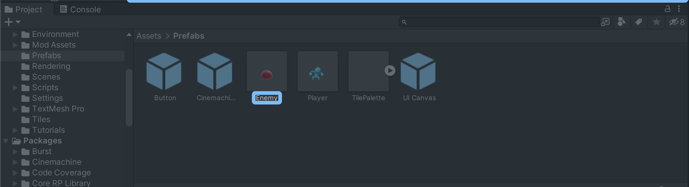

# Terms

+ **GameObject**: Everything in your game world, including the player character, is called a GameObject
+ **Components**: A component is a set of properties and behaviors of the selected GameObject. When you select a GameObject in the Hierarchy, you'll see its components in the Inspector. Components contain properties that give a GameObject specific functionalities. The Player Controller properties are what makes the player move in response to player input.
+ **Prefabs(**预制件**)**: Prefabs are templates for GameObjects with preset components. They're stored as assets that you can simply drag into the Scene view. A change to the prefab asset causes all of its instances to change as well. （有点像父类）
    - 
+ **Instance**: From the prefab, you can create multiple copies, called instance.
+ **Scene**: One environment, level, or display in your game. Scenes are containers for everything in the experience you are creating. One way to think about Scenes is as discrete experiences. For example, each level in a game could be a separate Scene, and the game’s main menu could be another.
+ **Packages**: Packages are small collections of Unity features or assets that help you do different things in your projects. 
    - This includes both:
        * Core features of Unity, that are installed by default alongside the Editor
        * Additional packages, that you can install in a project when you need them
    - Packaging different features together reduces the initial download size and time required to install a Unity version, and means that you can customize the Editor to meet the specific needs of your projects.
+ **Game View**: the view player have during the game.

> 更新: 2023-06-13 04:26:23  
> 原文: <https://www.yuque.com/viruspc/el3mi0/ipy57wxgm4if60ti>