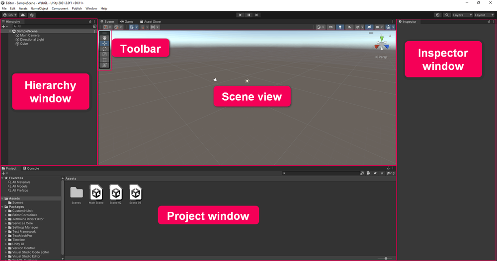
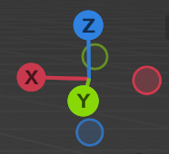
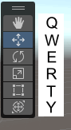

# 操作

- [编辑器界面](#%E7%BC%96%E8%BE%91%E5%99%A8%E7%95%8C%E9%9D%A2)
- [视图操作](#%E8%A7%86%E5%9B%BE%E6%93%8D%E4%BD%9C)
- [其他](#%E5%85%B6%E4%BB%96)
- [附](#%E9%99%84)
- [References](#references)

---

# 编辑器界面

# 视图操作
左上角可以选择 global 或 local 坐标系

1. **平移场景(pan)**
    1. 选择左上角移动工具
    2. 左键拖拽画布
    3. **对比blender**：拖拽画布右侧的
2. **旋转场景(orbit)**
    1. option/alt + 左键 + 移动
    2. **对比blender**：拖拽画布右上角的
3. **缩放场景(zoom)**
    1. option/alt + 右键 + 滚轮/上下滑动 或 右键 + 滚轮/上下滑动
    2. **对比blender**：触摸板双指聚拢/分散
4. **移动/旋转/缩放/三合一GameObject**
    1. 选择左上角对应工具（对应快捷键w,e,r或,y）
    2. 左键拖拽画布
    3. **对比blender**：选择左侧对应工具后，左键点击物体来操作
5. **聚焦gameobject(focus, frame select)：**
    1. 点击或通过 Rect Tool 选中（frame）GameObject
    2. 按下 F (shift+F) 键
    3. **对比blender**：按下 / 键
6. **复制gameobject**
    1. 选中
    2. ctrl+D
    3. **对比blender**：shift+D
7. **删除gameobject**
    1. Edit 
    2. Cmd+backspace或delete或Cmd+del
    3. **对比blender**：Shift+X或Shift+Delete
8. **Flythrough Mode: **You can also use Flythrough mode to navigate in the Scene view by flying around in first person, which is common in many games. To do this:
    1. Click and hold the right mouse button. （under perspective mode）
    2. Use WASD to move the view left/right/forward/backward.
    3. Use Q and E to move the view up and down.
    4. Select and hold Shift to move faster.
    5. **对比blender**：
        1. blender存在walk和fly两种navigation模式，和unity的fluthrough模式略有不同。walk和fly的区别：Walk mode restricts movement to the ground, while fly mode enables free movement in all directions, including vertical space.
        2. 点击view=>点击navigation=>选择walk或fly=>采用类似的按键开始移动视角=>左键单击确认当前视角退出navigation模式。unity不用左键确认。
9. **移动相机，使得当前视角作为相机视角**
    1. Select
    2. Ctrl+Shift+F (macOS: Cmd+Shift+F)
    3. **对比blender:** 
        1. 【视图】菜单中，打开【对齐视图】选项，选择【活动摄像机对齐当前视角】
        2. 或者，【视图】菜单中，打开【视图锁定】列表，勾选【锁定摄像机到视图方位】，即可让摄像机跟随视角一起变换。

# 其他
1. 批量移动: 类似文件系统，可以在hierarchy窗口中通过shift+左击来选中多个gameobject，然后移动。
2. Cmd+Shift+C 打开console
3. By default, Prefab Mode appears in the context of your scene. To edit your prefab in isolation, press Alt while selecting the arrow. 
4. Prefab mode: By default, Prefab Mode appears in the context of your scene. To edit your prefab in isolation, press Alt while selecting the arrow. In Prefab Mode, the prefab is the only GameObject you can edit. 

# 附
Toolbar快捷键图示:

+ Q: Hand tool, to pan your view
+ W: Move tool, to select and change position
+ E: Rotate tool, to select and rotate
+ R: Scale tool, to select and change size
+ T: Rect Transform tool, to scale in 2D
+ Y: Transform tool, to move, scale, and rotate with one Gizmo

# References
+ [Explore the Unity Editor - Unity Learn](https://learn.unity.com/tutorial/explore-the-unity-editor-1#6273f00fedbc2a7f158cc1ee)
+ [Fly/Walk Navigation — Blender Manual](https://docs.blender.org/manual/en/latest/editors/3dview/navigate/walk_fly.html)

[Manage GameObjects with prefabs - Unity Learn](https://learn.unity.com/tutorial/manage-gameobjects-with-prefabs?uv=2021.3&pathwayId=5f7bcab4edbc2a0023e9c38f&missionId=5f777d9bedbc2a001f6f5ec7&projectId=5fa1e431edbc2a001f53e6cc#)

> 更新: 2023-06-13 04:47:00  
> 原文: <https://www.yuque.com/viruspc/el3mi0/luefgbopltt3p6hq>