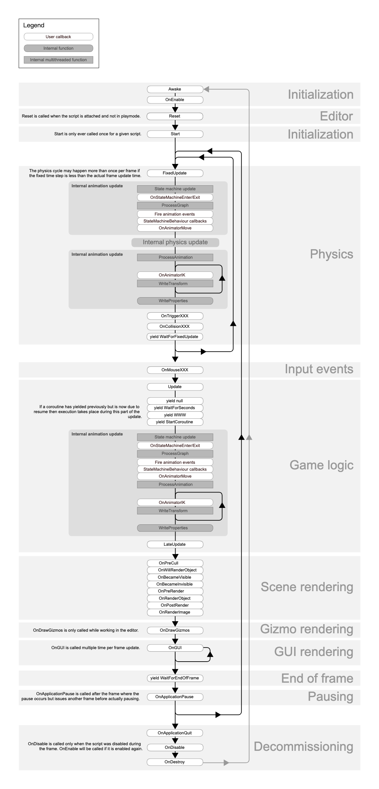

# 脚本生命周期

- [介绍](#%E4%BB%8B%E7%BB%8D)
- [生命周期图](#%E7%94%9F%E5%91%BD%E5%91%A8%E6%9C%9F%E5%9B%BE)
  * [First Scene load](#first-scene-load)
  * [Editor](#editor)
  * [Before the first frame update](#before-the-first-frame-update)
  * [In between frames](#in-between-frames)
  * [Update Order](#update-order)
  * [Animation update loop](#animation-update-loop)
    + [Useful profile markers](#useful-profile-markers)
  * [Rendering](#rendering)
  * [Coroutines](#coroutines)
  * [When the Object is destroyed](#when-the-object-is-destroyed)
  * [When quitting](#when-quitting)
- [参考资料](#%E5%8F%82%E8%80%83%E8%B5%84%E6%96%99)

---

# 介绍
类似 React 类组件生命周期，脚本生命周期（Script lifecycle）描述了一些事件的触发时间和顺序。 

Running a Unity script executes a number of event functions in a predetermined order. 

This page describes those event functions and explains how they fit into the execution sequence.

# 生命周期图

## First Scene load
These functions get called when a **scene**  
 starts (once for each object in the scene).

+ **Awake:** This function is always called before any Start functions and also just after a **prefab**  
 is instantiated. (If a GameObject is inactive during start up Awake is not called until it is made active.)
+ **OnEnable:** (only called if the Object is active): This function is called just after the object is enabled. This happens when a MonoBehaviour instance is created, such as when a level is loaded or a **GameObject** with the script component is instantiated.

Note that for objects added to the scene, the Awake and OnEnable functions for _all_ **scripts**  
 will be called before Start, Update, etc are called for any of them. Naturally, this cannot be enforced when you instantiate an object during gameplay.

Awake 只调用一次，OnEnable可能调用多次。每次物体失活再激活时，就会触发OnEnable。

## Editor
+ **Reset:** Reset is called to initialize the script’s properties when it is first attached to an object and also when the _Reset_ command is used.
+ **OnValidate:** OnValidate is called whenever the script’s properties are set, including when an object is deserialized, which can occur at various times, such as when you open a scene in the Editor and after a domain reload.

## Before the first frame update
+ **Start:** Start is called before the first frame update only if the script instance is enabled.

For objects that are part of a scene asset, the Start function is called on all scripts before Update, etc is called for any of them. Naturally, this cannot be enforced when you instantiate an object during gameplay.

## In between frames
+ **OnApplicationPause:** This is called at the end of the frame where the pause is detected, effectively between the normal frame updates. One extra frame will be issued after **OnApplicationPause** is called to allow the game to show graphics that indicate the paused state.

## Update Order
When you’re keeping track of game logic and interactions, animations, **camera**  
 positions, etc., there are a few different events you can use. The common pattern is to perform most tasks inside the **Update** function, but there are also other functions you can use.

+ **FixedUpdate:** **FixedUpdate** is often called more frequently than **Update**. It can be called multiple times per frame, if the frame rate is low and it may not be called between frames at all if the frame rate is high. All physics calculations and updates occur immediately after **FixedUpdate**. When applying movement calculations inside **FixedUpdate**, you do not need to multiply your values by **Time.deltaTime**. This is because **FixedUpdate** is called on a reliable timer, independent of the frame rate.
+ **Update:** **Update** is called once per frame. It is the main workhorse function for frame updates.
+ **LateUpdate:** **LateUpdate** is called once per frame, after **Update** has finished. Any calculations that are performed in **Update** will have completed when **LateUpdate** begins. A common use for **LateUpdate** would be a following third-person camera. If you make your character move and turn inside **Update**, you can perform all camera movement and rotation calculations in **LateUpdate**. This will ensure that the character has moved completely before the camera tracks its position.

In general, you should not rely on the order in which the same event function is invoked for different GameObjects — except when the order is explicitly documented or settable. (If you need a more fine-grained control of the player loop, you can use the [PlayerLoop API](https://docs.unity3d.com/ScriptReference/LowLevel.PlayerLoop.html).)

You cannot specify the order in which an event function is called for different instances of the same MonoBehaviour subclass. For example, the **Update** function of one MonoBehaviour might be called before or after the **Update** function for the same MonoBehaviour on another GameObject — including its own parent or child GameObjects.

You can specify that the event functions of one MonoBehaviour subclass should be invoked before those of a different subclass (using the Script Execution Order panel of the Project Settings window). For example, if you had two scripts, EngineBehaviour and SteeringBehaviour, you could set the Script Execution Order such that EngineBehaviours always updates before SteeringBehaviours.

## Animation update loop
These functions and [Profiler](https://docs.unity3d.com/Manual/Profiler.html)  
 Markers are called when Unity evaluates the Animation system.

+ **OnStateMachineEnter:** During the **State Machine Update** step, this callback is called on the first update frame when a controller’s state machine makes a transition that flows through an Entry state. It is not called for a transition to a **StateMachine** sub-state.  
  
This callback occurs only if there is a controller component (for example, [AnimatorController](https://docs.unity3d.com/ScriptReference/Animations.AnimatorController.html) or [AnimatorOverrideController](https://docs.unity3d.com/ScriptReference/AnimatorOverrideController.html) or [AnimatorControllerPlayable](https://docs.unity3d.com/ScriptReference/Animations.AnimatorControllerPlayable.html)) in the animation graph.  
  
**Note:** Adding this callback to a [StateMachineBehaviour](https://docs.unity3d.com/ScriptReference/StateMachineBehaviour.html) component disables multithreaded **state machine**  
 evaluation.
+ **OnStateMachineExit:** During the **State Machine Update** step, this callback is called on the last update frame when a controller’s state machine makes a transition that flows through an Exit state. It is not called for a transition to a **StateMachine** sub-state.  
  
This callback occurs only if there is a controller component (for example, [AnimatorController](https://docs.unity3d.com/ScriptReference/Animations.AnimatorController.html) or [AnimatorOverrideController](https://docs.unity3d.com/ScriptReference/AnimatorOverrideController.html) or [AnimatorControllerPlayable](https://docs.unity3d.com/ScriptReference/Animations.AnimatorControllerPlayable.html)) in the animation graph.  
  
**Note:** Adding this callback to a [StateMachineBehaviour](https://docs.unity3d.com/ScriptReference/StateMachineBehaviour.html) component disables multithreaded state machine evaluation.
+ **Fire**** ****Animation Events****  
****:** Calls all animation events from all clips sampled between the time of the last update and the time of the current update.
+ **StateMachineBehaviour (OnStateEnter/OnStateUpdate/OnStateExit):** A layer can have up to 3 active states: current state, interrupted state, and next state. This function is called for each active state with a StateMachineBehaviour component that defines the **OnStateEnter**, **OnStateUpdate**, or **OnStateExit** callback.  
  
The function is called for the current state first, then the interrupted state, and finally the next state.  
  
This step occurs only if there is a controller component (for example, [AnimatorController](https://docs.unity3d.com/ScriptReference/Animations.AnimatorController.html) or [AnimatorOverrideController](https://docs.unity3d.com/ScriptReference/AnimatorOverrideController.html) or [AnimatorControllerPlayable](https://docs.unity3d.com/ScriptReference/Animations.AnimatorControllerPlayable.html)) in the animation graph..
+ **OnAnimatorMove:** Every update frame, this is called once for each **Animator component**  
 to modify the **Root Motion**  
.
+ **StateMachineBehaviour(OnStateMove):** This is called on each active state with a [StateMachineBehaviour](https://docs.unity3d.com/ScriptReference/StateMachineBehaviour.html) that defines this callback.
+ **OnAnimatorIK:** Sets up animation IK. This is called once for each Animator Controller layer with **IK pass** enabled.  
  
This event executes only if you are using a Humanoid rig.
+ **StateMachineBehaviour(OnStateIK):** This is called on each active state with a [StateMachineBehaviour](https://docs.unity3d.com/ScriptReference/StateMachineBehaviour.html) component that defines this callback on a layer with **IK pass** enabled.
+ **WriteProperties:** Writes all other animated properties to the Scene from the main thread.

### Useful profile markers
Some of the animation functions shown in the [Script Lifecycle Flowchart](https://docs.unity3d.com/Manual/ExecutionOrder.html#ScriptLifecycleFlowchart) are not Event functions that you can call; they are internal functions called when Unity processes your animation.

These functions have **Profiler Markers**  
, so you can use the [Profiler](https://docs.unity3d.com/Manual/Profiler.html) to see when in the frame Unity calls them. Knowing when Unity calls these functions can help you understand exactly when the Event functions you do call are executed.

For example, suppose you call [Animator.Play](https://docs.unity3d.com/ScriptReference/Animator.Play.html) in the **FireAnimationEvents** callback. If you know that the **FireAnimationEvents** callback is fired only after the **State Machine Update** and **Process Graph** functions execute, you can anticipate that your **animation clip**  
 will play on the next frame, and not right away.

+ **State Machine Update:** All state machines are evaluated at this step in the execution sequence. This step occurs only if there is a controller component (for example, [AnimatorController](https://docs.unity3d.com/ScriptReference/Animations.AnimatorController.html) or [AnimatorOverrideController](https://docs.unity3d.com/ScriptReference/AnimatorOverrideController.html) or [AnimatorControllerPlayable](https://docs.unity3d.com/ScriptReference/Animations.AnimatorControllerPlayable.html)) in the animation graph.  
  
**Note:** State machine evaluation is normally multithreaded, but adding certain callbacks (for example **OnStateMachineEnter** and **OnStateMachineExit**) disables multithreading. See [Animation update loop](https://docs.unity3d.com/Manual/ExecutionOrder.html#AnimationUpdateLoop) above for details.
+ **ProcessGraph:** Evaluates all animation graphs. This includes sampling all animation clips that need to be evaluated, and computing Root Motion.
+ **ProcessAnimation:** Blends the results of the animation graph.
+ **WriteTransforms:** Writes all animated transforms to the scene from a worker thread.  
  
A Humanoid rig with multiple layers that have **IK pass** enabled can have multiple **WriteTransforms** passes (See the [Script Lifecycle Flowchart](https://docs.unity3d.com/Manual/ExecutionOrder.html#ScriptLifecycleFlowchart).

## Rendering
+ **OnPreCull:** Called before the camera culls the scene. Culling determines which objects are visible to the camera. OnPreCull is called just before culling takes place.
+ **OnBecameVisible/OnBecameInvisible:** Called when an object becomes visible/invisible to any camera.
+ **OnWillRenderObject:** Called **once** for each camera if the object is visible.
+ **OnPreRender:** Called before the camera starts rendering the scene.
+ **OnRenderObject:** Called after all regular scene rendering is done. You can use [GL](https://docs.unity3d.com/ScriptReference/GL.html) class or [Graphics.DrawMeshNow](https://docs.unity3d.com/ScriptReference/Graphics.DrawMeshNow.html) to draw custom geometry at this point.
+ **OnPostRender:** Called after a camera finishes rendering the scene.
+ **OnRenderImage:** Called after scene rendering is complete to allow **post-processing**  
 of the image, see [Post-processing Effects](https://docs.unity3d.com/Manual/PostProcessingOverview.html).
+ **OnGUI:** Called multiple times per frame in response to GUI events. The Layout and Repaint events are processed first, followed by a Layout and keyboard/mouse event for each input event.
+ **OnDrawGizmos** Used for drawing **Gizmos**  
 in the **scene view**  
 for visualisation purposes.

**Note:** These callbacks only work with the Built-in **Render Pipeline**  
.

## Coroutines
Normal coroutine updates are run after the Update function returns. A coroutine is a function that can suspend its execution (yield) until the given YieldInstruction finishes. Different uses of Coroutines:

+ **yield** The coroutine will continue after all Update functions have been called on the next frame.
+ **yield WaitForSeconds** Continue after a specified time delay, after all Update functions have been called for the frame.
+ **yield WaitForFixedUpdate** Continue after all FixedUpdate has been called on all scripts. If the coroutine yielded before FixedUpdate, then it resumes after FixedUpdate in the current frame.
+ **yield WWW** Continue after a WWW download has completed.
+ **yield StartCoroutine** Chains the coroutine, and will wait for the MyFunc coroutine to complete first.

## When the Object is destroyed
+ **OnDestroy:** This function is called after all frame updates for the last frame of the object’s existence (the object might be destroyed in response to Object.Destroy or at the closure of a scene).

## When quitting
These functions get called on all the active objects in your scene:

+ **OnApplicationQuit:** This function is called on all game objects before the application is quit. In the editor it is called when the user stops playmode.
+ **OnDisable:** This function is called when the behaviour becomes disabled or inactive.

# 参考资料
+ [Unity - Manual: Order of execution for event functions](https://docs.unity3d.com/Manual/ExecutionOrder.html)

> 更新: 2023-06-06 13:22:31  
> 原文: <https://www.yuque.com/viruspc/el3mi0/icwtc24c3s4ap9pn>