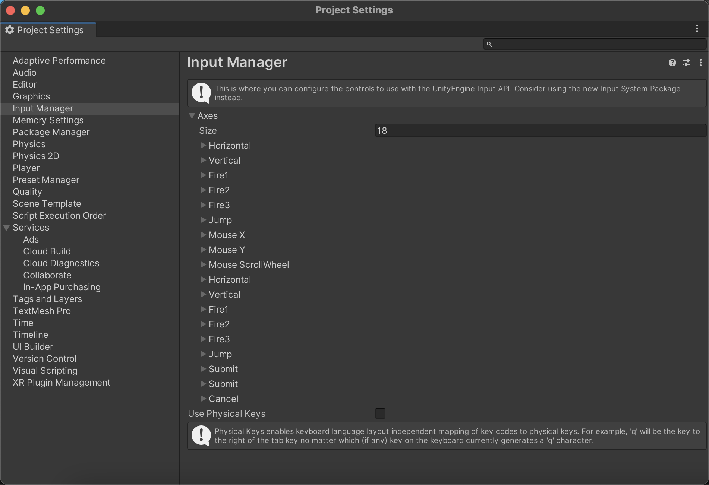
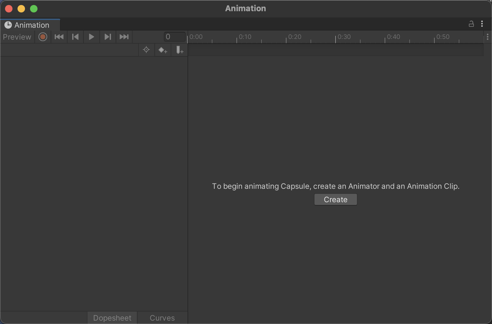
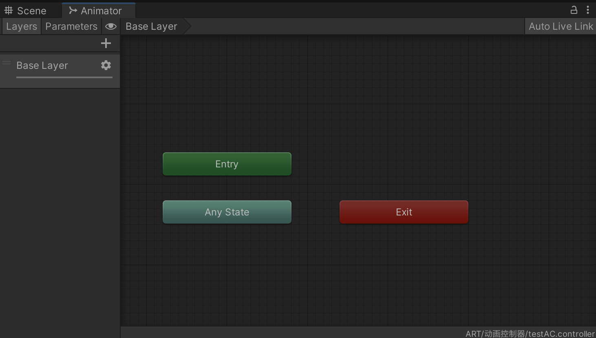
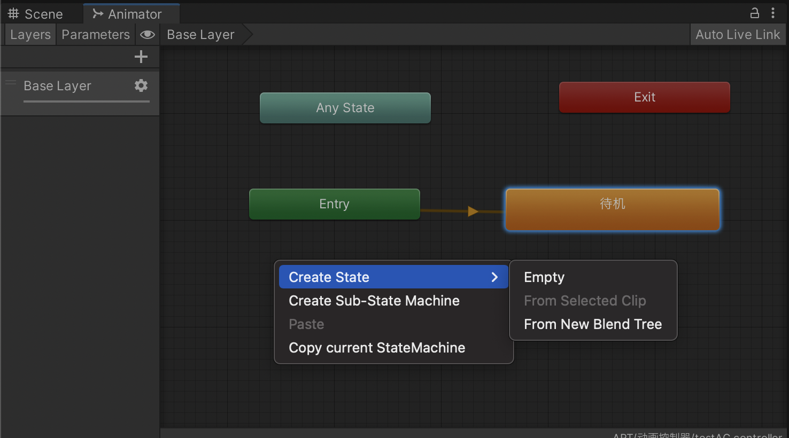
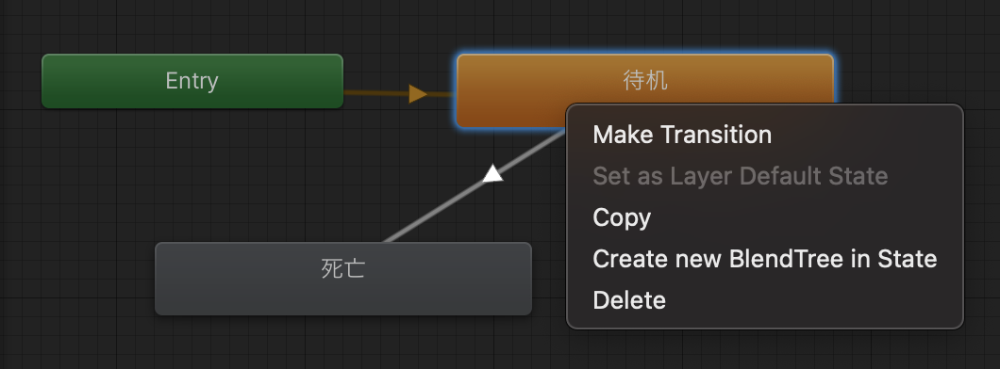
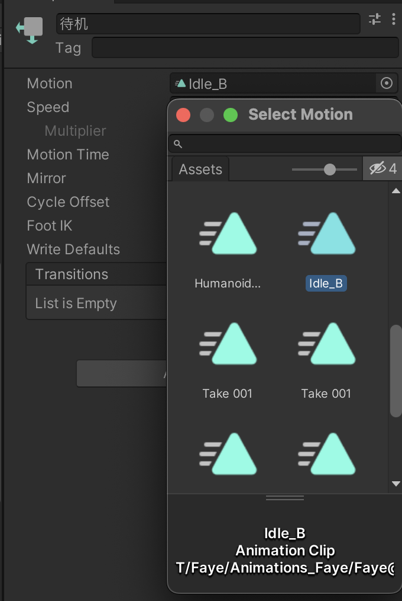

# 角色移动与动画系统

- [基本概念](#%E5%9F%BA%E6%9C%AC%E6%A6%82%E5%BF%B5)
- [背景](#%E8%83%8C%E6%99%AF)
- [输入](#%E8%BE%93%E5%85%A5)
  * [输入轴](#%E8%BE%93%E5%85%A5%E8%BD%B4)
  * [获取用户移动](#%E8%8E%B7%E5%8F%96%E7%94%A8%E6%88%B7%E7%A7%BB%E5%8A%A8)
  * [获取相机](#%E8%8E%B7%E5%8F%96%E7%9B%B8%E6%9C%BA)
  * [完整代码](#%E5%AE%8C%E6%95%B4%E4%BB%A3%E7%A0%81)
- [移动](#%E7%A7%BB%E5%8A%A8)
  * [沿角色前方移动](#%E6%B2%BF%E8%A7%92%E8%89%B2%E5%89%8D%E6%96%B9%E7%A7%BB%E5%8A%A8)
  * [沿角色前后左右移动](#%E6%B2%BF%E8%A7%92%E8%89%B2%E5%89%8D%E5%90%8E%E5%B7%A6%E5%8F%B3%E7%A7%BB%E5%8A%A8)
  * [沿世界坐标前后左右移动](#%E6%B2%BF%E4%B8%96%E7%95%8C%E5%9D%90%E6%A0%87%E5%89%8D%E5%90%8E%E5%B7%A6%E5%8F%B3%E7%A7%BB%E5%8A%A8)
  * [完整代码](#%E5%AE%8C%E6%95%B4%E4%BB%A3%E7%A0%81-1)
- [动画](#%E5%8A%A8%E7%94%BB)
  * [录制简单动画](#%E5%BD%95%E5%88%B6%E7%AE%80%E5%8D%95%E5%8A%A8%E7%94%BB)
  * [创建复杂动画](#%E5%88%9B%E5%BB%BA%E5%A4%8D%E6%9D%82%E5%8A%A8%E7%94%BB)
  * [添加简单动画](#%E6%B7%BB%E5%8A%A0%E7%AE%80%E5%8D%95%E5%8A%A8%E7%94%BB)
  * [添加复杂动画](#%E6%B7%BB%E5%8A%A0%E5%A4%8D%E6%9D%82%E5%8A%A8%E7%94%BB)
- [Tips](#tips)

---

# 基本概念

Animation Clip (Motion/animation/.anim)指定了单个动画。可以提前制作好，也可以在unity里自己做。

Transition 指定了动画之间的过渡

Animator Controller 是一个状态机，是多个Animation Clip 加它们之间的 Transition 关系。

Animator 上可以设置 Parameters，Object 上的 Script 可以修改这些 Parameter。Transition 根据 parameters 来触发，进而做 Animation Clip 的转换。

# 背景

用户移动时，需要做两件事：

1. 移动模型
2. 播放模型的走路动画

# 输入

## 输入轴

老版本有18个输入轴，通过Edit > Project Settings > Input Manager可以找到它们并设置相关参数。

```
1. 
```

## 获取用户移动

两个内置变量：`Horizontal`和`Vertical`

1. 输入：`Horizontal`默认为WS或上下方向键，`Vertical`默认为AD或左右方向键
2. 输出：
   1. `Input.GetAxis("Horizontal") `/ `Input.GetAxis("Vertical")`
      1. 输出：-1到1之间的值
   2. `Input.GetAxisRaw("Horizontal")` / `Input.GetAxisRaw("Vertical")`
      1. 与GetAxis的区别：输出是-1或0或1，不存在中间值

## 获取相机

三个内置变量`Mouse X`, `Mouse Y`和`Mouse ScrollWheel`

1. 输入：鼠标移动和滚轮
2. 输出：`Input.GetAxis("Mouse X")`, `Input.GetAxis("Mouse Y")`和`Input.GetAxis("Mouse ScrollWheel")`

## 完整代码

```csharp
public class InputC : MonoBehaviour
{
    public static InputC instance;
    public Vector2 m_Movement;  // 移动
    public Vector3 m_Camera;  // 相机

    // 挂载的 game object 激活时，在start之前执行
    private void Awake()
    {
        instance = this;  // 单例模式
    }

    // Start is called before the first frame update。脚本加载后执行。
    void Start()
    {
        
    }

    // Update is called once per framef
    void Update()
    {
        m_Movement.Set(Input.GetAxis("Horizontal"), Input.GetAxis("Vertical"));
        m_Camera.Set(Input.GetAxis("Mouse X"), Input.GetAxis("Mouse Y"), Input.GetAxis("Mouse ScrollWheel"));
        //if (Input.GetKeyDown(KeyCode.A)) {
        //    Debug.Log("log A");
        //}
    }
}

```

# 移动

首先，将移动脚本绑定在角色上。

## 沿角色前方移动

```csharp
// Space.World + transform.forward
// transform 记录了local space下的坐标变换信息
Vector3 dir = transform.forward;
transform.Translate(dir * walkSpeed * Time.deltaTime, Space.World);
```

或

```csharp
// Space.Self + Vector.forward
Vector3 dir = Vector3.forward; // 或 new Vector3(0,0,1)
transform.Translate(dir * walkSpeed * Time.deltaTime, Space.Self);
```

## 沿角色前后左右移动

```csharp
// TransformDirection + Space.World
Vector3 dir = transform.TransformDirection(new Vector3(m_Movement.x, 0, m_Movement.y));
transform.Translate(dir * walkSpeed * Time.deltaTime, Space.World);
```

或

```csharp
// Space.Self
Vector3 dir = new Vector3(m_Movement.x, 0, m_Movement.y);
transform.Translate(dir * walkSpeed * Time.deltaTime, Space.Self);
```

## 沿世界坐标前后左右移动

```csharp
// Space.World
Vector3 dir = new Vector3(m_Movement.x, 0, m_Movement.y);
transform.Translate(dir * walkSpeed * Time.deltaTime, Space.World);
```

## 完整代码

```csharp
public class PlayerC : MonoBehaviour
{
    public float walkSpeed = 2;
    Vector2 m_Movement;
    // Start is called before the first frame update
    void Start()
    {
        
    }

    // Update is called once per frame
    void Update()
    {
        #region 每一帧，获取输入值并移动
        getInput();
        move();
        #endregion
    }
    void getInput() {
        m_Movement = InputC.instance.m_Movement;
    }
    private void move() {
        Vector3 dir = new Vector3(m_Movement.x, 0, m_Movement.y);
    }
}

```

# 动画

## 录制简单动画

录制animation（`.anim`）文件

1. 选中要制作动画的物体
2. 调出animation窗口：界面左上角window=>Animation=>Animation
   1. 
3. 创建Animation（`.anim`）文件点击create，选择要放置动画文件的目录，创建。
   1. 该.anim文件自动以animator component的形式绑定到该物体上。
4. 录制动画
   1. 点击录制按钮
   2. 选中时间点
   3. 移动物体 或 修改物体属性
   4. 重复5-6
   5. 再次点击录制按钮，结束录制

## 创建复杂动画

请使用专业工具

## 添加简单动画

animation component 用于为物体附加简单动画

可以直接为 animation component 添加 .anim 文件

## 添加复杂动画

animator component 用于为物体附加复杂的带状态机的动画。

有时，角色在不同状态（待机、移动、死亡等）下具有不同的动画，可以通过 animator 中的animator controller（一个状态机）来控制。

动画本身在其他软件制作。

Animator Controller 可通过可视化的方式来创建状态机

1. 为物体添加 animator component
   1. 选中角色 => Inspector窗口 => add Component => animator
2. 创建 animator controller
   1. Assets/AnimatorController文件夹中右击 => create => Animator Controller
   2. 双击新建的Controller，出现可视化构建状态机的地方
      1. 
   3. 右击画布，创建状态
      1. 
   4. 通过点击状态=> Make Transition => 点击另一个状态，可以在两个状态间创立连接关系
      1. 
   5. 选中状态，为状态设置 motion （动画, .anim文件）
      1. 
3. 将animitor controller添加到对应的animator component

# Tips

1. 可以拖拽实例到.anim 文件预览的方式，来预览实例在该动画下的效果


> 更新: 2023-11-24 16:39:39  
> 原文: <https://www.yuque.com/viruspc/el3mi0/ff2otgid7b8t6zlh>