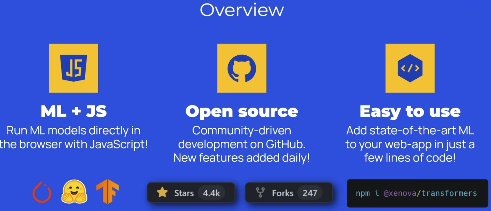
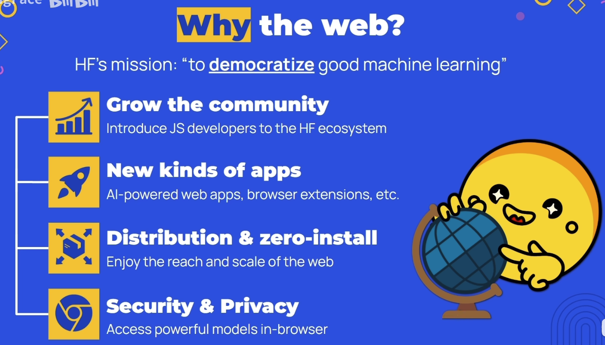
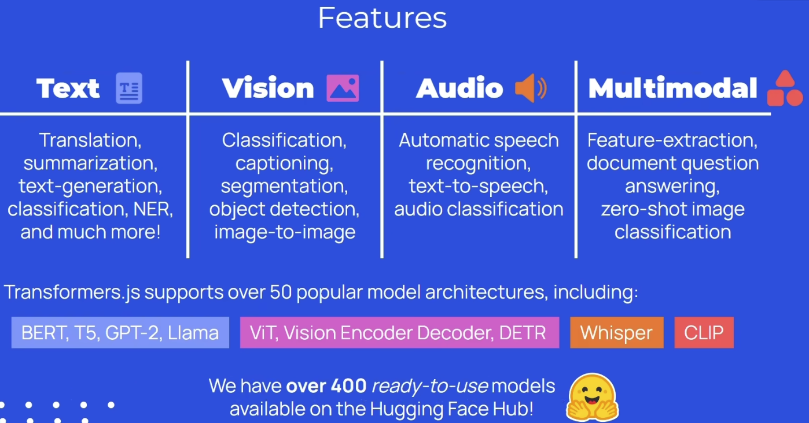
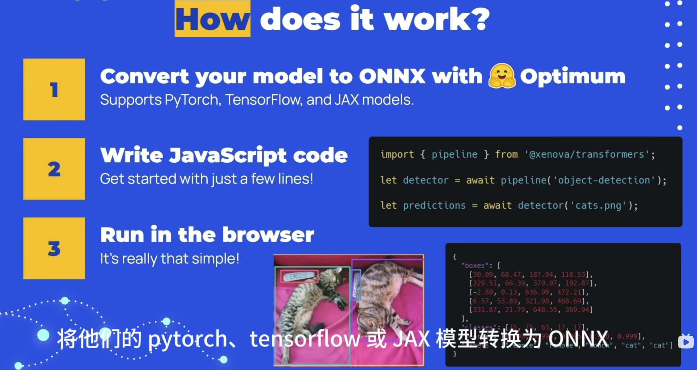
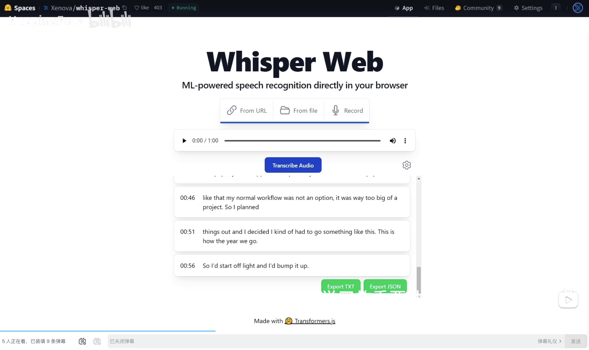
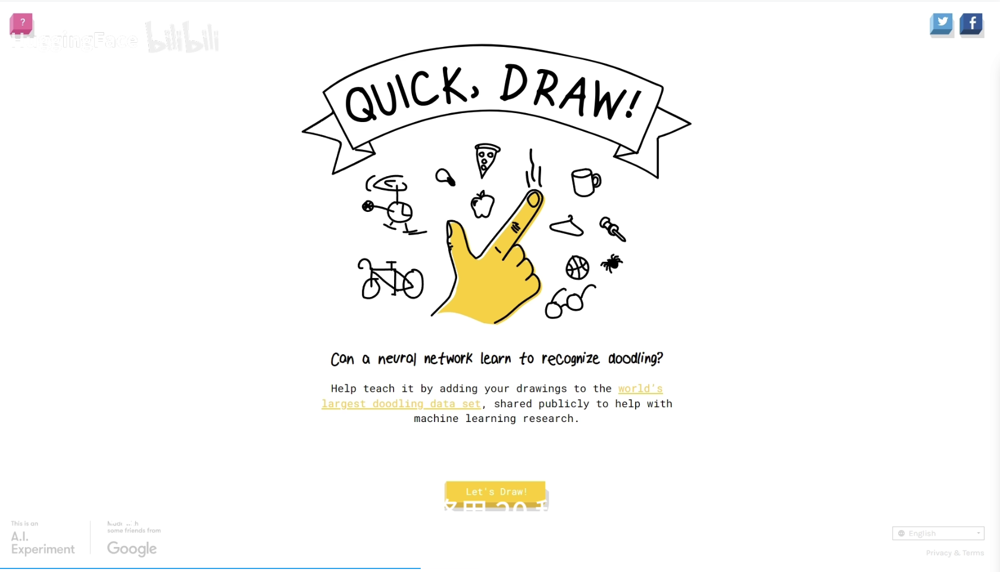
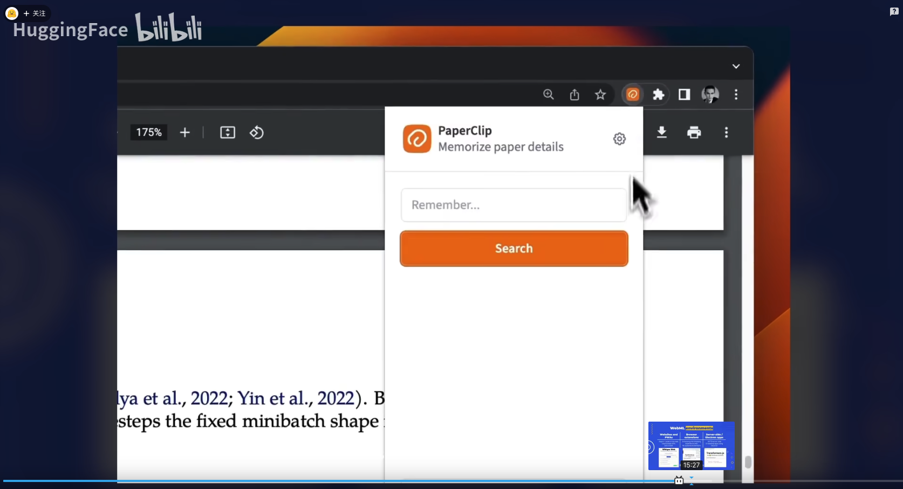
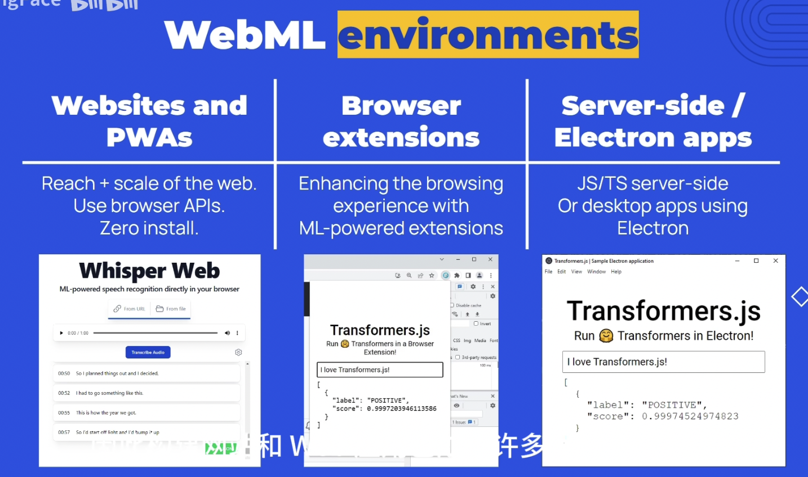
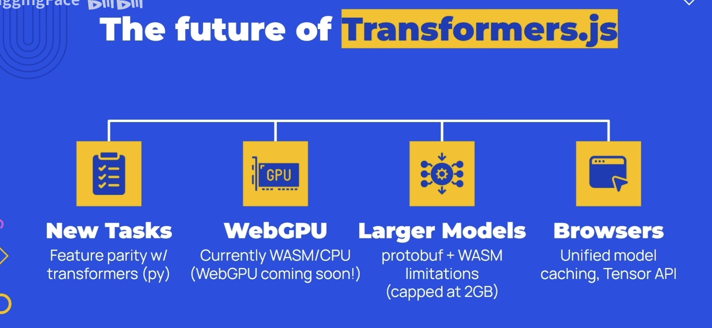

# transformer.js

- [简介](#%E7%AE%80%E4%BB%8B)
  * [为什么AI？](#%E4%B8%BA%E4%BB%80%E4%B9%88ai)
  * [为什么 Web？](#%E4%B8%BA%E4%BB%80%E4%B9%88-web)
- [有哪些功能？](#%E6%9C%89%E5%93%AA%E4%BA%9B%E5%8A%9F%E8%83%BD)
- [如何使用？](#%E5%A6%82%E4%BD%95%E4%BD%BF%E7%94%A8)
  * [生产模型](#%E7%94%9F%E4%BA%A7%E6%A8%A1%E5%9E%8B)
  * [发布模型](#%E5%8F%91%E5%B8%83%E6%A8%A1%E5%9E%8B)
  * [使用模型](#%E4%BD%BF%E7%94%A8%E6%A8%A1%E5%9E%8B)
- [效果评估](#%E6%95%88%E6%9E%9C%E8%AF%84%E4%BC%B0)
  * [案例分析（实际应用展示）](#%E6%A1%88%E4%BE%8B%E5%88%86%E6%9E%90%E5%AE%9E%E9%99%85%E5%BA%94%E7%94%A8%E5%B1%95%E7%A4%BA)
  * [性能分析](#%E6%80%A7%E8%83%BD%E5%88%86%E6%9E%90)
  * [跨端能力](#%E8%B7%A8%E7%AB%AF%E8%83%BD%E5%8A%9B)
- [未来展望](#%E6%9C%AA%E6%9D%A5%E5%B1%95%E6%9C%9B)

---

## 简介

提供了在javascript中运行预训练模型的方法。降低web开发者使用机器学习能力的门槛，弥补web开发和机器学习之间的鸿沟。

通过将AI带入浏览器，实现huggingface的使命：让机器学习走向大众。（to democratize ggood machine learning）

### 为什么AI？
大家都懂

### 为什么 Web？

第三点也挺重要的，每当推出新模型或新应用，人们首先想看的是看web demo。无打扰无安装打开即用的重要性怎么强调都不过分。降低用户的使用门槛对产品的推广至关重要。

## 有哪些功能？

## 如何使用？
### 生产模型
把预训练好的模型，转化为通过的onnx格式，就可以被transformer.js拿来用了。

transformer.js提供了转换甲苯Optimum，可以把tensorflow、pytorch等模型转换为onnx。

但注意受protobuf+WASM的技术栈影响，目前只支持最多2GB

### 发布模型
hugging face 提供了类似 npm registry 的管理平台，用户可以将 onnx 模型上传。

### 使用模型
简单三步

## 效果评估
### 案例分析（实际应用展示）
1. 语音转录、翻译：

语音识别效果超过 chrome speech API

2. 语义图像搜索（案例中用的模型50MB，图像2.5万张。忽略模型和数据库加载时间，计算时间只有50ms，还是在纯js的情况下）

3. google 的 quick draw

4. 论文中进行自然语言搜索

### 性能分析
1. 模型加载时间
    1. 看你模型大小和网速，很多几十M的模型就有很好的效果。
2. 模型执行时间
    1. 语义图像搜索。模型50MB，图像2.5万张。忽略模型和数据库加载时间，计算时间只有50ms。
3. 内存占用
    1. 受技术影响，模型最多不超2GB。。。

### 跨端能力

## 未来展望

1. 新任务和新模型，力争与Python库抗衡
2. 从 WASM+CPU 转向 WebGPU（PS：和 WebNN 是两种不同的思路）
3. 取消 2GB 模型的限制（限制来自于protobuf和wasm，为大模型带来了限制）
4. 与下一代浏览器整合（下一代浏览器会更加关注科学计算和 AI API 的浏览器。浏览器提供类似chrome扩展商店的模型商店，用户只需一键安装）

[https://www.bilibili.com/video/BV19c411B7QU/?spm_id_from=333.337.search-card.all.click&vd_source=a637826c55b409b420b4b6584a6e8379](https://www.bilibili.com/video/BV19c411B7QU/?spm_id_from=333.337.search-card.all.click&vd_source=a637826c55b409b420b4b6584a6e8379)

> 更新: 2023-12-08 07:24:02  
> 原文: <https://www.yuque.com/viruspc/el3mi0/gdhrl5t4e7kg44z0>