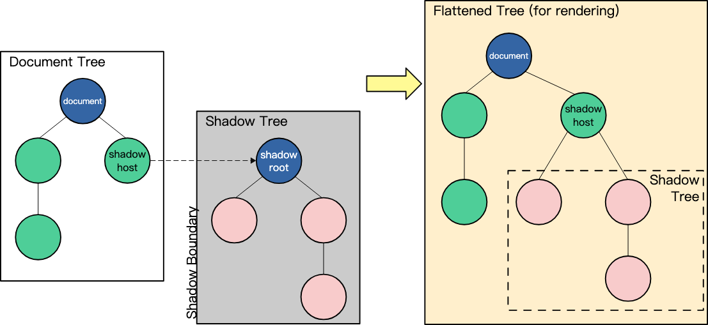
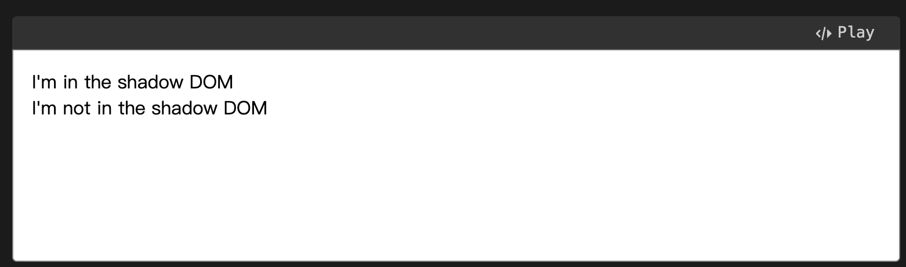
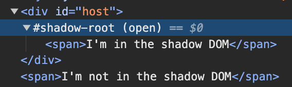
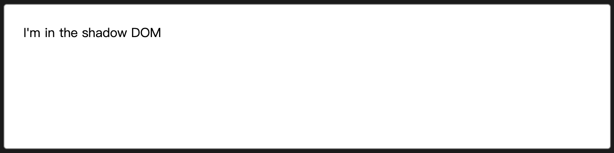
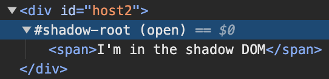
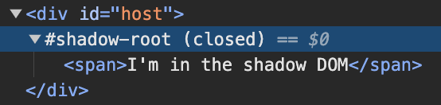

# Shadow DOM

- [Introduction](#introduction)
- [High-level view](#high-level-view)
- [创建和使用](#%E5%88%9B%E5%BB%BA%E5%92%8C%E4%BD%BF%E7%94%A8)
  * [Imperatively with JavaScript](#imperatively-with-javascript)
  * [Declaratively with HTML](#declaratively-with-html)
- [encapsulation](#encapsulation)
- [References](#references)

---

## Introduction

An important aspect of custom elements is encapsulation, because a custom element, by definition, is a piece of reusable functionality: it might be dropped into any web page and be expected to work.

So it's important that code running in the page should not be able to accidentally break a custom element by modifying its internal implementation. **Shadow DOM enables you to attach a DOM tree to an element, and have the internals of this tree hidden from JavaScript and CSS running in the page.**

## High-level view

Shadow DOM allows\*\* hidden DOM trees to be attached to elements in the regular DOM tree\*\* — this shadow DOM tree starts with a shadow root, underneath which you can attach any element, in the same way as the normal DOM.



There are some bits of shadow DOM terminology to be aware of:

* Shadow host: The regular DOM node that the shadow DOM is attached to.
* Shadow tree: The DOM tree inside the shadow DOM.
* Shadow boundary: the place where the shadow DOM ends, and the regular DOM begins.
* Shadow root: The root node of the shadow tree.

The difference is that none of the code inside a shadow DOM can affect anything outside it, allowing for handy encapsulation.

在 shadow DOM 向开发者提供之前，浏览器早就通过它来实现一些html元素了，比如 video 元素，video元素会提供一系列控件。

## 创建和使用

### Imperatively with JavaScript

```html
<div id="host"></div>
<span>I'm not in the shadow DOM</span>
```

```javascript
const host = document.querySelector("#host");
const shadow = host.attachShadow({ mode: "open" });
const span = document.createElement("span");
span.textContent = "I'm in the shadow DOM";
shadow.appendChild(span);

```

结果：





### Declaratively with HTML

you can use the `<template>` element to declaratively define the shadow DOM. The key to this behavior is the enumerated `shadowrootmode` attribute, which can be set to either open or closed, the same values as the mode option of `attachShadow()` method.

一般默认不展示 template 的内容，但 shadowrootmode='open' 时比较特殊

```html
<div id="host2">
  <template shadowrootmode="open">
    <span>I'm in the shadow DOM</span>
  </template>
</div>

```





> Note: By default, contents of `<template>` are not displayed. In this case, because the shadowrootmode="open" was included, the shadow root is rendered. In supporting browsers, the visible contents within that shadow root are displayed.

## encapsulation

* js:
  * 通过`document.querySelectorAll`，会发现找不到 shadow dom tree 上的元素。
  * 当 shadow dom 为 `open`mode时，可以通过`host.shadowRoot.querySelectorAll`来找 shadow dom tree 上的元素。
  * 当 shadow dom 为 `close`mode时，不可以通过`host.shadowRoot.querySelectorAll`来找 shadow dom tree 上的元素，来提供更好的安全性。但也不绝对安全，可以在创建shadowRoot时手动保持一个引用，后续通过这个引用来`query`。
  * 以上几条同样适用于 `getElementById`、`querySelector`
* css:
  * 页面的 css 不影响 shadow DOM 内的css。
  * shadow dom 的 css 不影响页面。
  * 要想为shadow dom 添加样式，两种方式：
    * Programmatically, by constructing a `CSSStyleSheet` object and attaching it to the shadow root.

```javascript
const sheet = new CSSStyleSheet();
sheet.replaceSync("span { color: red; border: 2px dotted black;}");

const host = document.querySelector("#host");

const shadow = host.attachShadow({ mode: "open" });
shadow.adoptedStyleSheets = [sheet];

const span = document.createElement("span");
span.textContent = "I'm in the shadow DOM";
shadow.appendChild(span);
```

```
    * Declaratively, by adding a `<style>` element in a `<template>` element's declaration.
```

```html
<template id="my-element">
  <style>
    span {
      color: red;
      border: 2px dotted black;
    }
  </style>
  <span>I'm in the shadow DOM</span>
</template>

<div id="host"></div>
<span>I'm not in the shadow DOM</span>

```

```javascript
const host = document.querySelector("#host");
const shadow = host.attachShadow({ mode: "open" });
const template = document.getElementById("my-element");

shadow.appendChild(template.content);

```

```javascript
let host = document.createElement("div");
let shadowRoot = host.attachShadow({ mode: "open" });
 // It's okay. shadowHost.shadowRoot returns a shadow root if it is open.
console.assert(host.shadowRoot == shadowRoot);
```

```javascript
let host = document.createElement("div");
let shadowRoot = host.attachShadow({ mode: "closed" });
// shadowHost.shadowRoot does not return the shadow root if it is closed.
console.assert(host.shadowRoot == null); 
```



## References

* <https://developer.mozilla.org/en-US/docs/Web/API/Web_components/Using_shadow_DOM>
* <https://blog.revillweb.com/open-vs-closed-shadow-dom-9f3d7427d1af>
* [What’s New in Shadow DOM v1 (by examples) - hayato](https://hayatoito.github.io/2016/shadowdomv1/)


> 更新: 2024-02-16 08:37:19  
> 原文: <https://www.yuque.com/viruspc/el3mi0/gmklagqnk62oouel>