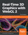
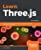
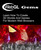
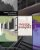
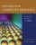

# WebGL/WebGPU/three.js Resources

  * [Browser-related](#browser-related)
  * [Reference Pages](#reference-pages)
  * [Forums and News](#forums-and-news)
  * [Tools](#tools)
  * [Three.js](#threejs)
  * [Courses and Tutorials for WebGL and Three.js](#courses-and-tutorials-for-webgl-and-threejs)
  * [WebGL 2](#webgl-2)
  * [File Formats](#file-formats)
  * [WebVR](#webvr)
  * [WebGPU](#webgpu)
  * [Other Frameworks](#other-frameworks)
  * [Compression](#compression)
  * [More Links](#more-links)
  * [Books](#books)
- [References](#references)

---

## Browser-related
Does this browser support WebGL? Test [here](https://get.webgl.org/).  
What WebGL extensions does this browser support? Test [here](https://webglreport.com/), and [here](http://renderingpipeline.com/webgl-extension-viewer/), and [here](https://www.khronos.org/registry/webgl/sdk/tests/extra/webgl-info.html), and [here](https://alteredqualia.com/tools/webgl-features/).  
What browser versions support WebGL? Find out [here](https://caniuse.com/#feat=webgl).  
How do I start up my browser for local development? Chrome: **--allow-file-access-from-files** else check the [three.js page](https://threejs.org/docs/#manual/introduction/How-to-run-thing-locally) or [Udacity page](https://www.udacity.com/wiki/cs291/enabling-webgl).  
What's my GPU info on Chrome? Paste in this URL: chrome://gpu/  
How do I use native OpenGL instead of ANGLE for Windows Chrome and Firefox? Find out [here](https://www.geeks3d.com/20130611/webgl-how-to-enable-native-opengl-in-your-browser-windows/).  
What other command line options are there for Chrome? Find out [here](https://peter.sh/experiments/chromium-command-line-switches/).  
You just want eye candy? Try [here](https://experiments.withgoogle.com/search?q=WebGL) for starters.  

## Reference Pages
Khronos [Reference card](https://www.khronos.org/files/webgl/webgl-reference-card-1_0.pdf)  
[Khronos Wiki](https://www.khronos.org/webgl/wiki/Main_Page).  
[Blacklist](https://www.khronos.org/webgl/wiki/BlacklistsAndWhitelists) of GPUs that don't run WebGL.  
[OpenGL ES Shading Language functions](https://www.shaderific.com/glsl-functions/), used for WebGL/Three.js shaders.

## Forums and News
[WebGL Dev List](https://groups.google.com/forum/#!forum/webgl-dev-list) on Google Groups  
Twitter: [#threejs](https://twitter.com/search?q=%23threejs&src=typd), [#webgl](https://twitter.com/search?q=%23webgl&src=typd)  
Reddit: [three.js](https://www.reddit.com/r/threejs), [WebGL](https://www.reddit.com/r/webgl/)

## Tools
[Spector.js](https://spector.babylonjs.com/) for examining renders and state. [Documentation](https://www.realtimerendering.com/blog/debugging-webgl-with-spectorjs/).  
[about:tracing](https://www.html5rocks.com/en/tutorials/games/abouttracing/) in Google Chrome, for examining GPU and CPU usage.  
[Debuggers and profilers](https://www.realtimerendering.com/blog/webgl-debugging-and-profiling-tools/), [profiling tips](https://cesium.com/blog/2014/12/01/webgl-profiling-tips/), [browser editors](https://www.realtimerendering.com/blog/webgl-browser-editors/), [Cozzi's list](https://www.realtimerendering.com/blog/webgl-resources/) (old)  
[Firefox Canvas Debugger](https://hacks.mozilla.org/2014/03/introducing-the-canvas-debugger-in-firefox-developer-tools/)  
[Shader compile/link performance](https://toji.github.io/shader-perf/)  
[Chrome shader editor](https://github.com/spite/ShaderEditorExtension)  
[Texture Format Tester](https://toji.github.io/texture-tester/)  
[Analyzing traces](https://google.github.io/tracing-framework/analyzing-traces.html)

## Three.js
[Homepage](https://threejs.org/) (which includes so very much), [Lee Stemkoski's demos](https://stemkoski.github.io/Three.js/), [Yomotsu examples](https://yomotsu.github.io/threejs-examples/), Udacity [demos](https://www.realtimerendering.com/udacity/?load=demo/unit7-view-pipeline.js) and [code](https://github.com/udacity/cs291)  
[Introductory tutorial](https://discoverthreejs.com/book/introduction/) from an [free book](https://discoverthreejs.com/book/), with coding inside the browser.  
[Quick reference](https://www.udacity.com/wiki/cs291/threejs-reference), [API](https://www.staunsholm.dk/THREE/jsdoc/), [wiki docs](https://github.com/mrdoob/three.js/wiki), [object overview](http://ushiroad.com/3j/)  
[Thumbnails of examples](https://www.realtimerendering.com/threejs/)  
[useful links page](https://threejs.org/docs/#manual/introduction/Useful-links)  
Demos: beyond [three.js's](https://threejs.org/), find more at [Learning Three.js](https://learningthreejs.com/), [Edan Kwan](https://edankwan.com/), [Fractal Fantasy](https://fractalfantasy.net/#/4/uncannyvalley), and [Autodesk Forge](https://viewer-rocks.autodesk.io/).  
[Source code](https://github.com/mrdoob/three.js/releases)  
[Editor](https://threejs.org/editor/)  
[Intro "live" slideset](https://fhtr.org/BasicsOfThreeJS/#1) (and [my own fork](https://www.realtimerendering.com/basics3js/#1)), [basics article](https://aerotwist.com/tutorials/getting-started-with-three-js/).

## Courses and Tutorials for WebGL and Three.js
[WebGL Fundamentals](https://webglfundamentals.org/) and [WebGL2 Fundamentals](https://webgl2fundamentals.org/) have numerous articles on getting started and specific subjects.  
The [three.js homepage](https://threejs.org/) links to

+ [Three.js Fundamentals](https://threejsfundamentals.org/)
+ The [Learn Three.js](https://smile.amazon.com/Learn-Three-js-Programming-animations-visualizations/dp/1788833287?tag=realtimerenderin) book (see [books](https://www.realtimerendering.com/webgl.html#books) for more info and resources)
+ Bruno Simon's [ultimate Three.js course](https://threejs-journey.xyz/) - unlike just about everything else listed here, this last one costs money (recommended by at least [one person](https://www.reddit.com/r/threejs/comments/o615a2/help_with_threejs/h2psiy7?utm_source=share&utm_medium=web2x&context=3))

The book [Discover Three.js](https://discoverthreejs.com/book/introduction/) has an extensive introduction to three.js online for free.  
[Udacity three.js MOOC course signup](https://www.udacity.com/course/interactive-3d-graphics--cs291), [resources](https://www.udacity.com/wiki/cs291), and [syllabus](https://www.udacity.com/wiki/cs291/syllabus) (dead links) - quite old, but the graphics lectures and general three.js knowledge is still valid (I admit a bias, as I designed it).  
[Barcelona WebGL MOOC course homepage](https://www.futurelearn.com/courses/3d-graphics-web-programmers)  
[WebGL Lessons: Three.js Shaders](https://github.com/Jam3/jam3-lesson-webgl-shader-threejs) on github  
Steven Wittens' [lovely computer graphics lessons](https://acko.net/files/fullfrontal/fullfrontal/webglmath/online.html) using Three.js, and [WebGL intro](https://acko.net/blog/on-webgl/) demofest  
Tarek Sherif's [tutorial slide presentation](https://tsherif.github.io/khronos-webgl-workshop1/#/) and [repository](https://github.com/tsherif/khronos-webgl-workshop1).  
[SIGGRAPH University introduction to WebGL](https://www.youtube.com/watch?v=tgVLb6fOVVc&feature=youtu.be)

## WebGL 2
Khronos [Reference card](https://www.khronos.org/files/webgl20-reference-guide.pdf)  
[Specification](https://www.khronos.org/registry/webgl/specs/latest/2.0/), related [OpenGL ES 3.0 specification](https://www.khronos.org/registry/OpenGL/specs/es/3.0/es_spec_3.0.pdf)  
[How to start using WebGL 2.](https://github.com/shrekshao/MoveWebGL1EngineToWebGL2/blob/master/Move-a-WebGL-1-Engine-To-WebGL-2-Blog-1.md)  
[New features in WebGL 2.](https://github.com/shrekshao/MoveWebGL1EngineToWebGL2/blob/master/Move-a-WebGL-1-Engine-To-WebGL-2-Blog-2.md)  
[Samples](https://github.com/WebGLSamples/WebGL2Samples) and [examples](https://github.com/tsherif/webgl2examples), and [bugs](https://github.com/tsherif/webgl2bugs).  
[PicoGL.js](https://tsherif.github.io/picogl.js/) - a minimal WebGL 2 rendering library; [tutorial](https://tsherif.wordpress.com/2017/07/26/webgl-2-development-with-picogl-js/)  
[Fun with WebGL 2.0](https://www.youtube.com/playlist?list=PLMinhigDWz6emRKVkVIEAaePW7vtIkaIF) - short tutorial videos, [code repository](https://github.com/sketchpunk/FunWithWebGL2), and [blog](https://sketchpunklabs.tumblr.com/)  
SIGGRAPH WebGL BOF videos: [2016](https://www.youtube.com/watch?v=0eWUzCa_M0E), [2017](https://www.youtube.com/watch?v=dAtdE4LQCSc), [2018](https://www.youtube.com/watch?v=FCAM-3aAzXg&t=3474s)  
[Brandon Jones' blog](https://blog.tojicode.com/2013/09/whats-coming-in-webgl-20.html)  
How Cesium creates [a WebGL 2 context](https://github.com/CesiumGS/cesium/blob/master/Source/Renderer/Context.js)  
Many more articles can be found at [Jendrik Ullner's site](https://www.jendrikillner.com/article_database/) - search on "webgl"

## File Formats
[glTF](https://github.com/KhronosGroup/glTF)

## WebVR
[WebVR info page](https://webvr.info/)

## WebGPU
[WebGPU spec](https://gpuweb.github.io/gpuweb/)  
[Chrome ships WebGPU](https://developer.chrome.com/blog/webgpu-release)  
Will Usher's tutorials: [Hello world triangle](https://www.willusher.io/graphics/2020/06/15/0-to-gltf-triangle), [bind groups](https://www.willusher.io/graphics/2020/06/20/0-to-gltf-bind-groups)  
[WebGPU Error Handling best practices](https://toji.dev/webgpu-best-practices/error-handling)  
Many more articles can be found at [Jendrik Ullner's site](https://www.jendrikillner.com/article_database/) - search on "webgpu"  

## Other Frameworks
[Shadertoy](https://www.shadertoy.com/) - play with, test, and share procedural shaders  
[babylon.js](https://www.babylonjs.com/)  
[glslify](https://github.com/glslify/glslify) - for shaders  
[Polygonjs](https://polygonjs.com/) - node-based shaders and more  
[PlayCanvas](https://playcanvas.com/)  
[WebGLStudio.js](https://webglstudio.org/)  
[A-FRAME](https://aframe.io/) - for VR, built atop three.js  
[CesiumJS](https://cesium.com/platform/cesiumjs/) - for globes and maps  
[Still more options](https://hackernoon.com/five-ways-to-build-webgl-apps-4c7eb541d193)  
[Wikipedia list](https://en.wikipedia.org/wiki/List_of_WebGL_frameworks)

## Compression
[Open3DGC](https://github.com/KhronosGroup/glTF/wiki/Open-3D-Graphics-Compression)  
[OpenCTM](http://openctm.sourceforge.net/)  
[Draco](https://github.com/google/draco)

## More Links
Just can't get enough? [Here are more](https://github.com/terkelg/awesome-creative-coding#shaders--opengl--webgl) on WebGL and many other subjects.

## Books
An undifferentiated listing of what I've found out there, though not exhaustive - I avoid "web technology" compendiums ("Learn Three.js, WebGL, HTML 5, and everything else in 24 Hours!") and books with no ratings and little information about them. Books are newest to oldest, and those older than five years old have been removed. Some books do come with free sample chapters and code samples (or the whole volume!), and some have extensive samples on Amazon or Google Books, linked.

| [Real-Time 3D Graphics with WebGL 2, Second Edition](https://smile.amazon.com/Real-Time-Graphics-WebGL-interactive-applications-ebook/dp/B07GVNQLH5?tag=realtimerenderin) , by Farhad Ghayour and Diego Cantor, Packt Publishing, October 2018 ([Table of Contents](https://www.packtpub.com/product/real-time-3d-graphics-with-webgl-2-second-edition/9781788629690) , [Google Books sample](https://books.google.com/books?id=Qel1DwAAQBAJ&printsec=frontcover) ). |
| :--- |
| [Learn Three.js, Third Edition](https://smile.amazon.com/Learn-Three-js-Programming-animations-visualizations/dp/1788833287?tag=realtimerenderin) , by Jos Dirksen, Packt Publishing, August 2018 ([Table of Contents](https://www.packtpub.com/product/learn-three-js-third-edition/9781788833288) , [code repository](https://github.com/josdirksen/learning-threejs-third) , [Google Books sample](https://www.google.com/books/edition/Learn_Three_js/cPFsDwAAQBAJ?hl=en&gbpv=1) ). |
| [WebGL Gems](https://smile.amazon.com/dp/B071JKN1XH?tag=realtimerenderin) , by Greg Sidelnikov, Learning Curve, June 2017. |
| [WebGL Insights](https://smile.amazon.com/WebGL-Insights-Patrick-Cozzi/dp/1498716075?tag=realtimerenderin) , edited by Patrick Cozzi, CRC Press, July 2015 ([book's website](http://webglinsights.com/) , [blog](https://webglinsights.blogspot.com/) ), [download for free](https://github.com/WebGLInsights/WebGLInsights.github.io/releases/download/v1.0/WebGL.Insights.-.Patrick.Cozzi.pdf) . |
| [Interactive Computer Graphics with WebGL (Seventh Edition)](https://smile.amazon.com/Interactive-Computer-Graphics-WebGL-Edition/dp/0133574849?tag=realtimerenderin) , by Edward Angel and Dave Shreiner, Addison-Wesley, March 2014 ([more info](https://www.pearson.com/us/higher-education/product/ANGEL-Interactive-Computer-Graphics-A-Top-Down-Approach-with-Web-GL-7th-Edition/9780133574845.html) , [figures and source code](https://www.cs.unm.edu/~angel/BOOK/INTERACTIVE_COMPUTER_GRAPHICS/SEVENTH_EDITION/) ). |

# References
+ [WebGL/three.js Resources](https://www.realtimerendering.com/webgl.html)

> 更新: 2023-05-20 11:22:59  
> 原文: <https://www.yuque.com/viruspc/el3mi0/nk0fomzu8ogq06r5>