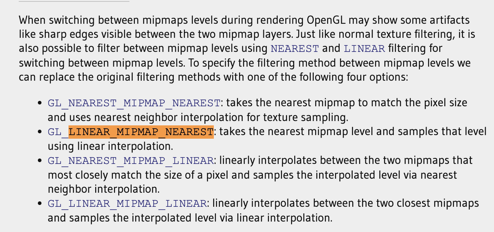

# mipmap

需要设置minFilter（pixel < texel）和magFilter(pixel>texel).

[https://learnopengl.com/Getting-started/Textures](https://learnopengl.com/Getting-started/Textures)

> 更新: 2023-05-11 03:50:06  
> 原文: <https://www.yuque.com/viruspc/el3mi0/ru2soxnrgwlr9hd4>