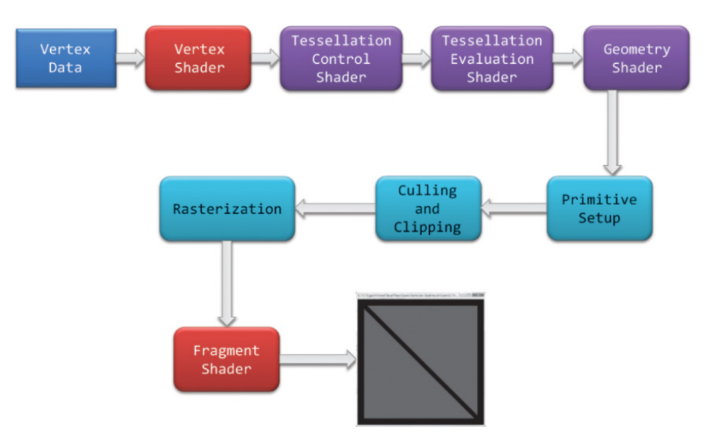
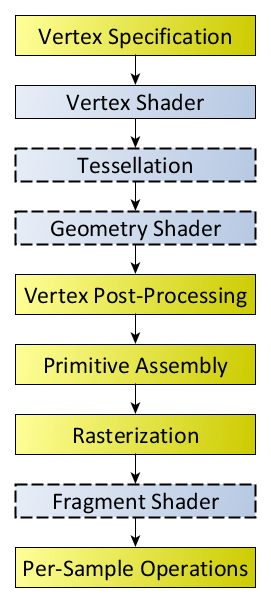

# **渲染管线**

- [Introduction](#introduction)
- [坐标空间](#%E5%9D%90%E6%A0%87%E7%A9%BA%E9%97%B4)
- [渲染流程](#%E6%B8%B2%E6%9F%93%E6%B5%81%E7%A8%8B)
- [References](#references)

---

(Vertex Shader) => Clip Space => (透视除法) => NDC => (视口变换) => Window Space => (Fragment Shader)

为什么需要透视除法?

为什么不能自己在vertex shd里进行透视除法？

# Introduction
为什么需要渲染管线？渲染管线是什么？

渲染管线的功能是通过给定虚拟相机、3D场景物体以及光源等场景要素来产生或者渲染一副2D的图像。

图形渲染管线主要包括两个功能：一是将物体3D坐标转变为屏幕空间2D坐标，二是为屏幕每个像素点进行着色。

渲染管线的一般流程如下图所示。分别是：

1. **顶点着色器**
2. 曲面细分
3. 几何着色器
4. **图元装配**
5. 裁剪剔除
6. **光栅化**
7. **片段着色器以及混合测试**






# 坐标空间
1. **模型空间**（Model Space / Object Space）：模型的局部坐标系。

=> vertex shader（编程）

2. **世界空间**（World Space）：场景的全局坐标系。
3. **观察空间**（View Space / Camera Space）：以相机为参考的坐标系。
4. **裁剪空间**（Clip Space）：用于裁剪视锥体外的顶点。

=> 图元装配-透视除法（硬件）

5. **标准化设备坐标**（NDC）：标准化范围的坐标，用于光栅化。

=> 图元装配-视口变换（硬件）

6. **屏幕空间**（Screen Space）：


# 渲染流程
1. **顶点着色器（Vertex Shader，可编程）**
    1. **输入：**模型空间，单个顶点；MVP变换矩阵。
    2. **输出：**裁剪空间，单个顶点
    3. **内容：**将顶点变换到观察空间，并投影到裁剪空间。模型空间=>世界空间=>观察空间=>裁剪空间
2. **顶点后处理（Vertex Post-Processing）**
    1. **Transform Feedback**
    2. **早期图元装配（Early Primitive Assembly）**
        1. **输入：**裁剪空间，顶点流
        2. **输出：**裁剪空间，图元序列
        3. **内容**：将顶点流转化为基础图元序（ convert a vertex stream into a sequence of base primitives [#](https://www.khronos.org/opengl/wiki/Primitive_Assembly#:~:text=4%20Face%20culling-,Early%20primitive%20assembly,generate%2011%20line%20base%20primitives.)）
    3. **曲面细分（Tessellation，可选，可编程）**

  a. **输入**：裁剪空间，单个顶点

  b. **输出**：裁剪空间，单个顶点

  c. **内容**：利用镶嵌化处理技术对三角面进行细分，以此来增加物体表面的三角面的数量

    4. **几何着色器（Geometry Shader，可选，可编程）**
        1. **输入：**裁剪空间，一个图元的一组顶点
        2. **输出：**裁剪空间，0个或1个或多个 的 同类型或不同类型的图元。
        3. **内容：**根据输入图元（点、线、三角形等）生成新的图元，可以增加或修改顶点数据以实现复杂的几何变换或效果。
        4. **应用**：
            1. 动态生成细节
                1. 草地或毛发效果：通过输入点图元生成多条草叶或毛发。
                2. 粒子系统：从输入点生成复杂的粒子形状（如火花或烟雾）
            2. 图元扩展
                1. 边框绘制，将三角形图元转换为线段图元
                2. 箭头绘制：从线段图元生成带箭头的矢量。
                3. 屏幕空间四边形：从点图元生成一个面片（例如用于绘制粒子或贴图）。
            3. 视锥裁剪
            4. 动态 LOD
        5. **例子**：

```glsl
#version 330 core

// 指定输入图元类型为三角形
layout(triangles) in;

// 指定输出图元类型为线段
layout(line_strip, max_vertices = 6) out;

void main() {
    // 输入的三个顶点分别是 gl_in[0], gl_in[1], gl_in[2]
    // gl_in 是一个数组，包含输入图元的所有顶点数据

    // 发射第一个线段 (顶点 0 -> 顶点 1)
    gl_Position = gl_in[0].gl_Position; // 顶点 0 的位置
    EmitVertex();                       // 发射顶点
    gl_Position = gl_in[1].gl_Position; // 顶点 1 的位置
    EmitVertex();                       // 发射顶点
    EndPrimitive();                     // 完成一个图元

    // 发射第二个线段 (顶点 1 -> 顶点 2)
    gl_Position = gl_in[1].gl_Position; // 顶点 1 的位置
    EmitVertex();                       // 发射顶点
    gl_Position = gl_in[2].gl_Position; // 顶点 2 的位置
    EmitVertex();                       // 发射顶点
    EndPrimitive();                     // 完成一个图元

    // 发射第三个线段 (顶点 2 -> 顶点 0)
    gl_Position = gl_in[2].gl_Position; // 顶点 2 的位置
    EmitVertex();                       // 发射顶点
    gl_Position = gl_in[0].gl_Position; // 顶点 0 的位置
    EmitVertex();                       // 发射顶点
    EndPrimitive();                     // 完成一个图元
}

```

    5. **图元装配（Primitive Assembly）**
        1. **输入：**裁剪空间，图元
        2. **输出：**屏幕空间，图元
        3. **内容：**
            1. 裁剪剔除
                1. 视锥体裁剪(Clipping)
                2. 背面剔除 (Back-Face Culling)
            2. 透视除法：
                1. 裁剪空间=>NDC
            3. 视口变换：
                1. NDC=>屏幕空间
                2. 裁切测试
3. **光栅化（Rasterization）**
    1. **输入：**屏幕空间，图元
    2. **输出：**屏幕空间，fragment 坐标
4. **Fragment Shader & Per-Sample Processing（可配置，可编程）**
    1. **输入：**屏幕空间，fragment坐标
    2. **输出：**屏幕空间，fragment颜色
    3. **内容**：
        1. Early Fragment Test (per sample processing)(现代GPU一般是放到fragment shader之前，也可能之后，看具体环境)
            1. 裁切测试（Scissor Test）
            2. 模板测试（Stencil Test） 
            3. 深度测试（Depth Test）  
        2. Fragment Shader
            1. 纹理
            2. 阴影
            3. 光照
            4. 混合
            5. 。。。

# References
+ [容易混淆的Clip Space vs NDC，透视除法](https://zhuanlan.zhihu.com/p/65969162)
+ [LearnOpenGL - Coordinate Systems](https://learnopengl.com/Getting-started/Coordinate-Systems#:~:text=Once%20all%20the%20vertices%20are,coordinates%20to%203D%20normalized%20device)
+ [猴子也能看懂的渲染管线（Render Pipeline）](https://zhuanlan.zhihu.com/p/137780634)
+ [Evernote Export](https://positiveczp.github.io/%E7%BB%86%E8%AF%B4%E5%9B%BE%E5%BD%A2%E5%AD%A6%E6%B8%B2%E6%9F%93%E7%AE%A1%E7%BA%BF.html)
+ [OpenGL Normal Vector Transformation](http://www.songho.ca/opengl/gl_normaltransform.html)
+ [WebGL2 3D Perspective Correct Texture Mapping](https://webgl2fundamentals.org/webgl/lessons/webgl-3d-perspective-correct-texturemapping.html)
+ [Primitive Assembly](https://www.khronos.org/opengl/wiki/Primitive_Assembly#:~:text=4%20Face%20culling-,Early%20primitive%20assembly,generate%2011%20line%20base%20primitives.)
+ [Tessellation - OpenGL Wiki](https://www.khronos.org/opengl/wiki/Tessellation)
+ [Vertex Post-Processing - OpenGL Wiki](https://www.khronos.org/opengl/wiki/Vertex_Post-Processing)
+ [Rendering Pipeline Overview - OpenGL Wiki](https://www.khronos.org/opengl/wiki/Rendering_Pipeline_Overview)


> 更新: 2025-08-09 10:50:32  
> 原文: <https://www.yuque.com/viruspc/el3mi0/dgo7gx9wk7lfvtmi>