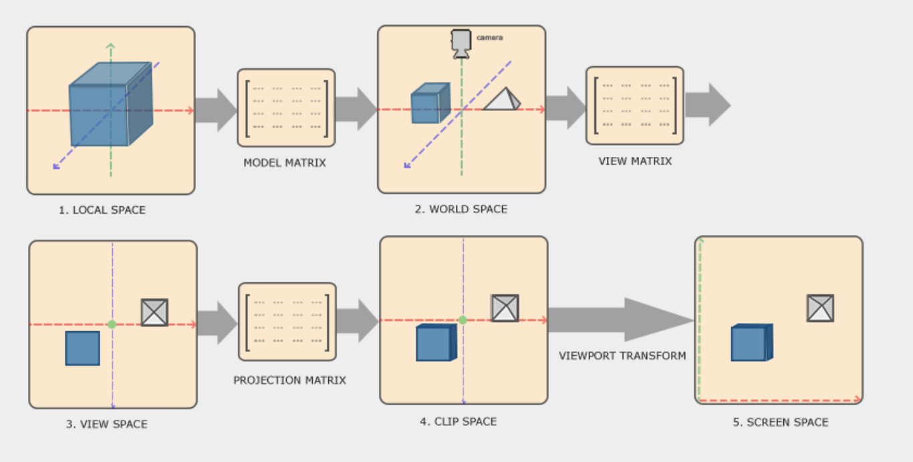
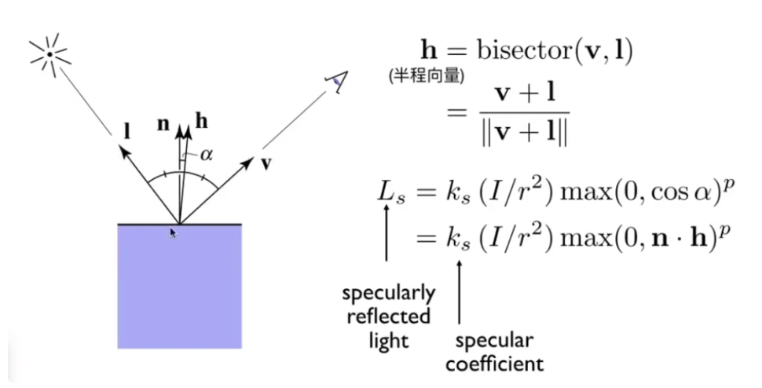
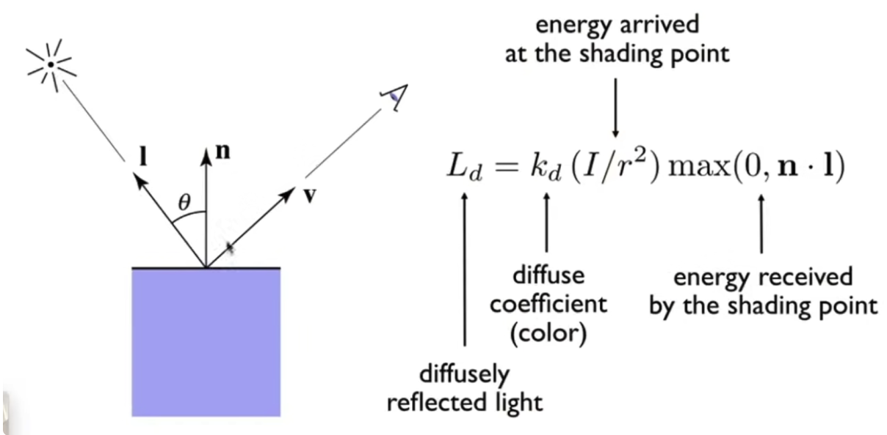

# 代码结构与组织

- [Introduction](#introduction)
- [Code Organization](#code-organization)
  * [Vertex Shader](#vertex-shader)
  * [Fragment Shader](#fragment-shader)
  * [JS](#js)
- [References](#references)

---

# Introduction

In this article, we show the common code organization of WebGL2.

# Code Organization

## Vertex Shader



* 没有选择直接向GPU传入world (model) matrx、view matrix和projection matrix三个矩阵，而是在CPU中利用这三个矩阵来预计算好各种矩阵:`u_world`, `u_worldInverseTranspose`（用于法向量的坐标变换）, `u_viewInverse`（相机在world space下的位置， 用于计算当前点到相机的方向向量）, `u_worldViewProjection`（用于计算`gl_Position`），在vertex shader中直接用。这样可以避免每个顶点重复计算各种矩阵。
*

```glsl
#version 300 es
 
uniform mat4 u_world;  // world matrix.
uniform mat4 u_worldInverseTranspose;  // inversed transposed world matrix, used to transform normal vector.
uniform mat4 u_worldViewProjection;  // used to calculate the gl_Postion

uniform vec3 u_lightWorldPos;  // the lignt position in the world space
uniform vec3 u_viewWorldPos; // the camera position in the world space.
// uniform mat4 u_viewInverse;  // camera matrix. The u_viewInverse[3] is the camera position in the world space.
 
in vec4 a_position;
in vec3 a_normal;
in vec2 a_texcoord;
 
out vec4 v_position;
out vec2 v_texCoord;
out vec3 v_normal;
out vec3 v_surfaceToLight;
out vec3 v_surfaceToView;
 
void main() {
  // 该点的纹理坐标
  v_texCoord = a_texcoord;
  // clip space下的点坐标
  v_position = (u_worldViewProjection * a_position);
  // world space下的法向量，用于光照模型中计算漫反射和高光
  v_normal = (u_worldInverseTranspose * vec4(a_normal, 0)).xyz;
  // world space 下的表面（点）到光线的方向向量，用于计算漫反射和高光
  v_surfaceToLight = u_lightWorldPos - (u_world * a_position).xyz;
  // world space 下的表面（点）到摄像机的方向向量，用于计算高光
  v_surfaceToView = (u_viewWorldPos - (u_world * a_position)).xyz;
  // v_surfaceToView = (u_viewInverse[3] - (u_world * a_position)).xyz;
  gl_Position = v_position;
}
```

## Fragment Shader

基于Blinn Phong模型和Phong shading： diffuse reflection + specular highlights + ambient lighting

Diffuse Reflection：



Specular highlights



Ambient lighting，环境光照: 光照不直接照射的地方，通过来自环境的反射光照亮

```glsl
#version 300 es
precision highp float;
 
in vec4 v_position;
in vec2 v_texCoord;
in vec3 v_normal;
in vec3 v_surfaceToLight;
in vec3 v_surfaceToView;
 
uniform vec4 u_lightColor;  // 光线颜色
uniform vec4 u_ambient;  // 环境光系数（各个颜色通道的系数）
uniform sampler2D u_diffuse;  // 材质（漫反射颜色）
uniform vec4 u_specular;  // 高光颜色
uniform float u_shininess;  // 高光的shininess
uniform float u_specularFactor;  // 高光系数
 
out vec4 outColor;

// 计算漫反射和高光的系数
vec4 lit(float l ,float h, float m) {
  return vec4(1.0,
              max(l, 0.0),
              (l > 0.0) ? pow(max(0.0, h), m) : 0.0,
              1.0);
}
 
void main() {
  // 材质颜色
  vec4 diffuseColor = texture(u_diffuse, v_texCoord);
  // 插值后该像素的法向量（着色频率为逐像素，采用phong shading）
  vec3 a_normal = normalize(v_normal);
  // 插值后的光线方向
  vec3 surfaceToLight = normalize(v_surfaceToLight);
  // 插值后的相机方向
  vec3 surfaceToView = normalize(v_surfaceToView);
  // 半程向量，用于计算高光
  vec3 halfVector = normalize(surfaceToLight + surfaceToView);
  vec4 litR = lit(dot(a_normal, surfaceToLight), // 漫反射系数
                  dot(a_normal, halfVector), // 高光系数
                  u_shininess);  // 控制高光的范围
  outColor = vec4((
    u_lightColor 
    * (diffuseColor * litR.y  // diffuse reflection
      + diffuseColor * u_ambient  // ambient lighting
      + u_specular * litR.z * u_specularFactor)).rgb,  // specular highlighting
    diffuseColor.a);
}
```

## JS

```javascript
// 0. Create program
const program = createProgramFromSource(gl, vertexShader, fragmentShader);

// 1. At initialization time
// 1.1. get Locations
const u_worldLoc                 = gl.getUniformLocation(program, "u_world");
const u_worldViewProjectionLoc   = gl.getUniformLocation(program, "u_worldViewProjection");
const u_worldInverseTransposeLoc = gl.getUniformLocation(program, "u_worldInverseTranspose");
const u_lightWorldPosLoc         = gl.getUniformLocation(program, "u_lightWorldPos");
const u_viewWorldPos             = gl.getUniformLocation(program, "u_viewWorldPos");
// const u_viewInverseLoc           = gl.getUniformLocation(program, "u_viewInverse");
const u_lightColorLoc            = gl.getUniformLocation(program, "u_lightColor");
const u_ambientLoc               = gl.getUniformLocation(program, "u_ambient");
const u_diffuseLoc               = gl.getUniformLocation(program, "u_diffuse");
const u_specularLoc              = gl.getUniformLocation(program, "u_specular");
const u_shininessLoc             = gl.getUniformLocation(program, "u_shininess");
const u_specularFactorLoc        = gl.getUniformLocation(program, "u_specularFactor");
 
const a_positionLoc              = gl.getAttribLocation(program, "a_position");
const a_normalLoc                = gl.getAttribLocation(program, "a_normal");
const a_texCoordLoc              = gl.getAttribLocation(program, "a_texcoord");
 
// 1.2. Setup all the buffers and attributes (assuming you made the buffers already)
const vao = gl.createVertexArray();
gl.bindVertexArray(vao);
gl.bindBuffer(gl.ARRAY_BUFFER, positionBuffer);
gl.enableVertexAttribArray(a_positionLoc);
gl.vertexAttribPointer(a_positionLoc, positionNumComponents, gl.FLOAT, false, 0, 0);
gl.bindBuffer(gl.ARRAY_BUFFER, normalBuffer);
gl.enableVertexAttribArray(a_normalLoc);
gl.vertexAttribPointer(a_normalLoc, normalNumComponents, gl.FLOAT, false, 0, 0);
gl.bindBuffer(gl.ARRAY_BUFFER, texcoordBuffer);
gl.enableVertexAttribArray(a_texcoordLoc);
gl.vertexAttribPointer(a_texcoordLoc, texcoordNumComponents, gl.FLOAT, 0, 0);
 
// 2. At init or draw time depending on use.
const worldMat                   = computeWorldMatrix();
const worldInverseTransposeMat   = computeWorldInverseTransposeMatrix();
const someWorldViewProjectionMat = computeWorldViewProjectionMatrix();
const lightWorldPos              = [100, 200, 300];
const viewWorldPos               = [0, 0, 100];
// const viewInverseMat             = computeInverseViewMatrix();

const lightColor                 = [1, 1, 1, 1];
const ambientColor               = [0.1, 0.1, 0.1, 1];
const diffuseTextureUnit         = 0;
const specularColor              = [1, 1, 1, 1];
const shininess                  = 60;
const specularFactor             = 1;
 
// 3. At draw time. should use locations, program and VAO defined before.
// 3.1 Use program and bind VAO
gl.useProgram(program);
gl.bindVertexArray(vao);
 
// 3.2 Setup the textures used
gl.activeTexture(gl.TEXTURE0 + diffuseTextureUnit);
gl.bindTexture(gl.TEXTURE_2D, diffuseTexture);
 
// 3.3 Set all the uniforms.
gl.uniformMatrix4fv(u_worldLoc, worldMat);
gl.uniformMatrix4fv(u_worldInverseTransposeLoc, worldInverseTransposeMat);
gl.uniformMatrix4fv(u_worldViewProjectionLoc, false, someWorldViewProjectionMat);
gl.uniform3fv(u_lightWorldPosLoc, lightWorldPos);
gl.uniform3fv(u_viewWorldPosLoc, viewWorldPos);
// gl.uniformMatrix4fv(u_viewInverseLoc, viewInverseMat);

gl.uniform4fv(u_lightColorLoc, lightColor);
gl.uniform4fv(u_ambientLoc, ambientColor);
gl.uniform1i(u_diffuseLoc, diffuseTextureUnit);
gl.uniform4fv(u_specularLoc, specularColor);
gl.uniform1f(u_shininessLoc, shininess);
gl.uniform1f(u_specularFactorLoc, specularFactor);

// 3.4 draw call
gl.drawArrays(...);
```

# References

* [LearnOpenGL - Coordinate Systems](https://learnopengl.com/Getting-started/Coordinate-Systems)
* [WebGL2 - Less Code, More Fun](https://webgl2fundamentals.org/webgl/lessons/webgl-less-code-more-fun.html)
* [Lecture 07: Shading 1 (Illumination, Shading and Graphics Pipeline)](https://www.yuque.com/pengcheng-fuigs/el3mi0/vu5pozlvxkmu4m0w)
* <https://www.yuque.com/pengcheng-fuigs/bsdyhz/vpgil7t2pvuggcde/edit#UaSzj>


> 更新: 2023-05-10 14:31:27  
> 原文: <https://www.yuque.com/viruspc/el3mi0/vpgil7t2pvuggcde>