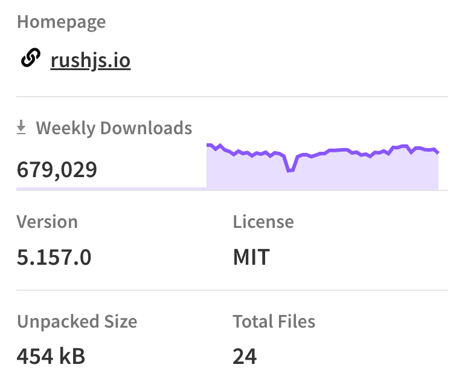

# Rush VS Turbo Repo

- [**Rush.js**](#rushjs)
- [**TurboRepo**](#turborepo)
- [**主要区别**](#%E4%B8%BB%E8%A6%81%E5%8C%BA%E5%88%AB)
- [**选择建议**](#%E9%80%89%E6%8B%A9%E5%BB%BA%E8%AE%AE)

---

<https://www.npmjs.com/package/@microsoft/rush>

<https://www.npmjs.com/package/turbo>

**Rush.js** 和 **TurboRepo** 都是用于管理\*\*单体仓库（Monorepo）\*\*的工具，它们解决的是一类问题：如何有效地组织、构建和管理一个包含多个子项目的代码仓库。但它们的设计理念、功能侧重点和适用场景有所不同。

### **Rush.js**

**Rush.js** 是一个专注于企业级单体仓库管理的工具，提供了强大的构建管理和依赖管理功能。它的主要特点包括：

1. **依赖版本锁定**：
   * 使用 `common-versions.json` 文件统一管理依赖版本，确保所有子项目使用一致的依赖版本。
   * 支持严格的版本控制，减少版本冲突问题。
2. **增量构建**：
   * Rush.js 提供了基于文件变更的增量构建机制，避免重复构建未变化的模块。
3. **支持复杂的构建流程**：
   * 适合大型项目，支持复杂的构建和发布流程。
   * 可以自定义构建步骤和任务。
4. **集成工具链**：
   * 内置支持 Yarn 和 PNPM，允许用户灵活选择包管理工具。
   * 提供对 CI/CD 流程的优化，支持分布式构建。
5. **适合企业级项目**：
   * 专为处理大型、复杂的单体仓库设计，适合拥有多个团队协作的大型项目。

### **TurboRepo**

**TurboRepo** 是一个更现代化、更轻量级的单体仓库管理工具，强调性能和易用性。它的主要特点包括：

1. **超快的构建缓存**：
   * TurboRepo 的核心是其高效的构建缓存系统，可以缓存任务输出，避免重复执行相同的构建任务。
   * 支持本地和远程缓存，适合分布式团队协作。
2. **任务管道管理**：
   * TurboRepo 使用任务管道（Pipeline）来定义构建任务之间的依赖关系，确保任务的执行顺序正确。
3. **易于上手**：
   * 配置简单，适合中小型项目或需要快速迭代的团队。
   * 可以直接与现有的工具链（如 Yarn Workspaces、PNPM）集成。
4. **适用场景**：
   * 更适合现代化前端项目，尤其是需要高性能构建的场景。
   * 适合团队规模较小或代码库复杂度较低的项目。

***

### **主要区别**

| 特性 | Rush.js | TurboRepo |
| --- | --- | --- |
| **复杂度** | 高，适合大型、复杂项目 | 低，适合中小型项目 |
| **构建缓存** | 支持，但不如 TurboRepo 强大 | 核心功能，性能优异 |
| **依赖管理** | 强调统一的依赖版本管理 | 依赖管理交由包管理工具处理 |
| **配置难度** | 配置较复杂，适合企业级项目 | 配置简单，易于上手 |
| **适用场景** | 企业级单体仓库，复杂构建流程 | 前端项目、高性能构建场景 |

***

### **选择建议**

* 如果你正在管理一个**大型企业级项目**，需要严格的依赖版本控制和复杂的构建流程，选择 **Rush.js**。
* 如果你需要一个轻量级、高性能的工具来管理单体仓库，尤其是前端项目，选择 **TurboRepo**。

两者在功能上有一定的重叠，但适用场景和设计理念有所不同，可以根据项目需求选择合适的工具。

> 更新: 2025-08-17 04:15:07  
> 原文: <https://www.yuque.com/viruspc/el3mi0/fl9zaaqqkgiksfd1>