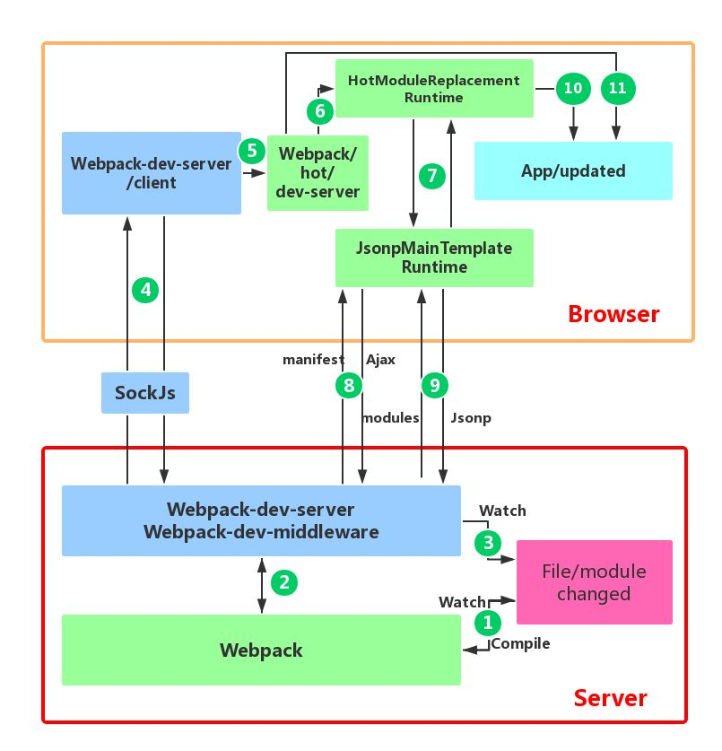
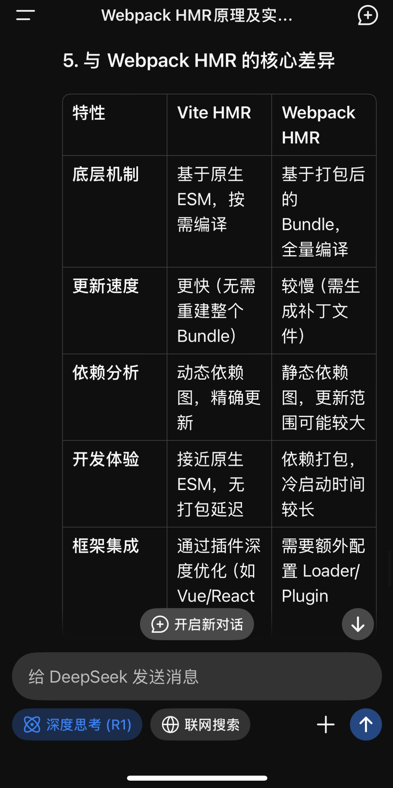
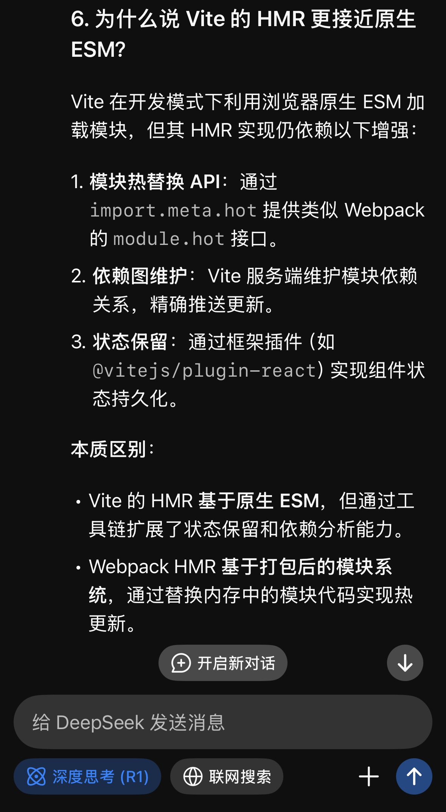

# HMR

- [文件监听](#%E6%96%87%E4%BB%B6%E7%9B%91%E5%90%AC)
- [HMR 流程](#hmr-%E6%B5%81%E7%A8%8B)
    + [**1. 函数定义与参数**](#1-%E5%87%BD%E6%95%B0%E5%AE%9A%E4%B9%89%E4%B8%8E%E5%8F%82%E6%95%B0)
    + [**2. 核心代码逻辑**](#2-%E6%A0%B8%E5%BF%83%E4%BB%A3%E7%A0%81%E9%80%BB%E8%BE%91)
      - [**(1) 更新模块缓存**](#1-%E6%9B%B4%E6%96%B0%E6%A8%A1%E5%9D%97%E7%BC%93%E5%AD%98)
      - [**(2) 标记模块为已更新**](#2-%E6%A0%87%E8%AE%B0%E6%A8%A1%E5%9D%97%E4%B8%BA%E5%B7%B2%E6%9B%B4%E6%96%B0)
      - [**(3) 触发模块热替换检查**](#3-%E8%A7%A6%E5%8F%91%E6%A8%A1%E5%9D%97%E7%83%AD%E6%9B%BF%E6%8D%A2%E6%A3%80%E6%9F%A5)
    + [**3. 完整伪代码示例**](#3-%E5%AE%8C%E6%95%B4%E4%BC%AA%E4%BB%A3%E7%A0%81%E7%A4%BA%E4%BE%8B)
    + [**4. 关键设计细节**](#4-%E5%85%B3%E9%94%AE%E8%AE%BE%E8%AE%A1%E7%BB%86%E8%8A%82)
      - [**(1) 模块缓存替换**](#1-%E6%A8%A1%E5%9D%97%E7%BC%93%E5%AD%98%E6%9B%BF%E6%8D%A2)
      - [**(2) 依赖链冒泡更新**](#2-%E4%BE%9D%E8%B5%96%E9%93%BE%E5%86%92%E6%B3%A1%E6%9B%B4%E6%96%B0)
      - [**(3) 状态保留与回调触发**](#3-%E7%8A%B6%E6%80%81%E4%BF%9D%E7%95%99%E4%B8%8E%E5%9B%9E%E8%B0%83%E8%A7%A6%E5%8F%91)
    + [**5. 示例场景**](#5-%E7%A4%BA%E4%BE%8B%E5%9C%BA%E6%99%AF)
    + [**6. 与浏览器原生 ESM 的对比**](#6-%E4%B8%8E%E6%B5%8F%E8%A7%88%E5%99%A8%E5%8E%9F%E7%94%9F-esm-%E7%9A%84%E5%AF%B9%E6%AF%94)
    + [**总结**](#%E6%80%BB%E7%BB%93)

---

# 文件监听

1. 轮询判断文件的最后编辑时间是否变化
2. 某个文件发生了改变，并不会立刻告诉监听者，而是先缓存起来，而是等 aggregateTimeut

# HMR 流程



* 客户端将打包好的代码存储在内存中
* 在浏览端和客户端有一个ws长链接
* 当文件的真实hash值变化时，客户端会将新的hash值推给浏览器端
* 浏览器端向客户端发起请求jsonp请求新的文件





`webpackHotUpdate` 是 Webpack 热模块替换（HMR）的核心函数，负责在浏览器端动态替换模块代码并触发更新流程。其核心逻辑可分为以下步骤：

***

### **1. 函数定义与参数**

`webpackHotUpdate` 是 Webpack 注入到客户端的全局方法，通常定义在 HMR Runtime 中：

```javascript
function webpackHotUpdate(chunkId, moreModules) {
  // 逻辑实现
}
```

* **参数**：
  * `chunkId`：当前更新的 Chunk 名称（如 `"main"`）。
  * `moreModules`：包含新模块代码的对象，键为模块 ID，值为模块函数。

***

### **2. 核心代码逻辑**

#### **(1) 更新模块缓存**

```javascript
// 遍历新模块对象，覆盖旧模块
for (const moduleId in moreModules) {
  // 将新模块代码写入全局模块缓存 __webpack_modules__
  __webpack_modules__[moduleId] = moreModules[moduleId];
}
```

* **直接替换**：将 `moreModules` 中的新模块函数覆盖 `__webpack_modules__` 中的旧模块。
* **幂等性**：无论模块是否已存在，直接覆盖确保最新代码生效。

#### **(2) 标记模块为已更新**

```javascript
// 记录当前更新的模块 ID
currentUpdate = Object.keys(moreModules);
```

* **维护更新队列**：将本次更新的模块 ID 暂存到 `currentUpdate`，用于后续触发依赖链更新。

#### **(3) 触发模块热替换检查**

```javascript
// 调用 HMR Runtime 的 check 方法，启动更新流程
__webpack_require__.hmrC.check();
```

* `hmrC.check()`：HMR Runtime 的核心方法，负责检查更新并执行冒泡逻辑。

***

### **3. 完整伪代码示例**

```javascript
// Webpack 注入的 HMR Runtime 代码
var currentUpdate = [];
function webpackHotUpdate(chunkId, moreModules) {
  // 1. 替换模块缓存
  for (var moduleId in moreModules) {
    __webpack_modules__[moduleId] = moreModules[moduleId];
  }
  
  // 2. 记录更新的模块
  currentUpdate = Object.keys(moreModules);
  
  // 3. 触发热更新检查
  __webpack_require__.hmrC.check();
}

// HMR Runtime 的 check 方法（简化版）
__webpack_require__.hmrC.check = function() {
  // 遍历更新的模块，检查其父模块的依赖链
  currentUpdate.forEach(function(moduleId) {
    var parents = __webpack_require__.hmrD[moduleId]; // 获取依赖该模块的父模块列表
    parents.forEach(function(parentId) {
      var parentModule = __webpack_require__.c[parentId];
      // 检查父模块是否声明了 accept 回调
      if (parentModule.hot.accept) {
        parentModule.hot.accept(); // 触发回调
      } else {
        // 向上冒泡，直到找到 accept 或刷新页面
        __webpack_require__.hmrBubble(parentId);
      }
    });
  });
};
```

***

### **4. 关键设计细节**

#### **(1) 模块缓存替换**

* `__webpack_modules__`：Webpack 维护的全局模块缓存，存储所有已加载模块的代码。
* **即时生效**：替换后的模块代码在下次被 `__webpack_require__` 加载时会执行新逻辑。

#### **(2) 依赖链冒泡更新**

* `hmrD`**（依赖关系表）**：记录每个模块的父模块（谁依赖了它）。
* **冒泡策略**：从被修改的模块向上查找，直到找到声明 `module.hot.accept` 的模块或触发页面刷新。

#### **(3) 状态保留与回调触发**

* **模块实例复用**：模块的 `module.exports` 对象未被销毁，允许通过 `accept` 回调手动同步状态。
* **自定义更新逻辑**：开发者在 `accept` 回调中决定如何重新渲染组件或合并状态。

***

### **5. 示例场景**

假设修改模块 `B.js`，其父模块为 `A.js`：

1. `webpackHotUpdate`\*\* 执行\*\*：替换 `__webpack_modules__` 中的 `B.js`。
2. `hmrC.check()`\*\* 触发\*\*：找到 `A.js` 的模块实例。
3. \*\*检查 **`A.js`** 的 \*\*`accept`：
   * 若 `A.js` 声明了 `module.hot.accept("./B.js", callback)`，执行 `callback`。
   * 若未声明，继续向上冒泡至 `A.js` 的父模块（如入口文件）。

***

### **6. 与浏览器原生 ESM 的对比**

| **特性** | **Webpack HMR (**`webpackHotUpdate`**)** | **浏览器原生 ESM** |
| --- | --- | --- |
| **模块替换** | 直接替换内存中的模块函数 | 重新加载文件，生成新模块实例 |
| **状态保留** | 通过复用 `module.exports` 实现 | 完全重置，状态丢失 |
| **依赖链管理** | 自动追踪依赖关系，精准更新 | 无内置依赖分析，需手动处理 |
| **更新触发** | 服务端推送补丁文件，客户端自动处理 | 需手动刷新页面或重新加载模块 |

***

### **总结**

`webpackHotUpdate` 的核心逻辑是：

1. **替换模块缓存**：覆盖 `__webpack_modules__` 中的旧模块代码。
2. **触发依赖链更新**：通过 `hmrC.check()` 检查父模块的 `accept` 回调。
3. **冒泡或刷新**：沿依赖链向上传播更新，或回退到页面刷新。

这种设计使得 Webpack HMR 能在不刷新页面的情况下实现模块级热替换，同时为开发者提供了状态保留的灵活控制。

文件监听和热更新 <https://blog.csdn.net/weixin_43675447/article/details/120227206>

Webpack HMR 原理解析 <https://zhuanlan.zhihu.com/p/30669007>


> 更新: 2025-04-22 17:10:08  
> 原文: <https://www.yuque.com/viruspc/el3mi0/rkyn5t>