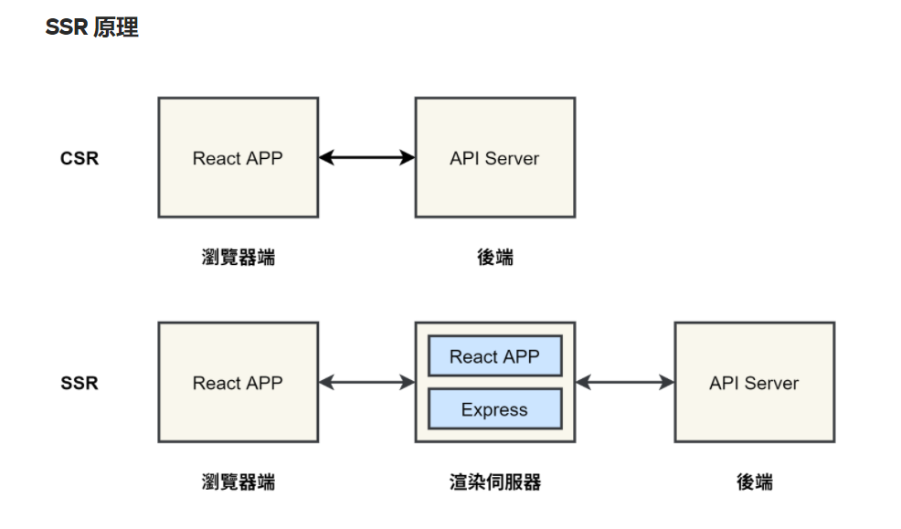

# SSR 与 CSR

- [SSR (Server Side Rendering)](#ssr-server-side-rendering)
- [特点](#%E7%89%B9%E7%82%B9)
  * [优点](#%E4%BC%98%E7%82%B9)
- [CSR(Client Side Rendering)](#csrclient-side-rendering)
  * [特点](#%E7%89%B9%E7%82%B9-1)
  * [优点](#%E4%BC%98%E7%82%B9-1)
  * [React + SSR做SEO和首屏渲染优化](#react--ssr%E5%81%9Aseo%E5%92%8C%E9%A6%96%E5%B1%8F%E6%B8%B2%E6%9F%93%E4%BC%98%E5%8C%96)
- [参考](#%E5%8F%82%E8%80%83)

---

# SSR (Server Side Rendering) 
# 特点
+ 页面的渲染发生在将HTML送到客户端浏览器**之前**。
+ 页面一旦送达，可以立刻被渲染。

## 优点
1. 首屏渲染快。 省去浏览器首次渲染的工作, 加快首屏显示速度。
2. 低性能设备友好。渲染压力转移到服务端。
3. SEO 友好。爬虫通常只请求HTML, 不请求JS。
4. 可访问性（ accessibility）好。
5. 安全性高。敏感数据和商业逻辑保持在服务端。
6. 适合静态网站。

# CSR(Client Side Rendering)
## 特点
+ 页面的渲染发生在将HTML送到客户端浏览器**之后**。
+ 页面送达后，需要等待js的送达和执行来进行渲染。

## 优点
1. 交互体验好。
2. 节省服务端资源。
3. 离线功能。通过在客户端缓存数据和逻辑来提供离线功能， 网络不稳定或断网后用户也可以继续使用网页的很多功能。
4. 适合web应用

**简而言之，就是数据拼接HTML字符串这件事放在服务端还是客户端造成了两者区别。**

**SSR强在首屏渲染。而CSR强在用户和页面多交互的场景和页面内容随时间动态变化的场景。**

****

## React + SSR做SEO和首屏渲染优化
中间加一个渲染服务器。在渲染服务器动态生成页面，类似java的servlet。

+ 擁有一個獨立的伺服器 (後端)，提供 API 可以請求資料。
+ 渲染伺服器與瀏覽器端都可以請求 API。
+ 渲染伺服器會在使用者請求 HTML 時，會請求 API 的資料，並將內容都事先放到 HTML 中。
+ **在第一次請求 HTML 後，之後的元件 routing、請求 API 都是在瀏覽器端執行。**

# 参考
+ [https://medium.com/%E6%89%8B%E5%AF%AB%E7%AD%86%E8%A8%98/server-side-rendering-ssr-in-reactjs-part1-d2a11890abfc](https://medium.com/%E6%89%8B%E5%AF%AB%E7%AD%86%E8%A8%98/server-side-rendering-ssr-in-reactjs-part1-d2a11890abfc)
+ SSR VS CSR ,一次讲个通透 - lipTone的文章 - 知乎 https://zhuanlan.zhihu.com/p/60975107
+ [https://solutionshub.epam.com/blog/post/what-is-server-side-rendering](https://solutionshub.epam.com/blog/post/what-is-server-side-rendering)
+ chatgpt
+ [https://www.yuque.com/pengcheng-fuigs/zpkvl7/ss2gmshomz03li1z?singleDoc#](https://www.yuque.com/pengcheng-fuigs/zpkvl7/ss2gmshomz03li1z?singleDoc#) 《Server and Client Components》

> 更新: 2023-04-19 09:59:10  
> 原文: <https://www.yuque.com/viruspc/el3mi0/nprp2n>