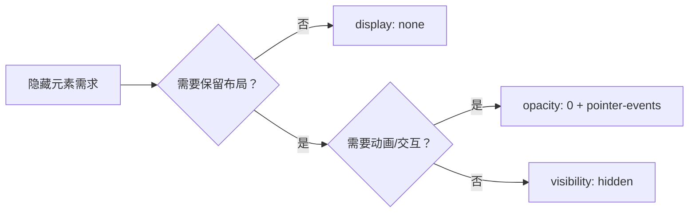

# Display，visibility，opacity

- [关键流程解释：](#%E5%85%B3%E9%94%AE%E6%B5%81%E7%A8%8B%E8%A7%A3%E9%87%8A)
- [性能优化建议：](#%E6%80%A7%E8%83%BD%E4%BC%98%E5%8C%96%E5%BB%BA%E8%AE%AE)

---

在浏览器不同渲染流程中发挥作用

| **特性** | `display: none` | `visibility: hidden` | `opacity: 0` |
| --- | --- | --- | --- |
| **是否在DOM树中** | ✅ 存在 | ✅ 存在 | ✅ 存在 |
| **是否在渲染树中** | ❌ **完全移除** | ✅ 保留 | ✅ 保留 |
| **是否参与布局计算** | ❌ **不占空间** | ✅ 保留空间 | ✅ 保留空间 |
| **是否参与绘制** | ❌ **不绘制** | ⚠️ 绘制但跳过像素填充（不可见） | ✅ 绘制为全透明 |
| **是否参与图层合成** | ❌ 不参与 | ✅ 参与 | ✅ 参与（GPU合成优化） |
| **是否响应事件** | ❌ 不可交互 | ❌ 不可交互 | ✅ **可交互**（除非设置pointer-events） |
| **切换时的渲染影响** | ✅ **触发重排+重绘**（布局重新计算） | ⚠️ **仅触发重绘**（布局不变） | ⚠️ **仅触发合成**（GPU处理） |
| **性能影响** | 🔴 高（影响布局） | 🟡 中（影响绘制） | 🟢 **低**（GPU优化） |
| **典型使用场景** | 需要完全移除元素时 | 需要保留布局占位时 | 需要动画效果时 |

***

### 关键流程解释：

1. **生成渲染树阶段**：
   * `display: none`：元素被**排除在渲染树外**
   * 其他两者：保留在渲染树中
2. **布局阶段（Layout/Reflow）**：
   * `display: none`：元素不参与布局计算，后续元素位置**重新排列**
   * `visibility: hidden`/`opacity: 0`：元素**保留原始占位**，不影响其他元素位置
3. **绘制阶段（Paint）**：
   * `visibility: hidden`：生成绘制指令但**跳过像素填充**
   * `opacity: 0`：正常绘制后由**GPU处理为透明**
   * `display: none`：无绘制操作
4. **合成阶段（Composite）**：
   * `opacity`变化通常由**GPU在独立图层处理**，无需重新绘制
   * 其他属性变更需要不同程度的重绘

***

### 性能优化建议：

* **高频动画**：优先使用 `opacity`（触发合成层优化）
* **频繁切换显示**：避免 `display: none`（触发重排）
* **保留布局结构**：使用 `visibility: hidden`
* **事件控制**：`opacity:0` 需配合 `pointer-events: none` 禁用交互

> 现代浏览器中，`opacity` 变化通常被提升到单独的合成层，由GPU直接处理透明度变化，避免了重排（Layout）和重绘（Paint），这是其性能优势的关键原因。

> 更新: 2025-06-10 01:13:58  
> 原文: <https://www.yuque.com/viruspc/el3mi0/gziuia95z6z59lvn>