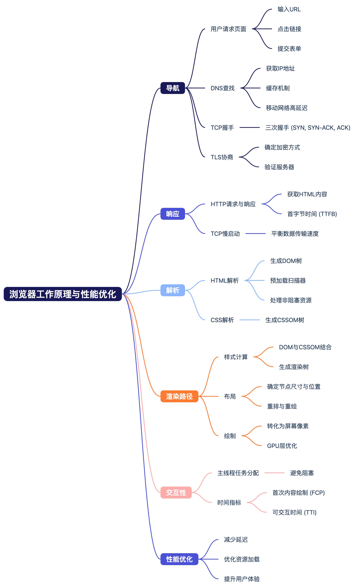
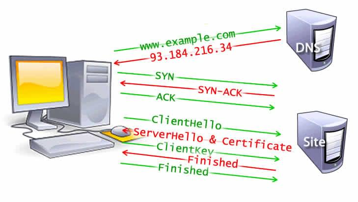
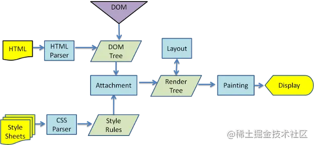
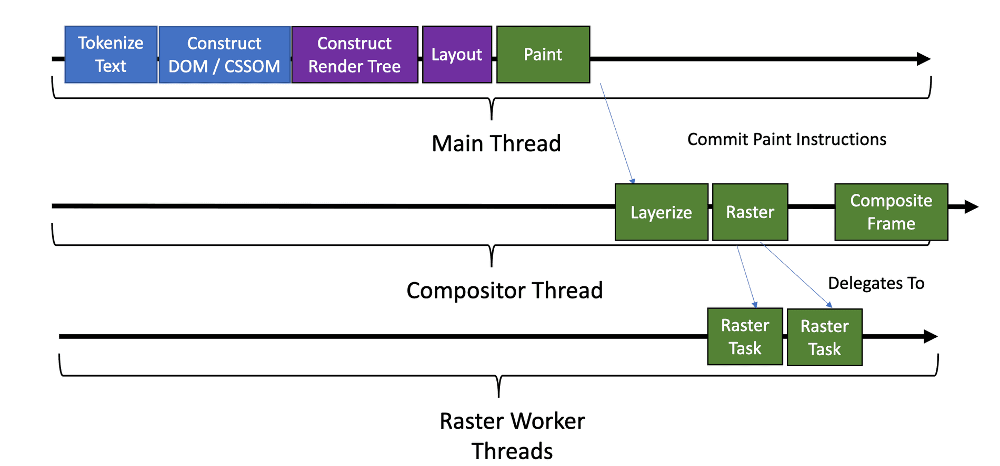
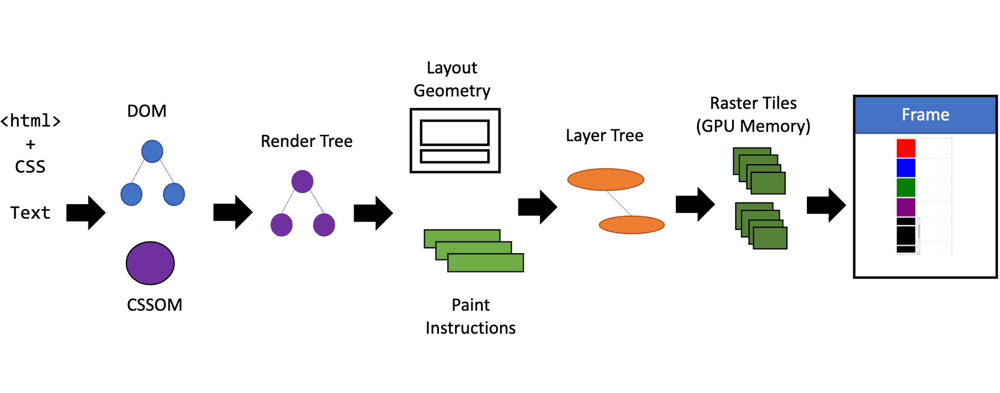
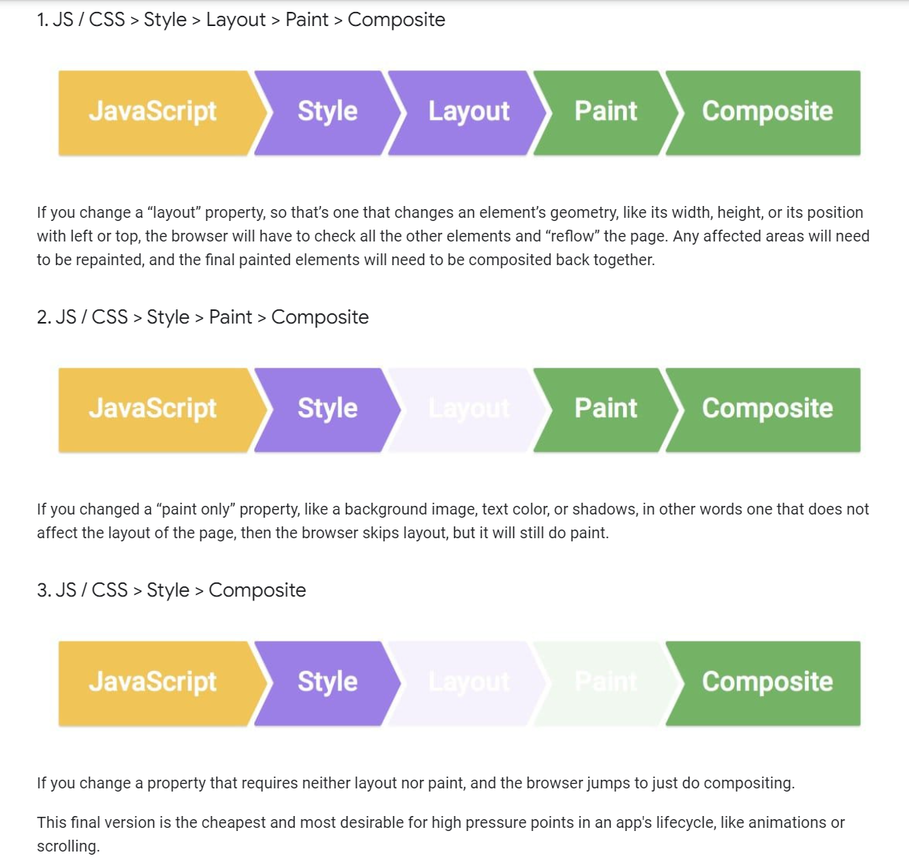
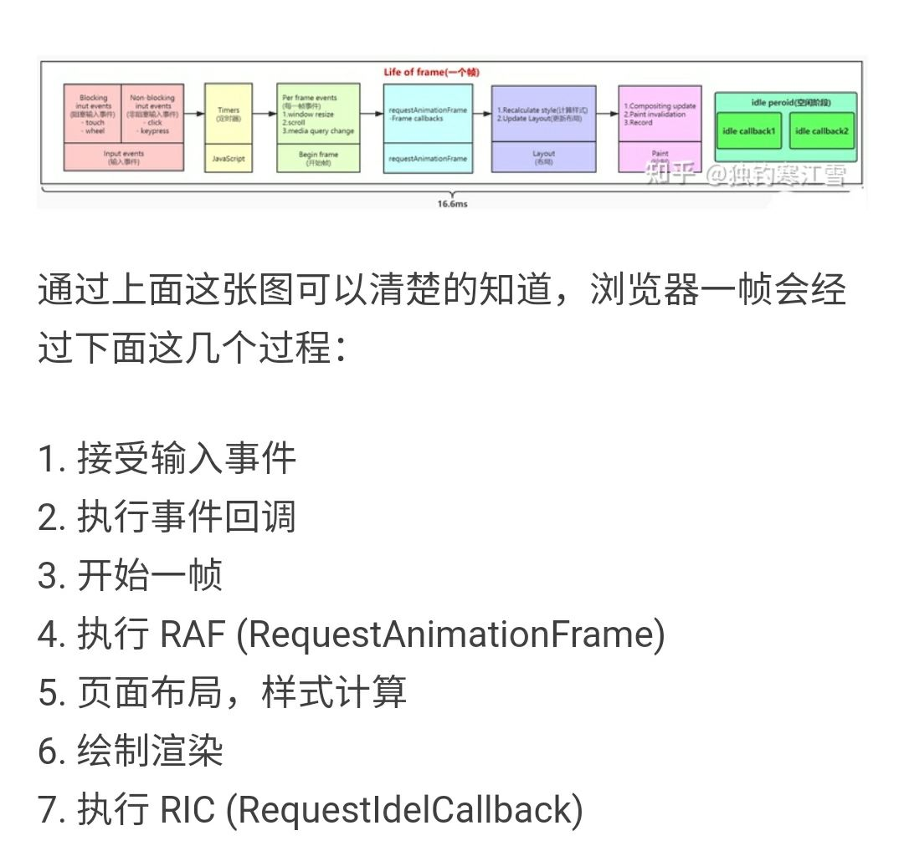

# 浏览器工作流程

- [Pipeline](#pipeline)
- [导航（Navigation）](#%E5%AF%BC%E8%88%AAnavigation)
- [响应（Response）](#%E5%93%8D%E5%BA%94response)
- [解析（Parsing）](#%E8%A7%A3%E6%9E%90parsing)
- [渲染（Render）](#%E6%B8%B2%E6%9F%93render)
- [交互（Interactivity）](#%E4%BA%A4%E4%BA%92interactivity)
- [有哪些线程？](#%E6%9C%89%E5%93%AA%E4%BA%9B%E7%BA%BF%E7%A8%8B)
- [Reflow, Repaint, Composing 相关操作](#reflow-repaint-composing-%E7%9B%B8%E5%85%B3%E6%93%8D%E4%BD%9C)
  * [. 针对重绘回流的优化方案](#-%E9%92%88%E5%AF%B9%E9%87%8D%E7%BB%98%E5%9B%9E%E6%B5%81%E7%9A%84%E4%BC%98%E5%8C%96%E6%96%B9%E6%A1%88)
- [线程抢占问题](#%E7%BA%BF%E7%A8%8B%E6%8A%A2%E5%8D%A0%E9%97%AE%E9%A2%98)
- [从帧的角度看](#%E4%BB%8E%E5%B8%A7%E7%9A%84%E8%A7%92%E5%BA%A6%E7%9C%8B)
  * [**1. 多个短耗时宏任务能否在同一帧内执行？**](#1-%E5%A4%9A%E4%B8%AA%E7%9F%AD%E8%80%97%E6%97%B6%E5%AE%8F%E4%BB%BB%E5%8A%A1%E8%83%BD%E5%90%A6%E5%9C%A8%E5%90%8C%E4%B8%80%E5%B8%A7%E5%86%85%E6%89%A7%E8%A1%8C)
    + [**示例场景：**](#%E7%A4%BA%E4%BE%8B%E5%9C%BA%E6%99%AF)
    + [**执行逻辑：**](#%E6%89%A7%E8%A1%8C%E9%80%BB%E8%BE%91)
  * [**2. 剩余时间是否必须分配给 **`requestIdleCallback`**？**](#2-%E5%89%A9%E4%BD%99%E6%97%B6%E9%97%B4%E6%98%AF%E5%90%A6%E5%BF%85%E9%A1%BB%E5%88%86%E9%85%8D%E7%BB%99-requestidlecallback)
    + [**执行顺序示例：**](#%E6%89%A7%E8%A1%8C%E9%A1%BA%E5%BA%8F%E7%A4%BA%E4%BE%8B)
  * [**3. 为什么浏览器不总是优先执行 **`requestIdleCallback`**？**](#3-%E4%B8%BA%E4%BB%80%E4%B9%88%E6%B5%8F%E8%A7%88%E5%99%A8%E4%B8%8D%E6%80%BB%E6%98%AF%E4%BC%98%E5%85%88%E6%89%A7%E8%A1%8C-requestidlecallback)
  * [**4. 浏览器如何平衡宏任务和空闲任务？**](#4-%E6%B5%8F%E8%A7%88%E5%99%A8%E5%A6%82%E4%BD%95%E5%B9%B3%E8%A1%A1%E5%AE%8F%E4%BB%BB%E5%8A%A1%E5%92%8C%E7%A9%BA%E9%97%B2%E4%BB%BB%E5%8A%A1)
    + [**关键流程图：**](#%E5%85%B3%E9%94%AE%E6%B5%81%E7%A8%8B%E5%9B%BE)
  * [**5. 实际场景中的权衡**](#5-%E5%AE%9E%E9%99%85%E5%9C%BA%E6%99%AF%E4%B8%AD%E7%9A%84%E6%9D%83%E8%A1%A1)
    + [**场景 1：短耗时宏任务 + 剩余时间**](#%E5%9C%BA%E6%99%AF-1%E7%9F%AD%E8%80%97%E6%97%B6%E5%AE%8F%E4%BB%BB%E5%8A%A1--%E5%89%A9%E4%BD%99%E6%97%B6%E9%97%B4)
    + [**场景 2：长耗时宏任务**](#%E5%9C%BA%E6%99%AF-2%E9%95%BF%E8%80%97%E6%97%B6%E5%AE%8F%E4%BB%BB%E5%8A%A1)
  * [**6. 最佳实践**](#6-%E6%9C%80%E4%BD%B3%E5%AE%9E%E8%B7%B5)
  * [**总结**](#%E6%80%BB%E7%BB%93)
- [参考资料](#%E5%8F%82%E8%80%83%E8%B5%84%E6%96%99)

---

## Pipeline



## 导航（Navigation）

介绍：

Navigation（导航）是指用户在浏览器中请求加载一个网页时，与服务器建立连接的过程。它是网页加载的第一步，发生在用户执行以下操作时触发：

* 在浏览器地址栏中输入一个URL并按下回车。
* 点击网页中的链接。
* 提交一个表单。
* 其他触发页面加载的行为。

网页性能优化的目标之一是尽量缩短导航完成所需的时间。理想情况下不会花太长时间，但网络延迟 和 带宽 会带来性能问题。

步骤：

1. DNS查询：将域名转为IP地址，找到网页所在的服务器。
   1. 检查本地DNS缓存（浏览器缓存）
   2. 检查操作系统DNS缓存（操作系统）
   3. 查询本地域名服务器（ISP提供的DNS服务器）
   4. 递归/迭代查询
      1. 根域名服务器
      2. 查询顶级域名服务器
      3. 查询权限域名服务器
2. TCP三次握手：浏览器与服务器建立连接。通常是在https下。
   1. SYN-SYN-ACK
3. TLS协商：如果使用HTTPS协议，还需要进行TLS握手，用于加密通信、验证服务器身份，并建立安全连接。
   1. 

优化：

1. 减少DNS查询次数：通过域名缓存（DNS Cache）或减少资源的跨域请求。
2. 优化TLS握手：使用现代协议（如HTTP/2）以减少握手的延迟。
3. 减少网络延迟：通过CDN将资源分发到离用户更近的服务器。

## 响应（Response）

介绍：

（Requset and）Response（响应）是指在浏览器向服务器发送请求，服务器返回给浏览器数据的过程。响应包含了网页加载所需的内容和信息，是整个网页加载流程中的关键环节之一。

步骤：

1. 浏览器发送 HTTP 请求：
   1. 浏览器通过已建立的连接（TCP 或 TLS）向服务器发送 HTTP 请求，通常是请求 HTML 文件或其他资源（如 CSS、JavaScript、图片等）。
2. 服务器处理请求：
   1. 服务器接收到请求后，根据请求的内容（如 URL 路径、请求方法等）处理请求，并生成响应。
3. 服务器返回响应：
   1. 服务器将响应头（Response Header）和响应体（Response Body）发送回浏览器。
   2. 响应头包含元数据（如状态码、内容类型等）。
   3. 响应体包含实际的资源内容，例如 HTML、CSS 文件或 JSON 数据。
   4. 首字节时间（Time to First Byte, TTFB）：TTFB 是指从浏览器发出请求到接收到服务器返回的第一个字节之间的时间。

优化：

1. 减少 TTFB：
   1. 优化服务器性能，减少处理请求的时间。
   2. 使用 CDN 将资源分发到离用户更近的服务器。
2. 压缩响应内容：
   1. 启用 Gzip 或 Brotli 压缩，减少 HTML、CSS 和 JavaScript 文件的大小。
3. 缓存响应：
   1. 使用浏览器缓存（如 Cache-Control 和 ETag）减少重复请求。
   2. 减少响应体大小：
   3. 删除不必要的内容，优化资源文件（如图片压缩、代码精简）。
4. TCP：慢启动与拥塞控制

## 解析（Parsing）



介绍：浏览器将响应数据转化为可以操作和渲染的结构化信息（DOM/CSSOM）。同时解析过程中会出发资源加载以支持后续操作和渲染。

步骤：

1. \*\* \*\*浏览器会从上到下解析文档，主要是 主线程 html parser 与 preload scanner 协同工作。
   1. 遇见HTML标记，用 HTML Parser 生成 DOM树
      1. 词法分析：调用HTML解析器解析为对应的token(一个token就是一个标签文本的序列化)
      2. 语法分析：并**构建DOM树**(就是一块内存，保存着tokens，建立他们之间的关系)
      3. 资源加载：
         1. 遇到非阻塞资源（如图片）时，浏览器会请求这些资源并继续解析
         2. 遇到阻塞性资源（同步script等），暂停执行，等待资源加载和执行结束
            1. 对于样式资源，调用**CSS Parser**处理构建出\*\*CSSOM树。\*\*CSSOM 树包含所有样式规则，包括浏览器默认样式。(但还没有到 Computed Style)（解析的非常非常快，通常快于dns lookup）。
            2. 对于脚本资源，调用**JavaScript引擎**进行JavaScript compilation，**绑定事件，修改DOM树/CSSOM树**等。为避免线程阻塞，可以用sync/defer来优化。
   2. preload scanner（预加载扫描器）会扫描HTML文档中未解析的部分，发现外部资源（如CSS、JavaScript、字体等），并提前发起网络请求。从而减少阻塞，提高解析效率。
      1. 如果遇到阻塞性资源（如同步JavaScript），HTML解析器和预加载扫描器都会暂停，等待资源加载和执行完成。
      2. （预加载扫描器依赖HTML解析器的进度，当HTML解析器暂停时，预加载扫描器无法继续扫描。）

优化：

* 使用 `async` 或 `defer` 属性可以减少阻塞。
* prefetch
  * Preload Scanner 处理的是当前页面渲染所需的**关键资源**（如CSS、JavaScript等），这些资源的优先级很高，通常会立即发起请求。
  * prefetch 处理的是**未来可能用到的资源**，资源优先级较低，只有在浏览器带宽空闲时才会加载这些资源。

## 渲染（Render）






<https://webperf.tips/tip/layers-and-compositing/>

Render 环节主要包括：style, layout, paint 和 compositing 四个步骤。

1. **（主线程）Style**：将在parsing环节中创建的CSSOM和DOM树被合并为 Render Tree，做样式计算（computed style tree）。render tree包含 所有可见元素及对应计算样式。
   1. 移除不**可见元素**（对渲染无贡献的元素）
      * `<head>`, `<meta>`, `<script>`（除非是`display: block`的自定义脚本）。
      * `display: none` 的元素（包括其子元素）。
      * `visibility: hidden` 的元素**保留在渲染树中**（占位但不可见）。
      * 零尺寸元素（如空`<div>`未设置尺寸且无内容）。
      * 计算可见节点的样式。
   * 样式计算
     * 继承：从父元素继承可继承属性（如 font-size, color）。
     * 层叠（Cascading）：解决CSS选择器优先级冲突（如 !important、内联样式、ID选择器）。
     * 默认值填充：未显式设置的属性使用默认值（如 display: block 是 <div> 的默认值）。
     * 处理伪元素与生成内容
       * 伪元素（Pseudo-elements）：如 ::before、::after、::first-line 会被视为独立的渲染节点插入渲染树。
       * 生成内容：通过 content 属性动态生成的内容（如计数器 counter()）会被添加到渲染树。
2. **（主线程）Layout**：计算每个可见元素的布局，计算每个节点的尺寸和位置，得到Layout Tree。
   1. Reflow：后续的尺寸位置重计算被称为Reflow。Reflow是指页面或整个文档任何部分的后续大小和位置的确定。修改几何属性或调整视口大小时会触发重排。
3. **（主线程）Painting**：生成 Skia Painting Record的过程（真实绘制是发生在合成器线程，有些地方把合成器绘制的逻辑也算作Paiting）。
   1. transform等属性会在合成器中利用gpu加速。
   2. 纯色/渐变/opacity等也可能直接放到合成器中，不经过skia。visibility为0的图层，skia会直接渲染出透明图层。
4. **(合成器线程, composing) (layerize/tile)**
   1. Layer：从layout tree 计算 layer tree(<https://developer.chrome.com/blog/inside-browser-part3#paint> 和 <https://webperf.tips/tip/layers-and-compositing/> 都认为layering发生在合成器线程)。有时，内容可以被提升到自己的层并进行合成，通过在GPU上只屏幕的一部分来提升性能。
      1. 特定的属性和元素会创建层，包括<video>和<canvas>，以及具有不透明度、3D变换、will-change等CSS属性的元素。这些节点及其后代将被绘制到自己的层上，除非某个后代因上述原因需要自己的层。
   2. Tile：将layer切分成更小的tiles. 将一层layer可能很大,合成器将它们切分成许多tiles(图块), 然后将这些图块分组发送给**多个**栅格化线程, 将他们栅格化,并存储在GPU内存中.
5. **(多个栅格线程 worker)rasterization**
   1. 用SKia，栅格化存储为 texture。
6. **(多个栅格线程 worker)draw quads**
   1. 向合成器线程传递draw quads图块信息
7. **(合成器线程) frame**
   1. 利用 draw quads 图块信息,合成一个合成器帧
   2. 通过IPC(Inter-process communication, 进程间通信)传回给浏览器进程
8. **(GPU) 渲染**
   1. 渲染

## 交互（Interactivity）

用户急哦阿虎

1. **(主线程)Painting**. 创建Paint Record（绘制指令列表，包括skia指令/skcanvas指令/webgl指令等），确定绘制节点的顺序。
   1. 举例来说, z-index属性会影响节点绘制的层级关系. 如果我们按照dom的层级结构来, 则会导致错误的渲染. 为了确保在屏幕上展示正确的层级, 主线程遍历 Layout Tree 创建一个绘制记录表(Paint Record)该表记录了绘制的顺序. 这个阶段被称为绘制(paint).
2. **(主线程)Layer**
   1. 有时也算做paint。遍历Layout Tree, 用skia光栅化生成 Layer tree (图层树)，可能gpu或cpu。图层栅格化生成不同图层的texture/framebuffer。
   2. 将Layer Tree 和 texture 和 Paint Record 一起传给合成器线程.合成器做分块和图层合成，transform等属性会在合成器中利用gpu加速。
   3. 纯色/渐变/opacity等也可能直接放到合成器中，不经过skia。visibility为0的图层，skia会直接渲染出透明图层。
   4. 有will-change样式的图层，会创建独立的合成层。
3. **(合成器线程, composing)tiles**
   1. 将layer切分成更小的tiles. 将一层layer可能很大,合成器将它们切分成许多tiles(图块), 然后将这些图块分组发送给**多个**栅格化线程, 将他们栅格化,并存储在GPU内存中.
4. **(多个栅格线程 worker)rasterization**
   1. 栅格化
5. **(多个栅格线程 worker)draw quads**
   1. 向合成器线程传递draw quads图块信息
6. **(合成器线程) frame**
   1. 利用 draw quads 图块信息,合成一个合成器帧
   2. 通过IPC(Inter-process communication, 进程间通信)传回给浏览器进程
7. **(GPU) 渲染**
   1. 渲染

## 有哪些线程？

js线程，渲染主线程，合成器线程，栅格worker

浏览器绘制页面和执行JS不能同时进行。浏览器正在绘制，js要删除，产生难以预料的后果。

## Reflow, Repaint, Composing 相关操作

**reflow**: 布局相关属性的操作会引起reflow:

width, top, text-align, height, bottom, overflow-y, padding, left, font-weight, margin, right, overflow, display, position, font-family, border-width, float, line-height, border, clear, vertival-align, min-height, white-space

**repaint:** 只修改颜色, 背景图, 阴影等不涉及布局的属性, 可以省略layout, 引起repaint.（Chrome将纯色/渐变优化到了合成器线程）

color, background, outline-color, border-style, background-image, outline, border-radius, background-position, outline-style, visibility, background-repeat, outline-width, text-decoration, background-size, box-shadow

**composing**: transform, animation, opacity, 滚动等效果, 会忽略layout和paint, 只会进行合成

### . 针对重绘回流的优化方案

能不能不？能不能减少？能不能延迟？

* 避免reflow,repaint:
  * 元素位置移动变换时尽量使用CSS3的**transform**来代替top，left等操作(表格)
  * visibility替代Displaynone避免reflow，Opacity替代visibility避免repaint
* 不要使用table布局
* 减少reflow/repaint更新频率
  * 批量更新
    * dom批量更新：利用文档素碎片（documentFragment），vue使用了该方式提升性能
    * css批量更新：将多次改变样式属性的操作合并成一次操作(修改className)
  * 减少不必要的修改：编写动画时，尽量使用requestAnimationFrame
* 减少更新内容
  * Layer
    * 动画实现过程中，启用GPU硬件加速：transform:tranlateZ(0)
    * 按图层分组：为动画元素新建图层，提高动画元素的z-index
  *



## 线程抢占问题

1. Reflow, Repaint 都发生在主线程, 都会发生js抢占问题.  (一个event loop里有多个task queue, task queue里的被调度的两个相邻task之间, 也就是 **micro tasks 执行完毕之后, 下一个task执行之前, 会进行重新渲染.** 渲染和task的执行都在主线程上
2. 优化手段1: 一种优化手段是借助于**requestAnimationFrame()**方法. 这个方法会在每一帧被调用, 通过 API 的回调, 然后我们可以把 js 运行任务分成一些更小的任务块(分到每一帧),在每一帧时间用完前暂停 js 执行. 这样的话, 在下一帧开始时, 主线程就可以按时执行布局和绘制. React 的最新渲染引擎,** React Fiber,** 用到了api来做了很多优化.
3. 还有第二种优化手段. 通过刚才流程图, 我们知道栅格化的整个流程是不占用主线程的. 只在合成器线程和山歌线程中运行. 这就意味着它无需和 js 抢夺主线程. 我们刚才提到, 如果反复进行重绘和重排, 可能会导致掉帧. 这是因为有可能 js 执行阻塞了主线程. 而 css 中有个动画属性叫\*\* transform,\*\* 通过该属性实现的动画**不会经过布局和绘制, 而是直接运行在合成器线程和栅格线程**, 所以不会受到主线程中js执行的影响. 更重要的是通过transform,实现的动画由于不需要经过布局绘制, 样式计算等操作, 所以节省了很多运算时间(方便实现负责的动画). 我们常常实现的动画效果如位置变化, 宽高变化, 旋转, 3D等, 都可以使用transform来代替.

## 从帧的角度看

<https://juejin.cn/post/6844904165462769678>



Event loop可能执行多次之后才到处理resize和scroll事件，然后才到requestAninationFrame。所以一般不要依赖setTimeout来做渲染刷新

浏览器的任务调度机制确实会根据任务的类型和剩余时间动态调整，以下是关键点的详细解释：

***

### **1. 多个短耗时宏任务能否在同一帧内执行？**

**答案：是的，可能！**\
浏览器的目标是尽可能高效地利用每一帧的时间（约16.67ms）。如果多个短耗时宏任务（如快速触发的点击事件）的**总执行时间小于帧的剩余时间**，浏览器会连续执行它们，而不是强制分割到不同帧。

#### **示例场景：**

```javascript
// 假设每次点击回调耗时 2ms
button.addEventListener("click", () => {
  console.log("Click (宏任务)");
});

// 用户快速点击按钮 5 次：
// 总耗时 5 * 2ms = 10ms < 16.67ms
// 浏览器可能在一帧内执行所有 5 个回调！
```

#### **执行逻辑：**

1. 事件循环从宏任务队列中取出第一个任务执行。
2. 执行完毕后，清空微任务队列。
3. 检查帧剩余时间是否足够执行下一个宏任务。
4. 如果足够，继续执行下一个宏任务；否则进入渲染阶段。

***

### **2. 剩余时间是否必须分配给 **`requestIdleCallback`**？**

**答案：不是！**\
`requestIdleCallback` 的设计目的是在\*\*主线程空闲时（即没有更高优先级的任务需要处理）\*\*执行低优先级任务。但浏览器的调度逻辑是：

1. **优先处理宏任务和微任务**，直到队列为空或帧时间耗尽。
2. **最后**，如果还有剩余时间，才会执行 `requestIdleCallback` 回调。

#### **执行顺序示例：**

```javascript
// 宏任务（耗时 5ms）
setTimeout(() => {
  console.log("宏任务");
}, 0);

// requestIdleCallback
requestIdleCallback(() => {
  console.log("requestIdleCallback");
});

// 输出顺序：
// 1. 宏任务
// 2. requestIdleCallback（仅在帧剩余时间执行）
```

***

### **3. 为什么浏览器不总是优先执行 **`requestIdleCallback`**？**

* **任务优先级不同**\
  宏任务（如用户交互事件）通常具有更高的优先级。用户点击按钮后，浏览器需要尽快响应，以提供流畅的交互体验。
* **避免饥饿问题**\
  如果总是优先执行 `requestIdleCallback`，高优先级的宏任务可能被长时间延迟，导致页面卡顿。

***

### **4. 浏览器如何平衡宏任务和空闲任务？**

浏览器通过以下策略实现动态调度：

1. **宏任务队列处理**
   * 执行当前队列中的宏任务，直到队列为空或帧时间耗尽。
2. **微任务队列处理**
   * 每个宏任务执行完毕后，立即清空所有微任务。
3. **渲染阶段**
   * 执行 `requestAnimationFrame` 回调，进行布局（Layout）和绘制（Paint）。
4. **空闲阶段**
   * 如果还有剩余时间，执行 `requestIdleCallback` 回调。

#### **关键流程图：**

```plain
事件循环（Event Loop）流程：
1. 执行一个宏任务
2. 清空所有微任务
3. 执行 rAF 回调 → 渲染
4. 若有剩余时间 → 执行 requestIdleCallback
5. 重复
```

***

### **5. 实际场景中的权衡**

#### **场景 1：短耗时宏任务 + 剩余时间**

* 若多个宏任务总耗时 10ms（帧剩余 6.67ms）：
  * 浏览器会先执行所有宏任务，再执行 `requestIdleCallback`（如果时间允许）。

#### **场景 2：长耗时宏任务**

* 若一个宏任务耗时 20ms（超过 16.67ms）：
  * 浏览器会执行完该任务后直接进入下一帧，跳过渲染和 `requestIdleCallback`，导致掉帧。

***

### **6. 最佳实践**

1. **拆分长任务**\
   使用 `setTimeout` 或 `requestIdleCallback` 将长任务拆分为小块，避免阻塞主线程。

```javascript
function processChunk() {
  // 处理小块任务
  if (hasMoreWork) {
    // 下一帧继续处理
    requestIdleCallback(processChunk);
  }
}
requestIdleCallback(processChunk);
```

2. **优先使用微任务**\
   对实时性要求高的任务用 `Promise.then` 或 `queueMicrotask`。

```javascript
button.addEventListener("click", () => {
  Promise.resolve().then(() => {
    console.log("高优先级微任务");
  });
});
```

3. \*\*合理使用 \*\*`requestIdleCallback`\
   仅将非关键任务（如日志上报、预加载）放在空闲阶段。

```javascript
requestIdleCallback((deadline) => {
  while (deadline.timeRemaining() > 0) {
    // 执行低优先级任务
  }
});
```

***

### **总结**

| 情况 | 结果 |
| --- | --- |
| 多个短耗时宏任务（总时间 <16ms） | ✅ 可能在一帧内执行 |
| 剩余时间 | ✅ 优先执行宏任务 → 最后执行空闲回调 |
| 长耗时宏任务（>16ms） | ❌ 阻塞帧 → 跳过渲染和空闲回调 |

**核心原则**：浏览器以用户体验为优先，确保高优先级任务（如用户交互）及时响应，而非严格按帧分配时间。理解这一点，可以更好地优化代码性能！

## 参考资料

<https://juejin.cn/post/6986416221323264030>

<https://developers.google.com/web/fundamentals/performance/rendering>

一篇文章说清浏览器解析和CSS（GPU）动画优化 <https://segmentfault.com/a/1190000008015671>

react fiber https://zhuanlan.zhihu.com/p/390409316

<https://developer.mozilla.org/en-US/docs/Web/Performance/Guides/How_browsers_work#parsing>

<https://webperf.tips/tip/browser-rendering-pipeline/>

<https://webperf.tips/tip/layers-and-compositing/>

<https://developer.chrome.com/blog/inside-browser-part3#compositing>


> 更新: 2025-05-25 07:04:05  
> 原文: <https://www.yuque.com/viruspc/el3mi0/ps289d>